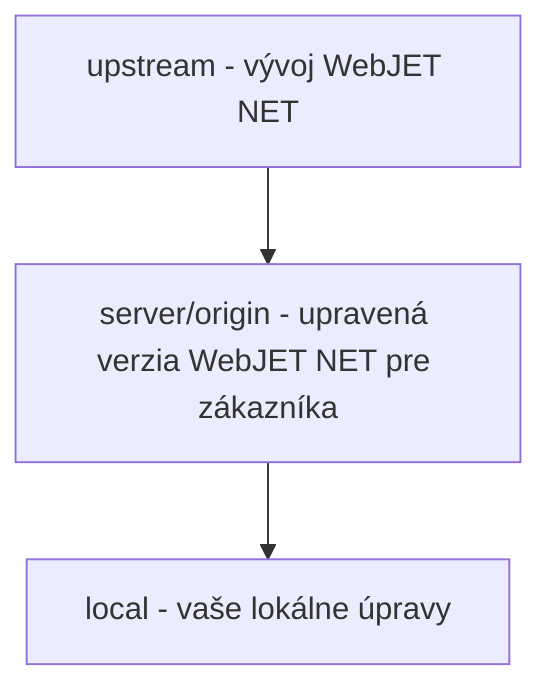

# Working with Git/Gitlab

>**`tl;dr`** Explanation of using GIT: basic concepts, work philosophy, workflow. How Merge Requests work in Gitlab, code quality control.

Gitlab is available at https://gitlab.web.iway.local. If you have only worked with SVN so far, you need to understand the main difference between SVN and GIT - **git is a distributed** versioning software, everyone has a copy of the repository on their computer and can work with it locally. Only when you are done with your work do you "push" it to the remote repository (to the server).

Basic concepts:

- git `clone` - ​​transfers (**clone**) the repository from the server **to your computer**
- git `commit` - ​​sends (**save**) the changes you made **to your** local **repository**. It's similar to SVN, but the changes aren't pushed to the server yet. So you can commit your work in progress as needed.
- git `branch` - ​​creates **new branch in code**, more in the [Branching](#branching) section
- git `push` - ​​**sends** your changes (commits) **to the server**
- git `pull` - ​​**updates** your local git repository **from the server**
- git `merge` - ​​**merges changes** between code branches

In this tutorial we are trying to explain the terms in a "layman's" way, so please excuse the non-technical terms. We are talking about a server, even though git is practically distributed and can have even more servers and other dependencies. Typically we will use the following terms:

- `local` - ​​your local git repository - the repository on your computer
- `server` (also referred to as `origin`) - the primary git repository from which you git cloned to your computer
- `upstream` - ​​git repository from which the project on the server is forked

To understand the difference between server and upstream, consider the following situation:

You have a development of a "generic" WebJET NET product (upstream) and a copy of it for the customer (server), including your local copy on your computer (local).


```mermaid
graph TD;
    upstream[upstream - vývoj WebJET NET]-->server
    server[server/origin - upravená verzia WebJET NET pre zákazníka]-->local
    local[local - vaše lokálne úpravy]
```

**The customer has a modified version** of WebJET NET that is stored in a git repository on the server. This version **was created by forking (`fork`) from the original WebJET NET repository**.

**For the customer** (on the server) you **program the modifications** for the given client, you can change, delete, add files and **this does not affect the development of the "generic" product** WebJET NET. Product development lives its own life, adding new features and functions. **The client has a fixed version of the intranet** from the server.

At some point, a **request to update the customer's intranet** will come. At that point, you will **pull the current code from the upstream server** and update the customer's code according to the changes on the upstream server, i.e. according to the development of the generic product. When merging the code from the `upstream` server and your customer's code, a so-called `merge conflict` may be created, in your IDE you will be given the option to keep the changes or update them according to the upstream server.

## Installation and setup

Before using Gitlab for the first time, you need to install a GIT client and generate encryption keys, as you connect to Git using SSH keys.

A detailed manual can be found in the [PDF document on the intranet](https://intra.iway.sk/files/dokumenty/webove-oddelenie/development/instalacia-git-vo-win.pdf).

!>**Warning:** when generating SSH keys **we do not recommend entering a password** (in the screenshot it is shown as SomeYourSecretPassword007), because VS Code / git may have trouble entering the password. The advantage of SSH keys is that they bring the comfort of not entering a password.

In short, install [GIT client for windows](https://git-scm.com/download/win) and then generate SSH keys in the **GitBash** program (for MacOS in the terminal) by entering the command:

```shell
ssh-keygen -m PEM -t rsa -b 4096 -C tvoj.email@interway.sk
```

Confirm the default folder for storing keys (the ```.ssh``` folder in your home folder), when prompted to enter **Passphrase** do not enter anything (confirm with the enter key).

Then, after generating the keys, enter the commands to set your name and email:

```shell
git config --global user.name "Meno Priezvisko"
git config --global user.email tvoj.email@interway.sk
```

**You don't need to send the .pub file**, **you enter it yourself in Gitlab**. Log in and click on your icon in the top right to go to the Settings menu, then select [SSH Keys](https://gitlab.web.iway.local/profile/keys) in the left menu. Open the id_rsa.pub file in a text editor and copy its contents into the Key text field, enter the key name (any) and click Add key.

## Cloning a repository from a server to your computer

After setting up the keys to communicate with the git server, you can clone the git repository to your computer.

> For the sake of order in your local workspace, I recommend **creating a subdirectory for the client**, and cloning the project into it. You will have a workspace directory **organized by clients and then by projects**.
>
> I recommend having the Workspace directory with projects for your IDE directly in your home directory.

You can get the address for the ```git clone``` command directly from gitlab. On the project homepage, there is a **blue Clone button** in the upper right. Click on it and a context menu will appear, copy the part from the Clone with SSH field.

```
cd workspace
mkdir menoklienta
cd menoklienta
git clone git@gitlab.web.iway.local:menoklienta/projekt.git
cd projekt
```

For example, in gitlab you copied the address ```git@gitlab.web.iway.local:mpsvr/mpsvr-intranet.git```. The value of **mpsvr** is **clientname** and **mpsvr-intranet** is **projectname**. So, do the following:

```
cd workspace
mkdir mpsvr
cd mpsvr
git clone git@gitlab.web.iway.local:mpsvr/mpsvr-intranet.git
cd mpsvr-intranet

#ak pouzivate VS Code mozete ho rovno spustit prikazom
code .
```

It is customary to prefix the project name with the client name. This is practical because in VS Code, in the title/project list/open windows, you only see the project name and not its parent directory. If the project name also includes the client name, it is easier to navigate.

## Working in VS Code

**In VS Code, branches are displayed in the bottom left**, clicking on the branch name will show you a list of all branches. Branches that you already have locally on your computer are marked as master, or feature/xxx, **those on the server start with the prefix origin** (e.g. origin/master, origin/feature/xxx). Branches starting with upstream are those that cover product development (e.g. upstream/master, upstream/feature/xxx).

In the `Source Control` window, you will see a list of changed files and by clicking on ```...```, you will see a menu (the title `Source Control` is displayed twice in the window, clicking on ... is necessary on the right in the second line above the field for entering `Commit Message`).

**In the `Commit`** menu there is an option `Commit` to **save work**, in the **menus `Pull`, `Push`** there are options `Pull` and `Push` for **sending to server (`push`)/updating from server (`pull`)** and in the **menu `Branch`** there is an option `Merge Branch` to [merge branches](#merge-branch).

## Branching

**The advantage of git is** that you can have **several parts of a project (branch) in progress on your computer,** and you commit them on your computer. The branches are independent of each other (changes in one part/branch do not affect another part/branch).

Imagine that you have a major change in progress and at the same time you receive a request for a minor change in a completely different part of the code. **You commit the work in progress and switch to a new branch**, where you make the second change, commit it and push it to the server. You don't have to worry about the fact that you have the first work in progress somewhere else and you don't have to remember what all you have to send to the server.

The basic requirement is to create a branch for each task you are solving. For development we use the gitlab flow methodology (usually without a develop branch). We use the following branch names:

- `master` - ​​the main branch where only **approved and tested code** is located. The master branch **is usually protected** and a regular developer does not have the right to push changes to it. These are accepted via the so-called [Merge request](#accepting-changes-merge-request)
- `feature/xxxxx-nazov-tiketu` - ​​branch in which the requested change in ticket xxxxx is implemented. The branch name starts with the prefix feature/ and continues with the ticket/request number and its short name (for better overview)
- `release/yyyy.ww` - ​​the release branch contains **production (released) versions** of the project. The ```yyyy.ww``` string contains the release number, I recommend using the year.week format, for example 2020.43.
- `hotfix/xxxxx-nazov-tiketu` - ​​contains **hotfixes for the production** version. A typical situation is a bug in production that needs to be fixed quickly.
- `develop` - ​​for some projects, a develop branch can also be used, which **represents the role of the master branch and may also contain work in progress**, but we recommend not using it because it tends to bring chaos to development.

We will show you some examples of how to proceed during development. **Before** every **creating a new branch** you must realize that **you are creating it as a new branch** from the **branch** that you have **currently open**. Typically, you must first switch to the necessary branch from which you are branching and also update it from the server.

The description of the [workflow/branch model](https://intra.iway.sk/files/dokumenty/webove-oddelenie/development/gitflow-workflow.pdf) is also in the document on the intranet.

>**Warning**: when you switch between branches, your code also changes. Some files are deleted (because they do not exist in the given branch) and some are added. After changing the branch, I recommend running the **gradlew clean** command to delete compiled files and if you are using NPM, also run **npm install** to install the necessary libraries. For npm, we recommend preparing a gradle task **[gradlew npminstall](../../build.gradle) ** so that you do not have to navigate to subdirectories with npm modules.

### Implementing a new requirement

- commit the currently working files (if you are already working on another request)
- ** switch** to **master** branch
- update the master branch from the server via ```git pull```
- create a **new branch** with the name **feature/TICKETID-short-ticketname**, for example ```feature/47419-monitorovanie-servera```

A branch will be created locally, you can work on your changes and commit the code locally. When you are done, you can **"push" the branch to the server** using ```git push```. Your IDE may ask you if you really want to push the branch to the server and possibly change its name (but keep it the same as it is locally).

### Release to production

Typically, you push current, tested code from the master branch into production. In practice, you could create a war archive directly from the master branch and deploy it to the server. But you wouldn't have a **fixed version of the deployed code** and it would be difficult to program hotfixes.

- **switch** to **master** branch
- update the master branch from the server via ```git pull```
- create a **new branch** with the name **release/yyyy.ww**, for example ```release/2020.43```
- push the branch to the server via ```git push```

The branch created in this way is just a **fork from the original master branch**, it does not contain any changes yet, it is just a **storage** for the hotfix in production.

### Fixing a bug in production

If an error occurs in production and a hotfix is ​​required:

- **switch** to the **release branch** that is used in production, e.g. ```release/2020.43```
- **to be safe** update the branch from the server via ```git pull```
- create a **new branch** with the name **hotfix/TICKETID-short-ticketname**, for example ```hotfix/47326-oprava-prihlasenia```

Now you have the same code on your computer as on the server, you can implement fixes as required. Then send the fix to the server via ```git push```.

!>**Warning:** changes in the hotfix branch must then be **merged** into the given **release branch and also into the master branch** (so that the hotfix is ​​not lost).

You can then deploy only the changed files to the server. However, after merging into the release branch, you can also deploy the entire release branch.

### Connection (`merge`) branch

**While developing on the feature/** branch, you may need to **update the code from the master** branch (or another one). Follow these steps:

- commit the currently working files
- **switch** to **master** branch
- update the master branch from the server via ```git pull```
- **switch back** to the branch **feature/TICKETID-short-ticket-name** that you want to update according to the master branch
- run the command ```git merge``` and select branch master

So, **you connect** the code of the **master** branch to the branch feature/TICKETID-short-name-ticket.

**In VS Code** you can perform the above operations in Source Control by clicking on ```...``` to the right of the Source Control text (... in the second line). You will see the Commit menu with the Commit option, in Pull, Push you have the Pull option, and in the Branch menu you have the Merge Branch option.

Of course, you may have merge conflicts when you and someone else on the master branch have made changes to a file. These conflicts need to be resolved.

In VS Code, **conflicts are displayed in the Source Control window in the MERGE CHANGES block**. By clicking on the file, you will also see the options to accept your changes, accept both changes, accept changes from the server. There can be multiple such changes in one file. You can also edit them manually, it is just text in the editor surrounded by ```<<< ----- >>>``` tags. After **resolving conflicts** in the file, right-click on it and select the ```Stage changes``` option. This will prepare the edited file for commit. When you have resolved conflicts in all files, commit the changes by clicking on the check mark icon (commit). The description ```Merge xxx with branch yyyy``` will be pre-filled for you.

## Accepting changes (Merge Request)

Using the Merge Request feature in GitLab, you can **perform a code review** before accepting changes in a feature/hotfix branch into the master branch. Typically, the master branch is protected and only a user in the **maintainer** group can push changes to it.

However, the function is **useful during development**, it displays a list of changed files so you have an overview of what you have changed.

### How and when to create a Merge Request

You create a Merge Request in Gitlab. In the relevant project, select **Repositories->Branches** in the left menu. For each branch (except master), you will see a **Merge request button**, click on it.

Fill in the **Title** in the form, it should **match the branch name**, e.g. ```feature/47419-monitorovanie-servera```. If the branch is not yet finished, enter the prefix **WIP:** (Work In Progress) in the title, i.e. ```WIP: feature/47419-monitorovanie-servera```.

**Description** can be filled in according to the ticket entry, in **Assignee** select a developer who will do code review for you, or a repository administrator (main developer of the project). During Work In Progress, you can leave the Assignee field empty.

Do not fill in the other fields, leave the fields in **Merge options** unchecked.

Click **Submit merge request** to create it. To view the list of created Merge requests, click Merge Requests in the left menu.

>Summary: We recommend creating a Merge Request immediately after pushing a branch with the WIP prefix. This will give you an overview of the changes in the branch and allow you to perform code quality checks yourself.

### Transition from Work In Progress

If you have a Merge Request created with the prefix WIP: and your branch is already **done and ready for review/merge to master** branch, click the **Mark as ready** button in the given Merge Request.

Also, don't forget to fill in the Assignee field (after clicking the Edit button).

### Verifying merge conflicts

The Overview tab shows the status of whether it is possible to merge the branch into master. If the **Merge button is green, everything is fine**. If it is grayed out with the text **There are merge conflicts**, you need to resolve the merge conflicts first.

>I always recommend **first merging changes to the master branch** before finally pushing them to your branch. This will get the current code from master into your feature branch and you can verify that your change is OK by **running automated tests**. If your feature branch broke a feature/test, you need to implement a fix.

### Code quality control

In the Merge Request, in the Changes tab, you can see a list of changes in the files. When you hover over a line, you will see an **icon for adding a comment** at the beginning of the line. Clicking on the icon will display a text field for adding a comment.

You can use @name to tag the person who resolved the comment. Below the comment, you will see the **Start review** and **Add comment now** buttons. The difference is that with **Start review** you can add **multiple comments** and send a notification at the end. With **Add comment now** you can **add a comment and send** a notification.

In the Merge Request, you will also see the message **X unresolved threads** at the top, where X is the number of unresolved comments.

As a developer, you should respond to comments. Incorporate changes, push them to the server, and then mark the comment as resolved by clicking the **Resolve thread** button.

### Merge

The final merge into the master branch is performed by the project manager by clicking the green **Merge** button. Your branch will receive a **merged** icon in the branch list.

We do not recommend using the **Squash commits** or Delete source branch options, leave these options unchecked. The **Squash commits** option would "merge" multiple commits** in your feature branch into one and merge it into the master branch. This is fine if you never make any changes to the feature branch again, but if you subsequently make another commit to the feature branch, the history with respect to the master branch will be broken. The **Delete source branch** option is obvious from the name, for now the rule is that we do not delete the old branch due to history.


