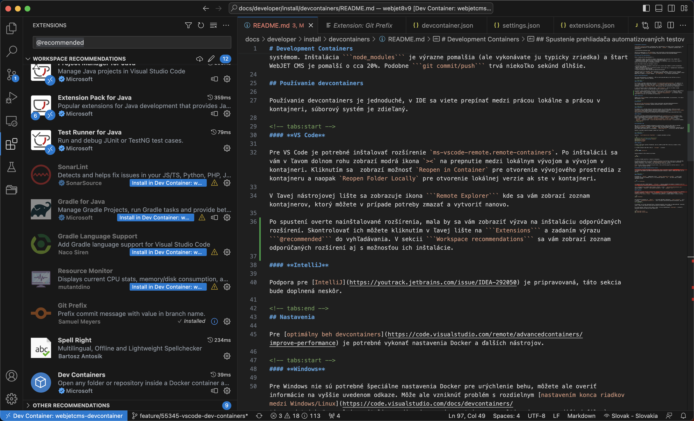
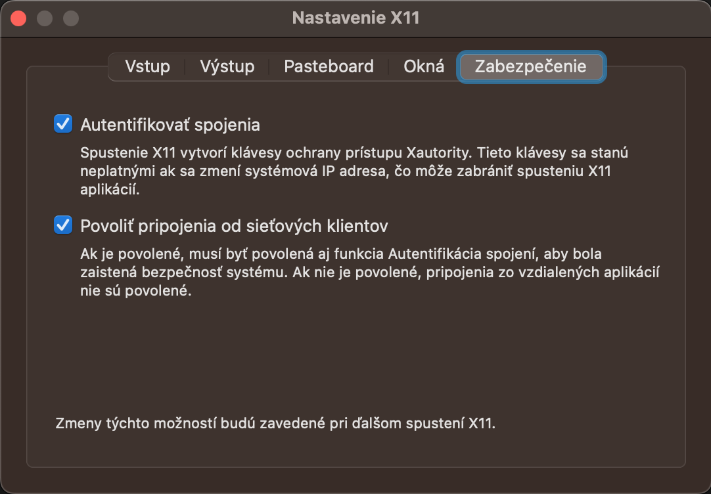

# Development Containers

[Development Containers](https://containers.dev) (devconatiners) is a method of development in containers. The GUI of the development environment runs on your machine, but its `backend` and complete code execution in containers.


It is currently supported in [VS Code](https://code.visualstudio.com/docs/devcontainers/containers), support for [IntelliJ](https://youtrack.jetbrains.com/issue/IDEA-292050).

## Benefits of using devcontainers

The main advantages of using devcontainers are:
- It only requires Docker to be installed on the machine (you don't need to have Java, NodeJS, etc. installed).
- Simplifies the overall installation of the environment on the developer's computer.
- It unifies the environment between developers - the container is installed with the exact version of Java, NodeJS and other tools as for example on the production environment.

It is therefore particularly suitable for the following scenarios:
- You are working on multiple projects, each using a different version of Java, NodeJS, and it is difficult to coordinate versions on your machine.
- Occasionally, you need to work on an outdated project that uses technologies that are no longer supported and are difficult to keep on your computer.
- You need to launch/test/verify/test the project quickly.

Of course development has its drawbacks - running in a container is a bit slower, especially working with the file system. Installing `node_modules` is significantly slower (but you typically rarely perform it) and the WebJET CMS start is about 20% slower. Similarly `git commit/push` lasts a few seconds longer.

When you run a project in a container, the standard HTTP ports 80,443,8080 are mapped to the local machine, so that you will see the WebJET running from the container in your browser by default, just as you would if you were running the project on your own machine.

The information about the launch from the container can be seen in the bottom left where the blue text is `Dev Container: meno`.


## Using devcontainers

Using devcontainers is easy, in the IDE you can switch between working locally and working in a container, the file system is shared.

<!-- tabs:start -->

#### **VS Code**

For VS Code you need to install the extension `ms-vscode-remote.remote-containers`. After installation, you will see a blue icon in the bottom left corner `><` to switch between local development and development in the container. Click to display the option `Reopen in Container` to open the development environment from the container and vice versa `Reopen Folder Locally` to open the local version if you are in a container.

An icon appears in the left toolbar `Remote Explorer` where you will see a list of containers that you can delete and re-create if necessary.

After launching, verify the installed extensions, you should be prompted to install the recommended extensions. You can check them by clicking in the left sidebar on `Extensions` and entering the expression `@recommended` in the search. In the section `Workspace recommendations` you will see a list of recommended extensions and the option to install them.



You may see compilation errors when you first open the project `Mapper` classes, but just open the class, make the change (space, delete space) and save the file and the error will be fixed.

#### **IntelliJ**

Support for [IntelliJ](https://youtrack.jetbrains.com/issue/IDEA-292050) is under preparation, this section will be added later.

<!-- tabs:end -->

## Settings

For [optimal running of devcontainers](https://code.visualstudio.com/remote/advancedcontainers/improve-performance) Docker and other tool settings need to be made.

<!-- tabs:start -->

#### **Windows**

For Windows, no special Docker settings are needed to speed up the runtime, but you can verify the information at the link above. However, there may be a problem with different [setting the end of lines between Windows/Linux](https://code.visualstudio.com/docs/devcontainers/tips-and-tricks#_resolving-git-line-ending-issues-in-containers-resulting-in-many-modified-files).

#### **macOS**

For macOS, you need to optimize the Docker settings for [faster disk work](https://www.docker.com/blog/speed-boost-achievement-unlocked-on-docker-desktop-4-6-for-mac/). Click on the Docker icon in the menu bar and select `Settings`, in the charts `General` select the option `VirtioFS` in section `Choose file sharing implementation for your containers`. The charts `Advanced` select the option `Allow the default Docker socket to be used` and click `Apply & Restart`.


<!-- tabs:end -->

You can use a DNS record in the container `host.docker.internal` to connect to your computer (e.g. your local database server).

## Gitlab/SSH keys

In order to get a connection to the gitlab server using SSH keys to work in the container, you need to configure [key sharing](https://code.visualstudio.com/remote/advancedcontainers/sharing-git-credentials) via `ssh-agent` between your computer and the container. Technically, you could copy the SSH key directly to a folder `/home/vscode/.ssh` but this is not an ideal solution.

First you need to start the ssh-agent (one-time operation):

<!-- tabs:start -->

#### **Windows**

Run `local Administrator PowerShell` and enter the following commands:

```sh
# Make sure you're running as an Administrator
Set-Service ssh-agent -StartupType Automatic
Start-Service ssh-agent
Get-Service ssh-agent
```

#### **macOS**

On macOS the SSH agent is running by default, it should be sufficient to add SSH keys as below.

<!-- tabs:end -->

And then add your SSH keys to `ssh-agent` command:

```sh
ssh-add $HOME/.ssh/id_rsa
```

To view the list of added keys, use the command:

```sh
ssh-add -l
```

You can then verify this in the container terminal.

After restarting devcontainers, you should be able to connect to git/gitlab just like on your machine. The above settings are also in the script `.devcontainer/localInit.sh` which is executed before each container start, so you don't need to execute these commands manually.

If you have a problem connecting to the git server, you can always switch to the local version and `pull/push` the operation is performed locally.

## Launching the Automated Test Viewer

If you need to see the browser for automated tests you need to set [XServer/X11 forwarding](https://www.oddbird.net/2022/11/30/headed-playwright-in-docker/) (window manager for Linux) on your computer.


<!-- tabs:start -->

#### **Windows**

On Windows is `XServer` supported within `Windows Subsystem for Linux/WSL` and should be available by default on both Windows 10 and 11. `WSL` via the start menu and enter the following command:

```sh
ls -a -w 1 /mnt/wslg
```

in the statement you should see the value `.X11-unix`. If not, go to the store and download [the current version of WSL](https://www.microsoft.com/store/productId/9P9TQF7MRM4R).

Unfortunately in the configuration there is a difference between Windows and macOS, in the file `.devcontainer/devcontainer.json` adjust the value `"DISPLAY": "host.docker.internal:0"` at `"DISPLAY": ":0"`.

#### **macOS**

For macOS, you first need to install [XQuartz](https://www.xquartz.org). After installation and restart, navigate in the app `XQuartz` to `Preferences -> Security` and tick the option `Allow connections from network clients`.



Restart the computer and then enter the command in the terminal:

```sh
xhost +localhost
```

to allow connection to `XQuartz` from the local computer. Setting up `xhost +localhost` is also in the script `.devcontainer/localInit.sh`, which is done before each container start, so that you do not forget about it.

<!-- tabs:end -->

Once set up, you will see a window from containerized Linux directly on your computer. Technically, you can run any GUI application installed in the container in this mode.

The first time you run the tests, you may get an error that it is not installed `playwright`, in the container terminal, run the commands to install it:

```sh
npx playwright install
npx playwright install-deps
```

## Sample files

The following is a list of sample files that you can use as a basis for your project. They are all located in the folder `.devcontainer`:

`devcontainer.json` - the configuration itself `devcontainer`:

```json
// For format details, see https://aka.ms/devcontainer.json. For config options, see the
// README at: https://github.com/devcontainers/templates/tree/main/src/alpine
{
	"name": "webjetcms-devcontainer",
	// Or use a Dockerfile or Docker Compose file. More info: https://containers.dev/guide/dockerfile
	"image": "mcr.microsoft.com/devcontainers/base:ubuntu",
	"features": {
		//https://github.com/devcontainers/features/tree/main/src/java
		"ghcr.io/devcontainers/features/java:1": {
			"version": "8",
			"jdkDistro": "open",
			"installAnt": true,
			"antVersion": "1.10.12"
		},
		//https://github.com/devcontainers/features/tree/main/src/node
		"ghcr.io/devcontainers/features/node:1": {
			"nodeGypDependencies": true,
			"version": "16"
		}
	},
    "runArgs": [
		//publish ports
		"--publish=80:80",
		"--publish=443:443",
		"--publish=8080:8080"
    ],

	"initializeCommand" : ".devcontainer/localInit.sh || true",
	"postCreateCommand": ".devcontainer/postCreateCommand.sh",
	"postStartCommand": ".devcontainer/postStartCommand.sh",

	//https://www.oddbird.net/2022/11/30/headed-playwright-in-docker/
	"containerEnv": {
        "DISPLAY": "host.docker.internal:0"
    },

	// Use 'forwardPorts' to make a list of ports inside the container available locally.
	//"forwardPorts": []

	// Configure tool-specific properties.
	"customizations": {
		"extensions": [
			"SonarSource.sonarlint-vscode",
			"vscjava.vscode-gradle",
			"naco-siren.gradle-language",
			"mutantdino.resourcemonitor",
			"srmeyers.git-prefix"
		],
		"settings": {
			"window.title": "${activeEditorMedium}${separator}${rootName}",
			"editor.stickyScroll.enabled": true,
			"java.debug.settings.showStaticVariables": true
		}
	}

	// Uncomment to connect as root instead. More info: https://aka.ms/dev-containers-non-root.
	// "remoteUser": "root"
}
```

`localInit.sh` - The script is run on the local machine before the container is created:

```sh
#!/bin/sh

#enable MacOS Xquartz connection
xhost +localhost

#add local SSH key to ssh-agent
ssh-add $HOME/.ssh/id_rsa
ssh-add -l
```

`postCreateCommand.sh` - the script is run after the container is created already inside it, allowing you to install additional programs:

```sh
#!/bin/sh
sudo apt update
sudo apt install iputils-ping
sudo apt -y install imagemagick
```

`postStartCommand.sh` - the script is executed every time the container is started, because of the slow translation `.local` domains added to `/etc/hosts` necessary DNS records:

```sh
#!/bin/sh

#set local DNS
sudo -- sh -c "echo '#LOCAL DNS FOR WEBJET' >> /etc/hosts"
sudo -- sh -c "echo '127.0.0.1    iwcm.interway.sk iwcm.iway.sk cms.iway.sk docs.interway.sk' >> /etc/hosts"
sudo -- sh -c "echo '1.2.3.4   gitlab.web.iway.local' >> /etc/hosts"
```
