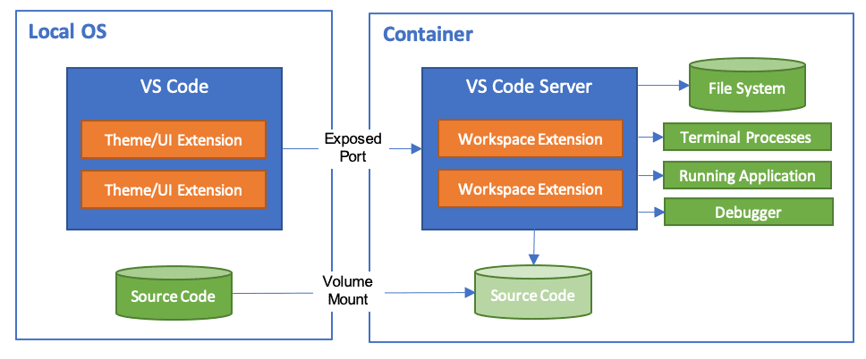
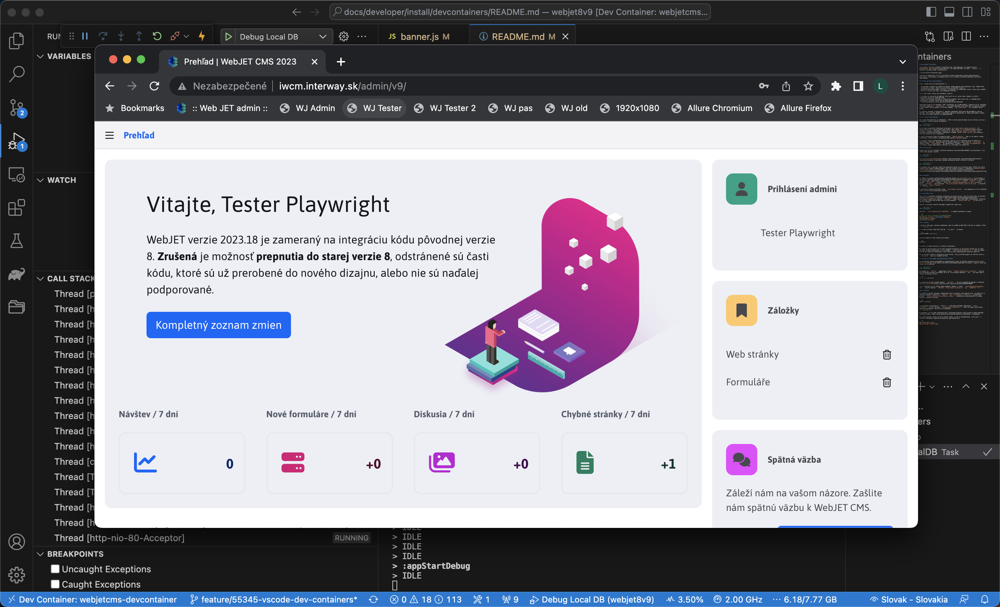
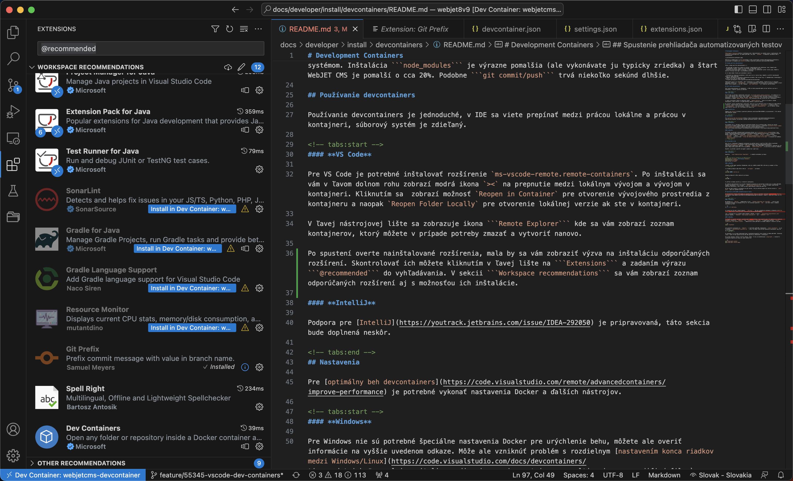
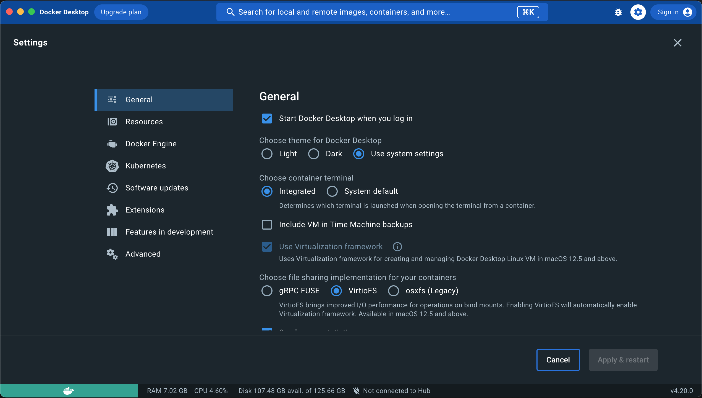
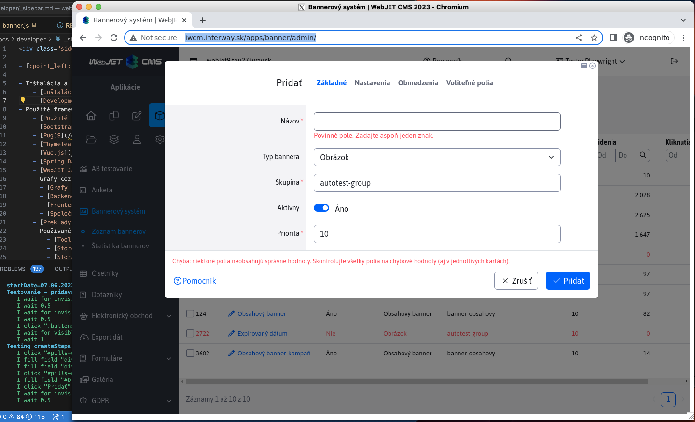
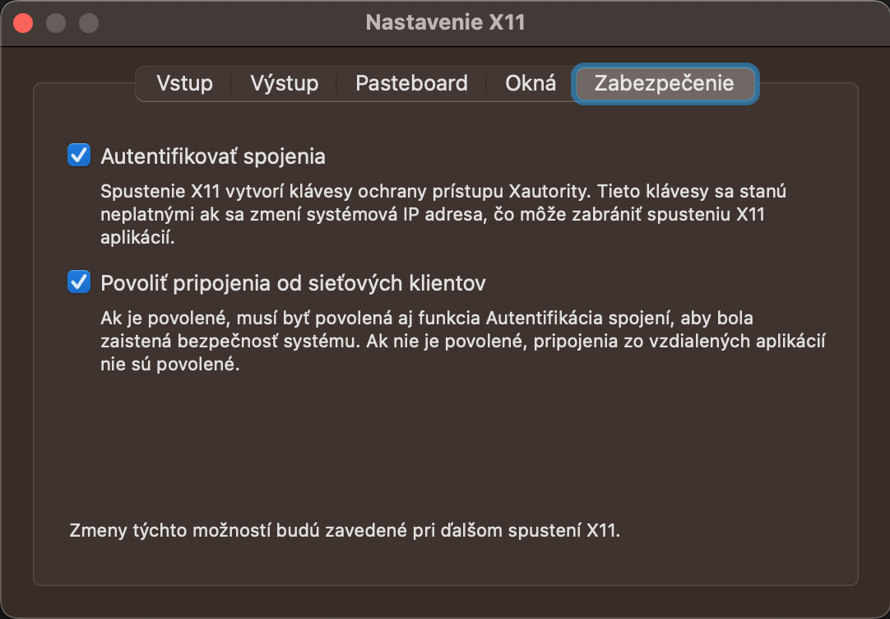

# Development Containers

[Development Containers](https://containers.dev) (devconatiners) is a way of developing in containers. The GUI of the development environment runs on your computer, but its ```backend``` and the complete code execution is in the containers.



It is currently supported in [VS Code](https://code.visualstudio.com/docs/devcontainers/containers), support for [IntelliJ](https://youtrack.jetbrains.com/issue/IDEA-292050) is in the works.

## Benefits of using devcontainers

The main advantages of using devcontainers are:

- It only requires Docker to be installed on your computer (you don't need to have Java, NodeJS, etc. installed).
- Simplifies the overall installation of the environment on the developer's computer.
- Unifies the environment between developers - the exact version of Java, NodeJS and other tools is installed in the container as in the production environment.

It is therefore particularly suitable for the following scenarios:

- You are working on multiple projects, each using a different version of Java, NodeJS, and it is difficult to coordinate the versions on your computer.
- Occasionally you need to work on an outdated project that uses technologies that are no longer supported and are difficult to keep on your computer.
- You need to launch/try/verify/test the project quickly.

Of course, development also has its drawbacks - running in a container is a bit slower, especially working with the file system. Installing ```node_modules``` is significantly slower (but you typically do it rarely) and starting WebJET CMS is about 20% slower. Similarly, ```git commit/push``` takes a few seconds longer.

After running the project in the container, the standard HTTP ports 80,443,8080 are mapped to the local computer, so you will see WebJET running from the container in your browser by default, just as if you had run the project on your computer.

Information about launching from the container can be seen in the bottom left where the blue text ```Dev Container: meno``` is.



## Using devcontainers

Using devcontainers is easy, you can switch between working locally and working in a container in the IDE, the file system is shared.

<!-- tabs:start -->
#### **VS Code**

For VS Code, you need to install the `ms-vscode-remote.remote-containers` extension. After installation, you will see a blue icon `><` in the lower left corner to switch between local development and container development. Clicking it will show the option `Reopen in Container` to open the development environment from the container and vice versa `Reopen Folder Locally` to open the local version if you are in the container.

The icon ```Remote Explorer``` is displayed in the left toolbar, where you will see a list of containers, which you can delete and recreate if necessary.

After launching, verify the installed extensions, you should be prompted to install recommended extensions. You can check them by clicking on ```Extensions``` in the left bar and entering ```@recommended``` in the search. In the ```Workspace recommendations``` section, you will see a list of recommended extensions with the option to install them.



When you first open the project, you may see ```Mapper``` class compilation errors, but just open the class, make a change (space, delete space), and save the file and the error will be fixed.

#### **IntelliJ**

Support for [IntelliJ](https://youtrack.jetbrains.com/issue/IDEA-292050) is in development, this section will be added later.

<!-- tabs:end -->
## Settings

For [optimal running of devcontainers](https://code.visualstudio.com/remote/advancedcontainers/improve-performance) it is necessary to configure Docker and other tools.

<!-- tabs:start -->
#### **Windows**

There are no special Docker settings required for Windows to speed up the runtime, but you can check the information in the link above. However, there may be an issue with different [line ending settings between Windows/Linux](https://code.visualstudio.com/docs/devcontainers/tips-and-tricks#_resolving-git-line-ending-issues-in-containers-resulting-in-many-modified-files).

#### **MacOS**

For MacOS, you need to optimize Docker settings for [faster disk work](https://www.docker.com/blog/speed-boost-achievement-unlocked-on-docker-desktop-4-6-for-mac/). Click the Docker icon in the menu bar and select the ```Settings``` option, in the ```General``` tab, select the ```VirtioFS``` option in the ```Choose file sharing implementation for your containers``` section. In the ```Advanced``` tab, select the ```Allow the default Docker socket to be used``` option and click the ```Apply & Restart``` button.



<!-- tabs:end -->

In the container, you can use the DNS record ```host.docker.internal``` to connect to your computer (e.g., your local database server).

## Gitlab/SSH keys

To connect to the gitlab server using SSH keys in your container, you need to set up [key sharing](https://code.visualstudio.com/remote/advancedcontainers/sharing-git-credentials) using ```ssh-agent``` between your computer and the container. Technically, you could copy the SSH key directly to the ```/home/vscode/.ssh``` folder, but that's not ideal.

First you need to start ssh-agent (one-time operation):

<!-- tabs:start -->
#### **Windows**

Run ```local Administrator PowerShell``` and enter the following commands:

```sh
# Make sure you're running as an Administrator
Set-Service ssh-agent -StartupType Automatic
Start-Service ssh-agent
Get-Service ssh-agent
```
#### **MacOS**

In MacOS, the SSH agent is running by default, it should be enough to add SSH keys as shown below.
<!-- tabs:end -->

And then add your SSH keys to ```ssh-agent``` with the command:

```sh
ssh-add $HOME/.ssh/id_rsa
```

To view the list of added keys, run the command:

```sh
ssh-add -l
```

You can then verify this in the container terminal.

After restarting devcontainers, you should be able to connect to git/gitlab just like on your computer. The settings are also in the ```.devcontainer/localInit.sh``` script that is executed before each container start, so you don't need to run these commands manually.

If you have trouble connecting to the git server, you can always switch to the local version and perform the ```pull/push``` operation locally.

## Launching the Automated Test Browser

If you need to see the browser for automated tests, you need to set up [XServer/X11 forwarding](https://www.oddbird.net/2022/11/30/headed-playwright-in-docker/) (a window manager for Linux) on your computer.



<!-- tabs:start -->
#### **Windows**

On Windows, ```XServer``` is supported within ```Windows Subsystem for Linux/WSL``` and should be available by default on Windows 10 and 11. To verify, launch ```WSL``` from the start menu and enter the following command:

```sh
ls -a -w 1 /mnt/wslg
```

you should see the value ```.X11-unix``` in the listing. If not, go to the store and download the [current version of WSL](https://www.microsoft.com/store/productId/9P9TQF7MRM4R).

Unfortunately, there is a difference in the configuration between Windows and MacOS, in the ```.devcontainer/devcontainer.json``` file, change the value of ```"DISPLAY": "host.docker.internal:0"``` to ```"DISPLAY": ":0"```.

#### **MacOS**

For MacOS, you first need to install [XQuartz](https://www.xquartz.org). After installing and restarting, go to ```XQuartz``` in the application ```Preferences -> Security``` and check the option ```Allow connections from network clients```.



Restart your computer again and then enter the command in the terminal:

```sh
xhost +localhost
```

to allow connections to ```XQuartz``` from the local machine. The ```xhost +localhost``` setting is also in the ```.devcontainer/localInit.sh``` script that is executed before each container start, so you don't forget it.
<!-- tabs:end -->

Once set up, you will see a window from containerized Linux directly on your computer. Technically, you can run any GUI application installed in the container in this mode.

When you run the tests for the first time, you may see an error that `playwright` is not installed, run the commands in the container terminal to install it:

```sh
npx playwright install
npx playwright install-deps
```

## Sample files

The following is a list of sample files that you can use as a basis for your project. They are all located in the ```.devcontainer``` folder:

```devcontainer.json``` - samotná konfigurácia ```devcontainer```:

```json
// For format details, see https://aka.ms/devcontainer.json. For config options, see the
// README at: https://github.com/devcontainers/templates/tree/main/src/alpine
{
	"name": "webjetcms-devcontainer",
	// Or use a Dockerfile or Docker Compose file. More info: https://containers.dev/guide/dockerfile
	"image": "mcr.microsoft.com/devcontainers/base:ubuntu",
	"features": {
		//https://github.com/devcontainers/features/tree/main/src/java
		"ghcr.io/devcontainers/features/java:1": {
			"version": "8",
			"jdkDistro": "open",
			"installAnt": true,
			"antVersion": "1.10.12"
		},
		//https://github.com/devcontainers/features/tree/main/src/node
		"ghcr.io/devcontainers/features/node:1": {
			"nodeGypDependencies": true,
			"version": "16"
		}
	},
    "runArgs": [
		//publish ports
		"--publish=80:80",
		"--publish=443:443",
		"--publish=8080:8080"
    ],

	"initializeCommand" : ".devcontainer/localInit.sh || true",
	"postCreateCommand": ".devcontainer/postCreateCommand.sh",
	"postStartCommand": ".devcontainer/postStartCommand.sh",

	//https://www.oddbird.net/2022/11/30/headed-playwright-in-docker/
	"containerEnv": {
        "DISPLAY": "host.docker.internal:0"
    },

	// Use 'forwardPorts' to make a list of ports inside the container available locally.
	//"forwardPorts": []

	// Configure tool-specific properties.
	"customizations": {
		"extensions": [
			"SonarSource.sonarlint-vscode",
			"vscjava.vscode-gradle",
			"naco-siren.gradle-language",
			"mutantdino.resourcemonitor",
			"srmeyers.git-prefix"
		],
		"settings": {
			"window.title": "${activeEditorMedium}${separator}${rootName}",
			"editor.stickyScroll.enabled": true,
			"java.debug.settings.showStaticVariables": true
		}
	}

	// Uncomment to connect as root instead. More info: https://aka.ms/dev-containers-non-root.
	// "remoteUser": "root"
}
```

```localInit.sh``` - skript sa spúšťa na lokálnom počítači pred vytvorením kontajnera:

```sh
#!/bin/sh

#enable MacOS Xquartz connection
xhost +localhost

#add local SSH key to ssh-agent
ssh-add $HOME/.ssh/id_rsa
ssh-add -l
```

```postCreateCommand.sh``` - skript sa spustí po vytvorení kontajnera už v jeho vnútri, umožňuje inštalovať dodatočné programy:

```sh
#!/bin/sh
sudo apt update
sudo apt install iputils-ping
sudo apt -y install imagemagick
```

```postStartCommand.sh``` - skript sa vykoná pri každom spustení kontajnera, z dôvodu pomalého prekladu ```.local``` domén pridáva do ```/etc/hosts``` potrebné DNS záznamy:

```sh
#!/bin/sh

#set local DNS
sudo -- sh -c "echo '#LOCAL DNS FOR WEBJET' >> /etc/hosts"
sudo -- sh -c "echo '127.0.0.1    iwcm.interway.sk iwcm.iway.sk cms.iway.sk docs.interway.sk' >> /etc/hosts"
sudo -- sh -c "echo '1.2.3.4   gitlab.web.iway.local' >> /etc/hosts"
```
