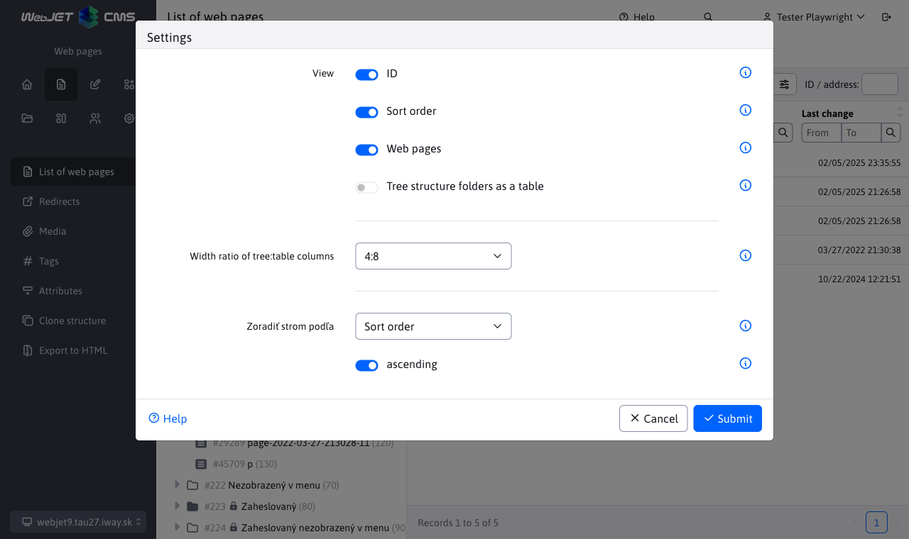

# jsTree

Library [jsTree](https://www.jstree.com/) is jquery `plugin`, which displays tree structures in WebJET.

<!-- @import "[TOC]" {cmd="toc" depthFrom=2 depthTo=6 orderedList=false} -->

<!-- code_chunk_output -->

- [jsTree](#jstree)
	- [Basic initialization in cooperation with Spring REST](#základná-inicializácia-v-spolupráca-so-spring-rest)
	- [Configuration](#konfigurácia)
		- [Creating a new REST controller](#vytvorenie-nového-rest-controllera)
		- [Custom object types](#vlastné-typy-objektov)
		- [Adjusting the display](#úprava-zobrazenia)
		- [Change the URL of a REST service](#zmena-url-adresy-rest-služby)
	- [Icons and CSS classes](#ikony-a-css-triedy)
		- [How to use icons](#spôsob-použitia-ikon)
<!-- /code_chunk_output -->

## Basic initialization in cooperation with Spring REST

The WebJET implementation of jsTree is configured using a JSON object in `app.js`.

Basic example:

```javascript
script.
    let jstree = $('#SomStromcek').jstree({
            'core' : {
                'check_callback' : function (operation, node, parent, position, more) {
                    if (operation === 'copy_node') {
                        return false;
                    }

                    if(operation === 'move_node') {
                        if(parent.id === '#') {
                            return false; // prevent moving a child above or below the root
                        }
                    }

                    return true; // allow everything else
                },
                'data' : function(obj, callback) {
                    let jsTreeParamValue;
                    if (jsTreeParamName === 'url') {
                        jsTreeParamValue = '/images';
                        if (obj.id !== '#' && typeof obj.original !== 'undefined') {
                            jsTreeParamValue = obj.original.virtualPath;
                        }
                    }
                    else {
                        jsTreeParamValue = 0;
                        if (obj.id !== '#') {
                            jsTreeParamValue = obj.id;
                        }
                    }

                    let data = {};
                    data[jsTreeParamName] = jsTreeParamValue;

                    if (typeof window.treeInitialJson != undefined && window.treeInitialJson != null) {
                        let items = window.treeInitialJson;
                        window.treeInitialJson = null;
                        callback.call(this, items);
                    }
                    else {
                        $.ajax({
                            url: WJ.urlAddPath(getJstreeUrl(), "/tree"),
                            method: 'post',
                            contentType: 'application/json',
                            data: JSON.stringify(data),
                            success: function (data) {
                                if (!data.result) {
                                    WJ.notifyError(data.error);
                                    return;
                                }
                                //WJ.log("calling callback, items=", data.items);
                                callback.call(this, data.items);
                            }
                        });
                    }
                }
            },
            "plugins" : [
                "dnd"
            ],
            "types" : {
                "#" : {
                    "max_children" : 1,
                    "max_depth" : 4,
                    "valid_children" : ["root"]
                },
                "root" : {
                    "icon" : "/static/3.3.8/assets/images/tree_icon.png",
                    "valid_children" : ["default"]
                },
                "default" : {
                    "valid_children" : ["default","file"]
                },
                "file" : {
                    "icon" : "glyphicon glyphicon-file",
                    "valid_children" : []
                }
            }
        }).on("move_node.jstree", function(e, data) {
            //console.log("Drop node " + data.node.id + " to " + data.parent);
            //console.log("Data", data);
            delete(data.node.children);
            //console.log("Data", data);
            let json = {
                node: data.node,
                old_parent: data.old_parent,
                old_position: data.old_position,
                parent: data.parent,
                position: data.position
            };

            $.ajax({
                url : jsTreeUrl + "/move",
                method: 'post',
                dataType: 'json',
                contentType: 'application/json',
                data: JSON.stringify(json),
                success: function(response) {
                    //console.log("response", response);
                    if (!response.result) {
                        toastr.error(response.error);

                        return;
                    }

                    // LPA: bez refreshu parenta jstree hadzalo internu chybu
                    jstree.jstree(true).refresh(data.parent);
                }
            })
        });
```

```html
<div id="SomStromcek" data-rest-url="/admin/rest/components/gallery/tree" data-rest-param-name="url"></div>
```

## Configuration

The address of the called REST service is configured using HTML attributes `data-rest-url` a `data-rest-param-name` (the name of the parameter sent to the REST service).

In the object `window.treeInitialJson` it is possible to set the initialization JSON data for the initial display of the tree structure. Thus, the first view will be faster as there is no need to call the REST service. Passing data to the backend is described in the section [thymeleaf](../frameworks/thymeleaf.md#vloženie-vlastných-objektov-do-modelu).

### Creating a new REST controller

New controller should expand the class [JsTreeRestController](../../../src/main/java/sk/iway/iwcm/admin/jstree/JsTreeRestController.java), implement abstract tree methods (menu items), `move` (BE implementation of item transfer) and `checkAccessAllowed` (user rights check by request).

### Custom object types

To the object `JsTreeItem` has been added `String customType`, for defining a custom type in customer implementations. The usage is the same as in the case of `Type`where we can compare `Enumy`, only in this case we compare `Stringy`, by the method of `equals`.

Use type

```java
if (original.getType() == JsTreeItemType.GROUP) {
    // vlastny kod pre dany type
}
```

Use `customType`

```java
if ("custom-jstree-item".equals(original.getCustomType())) {
    // vlastny kod pre dany custom type
}
```

### Adjusting the display

The JS object is tested before the tree structure is displayed `window.jstreeCustomizeData`. If it exists, it is called. It can modify the received data before displaying it.

An example is the display of the ID and the order of arrangement in the list of web pages implemented in `src/js/pages/web-pages-list/jstreesettings.js`:

```javascript
    jstreeCustomizeData(data) {
        //console.log("Customize data: ", data);

        if (data==null || typeof data == "undefined" || data.length < 1 ) return;

        const idShow = window.jstreeSettings.isIdShow();
        const priorityShow = window.jstreeSettings.isPriotityShow();

        data.forEach(function(item) {
            //console.log(item);
            if (typeof item.groupDetails != "undefined") {
                if (idShow) item.text = `<span class="id">#${item.groupDetails.groupId}</span> ${item.text}`;
                if (priorityShow) item.text = `${item.text} <span class="sortPriority">(${item.groupDetails.sortPriority})</span>`;
            } else if (typeof item.docDetails != "undefined") {
                if (idShow) item.text = `<span class="id">#${item.docDetails.docId}</span> ${item.text}`;
                if (priorityShow) item.text = `${item.text} <span class="sortPriority">(${item.docDetails.sortPriority})</span>`;
            }
        });
    }
```



### Change the URL of a REST service

The URL of the REST service is obtained from the data attribute `data-rest-url`, if you need to change it dynamically you can create a JavaScript function `window.getJstreeUrl`, which is used instead of the value in the data attribute:

```JavaScript
var somStromcek = null;

const queryString = window.location.search;
const urlParams = new URLSearchParams(queryString);
let dir = urlParams.get('dir')

window.getJstreeUrl = function() {
    if (somStromcek==null) somStromcek = $('#SomStromcek');
    let url = somStromcek.data("rest-url");
    if (dir != null) url = WJ.urlAddParam(url, "dir", dir);
    return url;
}
```

## Icons and CSS classes

The icon is set using [FontAwesome](https://fontawesome.com/icons?d=gallery) CSS classes by calling [JsTreeItem.setIcon](../../../src/main/java/sk/iway/iwcm/admin/jstree/JsTreeItemState.java). The value is, for example `fas fa-folder` or `fas fa-globe`.

The API provides methods for setting HTML attributes on both the LI and A element using attributes [li\_attr and a\_attr](https://www.jstree.com/docs/json/). To easily add CSS classes, the API provides methods `JsTreeItem.addLiClass` a `JsTreeItem.addAClass`. So you can set CSS states `is-not-public` or `fa-is-internal`.

JsTree does not allow to display multiple icons in a row, which we need to display the status of directories and web pages, we add these as HTML code to the text using the method `JsTreeItem.addTextIcon`.

Examples are in the classes [GroupsJsTreeItem](../../../src/main/java/sk/iway/iwcm/doc/GroupsJsTreeItem.java) a [DocumentsJsTreeItem](../../../src/main/java/sk/iway/iwcm/doc/DocumentsJsTreeItem.java).

### How to use icons

The use of icons has the following rules:
- <i class="fas fa-folder" role="presentation" /> / <i class="fas fa-globe" role="presentation" /> full page and folder icon = displayed in menu
- <i class="far fa-folder" role="presentation" /> / <i class="far fa-globe" role="presentation" /> empty page and folder icon = not shown in menu
- <i class="fas fa-lock" role="presentation" /> lock = only available for logged in visitor
- <span style="color: #FF4B58">red colour</span> = unavailable for public (internal directory) or page with display disabled (in DT it is possible to use CSS class is-not-public per line)
- **bold font** = main page of the directory (in DT it is possible to use CSS class `is-default-page`)
- <i class="fas fa-external-link-alt" /> out arrow = page is redirected
- <i class="fas fa-eye-slash" /> crossed out eye = page not searchable
