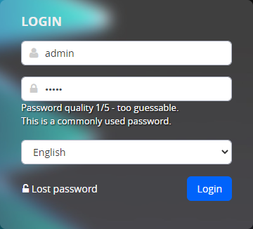

# Quality of passwords

Our implementation encapsulates the library [zxcvbn-ts](https://zxcvbn-ts.github.io/zxcvbn/), which evaluates the quality of a password based on several parameters. In addition to standard rules such as **Length** passwords, **large** letters, **Special to** characters checked in the password as well:
- a sequence of characters on the keyboard, e.g. `asdf`
- dates and years
- repeating sequences of the type `abcabc`
- common names and surnames
- well-known slogans such as `password`
The library has **built-in dictionary of the most commonly used entries** and the names against which it checks the password.

The check is implemented in the administration when creating/modifying a user but also in the login page in the administration, where it informs the user about the quality of the entered password.


## Example of use

Automatic use in a datatable is simple, the class constructor `WjPasswordStrength` uses the following options:
- `element` - HTML DOM element, or the element ID (which is subsequently obtained as `document.querySelector`)
```javascript
new WjPasswordStrength({ element: "#DTE_Field_password" }).load();
```

When used in this way, it is automatically set to the specified `element` initializes the password quality check. The element is searched for the appropriate `div[data-dte-e=msg-info]` to which information about the quality of the password is written.

## Features

- `load()` - asynchronously loads a dictionary of frequently used passwords and calls the function after loading `bindToElement()`.
- `bindToElement(element)` - initializes `keyup` event on the specified element to check the password quality. It prints the information to the appropriate `div[data-dte-e=msg-info]`.
- `checkPassword(password)` - verifies the quality of the specified password, returns the result in a JSON object.

## Implementation details

Current library `zxcvbn-ts` contains only `en,de,fr` dictionaries of frequently used entries. In our implementation, the function `load()` used only `en` Dictionary.

Password quality information uses translation keys from WebJET `wj-password-strength.warnings.` a `wj-password-strength.rating.`. Object `zxcvbn` is initialized with empty `translations` object and returns the keys directly. These are inserted into the WebJET translation keys to extract the information. Original library `zxcvbn` does not contain translations into the languages needed for WebJET, so we chose this solution. In addition, the texts can be edited directly via WebJET.

The library is imported in `app.js` and available globally:

```javascript
import { WjPasswordStrength } from "./libs/wj-password-strength";
global.WjPasswordStrength = WjPasswordStrength;
```

## Login screen

The library is also used on the login screen to the administration.

But since the login is implemented in the old JSP format and we don't want to make the JavaScript files of the full administration available on the login screen anymore, we use the login screen directly `zxcvbn-ts` library. Since the directory `node_modules` is not directly available, files are copied from directories in `node_modules/@zxcvbn-ts` to directories in `admin/skins/webjet8/assets/js/zxcvbn`to ensure that libraries are updated after an update via `npm update`.

The use of the library is implemented directly in `logon-spring.js` similarly to this library, the translation texts are also entered directly in the JSP file (but via translation keys synchronized with the administration).


