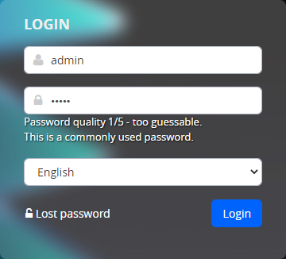

# Password quality

Our implementation encapsulates the [zxcvbn-ts](https://zxcvbn-ts.github.io/zxcvbn/) library, which evaluates password quality based on several parameters. In addition to standard rules such as **password length**, **capital** letters, **special** characters, it also checks the password for:

- sequence of characters on the keyboard, e.g. ```asdf```
- dates and years
- repeating sequences of type ```abcabc```
- common names and surnames
- known passwords like ```password```

The library has a **built-in dictionary of the most commonly used passwords** and names against which it checks the password.

The check is implemented in the administration when creating/editing a user, but also on the login page in the administration, where it informs the user about the quality of the entered password.


## Example of use

Automatic use in a datatable is simple, the ```WjPasswordStrength``` class constructor uses the following options:

- ```element``` - ​​HTML DOM element, or element ID (which is subsequently obtained as ```document.querySelector```)

```javascript
(new WjPasswordStrength({element: "#DTE_Field_password"})).load();
```

When used in this way, the password quality check is automatically initialized on the specified ```element```. The corresponding ```div[data-dte-e=msg-info]``` is searched for the element, in which information about the password quality is written.

## Features

- ```load()``` - ​​asynchronously loads a dictionary of frequently used passwords and calls the function ```bindToElement()``` after loading.
- ```bindToElement(element)``` - ​​initiates the ```keyup``` event on the specified element for password quality control. It writes the information to the corresponding ```div[data-dte-e=msg-info]```.
- ```checkPassword(password)``` - ​​verifies the quality of the entered password, returns the result in a JSON object.

## Implementation details

Currently, the ```zxcvbn-ts``` library contains only ```en,de,fr``` dictionaries of frequently used passwords. In our implementation, only the ```en``` dictionary is used in the ```load()``` function.

The password quality information uses translation keys from WebJET ```wj-password-strength.warnings.``` and ```wj-password-strength.rating.```. The ```zxcvbn``` object is initialized with an empty ```translations``` object and returns the keys directly. These are inserted into the WebJET translation keys to display the information. The original library ```zxcvbn``` does not contain translations into the languages ​​needed for WebJET, which is why we chose this solution. In addition, it is possible to edit texts directly via WebJET.

The library is imported in ```app.js``` and available globally:

```javascript
import { WjPasswordStrength } from './libs/wj-password-strength';
global.WjPasswordStrength = WjPasswordStrength;
```

## Login screen

The library is also used on the administration login screen.

However, since the login is implemented in the old JSP format and we do not want to make the full administration JavaScript files available on the login screen, the login screen uses the ```zxcvbn-ts``` library directly. Since the ```node_modules``` directory is not directly accessible, files are copied from the directories in ```node_modules/@zxcvbn-ts``` to the directories in ```admin/skins/webjet8/assets/js/zxcvbn``` during the ant build to ensure that the libraries are updated after the update via ```npm update```.

The use of the library is implemented directly in ```logon-spring.js``` similar to this library, translation texts are also entered directly in the JSP file (but via translation keys synchronized with the administration).

