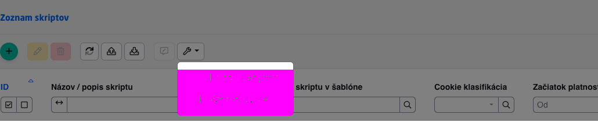

# Automated testing

For automated E2E testing the framework is used [CodeceptJS](https://codecept.io). Tests are written in JavaScript and practically control the browser in which the test is run. More information on why we chose this framework is in the section [Playwright + CodeceptJS](#playwright--codeceptjs).

## Installation

```shell
cd src/test/webapp/
npm install
```

!>**Warning:** Before running the testing, you need to compile the JS/CSS admin part of WebJET:

```shell
cd src/main/webapp/admin/v9/
npm install
npm run prod
```

and start the application server:

```shell
gradlew appRun
```

I recommend you to run each of the above commands in a separate Terminal (menu Terminal->New Terminal). You can switch between running terminals in the `Terminal`.

## Start testing

To start testing, use the following commands:

````shell
cd src/test/webapp/

#spustenie vsetkych testov
npm run all

#spustenie konkrétneho testu a zastavenie v prípade chyby
npm run pause tests/components/gallery_test.js

#Spustenie konkrétneho scenára s hodnotou ```@current``` v názve
npm run current
````

To run in firefox use the prefix `ff:` before the title:

```shell
npm run ff:all
npm run ff:pause tests/components/gallery_test.js
npm run ff:current
```

Running on another URL with browser display and browser disabled `firefox`:

```shell
CODECEPT_URL="http://demotest.webjetcms.sk" CODECEPT_SHOW=false npm run all
```

**Remark:** in Firefox we had problems with the speed of the tests. Therefore, for this browser in the file `codecept.conf.js` sets the variable `autodeayEnabled` to the value of `true` and the add-on is activated `autodelay`. The latter delays the execution of functions `amOnPage,click,forceClick` about 200ms before and 300ms after the command is called. We also identified a strange behavior of the browser, which if it is not on the foreground then the tests stop working out of nowhere and display nonsensical errors. When running the test once, the test always executed correctly. We attribute this to some optimization of JavaScript code execution in the browser when it is not active. When run with the browser not displayed, everything is fine, so always use the setting to run all tests `CODECEPT_SHOW=false`.

### Codecept UI

Codecept offers in beta a UI to view testing, you run it with the command:

```shell
npm run codeceptjs:ui
```

and then open the page in your browser `http://localhost:3001`.

### HTML report generation

**Mochawesome**

In npm is set [plugin for generating HTML reports](https://codecept.io/reports/#html). You generate it by running the command:

```shell
npm run codeceptjs --reporter mochawesome
```

and an HTML report with the test result will be generated in the /build/test/report directory. For failed tests, a screenshot is also created. The setting is in [codecept.conf.js](../../../../src/test/webapp/codecept.conf.js) in section `mocha`.

**Allure**

The report can also be generated via [allure](allure.md) by running the test:

```shell
npm run codeceptjs --plugins allure
```

Once the test is complete, you can view the results by running `allure` server:

```shell
allure serve ../../../build/test
```

## Playwright + CodeceptJS

For testing is used [Playwright](https://github.com/microsoft/playwright/tree/master/docs) a [CodeceptJS](https://codecept.io/basics/).

Why Playwright?

- it is the 3rd generation of the testing framework (1st generation Selenium, 2nd generation Puppeteer, 3rd generation Playwright)
- Microsoft bought the authors `Puppeteer` framework and they develop Playwright, so they have the experience
- Supported by `chromium, firefox, webkit` (2021 May Windows update will switch Edge to Chromium Core)
- can emulate resolutions, user agent, DPI

Why CodeceptJS?

- Playwright as well as `Puppeteer` is a communication (low level) protocol for controlling the browser (its automation)
- CodeceptJS is a testing framework that, among other things, can use Playwright
- test code is written in JavaScript
- the code of the tests is very [understandable](https://codecept.io/playwright/#setup)
- has advanced options [Locators](https://codecept.io/locators/#css-and-xpath) - search elements by text, css, xpath
- has [GUI](https://codecept.io/ui/) (not yet tested) for writing and displaying test results

### Configuration

The basic configuration is in the file `codecept.conf.js`. Important attributes:
- `url` (http://iwcm.interway.sk) - address (domain) of the server. You can change this via `--override` parameter and switch testing from DEV to TEST/PROD environment.
- `output` (../../../build/test) - directory to which you will generate a screenshot in case of a failed test (default to `build/test` in the root directory)
- `browser` (chromium) - the chosen browser to run the tests, can be `chromium, firefox, webkit`
- `emulate` (commented) - [Emulation](https://github.com/Microsoft/playwright/blob/master/src/deviceDescriptors.ts) facilities
- `screenshotOnFail` - enables/disables screenshot creation in case of a failed test

## Writing tests

Tests are created in subdirectories tests, where they are divided according to the individual modules/applications of WebJET. They are written in JavaScript, so you can use all the possibilities that JavaScript offers.

Example of a more complex test to test login [src/test/webapp/tests/admin/login.js](../../../../src/test/webapp/tests/admin/login.js):

!>**Warning:** to `Feature` enter the value in the format `adresár.podadresár.meno-súboru` for correct display of tests in tree structure and easy tracing of the file according to `Feature` in the log file.

```javascript
Feature('admin.login');

//Before sa vola pred kazdym Scenarom, v kazdom scenati volam /admin/ a zadavam username tester
Before(({I}) => {
    I.amOnPage('/admin/');
    I.fillField("username", "tester");
});

//Kazdy scenar sa spusta samostatne a samostatne sa vyhodnocuje
Scenario('zle zadane heslo', ({I}) => {
    //do pola password vyplnim zle heslo
    I.fillField("password", "wrongpassword");
    //kliknem na tlacitko
    I.click("login-submit");
    //overim, ci sa zobrazi uvedena hlaska
    I.see("Zadané meno alebo heslo je nesprávne.");
});

Scenario('prihlasenie zablokovane', ({I}) => {
    I.fillField("password", "wrongpassword");
    I.click("login-submit");
    I.see("Pre nesprávne zadané prihlasovacie údaje je prihlásenie na 10+ sekúnd zablokované");
    I.say("Cakam 10 sekund na exspirovanie zablokovanej IP adresy");
    //je potrebne cakat 10 sekund na exspirovanie zleho hesla
    I.wait(13);
    //odkomentujte pre zobrazenie interaktivneho terminalu
    //pause();
});

Scenario('uspesne prihlasenie', ({I}) => {
    I.fillField("password", secret("************"));
    I.click("login-submit");
    I.see("WebJET 2021 info");
    //konecne som prihlaseny
    I.wait(1);
    //zobrazim dropdown s menom usera, ten vyberam cez CSS selector
    I.click({css: "li.dropdown.user"});
    //overim, ci vidim moznost Odhlasenia
    I.see("Odhlásenie");
    //kliknem na odhlasenie, vsimnite si, ze to selectujem podla textu linky
    I.click("Odhlásenie");
    //overim, ci sa zobrazi text Prihlasenie (som korektne odhlaseny)
    I.see("Prihlásenie");
});
```

Note that in the demo I am intentionally using different locators/selectors (field name, text/label, CSS selector). This is one of the advantages of CodeceptJS. More about locator options is in [Documentation](https://codecept.io/locators/#css-and-xpath).

### Locators

The selectors that select an element on the page are well described in [official documentation](https://codecept.io/locators/).

```
{permalink: /'foo'} matches <div id="foo">
{name: 'foo'} matches <div name="foo">
{css: 'input[type=input][value=foo]'} matches <input type="input" value="foo">
{xpath: "//input[@type='submit'][contains(@value, 'foo')]"} matches <input type="submit" value="foobar">
{class: 'foo'} matches <div class="foo">
```

### Within

Using the notation `within` you can restrict the element to which the following commands are applied:

```javascript
within("div.breadcrumb-language-select", () => {
    I.click("Slovenský jazyk");
    I.click("Chorvátsky jazyk");
});
```

at the same time, most commands also allow you to write a selector to the command, the above can also be written as:

```javascript
  I.click("Slovenský jazyk", "div.breadcrumb-language-select");
  I.click("Chorvátsky jazyk", "div.breadcrumb-language-select");
```

### Playwright methods

V [official documentation](https://codecept.io/helpers/Playwright/) is a list of all options `I` object. Short references:
- [pressKey](https://codecept.io/helpers/Playwright/#presskey)
- [click](https://codecept.io/helpers/Playwright/#click)
- [forceClick](https://codecept.io/helpers/Playwright/#forceclick) - a forced click without waiting for an event, must be used on custom `checkboxy` (otherwise it gets stuck there)
- [see](https://codecept.io/helpers/Playwright/#see) / [dontSee](https://codecept.io/helpers/Playwright/#dontsee)
- [seeElement](https://codecept.io/helpers/TestCafe/#seeelement) / [dontSeeElement](https://codecept.io/helpers/Detox/#dontseeelement)
- [fillField](https://codecept.io/helpers/Playwright/#fillfield)
- [selectOption](https://codecept.io/helpers/Playwright/#selectoption)
- [wait](https://codecept.io/helpers/Playwright/#wait)
- [selectOption](https://codecept.io/helpers/Playwright/#selectoption)
- [executeScript](https://codecept.io/helpers/Playwright/#executescript)
- [saveScreenshot](https://codecept.io/helpers/Playwright/#savescreenshot)

### WebJET additional features

We have added several useful features for WebJET:
- [I.formatDateTime(timestamp)](../../../../src/test/webapp/steps_file.js) - formats timestamp to date and time using library moment
- [I.seeAndClick(selector)](../../../../src/test/webapp/steps_file.js) - waits for the element to be displayed and then clicks on it
- [await I.clickIfVisible(selector)](../../../../src/test/webapp/custom_helper.js) - if the element is displayed click on it, if it is not displayed skip the step (do not throw an error)
- [I.verifyDisabled(selector)](../../../../src/test/webapp/custom_helper.js) - verifies that the field is inactive
- [I.wjSetDefaultWindowSize()](../../../../src/test/webapp/steps_file.js) - sets the default window size after changing it, is called automatically even after logging in the login sequence in [codecept.conf.js](../../../../src/test/webapp/codecept.conf.js)
- [Document.compareScreenshotElement(selector, screenshotFileName, width, height, tolerance)](../../../../src/test/webapp/codecept.conf.js) - will perform [visual comparison](#visual-testing)
- `I.waitForTime(time)` - waiting until the specified time (timestamp).
- `I.toastrClose()` - closing the window `toastr` notifications.
- `clickCss(name, parent=null)` - performs a click just like `I.click` But `name` considered as CSS selector - execution is faster, no need to use wrapping to `{css: name}`.
- `forceClickCss(name, parent=null)` - performs a click just like `I.forceClick` But `name` considered as CSS selector - execution is faster, no need to use wrapping to `{css: name}`.

We have prepared special functions for the date table. They are implemented in [DT.js](../../../../src/test/webapp/pages/DT.js):
- `DT.waitForLoader(name)` - waits for displaying and then hiding the "Processing" information in the datatable. It is used as `DT.waitForLoader("#forms-list_processing");`
- `DT.filter(name, value, type=null)` - sets the value `value` in the text filter column `name` DATATables. If the attribute is also specified `type` sets the search type (e.g. Starts at, Ends at, Equals to).
- `DT.filterSelect(name, value)` - sets the value `value` into the select field of the column filter `name` DATATables. It is used as `DT.filterSelect('cookieClass', 'Neklasifikované');`
- `async I.getDataTableColumns(dataTableName)` - returns a DATA object with a datatable definition, used in automatic datatable testing
- `async getDataTableId(dataTableName)` - returns datatable ID, calls JS function `dataTable.DATA.id`
- [async I.getTotalRows()](../../../../src/test/webapp/custom_helper.js) - returns the total number of records in the datatable
- `DT.deleteAll(name = "datatableInit")` - deletes the currently displayed records, always use the `DT.filter` for filtering the necessary data.

For Datatable Editor implemented in [DTE.js](../../../../src/test/webapp/pages/DTE.js):
- `DTE.waitForLoader(name)` - waiting to be hidden `loadera` in the editor (save record)
- `DTE.waitForEditor(name)` - waits for the editor to display, if name is defined, the datatable with the given name is used, by default `datatableInit`
- `DTE.selectOption.(name, text)` - selects a value in the select box (in the correct way by displaying the options and then clicking on the option)
- `DTE.save(name)` - clicks the Save button in the editor, if name is defined, the datatable with the given name is used, by default `datatableInit`
- `DTE.cancel(name)` - clicks the close editor button, if name is defined, the datatable with the given name is used, by default `datatableInit`
- `DTE.fillField(name, value)` - fills in a standard field, as opposed to calling `I.fillField` it is possible to `name` parameter to directly specify the name of the field on the backend/json definition.
- `DTE.fillQuill(name, value)` - fills the value in the types field `QUILL`.
- `DTE.fillCkeditor(htmlCode)` - sets the HTML code to the currently displayed CKEditor.
- `DTE.fillCleditor(parentSelector, value)` - enters text into WYSIWYG `cleditor`. Value `parentSelector` - reference to the element in which the `cleditor` located (e.g. `#forum`), `value` - value to fill. **Warning:** it doesn't know the diacritics yet because of the use of `type` command. It is also possible to execute the following for a datatable [automated test](datatable.md).
- `DTE.appendField(name, value)` - adds text to the field in the editor, solves the problem of using `I.appendField` which is not always done correctly in the editor.

For JsTree (tree structure):
- `I.jstreeClick(name)` - clicks on the selected text in jstree (important to use especially in web pages where the link with the same name as the directory is also in the list of pages)
- `I.createFolderStructure(randomNumber)` - prepares a directory tree structure and two subdirectories for testing
- `I.deleteFolderStructure(randomNumber)` - deletes the tree structure of the directory and the two subdirectories prepared via `I.createFolder`

```javascript
//povodne ZLE riesenie s I.wait
I.click("Pridať");
```
- `I.jstreeNavigate(pathArray)` - in the field `pathArray` it is possible to define the names of individual nodes in the tree structure, which the function clicks on in turn, e.g. `I.jstreeNavigate( [ "English", "Contact" ] );`.

To verify the values in the table, you can use the functions:
- `DT.checkTableCell(name, row, col, value)` - verifies the value in the specified table (table ID) `value` in the specified row `row` and column `col`. Rows and columns start with 1.
- `DT.checkTableRow(name, row, values)` - verifies in the specified table (table ID) in the specified row `row` values in the field `values`. The lines start with 1. For example. `DT.checkTableRow("statsDataTable", 1, ["13", "2 022", "30", "533", "229", "1"]);`.

Functions implemented in `Document` facility:
- `switchDomain(domain)` - switches the domain to the specified value.
- `setConfigValue(name, value)` - sets a configuration variable with the specified name and value.
- `resetPageBuilderMode()` - deletes the remembered editor mode (standard/PageBuilder).
- `notifyClose` - will close `toastr` notification.
- `notifyCheckAndClose(text)` - verifies the text in `toastr` notification and closes it.
- `editorComponentOpen()` - opens the application settings in the page editor (window `editor_component.jsp`).
- `editorComponentOk()` - clicks OK to save the application settings.
- `scrollTo(selector)` - scrolls the content of the window to the specified element.

V `Document` object also includes functions for creating [screenshots](screenshots.md).

To test emails using [tempmail.plus](https://tempmail.plus) there is an object `TempMail`:
- `login(name, emailDomain = "fexpost.com")` - login and account setup
- `openLatestEmail()` - opens the latest email
- `closeEmail()` - closes an open email and returns to the email list
- `destroyInbox()` - deletes all emails in your inbox

### Waiting for completion

It is generally not recommended to use `I.wait` with a fixed period. The waiting time may be different on the local machine and in the CI/CD pipeline. Additionally, a fixed time may unnecessarily increase the time required to execute the test.

We recommend using the methods [waitFor\*](https://codecept.io/helpers/TestCafe/#waitforelement) especially `waitForElement`, `waitForText`, `waitForVisible` a `waitToHide`.

It is preferable to use mainly `waitForText` where we can effectively replace `I.wait` and subsequent `I.see` for one command:

```javascript
//povodne ZLE riesenie s I.wait
I.click("Pridať");
I.wait(1);
I.see("test-adresar-" + randomNumber, container);

//nove riesenie s I.waitForText, caka sa maximalne 10 sekund
I.click("Pridať");
I.waitForText("test-adresar-" + randomNumber, 10, container);
```

### Pause

If you put a command somewhere in the test code `pause()`, the execution of the tests will stop and you will see an interactive console in the Terminal where you can run commands. This way you can prepare the test steps and then simply copy the commands into the JS test file.

```shell
 ...
 Interactive shell started
 Use JavaScript syntax to try steps in action
 - Press ENTER to run the next step
 - Press TAB twice to see all available commands
 - Type exit + Enter to exit the interactive shell
 - Prefix => to run js commands
 I.
```

Pressing the TAB key twice will display a help (list of possible commands). You can enter these and watch what happens in the browser. Pressing the Enter key will advance the test to the next command. Entering `exit` the interactive terminal will be terminated and the test will continue automated further.

### Login

In the file [codecept.conf.js](../../../../src/test/webapp/codecept.conf.js) login via extension is also defined [autologin](https://codecept.io/plugins/#autologin):

```javascript
autoLogin: {
    enabled: true,
    saveToFile: true,
    inject: 'login',
    users: {
        admin: {
            login: (I) => {
            I.amOnPage('/admin/');
            I.fillField("username", "tester");
            I.fillField("password", secret("********"));
            I.click("login-submit");
            },
            check: (I) => {
                I.amOnPage('/admin/');
                I.see("WebJET 2021 info");
            }
        }
    }
}
```

It is possible to define multiple users (repeating the admin attribute), e.g. a registered user, an administrator with limited rights, etc.

Logins can be inserted into the tests using `Before` functions:

```javascript
Feature('gallery');

Before(({login}) => {
    login('admin');
});

Scenario('zoznam fotografii', ({I}) => {
    I.amOnPage("/admin/v9/apps/gallery");
    I.click("test");
    I.see("koala.jpg");
});
```

### Assert library

An extension is available [codeceptjs-chai](https://www.npmjs.com/package/codeceptjs-chai) for calling assert functions:

Basic use:

```javascript
I.assertEqual(1, 1);
I.assertEqual('foo', 'foo');
I.assertEqual('foo', 'foo', 'Both the values are not equal');

I.assertNotEqual('foobar', 'foo', 'Both the values are equal');

I.assertContain('foobar', 'foo', 'Target value does not contain given value');
I.assertNotContain('foo', 'bar', 'Target value contains given value');

I.assertStartsWith('foobar', 'foo', 'Target value does not start with given value');
I.assertNotStartsWith('foobar', 'bar', 'Target value starts with given value');

I.assertEndsWith('foobar', 'bar', 'Target value does not ends with given value');
I.assertNotEndsWith('foobar', 'bar', 'Target value ends with given value');

I.assertLengthOf('foo', 3, 'Target data does not match the length');
I.assertLengthAboveThan('foo', 2, 'Target length or size not above than given number');
I.assertLengthAboveThan('foo', 4, 'Target length or size not below than given number');

I.assertEmpty('', 'Target data is not empty');

I.assertTrue(true, 'Target data is not true');
I.assertFalse(false, 'Target data is not false');

I.assertAbove(2, 1, 'Target data not above the given value');
I.assertAbove(1, 2, 'Target data not below the given value');
```

If necessary, you can also use [assert](https://www.npmjs.com/package/assert) library. An example of use is in the test [gallery.js](../../../../src/test/webapp/tests/apps/gallery/gallery.js):

```javascript
const assert = require('assert');
...
assert.equal(+inputValueH, +area.h);
```

### Page objects

To create universal test scenarios, the component `Pages` into which Page objects are generated via the `npx codeceptjs gpo`, a page object is created using `Dependency Injection` (similar to Angular).

```javascript
const { I } = inject();

module.exports = {

  // insert your locators and methods here
}
```

In order to use it in tests, you need to register it in `codecept.conf.js`.

```javascript
exports.config = {
    include: {
        I: './steps_file.js',
        PageObject: './pages/PageObject.js'
    }
}
```

We can then insert it into our test scenario.

```javascript
Scenario('test-scenario', ({I, PageObject}) => {
  PageObject.someMethod();
})
```

It is also possible to insert objects into tests dynamically via `injectDependencies({})`.

```javascript
Scenario('test-scenario', ({I, PageObject}) => {
  I.fillField('Username', PageObject.username);
  I.pressKey('Enter');
}).injectDependencies({ PageObject: require('./PageObject.js') });
```

### Browser detection

If your tests behave differently in Firefox or Chromium, it is possible to use the browser validation features in the tests.

```javascript
if (Browser.isChromium()) {
  I.amOnPage("/admin/v9/apps/insert-script#/");
  ...
}

if (Browser.isFirefox()) {
  I.say("Firefox, skipping test");
  return;
}

if (Browser.isFirefox()) {
    //ff ma nejak inak kurzor a je potrebne este 2x ist hore
    I.pressKey('ArrowUp');
    I.pressKey('ArrowUp');
}
```

## Revocation of the right

By calling the page address with the parameter `removePerm` it is possible to remove a specified right from a logged-in user on the fly (without saving changes in rights) if the user's login name starts with `tester`. It is possible to test the display of the page without the specified permission and verify the security of the REST service call.

The revocation of the right is implemented in the function `DT.checkPerms(perms, url)` v [DT.js](../../../../src/test/webapp/pages/DT.js). Requires you to specify the right and the address of the page on which the right is being tested. Testo verifies the display of the notification `Prístup k tejto stránke je zamietnutý`. Optional parameter `datatableId` represents the ID/name of the table in the page (it is necessary to specify if there are multiple datatables in the page).

Example of use:

```javascript
Scenario('zoznam stranok', ({ I, DT }) => {
    I.waitForText("Newsletter", 20);
    I.click("Newsletter", container);
    I.see("Testovaci newsletter");

    //over prava
    DT.checkPerms("menuWebpages", "/admin/v9/webpages/web-pages-list/");
});
```

To the parameter `removePerm` it is also possible to specify multiple rights separated by a comma.

For datatables, it is also possible to set the rights to [individual buttons](../datatables/README.md#buttons-by-rights) (add, edit, duplicate, delete). You can also test individually disabled rights. But to verify the rights on the backend, you need to test the REST service as well. By adding the expression `forceShowButton` to the parameter `removePerm` for a user with a login name starting with `tester` the buttons in the datatable will be displayed. It is thus possible to test the display of the error message from the REST service (that the record cannot be added/edited/deleted). An example is in `webpage-perms.js`:

```javascript
Scenario('stranky-overenie prav na tlacidla', ({ I, login, DT, DTE }) => {
    login("admin");
    I.amOnPage("/admin/v9/webpages/web-pages-list/?removePerm=addPage,pageSave,deletePage,pageSaveAs");
    I.dontSeeElement("#datatableInit_wrapper button.buttons-create");
    I.dontSeeElement("#datatableInit_wrapper button.buttons-edit");
    I.dontSeeElement("#datatableInit_wrapper button.btn-duplicate");
    I.dontSeeElement("#datatableInit_wrapper button.buttons-remove");

    //over v dialogu
    I.click("Jet portal 4 - testovacia stranka");
    DTE.waitForEditor();
    I.dontSeeElement("#datatableInit_modal div.DTE_Form_Buttons button.btn-primary");

    I.amOnPage("/admin/v9/webpages/web-pages-list/?removePerm=addPage,pageSave,deletePage,pageSaveAs,forceShowButton&groupid=67");
    DT.waitForLoader();
    //skus pridat
    I.clickCss("#datatableInit_wrapper button.buttons-create");
    I.clickCss("#pills-dt-datatableInit-basic-tab");
    I.fillField("Názov web stránky", auto_webPage);
    DTE.save();
    I.see("Pridať web stránku - nemáte právo na pridanie web stránky");
    DTE.cancel();

    //skus editovat
    I.jstreeNavigate(["Test stavov", "Nedá sa zmazať"]);
    I.click("Nedá sa zmazať", "#datatableInit");
    DTE.waitForEditor();
    I.clickCss("#pills-dt-datatableInit-basic-tab");
    I.seeInField("Názov web stránky", "Nedá sa zmazať");
    DTE.save();
    I.see("Nemáte právo na editáciu web stránky");
    DTE.cancel();

    //skus zmazat
    DT.filter("title", "Nedá sa zmazať");
    I.click("table.datatableInit button.buttons-select-all");
    I.clickCss("#datatableInit_wrapper button.buttons-remove");
    DT.waitForEditor();
    I.see("Naozaj chcete zmazať položku?");
    DTE.save();
    I.see("Nemáte právo na editáciu web stránky");
});
```

**Technical information:**

The revocation of the right is implemented in [ThymeleafAdminController.removePermissionFromCurrentUser](../../../../src/main/java/sk/iway/iwcm/admin/ThymeleafAdminController.java). When you enter the URL parameter `removePerm` the rights of the currently logged in user are modified, including the Spring context.

## Visual testing

The visual testing function should be used to verify displays that cannot be verified by text testing (e.g. correct position of the selection menu). It is used [plugin pixelMatchHelper](https://github.com/stracker-phil/codeceptjs-pixelmatchhelper) which can compare the reference screenshot with the current one and can also highlight changes.

To simplify use, we have prepared a function `Document.compareScreenshotElement(selector, screenshotFileName, width, height, tolerance)` which will ensure the necessary steps. It has parameters:
- `selector` - `selector` the element from which the snapshot is to be taken (it is not taken from the whole screen, but only from the specified element)
- `screenshotFileName` - the image file name, it will automatically be compared with the same image name in the directory `src/test/webapp/screenshots/base`. For filename use prefix `autotest-` for better tracking of the created image
- `width` (optional) - browser window width
- `height` (optional) - browser window height
- `tolerance` (optional) - the degree of tolerance of differences to the reference image (0-100)

Example of use:

```javascript
await Document.compareScreenshotElement("#insertScriptTable_wrapper", "autotest-insert-script-settings.png", 1280, 270);
```

There will probably not be a reference image the first time you run it. But the test will create the current image and save it in the directory `build/test` (so we recommend prefixing the image name with autotest- so that the image can be easily found among screenshots of bugs from testing). If you want to use the image as a reference, copy it to the `src/test/webapp/screenshots/base`. Then the next time you run it, the reference image will be compared with the web page.

Identified differences are generated into images in the directory `src/test/webapp/screenshots/diff` for easy error verification. The test will also declare an error like any other test scenario when differences are identified.

Example of display error (wrong position of selection menu) - reference base image:


incorrect display in the page:


the resulting comparison with the highlighting of the difference area (pink colour):



**Notes on implementation**

Image comparison is encapsulated in a function `Document.compareScreenshotElement` implemented in `Document.js`. When the window is resized, it performs the resizing and returns the window to the default size after creating a screenshot by calling the function `I.wjSetDefaultWindowSize()` (this is also called after each login for consistency).

## Best practices

To run the tests successfully and repeatedly, we recommend the following points:

### Nomenclature

- you start the scenario with the function `Feature('xxx');` where xxx is the name of the test file. If an error occurs you can easily find the corresponding test file.

### Test data

- prepare and delete your test data
- all created objects must contain text `autotest` for identifying objects created by an automated test
- we recommend to use the call `I.getRandomText()` to obtain a unique suffix, a usage seen e.g. in [group-internal.js](../../../../src/test/webapp/tests/webpages/group-internal.js) where variables are defined and are filled in `Before` function
- it is ideal if you create the test data in a separate scenario and also delete it in a separate scenario. So if a test fails, the data deletion is done anyway.

```javascript
var auto_name, auto_folder_internal, auto_folder_public, sub_folder_public;

Before(({ I, login }) => {
     login('admin');
     I.amOnPage('/admin/v9/webpages/web-pages-list#/');

     if (typeof auto_name=="undefined") {
          var randomNumber = I.getRandomText();
          auto_name = 'name-autotest-' + randomNumber;
          auto_folder_internal = 'internal_folder-autotest-' + randomNumber;
          auto_folder_public = 'public_folder-autotest-' + randomNumber;
          sub_folder_public = 'sub_folder_public-autotest-' + randomNumber;
     }
});
```

### Selectors

It is important to use the correct selectors, text/element can appear multiple times in the page and then the test randomly crashes. Use ready-made features like `I.jstreeClick(name)` for tree structure and functions starting with DT./DTE. for datatable and editor e.g. `DTE.selectOption(name, text)` or `DT.filterSelect(name, value)`.

We recommend to try the selector in the JS console of the browser using jQuery, for example:

```javascript
//tlacidlo na pridanie zaznamu
$(".btn.btn-sm.buttons-create.btn-success.buttons-divider");

//v konzole bude vidno, ze vo web strankach je takych tlacidiel viacero:
//1xjstree a 2xdatatabulka z ktorej jedna je neviditelna pre adresare)
//je preto potrebne selektor zuzit tak, aby obsahoval vhodny parent kontajner

//zuzene len na column so stromovou strukturou - najde korektne len jedno tlacidlo
$("div.tree-col .btn.btn-sm.buttons-create.btn-success.buttons-divider")
```

### Timing

Timing of execution is very important, on a different computer or server the test may run at a different speed. It is necessary to wait correctly for asynchronous calls to the server to complete. Similarly, waiting for a dialog box to open, data to be saved, and so on can be a problem.

Do not use fixed time type `I.wait(1)` but use calls `I.waitFor...` or our `DT.waitFor...`. More in the section [Waiting for completion](#waiting-for-completion) a [WebJET additional features](#webjet-additional-features).

Typical examples:

```javascript
//kliknutie na tlacidlo Pridat a cakanie na otvorenie editora
I.click(add_button);
DTE.waitForEditor("groups-datatable");

//cakanie na loading datatabulky
DT.waitForLoader
//cakanie na otvorenie editora
DTE.waitForEditor
//cakanie na ulozenie editora
DTE.waitForLoader
```

**Every call**, `I.click('Uložiť');` has to wait for saving via `DTE.waitForLoader`.

### Scenario length

Try to keep individual scenarios short, don't combine unrelated parts into one scenario. However, you can prepare test data and reuse it in multiple scenarios (this will save time creating and deleting data between scenarios).

The script can also be run independently using `--grep` parameter see [Start testing](#start-of-testing).

### Debugging

You can run the test with the parameter `-p pauseOnFail` if an error occurs, the interactive console will automatically be displayed. In it you can check the browser's status and possibly try a correction command, which you can then translate into a test.

For this reason, do not use `After` function in the scenario, because it will be executed before the interactive console is invoked after the error and the browser window will no longer be in the same state.

## Deleting the database

The database grows with the use of tests, as both directories and web pages are moved to the trash after deletion. It is important to delete this data from the database once a quarter. You can use the following SQL statement:

```sql
DELETE FROM emails_campain WHERE subject LIKE '%-autotest%';
OPTIMIZE TABLE emails_campain;
DELETE FROM emails WHERE recipient_email LIKE '%autotest%' OR recipient_email LIKE '%emailtounsubscibe%';
OPTIMIZE TABLE emails;
DELETE FROM groups WHERE group_name LIKE '%sk-mirroring-subfolder%' OR group_name LIKE '%sk-mir-subfolder%' OR group_name LIKE '%autotest%' OR group_name LIKE '%test-adresar-2%' OR group_name='NewSubFolder' OR group_name LIKE 'section-2%';
OPTIMIZE TABLE groups;
DELETE FROM groups_scheduler WHERE group_name LIKE '%sk-mirroring-subfolder%' OR group_name LIKE '%sk-mir-subfolder%' OR group_name LIKE '%autotest%' OR group_name LIKE '%test-adresar-2%' OR group_name='NewSubFolder' OR group_name LIKE 'section-2%';
OPTIMIZE TABLE groups_scheduler;
DELETE FROM documents WHERE (doc_id NOT IN (7611, 18426, 2664, 27827, 29195, 29289, 64425, 50222, 60434)) AND (title LIKE '%sk-mirroring-subfolder%' OR title LIKE '%sk-mir-subfolder%' OR title LIKE '%-autotest%' OR title LIKE '%autotest_%' OR title LIKE '%_autotest%' OR title='autotest' OR title LIKE 'test-adresar-%' OR title='Nová web stránka' OR title LIKE 'page-%' OR title LIKE 'dobré ráno-%' OR title LIKE 'good morning-%' OR title LIKE 'test-mir-elfinderFile%');
OPTIMIZE TABLE documents;
DELETE FROM documents_history WHERE title LIKE 'Test_volnych_poli_sablony%' OR title LIKE '%sk-mirroring-subfolder%' OR title LIKE '%sk-mir-subfolder%' OR title LIKE '%-autotest%' OR title LIKE '%autotest_%' OR title LIKE '%_autotest%' OR title='autotest' OR title LIKE 'test-adresar-%' OR title='Nová web stránka' OR title LIKE 'page-%' OR title LIKE 'dobré ráno-%' OR title LIKE 'good morning-%' OR title LIKE 'test-mir-elfinderFile%' OR title LIKE 'Test_show_in%';
DELETE FROM documents_history WHERE doc_id=4 AND history_id>26 AND actual=0 AND publicable=0;
OPTIMIZE TABLE documents_history;
DELETE FROM _adminlog_ WHERE log_id>10 AND log_id NOT IN (58993, 58730, 103758, 103756);
OPTIMIZE TABLE _adminlog_;
DELETE FROM monitoring WHERE monitoring_id > 1219015;
OPTIMIZE TABLE monitoring;
DELETE FROM enumeration_data WHERE child_enumeration_type_id IS NOT NULL;
DELETE FROM enumeration_data WHERE parent_enumeration_data_id IS NOT NULL;
DELETE FROM enumeration_data WHERE string1 like '%testTest%';
DELETE FROM enumeration_data WHERE string1 like 'string1%';
OPTIMIZE TABLE enumeration_data;
UPDATE enumeration_type SET child_enumeration_type_id=NULL WHERE name like '%AutoTest%' AND enumeration_type_id>2283;
DELETE FROM enumeration_type WHERE name like '%AutoTest%' AND enumeration_type_id>2283;
OPTIMIZE TABLE enumeration_type;
DELETE FROM documents_history WHERE doc_id=22955 AND publicable=0;
UPDATE groups SET sort_priority=10 WHERE parent_group_id IN (15257, 80578);
DELETE FROM media WHERE media_fk_id NOT IN (259) AND (media_title_sk LIKE '%autotest%' OR media_title_sk LIKE 'image test%' OR media_title_sk LIKE '%onerror=alert%' OR media_title_sk LIKE 'media%');
OPTIMIZE TABLE media;
```

If you want to change the passwords in the test database across the board, use:

```sql
UPDATE users SET password='bcrypt:...', password_salt='bcrypt:...' WHERE user_id>1 AND login NOT IN ('user_sha512', 'user_bcrypt');
```

## Testing REST services

CodeceptJS also supports [testing of REST services](https://codecept.io/helpers/REST/). The setting is in `codecept.conf.js`:

```javascript
exports.config = {
  helpers: {
    REST: {
      defaultHeaders: {
        'x-auth-token': 'dGVzd.....g8'
      },
    },
    JSONResponse: {},
  }
}
```

Example of calling REST services and testing the returned state, login and JSON object:

```javascript
Before(({ I }) => {
    I.amOnPage('/logoff.do?forward=/admin/');
});

Scenario("API volanie", ({ I }) => {
    I.sendGetRequest('/admin/rest/web-pages/all?groupId=25');
    I.seeResponseCodeIs(200);
    I.seeResponseContainsKeys(['numberOfElements', 'totalPages']);
    I.seeResponseContainsJson({
        content: [
            {
                "id":11,
                "groupId":25,
                "title":"Produktová stránka"
            }
        ]
    })
});

Scenario("API volanie zle heslo", ({ I }) => {
    I.sendGetRequest('/admin/rest/web-pages/all?groupId=25', {
        'x-auth-token': 'dGVzd7VyOmNrTzaIfXRid05bTEldfGx3OURUa2sqQ1pOVnJ+Njg8'
    });
    I.seeResponseCodeIs(401);
});
```
