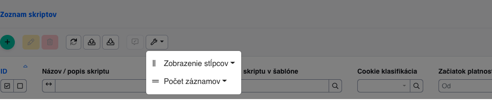
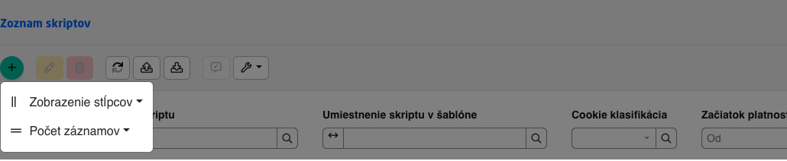

# Automated testing

For automated E2E testing, the framework [CodeceptJS](https://codecept.io) is used. The tests are written in JavaScript and practically control the browser in which the test is run. More information on why we chose this framework is in the section [Playwright + CodeceptJS](#playwright--codeceptjs).

## Installation

```shell
cd src/test/webapp/
npm install
```

!>**Warning:** Before starting testing, it is necessary to compile the JS/CSS admin parts of WebJET:

```shell
cd src/main/webapp/admin/v9/
npm install
npm run prod
```

and start the application server:

```shell
gradlew appRun
```

I recommend running each of the above commands in a separate Terminal (Terminal->New Terminal menu). You can switch between running terminals in the ```Terminal``` window.

## Starting testing

You can start testing using the following commands:

```shell
cd src/test/webapp/

#spustenie vsetkych testov
npm run all

#spustenie konkrétneho testu a zastavenie v prípade chyby
npm run pause tests/components/gallery_test.js

#Spustenie konkrétneho scenára s hodnotou ```@current``` v názve
npm run current
```

To run in Firefox, use the prefix ```ff:``` before the name:

```shell
npm run ff:all
npm run ff:pause tests/components/gallery_test.js
npm run ff:current
```

Running on a different URL with browser view disabled and browser ```firefox```:

```shell
CODECEPT_URL="http://demotest.webjetcms.sk" CODECEPT_SHOW=false npm run all
```

**Note:** We had problems with the speed of the tests in the Firefox browser. Therefore, for this browser, the ```autodeayEnabled``` variable is set to the value ```true``` in the ```codecept.conf.js``` file and the ```autodelay``` plugin is activated. It delays the execution of the ```amOnPage,click,forceClick``` functions by 200ms before and 300ms after the command is called. We also identified a strange behavior of the browser, which, if it is not in the foreground, the tests suddenly stop working and display meaningless errors. When running the test once, the test always ran correctly. We attribute this to some optimization of the execution of JavaScript code in the browser when it is not active. When running with the browser not displayed, everything is fine, so always use the ```CODECEPT_SHOW=false``` setting to run all tests.

### Codecept UI

Codecept offers a beta version of a UI for displaying testing, you can launch it with the command:

```shell
npm run codeceptjs:ui
```

and then open the page ```http://localhost:3001``` in your browser.

### Generating an HTML report

**Mocha awesome**

There is a [plugin for generating HTML reports](https://codecept.io/reports/#html) set up in npm. You can generate it by running the command:

```shell
npm run codeceptjs --reporter mochawesome
```

and an HTML report with the test result is generated in the /build/test/report directory. A screenshot is also created for failed tests. The setting is in [codecept.conf.js](../../../../src/test/webapp/codecept.conf.js) in the ```mocha``` section.

**Allure**

The report can also be generated via [allure](allure.md) by running the test:

```shell
npm run codeceptjs --plugins allure
```

Once the test is complete, you can view the results by running the ```allure``` server:

```shell
allure serve ../../../build/test
```

## Playwright + CodeceptJS

[Playwright](https://github.com/microsoft/playwright/tree/master/docs) and [CodeceptJS](https://codecept.io/basics/) are used for testing.

Why Playwright?

- it is the 3rd generation of testing framework (1st generation Selenium, 2nd generation Puppeteer, 3rd generation Playwright)
- Microsoft bought the authors of the ```Puppeteer``` framework and they develop Playwright, so they have experience
- supports ```chromium, firefox, webkit``` (May 2021 Windows Update will switch Edge to chromium core)
- can emulate resolutions, user agent, DPI

Why CodeceptJS?

- Playwright, like ```Puppeteer```, is a communication (low level) protocol for controlling the browser (its automation)
- CodeceptJS is a testing framework that can be used by Playwright, among other things
- test code is written in JavaScript
- the test code is very [understandable](https://codecept.io/playwright/#setup)
- has advanced [Locators](https://codecept.io/locators/#css-and-xpath) options - search for elements by text, css, xpath
- has a [GUI](https://codecept.io/ui/) (not yet tested) for writing and displaying test results

### Configuration

The basic configuration is in the file ```codecept.conf.js```. Important attributes:

- ```url``` (http://iwcm.interway.sk) - server address (domain). You can change it via the ```--override``` parameter and switch testing from DEV to TEST/PROD environment.
- ```output``` (../../../build/test) - directory where a screenshot will be generated in case of a failed test (defaults to ```build/test``` in the root directory)
- ```browser``` (chromium) - selected browser to run tests, can be ```chromium, firefox, webkit```
- ```emulate``` (commented) - [emulation](https://github.com/Microsoft/playwright/blob/master/src/deviceDescriptors.ts) devices
- ```screenshotOnFail``` - ​​enables/disables creating screenshots in case of a failed test

## Writing tests

Tests are created in the tests subdirectories, where they are divided according to individual WebJET modules/applications. They are written in JavaScript, so you can use all the features that JavaScript offers.

Example of a more complex test to test login [src/test/webapp/tests/admin/login.js](../../../../src/test/webapp/tests/admin/login.js):

!>**Warning:** in the ```Feature``` entry, enter a value in the format ```adresár.podadresár.meno-súboru``` for correct display of tests in the tree structure and easy retrieval of the file according to the ```Feature``` listed in the log file.

```javascript
Feature('admin.login');

//Before sa vola pred kazdym Scenarom, v kazdom scenati volam /admin/ a zadavam username tester
Before(({I}) => {
    I.amOnPage('/admin/');
    I.fillField("username", "tester");
});

//Kazdy scenar sa spusta samostatne a samostatne sa vyhodnocuje
Scenario('zle zadane heslo', ({I}) => {
    //do pola password vyplnim zle heslo
    I.fillField("password", "wrongpassword");
    //kliknem na tlacitko
    I.click("login-submit");
    //overim, ci sa zobrazi uvedena hlaska
    I.see("Zadané meno alebo heslo je nesprávne.");
});

Scenario('prihlasenie zablokovane', ({I}) => {
    I.fillField("password", "wrongpassword");
    I.click("login-submit");
    I.see("Pre nesprávne zadané prihlasovacie údaje je prihlásenie na 10+ sekúnd zablokované");
    I.say("Cakam 10 sekund na exspirovanie zablokovanej IP adresy");
    //je potrebne cakat 10 sekund na exspirovanie zleho hesla
    I.wait(13);
    //odkomentujte pre zobrazenie interaktivneho terminalu
    //pause();
});

Scenario('uspesne prihlasenie', ({I}) => {
    I.fillField("password", secret("************"));
    I.click("login-submit");
    I.see("WebJET 2021 info");
    //konecne som prihlaseny
    I.wait(1);
    //zobrazim dropdown s menom usera, ten vyberam cez CSS selector
    I.click({css: "li.dropdown.user"});
    //overim, ci vidim moznost Odhlasenia
    I.see("Odhlásenie");
    //kliknem na odhlasenie, vsimnite si, ze to selectujem podla textu linky
    I.click("Odhlásenie");
    //overim, ci sa zobrazi text Prihlasenie (som korektne odhlaseny)
    I.see("Prihlásenie");
});
```

Note that in the example I intentionally use different locators/selectors (field name, text/label, CSS selector). This is one of the advantages of CodeceptJS. More about the possibilities of Locators can be found in the [documentation](https://codecept.io/locators/#css-and-xpath).

### Locators

Locators (selectors) that select an element on a page are well described in the [official documentation](https://codecept.io/locators/).

```txt
{permalink: /'foo'} matches <div id="foo">
{name: 'foo'} matches <div name="foo">
{css: 'input[type=input][value=foo]'} matches <input type="input" value="foo">
{xpath: "//input[@type='submit'][contains(@value, 'foo')]"} matches <input type="submit" value="foobar">
{class: 'foo'} matches <div class="foo">
```

### Inside

Using the ```within``` notation, you can limit the element to which the following commands will be applied:

```javascript
within("div.breadcrumb-language-select", () => {
    I.click("Slovenský jazyk");
    I.click("Chorvátsky jazyk");
});
```

At the same time, most commands allow you to write a selector into the command, the above can also be written as:

```javascript
  I.click("Slovenský jazyk", "div.breadcrumb-language-select");
  I.click("Chorvátsky jazyk", "div.breadcrumb-language-select");
```

### Playwright's methods

The [official documentation](https://codecept.io/helpers/Playwright/) lists all the ```I``` object options. Short links:

- [pressKey](https://codecept.io/helpers/Playwright/#presskey)
- [click](https://codecept.io/helpers/Playwright/#click)
- [forceClick](https://codecept.io/helpers/Playwright/#forceclick) - forced click without waiting for an event, must be used on custom ```checkboxy``` (otherwise it will loop there)
- [see](https://codecept.io/helpers/Playwright/#see) / [dontSee](https://codecept.io/helpers/Playwright/#dontsee)
- [seeElement](https://codecept.io/helpers/TestCafe/#seeelement) / [dontSeeElement](https://codecept.io/helpers/Detox/#dontseeelement)
- [fillField](https://codecept.io/helpers/Playwright/#fillfield)
- [selectOption](https://codecept.io/helpers/Playwright/#selectoption)
- [wait](https://codecept.io/helpers/Playwright/#wait)
- [selectOption](https://codecept.io/helpers/Playwright/#selectoption)
- [executeScript](https://codecept.io/helpers/Playwright/#executescript)
- [saveScreenshot](https://codecept.io/helpers/Playwright/#savescreenshot)

### WebJET additional features

We have added several useful features to WebJET:

- [I.formatDateTime(timestamp)](../../../../src/test/webapp/steps_file.js) - formats timestamp to date and time using moment library
- [I.seeAndClick(selector)](../../../../src/test/webapp/steps_file.js) - waits for the element to be displayed and then clicks on it
- [await I.clickIfVisible(selector)](../../../../src/test/webapp/custom_helper.js) - if the given element is visible, click on it, if it is not visible, skip the step (does not throw an error)
- [I.verifyDisabled(selector)](../../../../src/test/webapp/custom_helper.js) - verifies if the given field is inactive
- [I.wjSetDefaultWindowSize()](../../../../src/test/webapp/steps_file.js) - sets the default window size after changing it, is also called automatically after logging in in the login sequence in [codecept.conf.js](../../../../src/test/webapp/codecept.conf.js)
- [Document.compareScreenshotElement(selector, screenshotFileName, width, height, tolerance)](../../../../src/test/webapp/codecept.conf.js) - performs [visual comparison](#visual-testing)
- `I.waitForTime(time)` - ​​waiting until the specified time (timestamp).
- `I.toastrClose()` - ​​close the `toastr` notification window.
- `clickCss(name, parent=null)` - ​​performs the click in the same way as `I.click` but treats `name` as a CSS selector - execution is faster, no need to use wrapping in `{css: name}`.
- `forceClickCss(name, parent=null)` - ​​performs the click in the same way as `I.forceClick` but treats `name` as a CSS selector - execution is faster, no need to use wrapping in `{css: name}`.

We have special functions for the datatable. They are implemented in [DT.js](../../../../src/test/webapp/pages/DT.js):

- ```DT.waitForLoader(name)``` - ​​waits for the "Processing" information to be displayed and then hidden in the data table. Used as ```DT.waitForLoader("#forms-list_processing");```
- ```DT.filter(name, value, type=null)``` - ​​sets the value ```value``` to the text filter of the column ```name``` of the data table. If the attribute ```type``` is also specified, the search type is set (e.g. Starts with, Ends with, Equals).
- ```DT.filterSelect(name, value)``` - ​​sets the value ```value``` to the select field of the filter column ```name``` of the data table. Used as ```DT.filterSelect('cookieClass', 'Neklasifikované');```
- ```async I.getDataTableColumns(dataTableName)``` - ​​returns a DATA object with a datatable definition, used in automatic datatable testing
- ```async getDataTableId(dataTableName)``` - ​​returns the datatable ID, calls the JS function ```dataTable.DATA.id```
- [async I.getTotalRows()](../../../../src/test/webapp/custom_helper.js) - returns the total number of records in the datatable
- ```DT.deleteAll(name = "datatableInit")``` - ​​deletes the currently displayed records, always use ```DT.filter``` before using to filter the necessary data.

For the Datatable Editor implemented in [DTE.js](../../../../src/test/webapp/pages/DTE.js):

- ```DTE.waitForLoader(name)``` - ​​waiting for ```loadera``` to be hidden in the editor (save the record)
- ```DTE.waitForEditor(name)``` - ​​waits for the editor to be displayed, if name is defined, the datatable with the given name will be used, by default ```datatableInit```
- ```DTE.selectOption.(name, text)``` - ​​selects a value in the select box (by displaying the options correctly and then clicking on the option)
- ```DTE.save(name)``` - ​​clicks the Save button in the editor, if name is defined, the data table with the given name will be used, by default ```datatableInit```
- ```DTE.cancel(name)``` - ​​clicks the close editor button, if name is defined, the datatable with the given name will be used, by default ```datatableInit```
- ```DTE.fillField(name, value)``` - ​​fills in a standard field, unlike calling ```I.fillField```, it is possible to enter the field name directly in the backend/json definition into the ```name``` parameter.
- ```DTE.fillQuill(name, value)``` - ​​fills the value in the type field ```QUILL```.
- ```DTE.fillCkeditor(htmlCode)``` - ​​sets the HTML code to the currently displayed CKEditor.
- ```DTE.fillCleditor(parentSelector, value)``` - ​​enters text into WYSIWYG ```cleditor```. Value ```parentSelector``` - reference to the element in which ```cleditor``` is located (e.g. ```#forum```), ```value``` - value to fill in. **Warning:** it does not yet know diacritics due to the use of the ```type``` command.
It is also possible to perform an [automated test](datatable.md) for the datatable.

- `DTE.appendField(name, value)` - ​​will complete the text of the field in the editor, solves the problem with using `I.appendField`, which does not always execute correctly in the editor.

For JsTree (tree structure):

- ```I.jstreeClick(name)``` - ​​clicks on the selected text in the jstree (important to use especially in websites where there is a link with the same name as the directory in the page list)
- ```I.createFolderStructure(randomNumber)``` - ​​prepares a directory tree structure and two subdirectories for testing
- ```I.deleteFolderStructure(randomNumber)``` - ​​deletes the directory tree structure and two subdirectories prepared via ```I.createFolder```

```javascript
//povodne ZLE riesenie s I.wait
I.click("Pridať");
```

- ```I.jstreeNavigate(pathArray)``` - ​​in the field ```pathArray``` it is possible to define the names of individual nodes in the tree structure, which the function will click on sequentially, e.g. ```I.jstreeNavigate( [ "English", "Contact" ] );```.

To validate values ​​in a table, you can use the following functions:

- ```DT.checkTableCell(name, row, col, value)``` - ​​verifies the value ```value``` in the specified row ```row``` and column ```col``` in the specified table (table ID). Rows and columns start with the number 1.
- ```DT.checkTableRow(name, row, values)``` - ​​verifies the values ​​in the field ```values``` in the specified table (table ID) in the specified row ```row```. The rows start with the number 1. For example ```DT.checkTableRow("statsDataTable", 1, ["13", "2 022", "30", "533", "229", "1"]);```.

Functions implemented in the ```Document``` object:

- ```switchDomain(domain)``` - ​​switches the domain to the specified value.
- ```setConfigValue(name, value)``` - ​​sets a configuration variable with the specified name and value.
- ```resetPageBuilderMode()``` - ​​clears the remembered editor mode (standard/PageBuilder).
- `notifyClose` - ​​closes the `toastr` notification.
- `notifyCheckAndClose(text)` - ​​validates the text in the `toastr` notification and closes it.
- `editorComponentOpen()` - ​​opens the application settings in the page editor (window `editor_component.jsp`).
- `editorComponentOk()` - ​​clicks the OK button to save the application settings.
- `scrollTo(selector)` - ​​moves the window contents to the specified element.

The ```Document``` object also contains functions for creating [screenshots](screenshots.md).

For testing emails using [tempmail.plus](https://tempmail.plus) there is an object `TempMail`:

- `login(name, emailDomain = "fexpost.com")` - ​​login and account setup
- `openLatestEmail()` - ​​opens the latest email
- `closeEmail()` - ​​closes the open email and returns to the email list
- `destroyInbox()` - ​​deletes all emails in the mailbox

### Waiting for completion

It is generally not recommended to use ```I.wait``` with a fixed time. The time required to wait may be different on the local machine and in the CI/CD pipeline. Furthermore, a fixed time may unnecessarily increase the time required to execute the test.

We recommend using the [waitFor*](https://codecept.io/helpers/TestCafe/#waitforelement) methods, especially ```waitForElement```, ```waitForText```, ```waitForVisible``` and ```waitToHide```.

It is advantageous to use mainly ```waitForText``` where we can effectively replace ```I.wait``` and subsequent ```I.see``` with one command:

```javascript
//povodne ZLE riesenie s I.wait
I.click("Pridať");
I.wait(1);
I.see("test-adresar-" + randomNumber, container);

//nove riesenie s I.waitForText, caka sa maximalne 10 sekund
I.click("Pridať");
I.waitForText("test-adresar-" + randomNumber, 10, container);
```

### Pause

If you put the command ```pause()``` somewhere in the test code, the test execution will stop and you will see an interactive console in Terminal where you can run commands. This way you can prepare the test steps and then simply copy the commands into the JS file with the test.

```shell
 ...
 Interactive shell started
 Use JavaScript syntax to try steps in action
 - Press ENTER to run the next step
 - Press TAB twice to see all available commands
 - Type exit + Enter to exit the interactive shell
 - Prefix => to run js commands
 I.
```

Pressing the TAB key twice will display a help (a list of possible commands). You can enter them and watch what happens in the browser. Pressing the Enter key will advance the test to the next command. Entering ```exit``` will exit the interactive terminal and the test will continue automatically.

### Login

In the file [codecept.conf.js](../../../../src/test/webapp/codecept.conf.js) login via the [autologin](https://codecept.io/plugins/#autologin) extension is also defined:

```javascript
autoLogin: {
    enabled: true,
    saveToFile: true,
    inject: 'login',
    users: {
        admin: {
            login: (I) => {
            I.amOnPage('/admin/');
            I.fillField("username", "tester");
            I.fillField("password", secret("********"));
            I.click("login-submit");
            },
            check: (I) => {
                I.amOnPage('/admin/');
                I.see("WebJET 2021 info");
            }
        }
    }
}
```

It is possible to define multiple users (repeat the admin attribute), e.g. a registered user, an administrator with limited rights, etc.

Login can be inserted into tests using the ```Before``` function:

```javascript
Feature('gallery');

Before(({login}) => {
    login('admin');
});

Scenario('zoznam fotografii', ({I}) => {
    I.amOnPage("/admin/v9/apps/gallery/");
    I.click("test");
    I.see("koala.jpg");
});
```

### Assert library

There is an extension [codeceptjs-chai](https://www.npmjs.com/package/codeceptjs-chai) available for calling assert functions:

Basic use:

```javascript
I.assertEqual(1, 1);
I.assertEqual('foo', 'foo');
I.assertEqual('foo', 'foo', 'Both the values are not equal');

I.assertNotEqual('foobar', 'foo', 'Both the values are equal');

I.assertContain('foobar', 'foo', 'Target value does not contain given value');
I.assertNotContain('foo', 'bar', 'Target value contains given value');

I.assertStartsWith('foobar', 'foo', 'Target value does not start with given value');
I.assertNotStartsWith('foobar', 'bar', 'Target value starts with given value');

I.assertEndsWith('foobar', 'bar', 'Target value does not ends with given value');
I.assertNotEndsWith('foobar', 'bar', 'Target value ends with given value');

I.assertLengthOf('foo', 3, 'Target data does not match the length');
I.assertLengthAboveThan('foo', 2, 'Target length or size not above than given number');
I.assertLengthAboveThan('foo', 4, 'Target length or size not below than given number');

I.assertEmpty('', 'Target data is not empty');

I.assertTrue(true, 'Target data is not true');
I.assertFalse(false, 'Target data is not false');

I.assertAbove(2, 1, 'Target data not above the given value');
I.assertAbove(1, 2, 'Target data not below the given value');
```

If necessary, you can also use the [assert](https://www.npmjs.com/package/assert) library. An example of its use is in the [gallery.js](../../../../src/test/webapp/tests/apps/gallery/gallery.js) test:

```javascript
const assert = require('assert');
...
assert.equal(+inputValueH, +area.h);
```

### Page objects

To create universal test scenarios, there is a folder `Pages` into which Page objects are generated
via the `npx codeceptjs gpo` command, a page object is created using ```Dependency Injection``` (similar to Angular).

```javascript
const { I } = inject();

module.exports = {

  // insert your locators and methods here
}
```

In order to be able to use it in tests, it needs to be registered in `codecept.conf.js`.

```javascript
exports.config = {
    include: {
        I: './steps_file.js',
        PageObject: './pages/PageObject.js'
    }
}
```

We can then insert it into our test scenario.

```javascript
Scenario('test-scenario', ({I, PageObject}) => {
  PageObject.someMethod();
})
```

It is also possible to insert objects into tests dynamically via `injectDependencies({})`.

```javascript
Scenario('test-scenario', ({I, PageObject}) => {
  I.fillField('Username', PageObject.username);
  I.pressKey('Enter');
}).injectDependencies({ PageObject: require('./PageObject.js') });
```

### Browser detection

If your tests behave differently in Firefox or Chromium, you can use the functions in your tests to verify the browser used.

```javascript
if (Browser.isChromium()) {
  I.amOnPage("/admin/v9/apps/insert-script/");
  ...
}

if (Browser.isFirefox()) {
  I.say("Firefox, skipping test");
  return;
}

if (Browser.isFirefox()) {
    //ff ma nejak inak kurzor a je potrebne este 2x ist hore
    I.pressKey('ArrowUp');
    I.pressKey('ArrowUp');
}
```

## Withdrawal of rights

By calling the page address with the parameter ```removePerm```, it is possible to remove the specified right from the logged-in user at runtime (without saving changes to rights) if the user's login name begins with ```tester```. This makes it possible to test the display of the page without the specified right and thus verify the security of the REST service call.

The right is implemented in the function ```DT.checkPerms(perms, url)``` in [DT.js](../../../../src/test/webapp/pages/DT.js). It requires specifying the right and the address of the page on which the right is being tested. The test verifies the display of the notification ```Prístup k tejto stránke je zamietnutý```.
 The optional parameter ```datatableId``` represents the ID/name of the table in the page (needs to be specified if there are multiple data tables in the page).

Example of use:

```javascript
Scenario('zoznam stranok', ({ I, DT }) => {
    I.waitForText("Newsletter", 20);
    I.click("Newsletter", container);
    I.see("Testovaci newsletter");

    //over prava
    DT.checkPerms("menuWebpages", "/admin/v9/webpages/web-pages-list/");
});
```

It is also possible to enter multiple rights separated by commas in the ```removePerm``` parameter.

In datatables, it is also possible to set rights for [individual buttons](../datatables/README.md#buttons-by-rights) (add, edit, duplicate, delete). This way, you can also test individually disabled rights. However, to verify rights on the backend, it is also necessary to test the REST service. By adding the expression ```forceShowButton``` to the parameter ```removePerm``` for a user with a login name starting with ```tester```, the buttons in the datatable will be displayed. This way, it is possible to test the display of the error message from the REST service (that the record cannot actually be added/edited/deleted). An example is in ```webpage-perms.js```:

```javascript
Scenario('stranky-overenie prav na tlacidla', ({ I, login, DT, DTE }) => {
    login("admin");
    I.amOnPage("/admin/v9/webpages/web-pages-list/?removePerm=addPage,pageSave,deletePage,pageSaveAs");
    I.dontSeeElement("#datatableInit_wrapper button.buttons-create");
    I.dontSeeElement("#datatableInit_wrapper button.buttons-edit");
    I.dontSeeElement("#datatableInit_wrapper button.btn-duplicate");
    I.dontSeeElement("#datatableInit_wrapper button.buttons-remove");

    //over v dialogu
    I.click("Jet portal 4 - testovacia stranka");
    DTE.waitForEditor();
    I.dontSeeElement("#datatableInit_modal div.DTE_Form_Buttons button.btn-primary");

    I.amOnPage("/admin/v9/webpages/web-pages-list/?removePerm=addPage,pageSave,deletePage,pageSaveAs,forceShowButton&groupid=67");
    DT.waitForLoader();
    //skus pridat
    I.clickCss("#datatableInit_wrapper button.buttons-create");
    I.clickCss("#pills-dt-datatableInit-basic-tab");
    I.fillField("Názov web stránky", auto_webPage);
    DTE.save();
    I.see("Pridať web stránku - nemáte právo na pridanie web stránky");
    DTE.cancel();

    //skus editovat
    I.jstreeNavigate(["Test stavov", "Nedá sa zmazať"]);
    I.click("Nedá sa zmazať", "#datatableInit");
    DTE.waitForEditor();
    I.clickCss("#pills-dt-datatableInit-basic-tab");
    I.seeInField("Názov web stránky", "Nedá sa zmazať");
    DTE.save();
    I.see("Nemáte právo na editáciu web stránky");
    DTE.cancel();

    //skus zmazat
    DT.filter("title", "Nedá sa zmazať");
    I.click("table.datatableInit button.buttons-select-all");
    I.clickCss("#datatableInit_wrapper button.buttons-remove");
    DT.waitForEditor();
    I.see("Naozaj chcete zmazať položku?");
    DTE.save();
    I.see("Nemáte právo na editáciu web stránky");
});
```

**Technical information:**

Removing permission is implemented in [ThymeleafAdminController.removePermissionFromCurrentUser](../../../../src/main/java/sk/iway/iwcm/admin/ThymeleafAdminController.java). When specifying the URL parameter ```removePerm```, the permissions of the currently logged in user, including the Spring context, are modified.

## Visual testing

The visual testing feature should be used to verify a display that cannot be verified by testing the text (e.g. correct position of a selection menu). The [pixelMatchHelper plugin](https://github.com/stracker-phil/codeceptjs-pixelmatchhelper) is used, which can compare a reference screenshot with the current one and highlight changes.

To simplify use, we have prepared a function ```Document.compareScreenshotElement(selector, screenshotFileName, width, height, tolerance)``` that will take care of the necessary steps. It has the following parameters:

- ```selector``` - ​​```selector``` of the element to be captured (not the entire screen, but only the specified element)
- ```screenshotFileName``` - ​​image file name, automatically compared with the same image name in the ```src/test/webapp/screenshots/base``` directory. Use the prefix ```autotest-``` for the file name to better locate the created image
- ```width``` (optional) - browser window width
- ```height``` (optional) - browser window height
- ```tolerance``` (optional) - tolerance level for differences to the reference image (0-100)

Example of use:

```javascript
await Document.compareScreenshotElement("#insertScriptTable_wrapper", "autotest-insert-script-settings.png", 1280, 270);
```

The first time you run the test, there will probably be no reference image. However, the test will create a current image and save it in the ```build/test``` directory (therefore, we recommend prefixing the image name with the text autotest - so that the image can be easily found among the screenshots of errors from testing). If you want to use the image as a reference, copy it to the ```src/test/webapp/screenshots/base``` directory. Then, the next time you run the test, the reference image will be compared with the web page.

The identified differences are generated into images in the ```src/test/webapp/screenshots/diff``` directory for easy error verification. The test will also report an error when identifying differences like any other test scenario.

Example of display error (wrong position of selection menu) - reference base image:



incorrect display on the page:



resulting comparison with highlighting the different area (pink color):


**Implementation Notes**

The image comparison is encapsulated in the function ```Document.compareScreenshotElement``` implemented in ```Document.js```. When specifying the window size, it performs a resizing and after creating a screenshot, it returns the window to its original size by calling the function ```I.wjSetDefaultWindowSize()``` (this is also called after each login for consistency).

## Best practices

For successful and repeated test runs, we recommend following these points:

### Nomenclature

- you start the scenario with the function ```Feature('xxx');``` where xxx is the name of the test file. If an error occurs, you can easily find the appropriate test file.

### Test data

- prepare and delete your test data
- all created objects must contain the text ```autotest``` to identify objects created by an automated test
- we recommend using the ```I.getRandomText()``` call to get a unique suffix, its use can be seen e.g. in [group-internal.js](../../../../src/test/webapp/tests/webpages/group-internal.js) where variables are defined and filled in the ```Before``` function
- it is ideal if you create test data in a separate scenario and also delete it in a separate scenario. So if a test fails, the data will be deleted anyway.

```javascript
var auto_name, auto_folder_internal, auto_folder_public, sub_folder_public;

Before(({ I, login }) => {
     login('admin');
     I.amOnPage('/admin/v9/webpages/web-pages-list/');

     if (typeof auto_name=="undefined") {
          var randomNumber = I.getRandomText();
          auto_name = 'name-autotest-' + randomNumber;
          auto_folder_internal = 'internal_folder-autotest-' + randomNumber;
          auto_folder_public = 'public_folder-autotest-' + randomNumber;
          sub_folder_public = 'sub_folder_public-autotest-' + randomNumber;
     }
});
```

### Selectors

It is important to use correct selectors, text/element can be found multiple times in the page and then the test randomly fails. Use ready-made functions like ```I.jstreeClick(name)``` for the tree structure and functions starting with DT./DTE. for the datatable and editor e.g. ```DTE.selectOption(name, text)``` or ```DT.filterSelect(name, value)```.

We recommend testing the selector in the browser's JS console using jQuery, for example:

```javascript
//tlacidlo na pridanie zaznamu
$(".btn.btn-sm.buttons-create.btn-success.buttons-divider");

//v konzole bude vidno, ze vo web strankach je takych tlacidiel viacero:
//1xjstree a 2xdatatabulka z ktorej jedna je neviditelna pre adresare)
//je preto potrebne selektor zuzit tak, aby obsahoval vhodny parent kontajner

//zuzene len na column so stromovou strukturou - najde korektne len jedno tlacidlo
$("div.tree-col .btn.btn-sm.buttons-create.btn-success.buttons-divider")
```

### Timing

Execution timing is very important, on another computer or server the test may run at a different speed. It is necessary to wait correctly for the completion of asynchronous calls to the server. Similarly, there may be a problem with waiting for a dialog box to open, data to be saved, etc.

Do not use fixed time like ```I.wait(1)``` but use ```I.waitFor...``` or our ```DT.waitFor...``` calls. More information can be found in the [Waiting for completion](#waiting-for-completion) and [WebJET additional functions](#webjet-additional-functions) sections.

Typical examples:

```javascript
//kliknutie na tlacidlo Pridat a cakanie na otvorenie editora
I.click(add_button);
DTE.waitForEditor("groups-datatable");

//cakanie na loading datatabulky
DT.waitForLoader
//cakanie na otvorenie editora
DTE.waitForEditor
//cakanie na ulozenie editora
DTE.waitForLoader
```

**Every call**, ```I.click('Uložiť');``` must wait for storage via ```DTE.waitForLoader```.

### Script length

Try to keep each scenario short, don't combine unrelated parts into one scenario. However, you can prepare test data and reuse it in multiple scenarios (this will save time creating and deleting data between scenarios).

The scenario can also be run separately using the ```--grep``` parameter, see [Starting testing](#starting-testing).

### Debugging

You can run the test with the parameter ```-p pauseOnFail```, if an error occurs, an interactive console will automatically appear. In it, you can verify the browser status and possibly try a correction command, which you can then also implement in the test.

For this reason, do not use the ```After``` function in a scenario, as it will be executed before the interactive console is invoked after an error and the browser window will no longer be in the same state.

## Deleting a database

The database grows with the use of tests, as directories and web pages are moved to the trash after deletion. It is important to delete this data from the database once a quarter. You can use the following SQL command:

```sql
DELETE FROM emails_campain WHERE subject LIKE '%-autotest%';
OPTIMIZE TABLE emails_campain;
DELETE FROM emails WHERE recipient_email LIKE '%autotest%' OR recipient_email LIKE '%emailtounsubscibe%';
OPTIMIZE TABLE emails;
DELETE FROM groups WHERE group_name LIKE '%sk-mirroring-subfolder%' OR group_name LIKE '%sk-mir-subfolder%' OR group_name LIKE '%autotest%' OR group_name LIKE '%test-adresar-2%' OR group_name='NewSubFolder' OR group_name LIKE 'section-2%';
OPTIMIZE TABLE groups;
DELETE FROM groups_scheduler WHERE group_name LIKE '%sk-mirroring-subfolder%' OR group_name LIKE '%sk-mir-subfolder%' OR group_name LIKE '%autotest%' OR group_name LIKE '%test-adresar-2%' OR group_name='NewSubFolder' OR group_name LIKE 'section-2%';
OPTIMIZE TABLE groups_scheduler;
DELETE FROM documents WHERE (doc_id NOT IN (7611, 18426, 2664, 27827, 29195, 29289, 64425, 50222, 60434)) AND (title LIKE '%sk-mirroring-subfolder%' OR title LIKE '%sk-mir-subfolder%' OR title LIKE '%-autotest%' OR title LIKE '%autotest_%' OR title LIKE '%_autotest%' OR title='autotest' OR title LIKE 'test-adresar-%' OR title='Nová web stránka' OR title LIKE 'page-%' OR title LIKE 'dobré ráno-%' OR title LIKE 'good morning-%' OR title LIKE 'test-mir-elfinderFile%');
OPTIMIZE TABLE documents;
DELETE FROM documents_history WHERE title LIKE 'Test_volnych_poli_sablony%' OR title LIKE '%sk-mirroring-subfolder%' OR title LIKE '%sk-mir-subfolder%' OR title LIKE '%-autotest%' OR title LIKE '%autotest_%' OR title LIKE '%_autotest%' OR title='autotest' OR title LIKE 'test-adresar-%' OR title='Nová web stránka' OR title LIKE 'page-%' OR title LIKE 'dobré ráno-%' OR title LIKE 'good morning-%' OR title LIKE 'test-mir-elfinderFile%' OR title LIKE 'Test_show_in%';
DELETE FROM documents_history WHERE doc_id=4 AND history_id>26 AND actual=0 AND publicable=0;
OPTIMIZE TABLE documents_history;
DELETE FROM _adminlog_ WHERE log_id>10 AND log_id NOT IN (58993, 58730, 103758, 103756);
OPTIMIZE TABLE _adminlog_;
DELETE FROM monitoring WHERE monitoring_id > 1219015;
OPTIMIZE TABLE monitoring;
DELETE FROM enumeration_data WHERE child_enumeration_type_id IS NOT NULL;
DELETE FROM enumeration_data WHERE parent_enumeration_data_id IS NOT NULL;
DELETE FROM enumeration_data WHERE string1 like '%testTest%';
DELETE FROM enumeration_data WHERE string1 like 'string1%';
OPTIMIZE TABLE enumeration_data;
UPDATE enumeration_type SET child_enumeration_type_id=NULL WHERE name like '%AutoTest%' AND enumeration_type_id>2283;
DELETE FROM enumeration_type WHERE name like '%AutoTest%' AND enumeration_type_id>2283;
OPTIMIZE TABLE enumeration_type;
DELETE FROM documents_history WHERE doc_id=22955 AND publicable=0;
UPDATE groups SET sort_priority=10 WHERE parent_group_id IN (15257, 80578);
DELETE FROM media WHERE media_fk_id NOT IN (259) AND (media_title_sk LIKE '%autotest%' OR media_title_sk LIKE 'image test%' OR media_title_sk LIKE '%onerror=alert%' OR media_title_sk LIKE 'media%');
OPTIMIZE TABLE media;
DELETE FROM _properties_ WHERE prop_key LIKE '%autotest%';
OPTIMIZE TABLE _properties_;
```

To change passwords across the board in the test database, use:

```sql
UPDATE users SET password='bcrypt:...', password_salt='bcrypt:...' WHERE user_id>1 AND login NOT IN ('user_sha512', 'user_bcrypt');
```

In the penetration testing database, it is necessary to disable the menu item for editing administrators for users, use the following SQL:

```sql
INSERT INTO `user_disabled_items` (`user_id`, `item_name`)
VALUES
	(18, 'users.edit_admins'),
    (18, 'conf.show_all_variables'),
    (1827, 'users.edit_admins'),
    (1827, 'conf.show_all_variables');
UPDATE _conf_ SET value='' WHERE name='adminEnableIPs';
```

For a clean database on which you want to run `baseTest` you need to set:

```sql
INSERT INTO _conf_ VALUES ('templatesUseDomainLocalSystemFolder', 'true', NULL);
INSERT INTO _conf_ VALUES ('multiDomainEnabled', 'true', NULL);
INSERT INTO _conf_ VALUES ('enableStaticFilesExternalDir', 'true', NULL);
UPDATE _conf_ SET value='aceintegration' WHERE name='installName';

UPDATE groups SET group_name='Jet portal 4', navbar='Jet portal 4' WHERE group_id=1;
INSERT INTO `documents` (`doc_id`, `title`, `data`, `data_asc`, `external_link`, `navbar`, `date_created`, `publish_start`, `publish_end`, `author_id`, `group_id`, `temp_id`, `views_total`, `views_month`, `searchable`, `available`, `cacheable`, `file_name`, `file_change`, `sort_priority`, `header_doc_id`, `menu_doc_id`, `footer_doc_id`, `password_protected`, `html_head`, `html_data`, `perex_place`, `perex_image`, `perex_group`, `show_in_menu`, `event_date`, `virtual_path`, `sync_id`, `sync_status`, `logon_page_doc_id`, `right_menu_doc_id`, `field_a`, `field_b`, `field_c`, `field_d`, `field_e`, `field_f`, `field_g`, `field_h`, `field_i`, `field_j`, `field_k`, `field_l`, `disable_after_end`, `forum_count`, `field_m`, `field_n`, `field_o`, `field_p`, `field_q`, `field_r`, `field_s`, `field_t`, `require_ssl`, `root_group_l1`, `root_group_l2`, `root_group_l3`, `temp_field_a_docid`, `temp_field_b_docid`, `temp_field_c_docid`, `temp_field_d_docid`, `show_in_navbar`, `show_in_sitemap`, `logged_show_in_menu`, `logged_show_in_navbar`, `logged_show_in_sitemap`, `url_inherit_group`, `generate_url_from_title`, `editor_virtual_path`, `publish_after_start`)
VALUES
	(141, 'Jet portal 4 - testovacia stranka', '<p>Toto je testovacia stranka... 01</p>\n\n<p>Druhy odstavec</p>', '   toto je testovacia stranka... 01    \n\n   druhy odstavec    <h1>jet portal 4   testovacia stranka</h1>\n', '', 'Jet portal 4 - testovacia stranka', '2024-09-10 07:39:06', '2020-08-24 11:39:00', NULL, 1, 1, 4, 0, 0, 1, 1, 0, '/Jet portal 4', NULL, 10, -1, -1, -1, NULL, '', '', '', '/images/zo-sveta-financii/foto-3.jpg', '', 1, NULL, '/lta-href=39amp4739gtjet-portalltamp47agt/', 0, 0, 0, -1, '', '', '', '', '', '', '', '', '', '', 'ewteret', '', 0, 1, '', '', '', '', '', '', '', '', 0, 1, NULL, NULL, 9780, -1, -1, -1, 1, 1, 1, 1, 1, 0, 0, '', 0);
INSERT INTO `documents` (`doc_id`, `title`, `data`, `data_asc`, `external_link`, `navbar`, `date_created`, `publish_start`, `publish_end`, `author_id`, `group_id`, `temp_id`, `views_total`, `views_month`, `searchable`, `available`, `cacheable`, `file_name`, `file_change`, `sort_priority`, `header_doc_id`, `menu_doc_id`, `footer_doc_id`, `password_protected`, `html_head`, `html_data`, `perex_place`, `perex_image`, `perex_group`, `show_in_menu`, `event_date`, `virtual_path`, `sync_id`, `sync_status`, `logon_page_doc_id`, `right_menu_doc_id`, `field_a`, `field_b`, `field_c`, `field_d`, `field_e`, `field_f`, `field_g`, `field_h`, `field_i`, `field_j`, `field_k`, `field_l`, `disable_after_end`, `forum_count`, `field_m`, `field_n`, `field_o`, `field_p`, `field_q`, `field_r`, `field_s`, `field_t`, `require_ssl`, `root_group_l1`, `root_group_l2`, `root_group_l3`, `temp_field_a_docid`, `temp_field_b_docid`, `temp_field_c_docid`, `temp_field_d_docid`, `show_in_navbar`, `show_in_sitemap`, `logged_show_in_menu`, `logged_show_in_navbar`, `logged_show_in_sitemap`, `url_inherit_group`, `generate_url_from_title`, `editor_virtual_path`, `publish_after_start`)
VALUES
	(264, 'Presmerovaná extrená linka', '<p>&nbsp;</p>', '   &nbsp;    <h1>presmerovana extrena linka</h1>', '/presmerovanie/', 'Presmerovaná extrená linka', '2020-12-12 16:57:10', '2020-12-12 16:56:00', NULL, 1, 67, 4, 0, 0, 1, 1, 0, '/Test stavov', NULL, 30, -1, -1, -1, NULL, '', NULL, '', '', NULL, 1, NULL, '/novy-adresar-01/presmerovana-extrena-linka.html', 0, 0, -1, -1, '', '', '', '', '', '', '', '', '', '', '', '', 0, 0, '', '', '', '', '', '', '', '', 0, 67, NULL, NULL, -1, -1, -1, -1, 1, 1, 1, 1, 1, 0, 0, NULL, 0);
INSERT INTO `documents` (`doc_id`, `title`, `data`, `data_asc`, `external_link`, `navbar`, `date_created`, `publish_start`, `publish_end`, `author_id`, `group_id`, `temp_id`, `views_total`, `views_month`, `searchable`, `available`, `cacheable`, `file_name`, `file_change`, `sort_priority`, `header_doc_id`, `menu_doc_id`, `footer_doc_id`, `password_protected`, `html_head`, `html_data`, `perex_place`, `perex_image`, `perex_group`, `show_in_menu`, `event_date`, `virtual_path`, `sync_id`, `sync_status`, `logon_page_doc_id`, `right_menu_doc_id`, `field_a`, `field_b`, `field_c`, `field_d`, `field_e`, `field_f`, `field_g`, `field_h`, `field_i`, `field_j`, `field_k`, `field_l`, `disable_after_end`, `forum_count`, `field_m`, `field_n`, `field_o`, `field_p`, `field_q`, `field_r`, `field_s`, `field_t`, `require_ssl`, `root_group_l1`, `root_group_l2`, `root_group_l3`, `temp_field_a_docid`, `temp_field_b_docid`, `temp_field_c_docid`, `temp_field_d_docid`, `show_in_navbar`, `show_in_sitemap`, `logged_show_in_menu`, `logged_show_in_navbar`, `logged_show_in_sitemap`, `url_inherit_group`, `generate_url_from_title`, `editor_virtual_path`, `publish_after_start`)
VALUES
	(60434, 'Autotest banner', '<p>Obrázkový banner:</p>\n\n<div class=\"banner-image\">\n!INCLUDE(/components/banner/banner.jsp, group=&quot;autotest-group&quot;, status=enabled, displayMode=2, refreshRate=0, bannerIndex=&quot;&quot;, showInIframe=false, iframeWidth=, iframeHeight=)!\n</div>', '   obrazkovy banner:    \n\n                          \n                                                                                                                                                                                                   \n      <h1>autotest banner</h1>\n', '', 'Autotest banner', '2023-05-11 10:03:52', '2023-05-11 09:54:09', NULL, 18, 18621, 4, 0, 0, 1, 1, 0, '/Aplikácie/Bannerový systém', NULL, 4140, -1, -1, -1, NULL, '', '', '', '', NULL, 1, NULL, '/apps/bannerovy-system/autotest-banner.html', 30608, 0, 0, -1, '', '', '', '', '', '', '', '', '', '', '', '', 0, 0, '', '', '', '', '', '', '', '', 0, 15257, 18621, NULL, -1, -1, -1, -1, NULL, NULL, NULL, NULL, NULL, 0, 1, '', 0);
INSERT INTO `documents` (`doc_id`, `title`, `data`, `data_asc`, `external_link`, `navbar`, `date_created`, `publish_start`, `publish_end`, `author_id`, `group_id`, `temp_id`, `views_total`, `views_month`, `searchable`, `available`, `cacheable`, `file_name`, `file_change`, `sort_priority`, `header_doc_id`, `menu_doc_id`, `footer_doc_id`, `password_protected`, `html_head`, `html_data`, `perex_place`, `perex_image`, `perex_group`, `show_in_menu`, `event_date`, `virtual_path`, `sync_id`, `sync_status`, `logon_page_doc_id`, `right_menu_doc_id`, `field_a`, `field_b`, `field_c`, `field_d`, `field_e`, `field_f`, `field_g`, `field_h`, `field_i`, `field_j`, `field_k`, `field_l`, `disable_after_end`, `forum_count`, `field_m`, `field_n`, `field_o`, `field_p`, `field_q`, `field_r`, `field_s`, `field_t`, `require_ssl`, `root_group_l1`, `root_group_l2`, `root_group_l3`, `temp_field_a_docid`, `temp_field_b_docid`, `temp_field_c_docid`, `temp_field_d_docid`, `show_in_navbar`, `show_in_sitemap`, `logged_show_in_menu`, `logged_show_in_navbar`, `logged_show_in_sitemap`, `url_inherit_group`, `generate_url_from_title`, `editor_virtual_path`, `publish_after_start`)
VALUES
	(21343, 'Bannerový systém', '<p>HTML&nbsp;Banner:</p>\n\n<div class=\"banner-html\">\n!INCLUDE(/components/banner/banner.jsp, group=&quot;banner-html&quot;, status=enabled, displayMode=2, refreshRate=0, bannerIndex=&quot;&quot;, showInIframe=false, iframeWidth=, iframeHeight=)!\n</div>\n\n<p>Obrázkový banner:</p>\n\n<div class=\"banner-image\">\n!INCLUDE(/components/banner/banner.jsp, group=&quot;banner-image&quot;, status=enabled, displayMode=2, refreshRate=0, bannerIndex=&quot;&quot;, showInIframe=false, iframeWidth=, iframeHeight=)!\n</div>\n\n<p>Obsahový banner:</p>\n\n<div class=\"banner-content\">\n!INCLUDE(/components/banner/banner.jsp, group=&quot;banner-obsahovy&quot;, status=enabled, displayMode=2, bannerIndex=0, videoWrapperClass=, jumbotronVideoClass=, showInIframe=false, refreshRate=0, iframeWidth=0, iframeHeight=0)!\n</div>', '   html      banner:    \n\n                         \n                                                                                                                                                                                                \n      \n\n   obrazkovy banner:    \n\n                          \n                                                                                                                                                                                                 \n      \n\n   obsahovy banner:    \n\n                            \n                                                                                                                                                                                                                                     \n      <h1>bannerovy system</h1>\n', '', 'Bannerový systém', '2025-05-09 11:43:07', '2021-11-23 19:22:00', NULL, 18, 18621, 4, 0, 0, 1, 1, 0, '/Aplikácie/Bannerový systém', NULL, 4120, -1, -1, -1, NULL, '', '', '', '', NULL, 1, NULL, '/apps/bannerovy-system/', 0, 0, 0, -1, '', '', '', '', '', '', '', '', '', '', '', '', 0, 0, '', '', '', '', '', '', '', 'Bez nadpisu', 0, 15257, 18621, NULL, -1, -1, -1, -1, 1, 1, 1, 1, 1, 0, 0, '', 0);
INSERT INTO `documents` (`doc_id`, `title`, `data`, `data_asc`, `external_link`, `navbar`, `date_created`, `publish_start`, `publish_end`, `author_id`, `group_id`, `temp_id`, `views_total`, `views_month`, `searchable`, `available`, `cacheable`, `file_name`, `file_change`, `sort_priority`, `header_doc_id`, `menu_doc_id`, `footer_doc_id`, `password_protected`, `html_head`, `html_data`, `perex_place`, `perex_image`, `perex_group`, `show_in_menu`, `event_date`, `virtual_path`, `sync_id`, `sync_status`, `logon_page_doc_id`, `right_menu_doc_id`, `field_a`, `field_b`, `field_c`, `field_d`, `field_e`, `field_f`, `field_g`, `field_h`, `field_i`, `field_j`, `field_k`, `field_l`, `disable_after_end`, `forum_count`, `field_m`, `field_n`, `field_o`, `field_p`, `field_q`, `field_r`, `field_s`, `field_t`, `require_ssl`, `root_group_l1`, `root_group_l2`, `root_group_l3`, `temp_field_a_docid`, `temp_field_b_docid`, `temp_field_c_docid`, `temp_field_d_docid`, `show_in_navbar`, `show_in_sitemap`, `logged_show_in_menu`, `logged_show_in_navbar`, `logged_show_in_sitemap`, `url_inherit_group`, `generate_url_from_title`, `editor_virtual_path`, `publish_after_start`)
VALUES
	(18660, 'test_final', '<p>&nbsp;</p>', '   &nbsp;    <h1>test final</h1>\n', NULL, 'test_final', '2022-03-28 20:07:11', '2022-01-02 00:00:00', '2022-01-02 00:00:00', 18, 84, 1, 0, 0, 1, 1, 0, '/test', NULL, 120, 9780, 1, 9780, ',5,6', NULL, NULL, NULL, NULL, NULL, 1, '2022-01-02 00:00:00', '/tseer/test_final.html', 0, 0, 0, -1, NULL, NULL, NULL, NULL, NULL, NULL, NULL, NULL, NULL, NULL, NULL, NULL, 0, 0, NULL, NULL, NULL, NULL, NULL, NULL, NULL, 'Bez nadpisu', 0, 84, NULL, NULL, -2, 9780, 1, 3, 1, 1, 1, 1, 1, 0, 0, '', 0);
INSERT INTO `documents` (`doc_id`, `title`, `data`, `data_asc`, `external_link`, `navbar`, `date_created`, `publish_start`, `publish_end`, `author_id`, `group_id`, `temp_id`, `views_total`, `views_month`, `searchable`, `available`, `cacheable`, `file_name`, `file_change`, `sort_priority`, `header_doc_id`, `menu_doc_id`, `footer_doc_id`, `password_protected`, `html_head`, `html_data`, `perex_place`, `perex_image`, `perex_group`, `show_in_menu`, `event_date`, `virtual_path`, `sync_id`, `sync_status`, `logon_page_doc_id`, `right_menu_doc_id`, `field_a`, `field_b`, `field_c`, `field_d`, `field_e`, `field_f`, `field_g`, `field_h`, `field_i`, `field_j`, `field_k`, `field_l`, `disable_after_end`, `forum_count`, `field_m`, `field_n`, `field_o`, `field_p`, `field_q`, `field_r`, `field_s`, `field_t`, `require_ssl`, `root_group_l1`, `root_group_l2`, `root_group_l3`, `temp_field_a_docid`, `temp_field_b_docid`, `temp_field_c_docid`, `temp_field_d_docid`, `show_in_navbar`, `show_in_sitemap`, `logged_show_in_menu`, `logged_show_in_navbar`, `logged_show_in_sitemap`, `url_inherit_group`, `generate_url_from_title`, `editor_virtual_path`, `publish_after_start`)
VALUES
	(274, 'Tento nie je interný', '<p>&nbsp;</p>', '   &nbsp;    <h1>tento nie je interny</h1>\n', '', 'Tento nie je interný', '2022-07-06 12:46:41', '2020-12-13 13:52:00', NULL, 1, 228, 4, 0, 0, 1, 1, 0, '/Test stavov/Tento nie je interný', NULL, 130, -1, -1, -1, NULL, '', '', '', '', ',,', 1, NULL, '/novy-adresar-01/interny/tento-nie-je-interny/', 0, 0, 0, -1, '', '', '', '', '', '', '', '', '', '', '', '', 0, 0, '', '', '', '', '', '', '', '', 0, 67, 228, NULL, -1, -1, -1, -1, 1, 1, 1, 1, 1, 0, 0, '', 0);
INSERT INTO `documents` (`doc_id`, `title`, `data`, `data_asc`, `external_link`, `navbar`, `date_created`, `publish_start`, `publish_end`, `author_id`, `group_id`, `temp_id`, `views_total`, `views_month`, `searchable`, `available`, `cacheable`, `file_name`, `file_change`, `sort_priority`, `header_doc_id`, `menu_doc_id`, `footer_doc_id`, `password_protected`, `html_head`, `html_data`, `perex_place`, `perex_image`, `perex_group`, `show_in_menu`, `event_date`, `virtual_path`, `sync_id`, `sync_status`, `logon_page_doc_id`, `right_menu_doc_id`, `field_a`, `field_b`, `field_c`, `field_d`, `field_e`, `field_f`, `field_g`, `field_h`, `field_i`, `field_j`, `field_k`, `field_l`, `disable_after_end`, `forum_count`, `field_m`, `field_n`, `field_o`, `field_p`, `field_q`, `field_r`, `field_s`, `field_t`, `require_ssl`, `root_group_l1`, `root_group_l2`, `root_group_l3`, `temp_field_a_docid`, `temp_field_b_docid`, `temp_field_c_docid`, `temp_field_d_docid`, `show_in_navbar`, `show_in_sitemap`, `logged_show_in_menu`, `logged_show_in_navbar`, `logged_show_in_sitemap`, `url_inherit_group`, `generate_url_from_title`, `editor_virtual_path`, `publish_after_start`)
VALUES
	(183, 'Produktová stránka - B verzia', '<section class=\"prices\">\n<div class=\"container\">\n<div class=\"row\">\n<div class=\"col-12 col-md-4\">\n<div class=\"card border-0\">\n<div class=\"card-header text-white\">\n<h3 class=\"text-white text-center\">Vulputate</h3>\n\n<h4 class=\"text-white text-center\">$9,90</h4>\n</div>\n\n<div class=\"card-body bg-light\">\n<p class=\"text-center\"><i class=\"fa fa-sitemap fa-3x fa-3x\"></i></p>\n\n<p class=\"text-center\"><b>vulputate purus</b></p>\n\n<ul class=\"list-group bg-transparent text-center\">\n	<li class=\"list-group-item border-0 bg-transparent\">Nunc sed purus</li>\n	<li class=\"list-group-item border-0 bg-transparent\">rutrum varius sollicitudin</li>\n	<li class=\"list-group-item border-0 bg-transparent\">vulputate purus</li>\n</ul>\n\n<p class=\"text-center\"><a class=\"btn btn-primary\" href=\"#\">Sollicitudin</a></p>\n</div>\n</div>\n</div>\n\n<div class=\"col-12 col-md-4\">\n<div class=\"card border-0\">\n<div class=\"card-header text-white\">\n<h3 class=\"text-white text-center\">Vulputate</h3>\n\n<h4 class=\"text-white text-center\">$19,90</h4>\n</div>\n\n<div class=\"card-body bg-light\">\n<p class=\"text-center\"><i class=\"fa fa-sitemap fa-3x fa-3x\"></i></p>\n\n<p class=\"text-center\"><b>vulputate purus</b></p>\n\n<ul class=\"list-group bg-transparent text-center\">\n	<li class=\"list-group-item border-0 bg-transparent\">Nunc sed purus</li>\n	<li class=\"list-group-item border-0 bg-transparent\">rutrum varius sollicitudin</li>\n	<li class=\"list-group-item border-0 bg-transparent\">vulputate purus</li>\n</ul>\n\n<p class=\"text-center\"><a class=\"btn btn-primary\" href=\"#\">Sollicitudin</a></p>\n</div>\n</div>\n</div>\n\n<div class=\"col-12 col-md-4\">\n<div class=\"card border-0\">\n<div class=\"card-header text-white\">\n<h3 class=\"text-white text-center\">Vulputate</h3>\n\n<h4 class=\"text-white text-center\">$29,90</h4>\n</div>\n\n<div class=\"card-body bg-light\">\n<p class=\"text-center\"><i class=\"fa fa-sitemap fa-3x fa-3x\"></i></p>\n\n<p class=\"text-center\"><b>vulputate purus</b></p>\n\n<ul class=\"list-group bg-transparent text-center\">\n	<li class=\"list-group-item border-0 bg-transparent\">Nunc sed purus</li>\n	<li class=\"list-group-item border-0 bg-transparent\">rutrum varius sollicitudin</li>\n	<li class=\"list-group-item border-0 bg-transparent\">vulputate purus</li>\n</ul>\n\n<p class=\"text-center\"><a class=\"btn btn-primary\" href=\"#\">Sollicitudin</a></p>\n</div>\n</div>\n</div>\n</div>\n</div>\n</section>\n\n<section class=\"break\" style=\"margin-top: -20px;\">\n<div class=\"container\">\n<div class=\"row justify-content-md-center\">\n<div class=\"col-12 col-md-8\">\n<p class=\"text-center\">Lorem ipsum dolor sit amet, consectetur adipiscing elit. Nullam nec purus quis lectus semper blandit et in leo.</p>\n\n<p class=\"text-center\"><a class=\"btn btn-primary\" href=\"#\">Amet</a></p>\n</div>\n</div>\n</div>\n</section>\n\n<section>\n<div class=\"container\">\n<div class=\"row\">\n<div class=\"col-12 col-md-4\"></div>\n\n<div class=\"col-12 col-md-7 align-self-center offset-md-1\">\n<h2>Etiam sit amet</h2>\n\n<p>Ut efficitur venenatis erat a&nbsp;facilisis. Ut sit amet ante et eros mollis congue at at nisi. Nunc scelerisque bibendum mauris, et cursus ipsum euismod molestie. Phasellus massa dui, luctus eu accumsan auctor, tristique eu magna. Suspendisse ullamcorper luctus ligula, eu vehicula nisi volutpat id.</p>\n\n<p><a class=\"btn btn-primary\" href=\"#\">Nullam</a></p>\n</div>\n</div>\n</div>\n</section>\n\n<p>&nbsp;</p>', '                        \n                       \n                 \n                             \n                           \n                                    \n                                   vulputate     \n\n                                   $9,90     \n      \n\n                                \n                                                                    \n\n                          vulputate purus        \n\n                                                  \n	                                                    nunc sed purus     \n	                                                    rutrum varius sollicitudin     \n	                                                    vulputate purus     \n     \n\n                                                           sollicitudin        \n      \n      \n      \n\n                             \n                           \n                                    \n                                   vulputate     \n\n                                   $19,90     \n      \n\n                                \n                                                                    \n\n                          vulputate purus        \n\n                                                  \n	                                                    nunc sed purus     \n	                                                    rutrum varius sollicitudin     \n	                                                    vulputate purus     \n     \n\n                                                           sollicitudin        \n      \n      \n      \n\n                             \n                           \n                                    \n                                   vulputate     \n\n                                   $29,90     \n      \n\n                                \n                                                                    \n\n                          vulputate purus        \n\n                                                  \n	                                                    nunc sed purus     \n	                                                    rutrum varius sollicitudin     \n	                                                    vulputate purus     \n     \n\n                                                           sollicitudin        \n      \n      \n      \n      \n      \n          \n\n                                                  \n                       \n                                           \n                             \n                       lorem ipsum dolor sit amet, consectetur adipiscing elit. nullam nec purus quis lectus semper blandit et in leo.    \n\n                                                           amet        \n      \n      \n      \n          \n\n         \n                       \n                 \n                                                                                                                                                   \n\n                                                           \n    etiam sit amet     \n\n   ut efficitur venenatis erat a&nbsp;facilisis. ut sit amet ante et eros mollis congue at at nisi. nunc scelerisque bibendum mauris, et cursus ipsum euismod molestie. phasellus massa dui, luctus eu accumsan auctor, tristique eu magna. suspendisse ullamcorper luctus ligula, eu vehicula nisi volutpat id.    \n\n                                       nullam        \n      \n      \n      \n          \n\n   &nbsp;    <h1>produktova stranka   b verzia</h1>\n<div style=\'display:none\' class=\'fulltextPerex\'>b verzia<br>produktova stranka, ktora je ako samostatna<br>microsite v roznych farebnych variantoch.</div>\n', '', 'Produktová stránka - B verzia', '2025-12-01 23:02:15', '2018-11-19 12:49:00', NULL, 18, 27, 5, 0, 0, 1, 1, 0, '/Newsletter', NULL, 30, -1, -1, -1, '5', '', 'B verzia<br>Produktová stránka, ktorá je ako samostatná<br>microsite v rôznych farebných variantoch.', '', '', ',,', 0, NULL, '/newsletter/produktova-stranka-b-verzia.html', 0, 1, -1, -1, '', '', '', '', '', '', '', '', '', '', '', '', 0, 0, '', '', '', '', '', '', '', 'undefined', 0, 27, NULL, NULL, -1, -1, -1, -1, 1, 1, 1, 1, 1, 0, 0, NULL, 0);
INSERT INTO `documents` (`doc_id`, `title`, `data`, `data_asc`, `external_link`, `navbar`, `date_created`, `publish_start`, `publish_end`, `author_id`, `group_id`, `temp_id`, `views_total`, `views_month`, `searchable`, `available`, `cacheable`, `file_name`, `file_change`, `sort_priority`, `header_doc_id`, `menu_doc_id`, `footer_doc_id`, `password_protected`, `html_head`, `html_data`, `perex_place`, `perex_image`, `perex_group`, `show_in_menu`, `event_date`, `virtual_path`, `sync_id`, `sync_status`, `logon_page_doc_id`, `right_menu_doc_id`, `field_a`, `field_b`, `field_c`, `field_d`, `field_e`, `field_f`, `field_g`, `field_h`, `field_i`, `field_j`, `field_k`, `field_l`, `disable_after_end`, `forum_count`, `field_m`, `field_n`, `field_o`, `field_p`, `field_q`, `field_r`, `field_s`, `field_t`, `require_ssl`, `root_group_l1`, `root_group_l2`, `root_group_l3`, `temp_field_a_docid`, `temp_field_b_docid`, `temp_field_c_docid`, `temp_field_d_docid`, `show_in_navbar`, `show_in_sitemap`, `logged_show_in_menu`, `logged_show_in_navbar`, `logged_show_in_sitemap`, `url_inherit_group`, `generate_url_from_title`, `editor_virtual_path`, `publish_after_start`)
VALUES
	(259, 'Zobrazený v menu', '<p>&nbsp;</p>', '             <h1>zobrazeny v menu</h1>\n', '', 'Zobrazený v menu', '2025-12-02 01:36:51', '2020-12-12 16:42:00', NULL, 18, 221, 4, 0, 0, 1, 1, 0, '/Test stavov/Zobrazený v menu', NULL, 20, -1, -1, -1, NULL, '', '', '', '', ',,', 1, NULL, '/novy-adresar-01/zobrazeny-menu/', 0, 0, 0, -1, '', '', '', '', '', '', '', '', '', '', '', '', 0, 0, '', '', '', '', '', '', '', '', 0, 67, 221, NULL, -1, -1, -1, -1, 1, 1, 1, 1, 1, 0, 0, '', 0);

INSERT INTO `groups` (`group_id`, `group_name`, `internal`, `parent_group_id`, `navbar`, `default_doc_id`, `temp_id`, `sort_priority`, `password_protected`, `menu_type`, `url_dir_name`, `sync_id`, `sync_status`, `html_head`, `logon_page_doc_id`, `domain_name`, `new_page_docid_template`, `install_name`, `field_a`, `field_b`, `field_c`, `field_d`, `logged_menu_type`, `link_group_id`, `lng`, `hidden_in_admin`, `force_group_template`, `show_in_navbar`, `show_in_sitemap`, `logged_show_in_navbar`, `logged_show_in_sitemap`)
VALUES
	(15257, 'Aplikácie', 0, 0, 'Aplikácie', 17321, 4, 410, '', 1, 'apps', 30581, 1, '', 0, 'demo.webjetcms.sk', -1, '', '', 'Hodnota 1', '', '', -1, 0, 'sk', 0, 0, NULL, NULL, NULL, NULL);
INSERT INTO `groups` (`group_id`, `group_name`, `internal`, `parent_group_id`, `navbar`, `default_doc_id`, `temp_id`, `sort_priority`, `password_protected`, `menu_type`, `url_dir_name`, `sync_id`, `sync_status`, `html_head`, `logon_page_doc_id`, `domain_name`, `new_page_docid_template`, `install_name`, `field_a`, `field_b`, `field_c`, `field_d`, `logged_menu_type`, `link_group_id`, `lng`, `hidden_in_admin`, `force_group_template`, `show_in_navbar`, `show_in_sitemap`, `logged_show_in_navbar`, `logged_show_in_sitemap`)
VALUES
	(18621, 'Bannerový systém', 0, 15257, 'Bannerový systém', 21343, 4, 10, NULL, 1, 'bannerovy-system', 30605, 1, '', 0, 'demo.webjetcms.sk', -1, '', '', '', '', '', -1, 0, 'sk', 0, 0, NULL, NULL, NULL, NULL);
INSERT INTO `groups` (`group_id`, `group_name`, `internal`, `parent_group_id`, `navbar`, `default_doc_id`, `temp_id`, `sort_priority`, `password_protected`, `menu_type`, `url_dir_name`, `sync_id`, `sync_status`, `html_head`, `logon_page_doc_id`, `domain_name`, `new_page_docid_template`, `install_name`, `field_a`, `field_b`, `field_c`, `field_d`, `logged_menu_type`, `link_group_id`, `lng`, `hidden_in_admin`, `force_group_template`, `show_in_navbar`, `show_in_sitemap`, `logged_show_in_navbar`, `logged_show_in_sitemap`)
VALUES
	(84, 'test', 0, 0, '<a href=&#47;tseer&#47;>tetste<&#47;a>', 167, 4, 50, '3', 1, 'tseer', 0, 1, '', 171, 'demo.webjetcms.sk', -1, '', '', '', '', '', -1, 0, 'sk', 0, 0, NULL, 2, NULL, 2);
INSERT INTO `groups` (`group_id`, `group_name`, `internal`, `parent_group_id`, `navbar`, `default_doc_id`, `temp_id`, `sort_priority`, `password_protected`, `menu_type`, `url_dir_name`, `sync_id`, `sync_status`, `html_head`, `logon_page_doc_id`, `domain_name`, `new_page_docid_template`, `install_name`, `field_a`, `field_b`, `field_c`, `field_d`, `logged_menu_type`, `link_group_id`, `lng`, `hidden_in_admin`, `force_group_template`, `show_in_navbar`, `show_in_sitemap`, `logged_show_in_navbar`, `logged_show_in_sitemap`)
VALUES
	(67, 'Test stavov', 0, 0, 'Test stavov', 92, 4, 30, NULL, 2, 'test-stavov', 0, 1, '', 0, 'demo.webjetcms.sk', -1, '', '', '', '', '', -1, 0, 'sk', 0, 0, NULL, NULL, NULL, NULL);
INSERT INTO `groups` (`group_id`, `group_name`, `internal`, `parent_group_id`, `navbar`, `default_doc_id`, `temp_id`, `sort_priority`, `password_protected`, `menu_type`, `url_dir_name`, `sync_id`, `sync_status`, `html_head`, `logon_page_doc_id`, `domain_name`, `new_page_docid_template`, `install_name`, `field_a`, `field_b`, `field_c`, `field_d`, `logged_menu_type`, `link_group_id`, `lng`, `hidden_in_admin`, `force_group_template`, `show_in_navbar`, `show_in_sitemap`, `logged_show_in_navbar`, `logged_show_in_sitemap`)
VALUES
	(221, 'Zobrazený v menu', 0, 67, 'Zobrazený v menu', 111232, 4, 60, NULL, 1, 'zobrazeny-menu', 0, 1, '', 0, 'demo.webjetcms.sk', -1, '', '', '', '', '', -1, 0, 'sk', 0, 0, NULL, NULL, NULL, NULL);
INSERT INTO `groups` (`group_id`, `group_name`, `internal`, `parent_group_id`, `navbar`, `default_doc_id`, `temp_id`, `sort_priority`, `password_protected`, `menu_type`, `url_dir_name`, `sync_id`, `sync_status`, `html_head`, `logon_page_doc_id`, `domain_name`, `new_page_docid_template`, `install_name`, `field_a`, `field_b`, `field_c`, `field_d`, `logged_menu_type`, `link_group_id`, `lng`, `hidden_in_admin`, `force_group_template`, `show_in_navbar`, `show_in_sitemap`, `logged_show_in_navbar`, `logged_show_in_sitemap`)
VALUES
	(27, 'Newsletter', 0, 0, 'Newsletter', 319, 3, 10, '5', 1, 'newsletter', 0, 1, '', 0, 'demo.webjetcms.sk', -1, '', '', 'Hodnota 1', '', '', -1, 0, '', 0, 0, NULL, NULL, NULL, NULL);
INSERT INTO `groups` (`group_id`, `group_name`, `internal`, `parent_group_id`, `navbar`, `default_doc_id`, `temp_id`, `sort_priority`, `password_protected`, `menu_type`, `url_dir_name`, `sync_id`, `sync_status`, `html_head`, `logon_page_doc_id`, `domain_name`, `new_page_docid_template`, `install_name`, `field_a`, `field_b`, `field_c`, `field_d`, `logged_menu_type`, `link_group_id`, `lng`, `hidden_in_admin`, `force_group_template`, `show_in_navbar`, `show_in_sitemap`, `logged_show_in_navbar`, `logged_show_in_sitemap`)
VALUES
	(83, 'test23', 0, 0, '<a href=\'&#47;teeeeestststst&#47;\'>teeest<&#47;a>', 114, 4, 0, '', 2, 'teeeeestststst', 0, 1, '', 0, 'test23.tau27.iway.sk', -1, '', '', '', '', '', 2, 0, 'sk', 0, 0, NULL, NULL, NULL, NULL);
INSERT INTO `groups` (`group_id`, `group_name`, `internal`, `parent_group_id`, `navbar`, `default_doc_id`, `temp_id`, `sort_priority`, `password_protected`, `menu_type`, `url_dir_name`, `sync_id`, `sync_status`, `html_head`, `logon_page_doc_id`, `domain_name`, `new_page_docid_template`, `install_name`, `field_a`, `field_b`, `field_c`, `field_d`, `logged_menu_type`, `link_group_id`, `lng`, `hidden_in_admin`, `force_group_template`, `show_in_navbar`, `show_in_sitemap`, `logged_show_in_navbar`, `logged_show_in_sitemap`)
VALUES
	(9811, 'Slovensky', 0, 0, 'Slovensky', 11036, 4, 10, '', 2, 'slovensky', 944, 1, '', 0, 'mirroring.tau27.iway.sk', -1, '', '', '', '', '', -1, 0, 'sk', 0, 0, NULL, NULL, NULL, NULL);
INSERT INTO `groups` (`group_id`, `group_name`, `internal`, `parent_group_id`, `navbar`, `default_doc_id`, `temp_id`, `sort_priority`, `password_protected`, `menu_type`, `url_dir_name`, `sync_id`, `sync_status`, `html_head`, `logon_page_doc_id`, `domain_name`, `new_page_docid_template`, `install_name`, `field_a`, `field_b`, `field_c`, `field_d`, `logged_menu_type`, `link_group_id`, `lng`, `hidden_in_admin`, `force_group_template`, `show_in_navbar`, `show_in_sitemap`, `logged_show_in_navbar`, `logged_show_in_sitemap`)
VALUES
	(104, 'Podadresar 1', 0, 84, '<a href=\'&#47;podadresar-1&#47;\'>Podadresar 1<&#47;a>', 133, 4, 30, NULL, 1, 'podadresar-1', 0, 1, '', 0, 'demo.webjetcms.sk', -1, '', '', '', '', '', -1, 0, 'sk', 0, 0, NULL, NULL, NULL, NULL);
INSERT INTO `groups` (`group_id`, `group_name`, `internal`, `parent_group_id`, `navbar`, `default_doc_id`, `temp_id`, `sort_priority`, `password_protected`, `menu_type`, `url_dir_name`, `sync_id`, `sync_status`, `html_head`, `logon_page_doc_id`, `domain_name`, `new_page_docid_template`, `install_name`, `field_a`, `field_b`, `field_c`, `field_d`, `logged_menu_type`, `link_group_id`, `lng`, `hidden_in_admin`, `force_group_template`, `show_in_navbar`, `show_in_sitemap`, `logged_show_in_navbar`, `logged_show_in_sitemap`)
VALUES
	(228, 'Tento nie je interný', 0, 67, 'Tento nie je interný', 274, 4, 40, '', 1, 'tento-nie-je-interny', 0, 1, '', -1, 'demo.webjetcms.sk', -1, '', '', '', '', '', -1, 0, 'sk', 0, 0, NULL, NULL, NULL, NULL);

UPDATE groups SET domain_name='demo.webjetcms.sk' WHERE domain_name IS NULL OR domain_name='';
UPDATE groups SET domain_name='demo.webjetcms.sk' WHERE domain_name != 'mirroring.tau27.iway.sk' AND domain_name != 'test23.tau27.iway.sk';

INSERT INTO `templates` (`temp_id`, `temp_name`, `forward`, `lng`, `header_doc_id`, `footer_doc_id`, `after_body_data`, `css`, `menu_doc_id`, `right_menu_doc_id`, `base_css_path`, `object_a_doc_id`, `object_b_doc_id`, `object_c_doc_id`, `object_d_doc_id`, `available_groups`, `template_install_name`, `disable_spam_protection`, `templates_group_id`, `inline_editing_mode`)
VALUES
	(4, 'Article', 'jet/article.jsp', 'sk', 1, 3, '', '', -1, -1, '/templates/aceintegration/jet/assets/css/ninja.min.css\n/templates/aceintegration/jet/assets/fontawesome/css/fontawesome.css\n/templates/aceintegration/jet/assets/fontawesome/css/solid.css', -1, -1, -1, -1, '', '', 0, 2, '');

INSERT INTO templates_group VALUES
	(2, 'Demo JET', 'jet', 'demojet', '');


INSERT INTO enumeration_type (enumeration_type_id, name, string1_name, string2_name, string3_name, string4_name, string5_name, string6_name, string7_name, string8_name, string9_name, string10_name, string11_name, string12_name, decimal1_name, decimal2_name, decimal3_name, decimal4_name, boolean1_name, boolean2_name, boolean3_name, boolean4_name, hidden, child_enumeration_type_id, DTYPE, allow_child_enumeration_type, date1_name, date2_name, date3_name, date4_name, allow_parent_enumeration_data)
VALUES
	(2, 'Okresne Mestá', 'mesto', 'krajina', '', '', '', '', '', '', '', '', '', '', 'latitude', 'longitude', '', '', '', '', '', '', 0, NULL, 'default', 0, '', '', '', '', 1);
INSERT INTO enumeration_data (enumeration_data_id, enumeration_type_id, child_enumeration_type_id, string1, string2, string3, string4, decimal1, decimal2, decimal3, decimal4, boolean1, boolean2, boolean3, boolean4, sort_priority, hidden, DTYPE, string5, string6, date1, date2, date3, date4, parent_enumeration_data_id, string7, string8, string9, string10, string11, string12)
VALUES
	(2, 2, NULL, 'Bánovce nad Bebravou', 'Slovensko', '', '', 48.7167, 18.2667, NULL, NULL, 0, 0, 0, 0, 9, 0, 'default', '', '', NULL, NULL, NULL, NULL, NULL, '', '', '', '', '', '');

INSERT INTO user_perm_groups VALUES
	(2, 'testovacia skupina - VSETKY APLIKacie', '', '', '');
INSERT INTO user_perm_groups VALUES
	(3, 'forTestA', '', '1', '');
INSERT INTO user_perm_groups VALUES
	(4, 'forTestB', '', '', '');

INSERT INTO media_groups VALUES
	(1, 'Media Skupina 1', NULL, NULL);
INSERT INTO media_groups VALUES
	(2, 'Iná skupina 2', '', NULL);

INSERT INTO `_properties_` (`id`, `prop_key`, `prop_value`, `lng`, `update_date`)
VALUES
	(21182, 'components.media.field_a.type', 'autocomplete:Autocomplete Možnosť 1|Autocomplete Iná možnosť|Autocomplete Pokus 3|Chacha funguje', 'sk', '2023-09-18 13:58:57');
INSERT INTO `_properties_` (`id`, `prop_key`, `prop_value`, `lng`, `update_date`)
VALUES
	(39186, 'components.perex.field_a.type', 'autocomplete:Autocomplete Možnosť 1|Autocomplete Iná možnosť|Autocomplete Pokus 3|Chacha funguje', 'sk', '2024-12-11 08:33:49');
INSERT INTO `_properties_` (`id`, `prop_key`, `prop_value`, `lng`, `update_date`)
VALUES
	(39192, 'components.perex.field_b.type', 'boolean', 'sk', '2024-12-11 08:34:35');

DELETE FROM `user_groups` WHERE user_group_id IN (2,3,4);
INSERT INTO `user_groups` (`user_group_id`, `user_group_name`, `user_group_type`, `user_group_comment`, `require_approve`, `email_doc_id`, `allow_user_edit`, `require_email_verification`, `price_discount`)
VALUES
	(2, 'Obchodní partneri', 0, NULL, 0, -1, 0, NULL, 0);
INSERT INTO `user_groups` (`user_group_id`, `user_group_name`, `user_group_type`, `user_group_comment`, `require_approve`, `email_doc_id`, `allow_user_edit`, `require_email_verification`, `price_discount`)
VALUES
	(3, 'Redaktori', 0, '', 0, 68580, 0, 0, 0);
INSERT INTO `user_groups` (`user_group_id`, `user_group_name`, `user_group_type`, `user_group_comment`, `require_approve`, `email_doc_id`, `allow_user_edit`, `require_email_verification`, `price_discount`)
VALUES
	(4, 'Bankári', 0, '', 1, -1, 1, 0, 0);
UPDATE user_groups SET user_group_name='VIP Klienti' WHERE user_group_id=1;
UPDATE user_groups SET user_group_name='Redaktori' WHERE user_group_id=3;

INSERT INTO `users` (`user_id`, `title`, `first_name`, `last_name`, `login`, `password`, `is_admin`, `user_groups`, `company`, `adress`, `city`, `email`, `PSC`, `country`, `phone`, `authorized`, `editable_groups`, `editable_pages`, `writable_folders`, `last_logon`, `module_perms`, `disabled_items`, `reg_date`, `field_a`, `field_b`, `field_c`, `field_d`, `field_e`, `date_of_birth`, `sex_male`, `photo`, `signature`, `forum_rank`, `rating_rank`, `allow_login_start`, `allow_login_end`, `authorize_hash`, `fax`, `delivery_first_name`, `delivery_last_name`, `delivery_company`, `delivery_adress`, `delivery_city`, `delivery_psc`, `delivery_country`, `delivery_phone`, `position`, `parent_id`, `password_salt`, `domain_id`, `mobile_device`, `api_key`)
VALUES
	(2, '', 'Obchodny', 'Partner', 'partner', 'bcrypt:$2a$12$c.Oqx1kz8x/t6sh3GP1CTuzBPw.kBr4ocMbfzVwD3ffc2DVEH1QT.', 0, '2', 'Interway s.r.o.', 'Hattalova 12/a', '', 'partner@fexpost.com', '83103', 'Slovensko', '0903-945990', 1, NULL, '', '', NULL, NULL, NULL, '2024-10-30 10:24:49', '', 'Hodnota 1', '', '', '', NULL, 1, '', '', 0, 0, NULL, NULL, NULL, '', '', '', '', '', '', '', '', '', '', 0, 'bcrypt:$2a$12$c.Oqx1kz8x/t6sh3GP1CTu', 1, NULL, 'bcrypt:$2a$12$6XjthBQuDhTodQUAup60uu|bcrypt:$2a$12$6XjthBQuDhTodQUAup60uuWLYvmTWZ7XZ0LV7Rgtl4htTXMV3zUx6');
INSERT INTO `users` (`user_id`, `title`, `first_name`, `last_name`, `login`, `password`, `is_admin`, `user_groups`, `company`, `adress`, `city`, `email`, `PSC`, `country`, `phone`, `authorized`, `editable_groups`, `editable_pages`, `writable_folders`, `last_logon`, `module_perms`, `disabled_items`, `reg_date`, `field_a`, `field_b`, `field_c`, `field_d`, `field_e`, `date_of_birth`, `sex_male`, `photo`, `signature`, `forum_rank`, `rating_rank`, `allow_login_start`, `allow_login_end`, `authorize_hash`, `fax`, `delivery_first_name`, `delivery_last_name`, `delivery_company`, `delivery_adress`, `delivery_city`, `delivery_psc`, `delivery_country`, `delivery_phone`, `position`, `parent_id`, `password_salt`, `domain_id`, `mobile_device`, `api_key`)
VALUES
	(3, '', 'VIP', 'Klient', 'vipklient', 'bcrypt:$2a$12$c.Oqx1kz8x/t6sh3GP1CTuzBPw.kBr4ocMbfzVwD3ffc2DVEH1QT.', 0, '1,5', 'Interway s.r.o.', 'Hattalova 12/a', '', 'vipklient@fexpost.com', '83103', 'Slovensko', '0903-945990', 1, NULL, '', '', NULL, NULL, NULL, '2022-06-06 13:57:03', '', 'Hodnota 1', '', '', '', NULL, 1, '', '', 0, 0, NULL, NULL, NULL, '', '', '', '', '', '', '', '', '', '', 0, 'bcrypt:$2a$12$c.Oqx1kz8x/t6sh3GP1CTu', 1, NULL, NULL);
INSERT INTO `users` (`user_id`, `title`, `first_name`, `last_name`, `login`, `password`, `is_admin`, `user_groups`, `company`, `adress`, `city`, `email`, `PSC`, `country`, `phone`, `authorized`, `editable_groups`, `editable_pages`, `writable_folders`, `last_logon`, `module_perms`, `disabled_items`, `reg_date`, `field_a`, `field_b`, `field_c`, `field_d`, `field_e`, `date_of_birth`, `sex_male`, `photo`, `signature`, `forum_rank`, `rating_rank`, `allow_login_start`, `allow_login_end`, `authorize_hash`, `fax`, `delivery_first_name`, `delivery_last_name`, `delivery_company`, `delivery_adress`, `delivery_city`, `delivery_psc`, `delivery_country`, `delivery_phone`, `position`, `parent_id`, `password_salt`, `domain_id`, `mobile_device`, `api_key`)
VALUES
	(4, NULL, 'Matej', 'Pavlík', 'arnoldschwarzenegger', 'bcrypt:$2a$12$pqnu2eJLMkU1d8jszOBsOes392DU.c.kmoBsO7GeotsGiNl0ctGUK', 0, '4', NULL, NULL, NULL, 'arnoldschwarzenegger@fexpost.com', NULL, NULL, NULL, 1, NULL, '', '', '2025-12-01 22:26:42', NULL, NULL, '2025-01-28 20:52:55', NULL, 'Hodnota 1', NULL, NULL, NULL, NULL, 1, '/images/gallery/user/arnoldschwarzenegger.jpg', '', 0, 0, NULL, NULL, NULL, '', '', '', '', '', '', '', '', '', 'Osobný bankár', 0, 'bcrypt:$2a$12$pqnu2eJLMkU1d8jszOBsOe', 1, NULL, NULL);
INSERT INTO `users` (`user_id`, `title`, `first_name`, `last_name`, `login`, `password`, `is_admin`, `user_groups`, `company`, `adress`, `city`, `email`, `PSC`, `country`, `phone`, `authorized`, `editable_groups`, `editable_pages`, `writable_folders`, `last_logon`, `module_perms`, `disabled_items`, `reg_date`, `field_a`, `field_b`, `field_c`, `field_d`, `field_e`, `date_of_birth`, `sex_male`, `photo`, `signature`, `forum_rank`, `rating_rank`, `allow_login_start`, `allow_login_end`, `authorize_hash`, `fax`, `delivery_first_name`, `delivery_last_name`, `delivery_company`, `delivery_adress`, `delivery_city`, `delivery_psc`, `delivery_country`, `delivery_phone`, `position`, `parent_id`, `password_salt`, `domain_id`, `mobile_device`, `api_key`)
VALUES
	(5, '', 'Filip', 'Lukáč', 'sylvesterstallone', 'bcrypt:$2a$12$c.Oqx1kz8x/t6sh3GP1CTuzBPw.kBr4ocMbfzVwD3ffc2DVEH1QT.', 0, '4', '', '', '', 'sylvesterstallone@fexpost.com', '', '', '', 1, '1,31', '10,13', '', '2022-05-26 09:28:27', NULL, NULL, '2025-03-06 19:51:12', '', '', '', '', '', NULL, 1, '/images/gallery/user/sylvesterstallone.jpg', '', 0, 0, NULL, NULL, NULL, '', '', '', '', '', '', '', '', '', 'Osobný bankár', 0, 'bcrypt:$2a$12$c.Oqx1kz8x/t6sh3GP1CTu', 1, NULL, NULL);

INSERT INTO `banner_banners` (`banner_id`, `banner_type`, `banner_group`, `priority`, `active`, `banner_location`, `banner_redirect`, `width`, `height`, `html_code`, `date_from`, `date_to`, `max_views`, `max_clicks`, `stat_views`, `stat_clicks`, `stat_date`, `name`, `target`, `click_tag`, `frame_rate`, `client_id`, `domain_id`, `visitor_cookie_group`, `image_link`, `image_link_mobile`, `primary_header`, `secondary_header`, `description_text`, `primary_link_title`, `primary_link_url`, `primary_link_target`, `secondary_link_title`, `secondary_link_url`, `secondary_link_target`, `campaign_title`, `only_with_campaign`, `field_a`, `field_b`, `field_c`, `field_d`, `field_e`, `field_f`)
VALUES
	(123, 1, 'banner-image', 10, 1, '/images/bannery/banner-iwayday.png', '/investicie/', 0, 0, '', '1970-01-01 00:00:00', '2099-12-31 00:00:00', 0, 0, 13933, 37, '2025-12-01 19:57:15', 'Obrázkový banner', '_self', NULL, 0, -1, 1, NULL, '', '', '', '', '', '', '', '_self', '', '', '_self', NULL, NULL, NULL, NULL, NULL, NULL, NULL, NULL);
INSERT INTO `banner_banners` (`banner_id`, `banner_type`, `banner_group`, `priority`, `active`, `banner_location`, `banner_redirect`, `width`, `height`, `html_code`, `date_from`, `date_to`, `max_views`, `max_clicks`, `stat_views`, `stat_clicks`, `stat_date`, `name`, `target`, `click_tag`, `frame_rate`, `client_id`, `domain_id`, `visitor_cookie_group`, `image_link`, `image_link_mobile`, `primary_header`, `secondary_header`, `description_text`, `primary_link_title`, `primary_link_url`, `primary_link_target`, `secondary_link_title`, `secondary_link_url`, `secondary_link_target`, `campaign_title`, `only_with_campaign`, `field_a`, `field_b`, `field_c`, `field_d`, `field_e`, `field_f`)
VALUES
	(124, 4, 'banner-obsahovy', 10, 1, '/apps/bannerovy-system/', '/investicie/', 0, 0, '', '1970-01-01 00:00:00', '2099-12-31 00:00:00', 0, 0, 7956, 0, '2025-12-01 19:55:44', 'Obsahový banner', '_self', NULL, 0, -1, 1, NULL, '/images/gallery/test-vela-foto/o_img04152.jpg', '/images/gallery/test-vela-foto/o_img04082.jpg', 'Primárny nadpis', 'Sekundárny nadpis', '<p>Naše výhody:</p><ul><li>Zrýchlenie 4,5s/100 km/h</li><li>Dojazd: 423 km</li></ul>', 'Primárny odkaz', '/', '_self', 'Sekundárny odkaz', '/sekundarny', '_self', '', 0, '', '', '', '', '', '');

INSERT INTO media VALUES
	(62, 259, 'documents', 'www.sme.sk', NULL, NULL, NULL, 'www.sme.sk', '/images/bannery/banner-iwayday.png', 'Media Skupina 1', NULL, NULL, NULL, NULL, 20, '2020-12-28 17:29:45', 1, '', '', '', '', 'false', '');

INSERT INTO `calendar_types` (`type_id`, `name`, `schvalovatel_id`, `domain_id`)
VALUES
	(434, 'DomainTest_Test23_type', -1, 83);

INSERT INTO `basket_delivery_methods` (`id`, `delivery_method_name`, `supported_countries`, `price`, `vat`, `sort_priority`, `field_a`, `field_b`, `field_c`, `field_d`, `field_e`, `field_f`, `field_g`, `field_h`, `field_i`, `field_j`, `field_k`, `field_l`, `domain_id`, `title`)
VALUES
	(4, 'sk.iway.iwcm.components.basket.delivery_methods.rest.ByMailService', '.sk', 5.00, 23, 0, '', '', '', '', '', '', '', '', '', '', '', '', 1, 'Štandardná pošta');
INSERT INTO `basket_delivery_methods` (`id`, `delivery_method_name`, `supported_countries`, `price`, `vat`, `sort_priority`, `field_a`, `field_b`, `field_c`, `field_d`, `field_e`, `field_f`, `field_g`, `field_h`, `field_i`, `field_j`, `field_k`, `field_l`, `domain_id`, `title`)
VALUES
	(5, 'sk.iway.iwcm.components.basket.delivery_methods.rest.InStoreService', '.sk+.cz+.pl', 0.00, 0, 0, '', '', '', '', '', '', '', '', '', '', '', '', 1, NULL);
INSERT INTO `basket_delivery_methods` (`id`, `delivery_method_name`, `supported_countries`, `price`, `vat`, `sort_priority`, `field_a`, `field_b`, `field_c`, `field_d`, `field_e`, `field_f`, `field_g`, `field_h`, `field_i`, `field_j`, `field_k`, `field_l`, `domain_id`, `title`)
VALUES
	(6, 'sk.iway.iwcm.components.basket.delivery_methods.rest.ByMailService', '.sk', 12.00, 23, 0, '', '', '', '', '', '', '', '', '', '', '', '', 1, 'Express 24h');
INSERT INTO `basket_delivery_methods` (`id`, `delivery_method_name`, `supported_countries`, `price`, `vat`, `sort_priority`, `field_a`, `field_b`, `field_c`, `field_d`, `field_e`, `field_f`, `field_g`, `field_h`, `field_i`, `field_j`, `field_k`, `field_l`, `domain_id`, `title`)
VALUES
	(7, 'sk.iway.iwcm.components.basket.delivery_methods.rest.ByMailService', '.sk', 12.00, 23, 0, '', '', '', '', '', '', '', '', '', '', '', '', 1, 'components.basket.order_form.delivery_courier');
```

## Testing REST services

CodeceptJS also supports [testing REST services](https://codecept.io/helpers/REST/). The settings are in ```codecept.conf.js```:

```javascript
exports.config = {
  helpers: {
    REST: {
      defaultHeaders: {
        'x-auth-token': 'dGVzd.....g8'
      },
    },
    JSONResponse: {},
  }
}
```

Example of calling REST services and testing the returned state, login, and JSON object:

```javascript
Before(({ I }) => {
    I.amOnPage('/logoff.do?forward=/admin/');
});

Scenario("API volanie", ({ I }) => {
    I.sendGetRequest('/admin/rest/web-pages/all?groupId=25');
    I.seeResponseCodeIs(200);
    I.seeResponseContainsKeys(['numberOfElements', 'totalPages']);
    I.seeResponseContainsJson({
        content: [
            {
                "id":11,
                "groupId":25,
                "title":"Produktová stránka"
            }
        ]
    })
});

Scenario("API volanie zle heslo", ({ I }) => {
    I.sendGetRequest('/admin/rest/web-pages/all?groupId=25', {
        'x-auth-token': 'dGVzd7VyOmNrTzaIfXRid05bTEldfGx3OURUa2sqQ1pOVnJ+Njg8'
    });
    I.seeResponseCodeIs(401);
});
```
