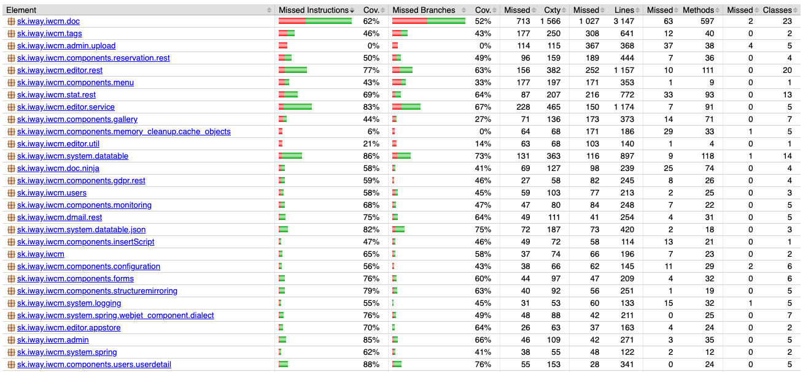

# Code coverage

> The test coverage measurement expresses the percentage of code that is executed during test scenarios. The higher the percentage of code coverage by test scenarios, the lower the chance that the code contains undetected software errors.

<div class="video-container">
    <iframe width="560" height="315" src="https://www.youtube.com/embed/vJkto5AcQeA" title="YouTube video player" frameborder="0" allow="accelerometer; autoplay; clipboard-write; encrypted-media; gyroscope; picture-in-picture; web-share" allowfullscreen></iframe>
</div>

WebJET includes an integrated library [jacoco](https://github.com/jacoco/jacoco), which tracks which parts of the code are executed during runtime and then generates a detailed report in HTML format. In it, you can navigate through individual packages down to the level of Java classes and methods with detailed highlighting of which parts of the code were executed during the tests and which were not.

The specific feature is that the code coverage is monitored by tests even **during the standard run of the application server**, so coverage is measured during normal work and therefore also **during the execution of automated e2e tests**.

We recommend adding additional test scenarios for the part of the code that was not executed during the tests.



You can view the [last generated test coverage status](http://docs.webjetcms.sk/latest/codecoverage-report/index.html).

## Use

In standard use in VS Code, a report is automatically generated in ```./build/jacoco/report/index.html``` after executing tasks ```appStart```. If it is not generated (e.g. if you stop the task via ```CTRL+C```), run ```gradlew generateJacocoReport``` to generate the report. For task ```appStartDebug```, ```jacoco``` is disabled because HotSwap was not working, but you can decide what is more important to you.

You will see a link in the terminal to open the report in your browser. This way, you can easily monitor your coverage of the code of the relevant services while writing tests.

A script ```./ant/codecoverage.sh``` is also prepared for complete report generation. The script runs standard JUnit tests as well as automated e2e tests. The task ```appBeforeIntegrationTest``` is used, which starts the application server in the background so that automated tests can continue. The application server is stopped using the task ```appAfterIntegrationTest```, which also starts the generation of HTML reports.

```shell
#!/bin/sh

echo ">>>>>>>>>>> Compiling project"
cd ..
gradlew clean
gradlew compileJava
gradlew npminstall
gradlew npmbuild

echo ">>>>>>>>>>> Executing JUnit test"
gradlew test

echo ">>>>>>>>>>> Starting app server"
gradlew appBeforeIntegrationTest

echo ">>>>>>>>>>> Executing e2e/codeceptjs tests"
cd src/test/webapp
npm run singlethread
npm run parallel8
cd ../../..

sleep 30

echo ">>>>>>>>>>> Stopping app server"
gradlew appAfterIntegrationTest
```

The result is a file ```build/jacoco/test.exec``` with the results of the JUnit tests and ```build/jacoco/appBeforeIntegrationTest.exec``` with the results of the e2e/codeceptjs tests. The report is generated by combining the results from all ```.exec``` files in the ```build/jacoco``` folder.

## Implementation details

The ```jacoco``` extension is added in ```build.gradle``` and is set for use in tests, but also during standard application server startup. It slightly increases the load on the processor and memory, if necessary, you can disable the extension by setting the ```enabled``` attribute to ```false``` in ```tasks.appStart``` and ```tasks.appStartDebug```.

However, such a setting has the advantage that during the developer's normal work, a code coverage report is continuously generated and can be checked after each application server stop using the ```finalizedBy tasks.generateJacocoReport``` setting. The application server is stopped by default using ```gradlew appStop```. If the application server is stopped, for example, using ```CTRL+C```, you can generate the report manually by calling ```gradlew generateJacocoReport```.

The version of [jacoco](https://github.com/jacoco/jacoco/releases) used is set in the variable ```toolVersion```, setting it to the value ```+``` will automatically use the latest available version.

```groovy
plugins {
    ...
    id 'jacoco'
}

jacoco {
    //set latest version
    toolVersion = "+"
}
gretty {
    ...
    afterEvaluate {
        tasks.appStart {
            file("${rootDir}/build/jacoco/appStart.exec").delete()
            jacoco {
                enabled = true
            }
            finalizedBy tasks.generateJacocoReport
        }
        tasks.appStartDebug {
            file("${rootDir}/build/jacoco/appStartDebug.exec").delete()
            jacoco {
                //enabled = true
            }
            //finalizedBy tasks.generateJacocoReport
        }
        tasks.appAfterIntegrationTest {
            finalizedBy tasks.generateJacocoReport
        }
    }
}

task('generateJacocoReport', type: JacocoReport) {

  executionData fileTree(project.rootDir.absolutePath).include("**/build/jacoco/*.exec")

  sourceDirectories.setFrom project.files(project.sourceSets.main.allSource.srcDirs)
  classDirectories.setFrom project.sourceSets.main.output

  def reportDir = project.reporting.file("${rootDir}/build/jacoco/report")
  reports {
    html.destination = reportDir
  }
  doLast {
    System.out.println "Jacoco report for server created: file://${reportDir.toURI().path}/index.html"
  }
}
```

The key is to set ```afterEvaluate``` for gretty. This will enable ```jacoco``` for tasks ```appStart``` and possibly ```appStartDebug``` as [by default jacoco](https://gretty-gradle-plugin.github.io/gretty-doc/Code-coverage-support.html) is only enabled for task ```appBeforeIntegrationTest```.

The task ```generateJacocoReport``` generates an HTML report in the folder ```./build/jacoco/report```. It displays a link in the terminal to open the file in a browser:

```groovy
gradlew generateJacocoReport

> Task :generateJacocoReport
Jacoco report for server created: file:///Users/xxx/Documents/workspace/webjet/build/jacoco/report/index.html
```

In your browser, all you need to do is open the link ```file:///Users/xxx/Documents/workspace/webjet/build/jacoco/report/index.html``` to view the generated report.


