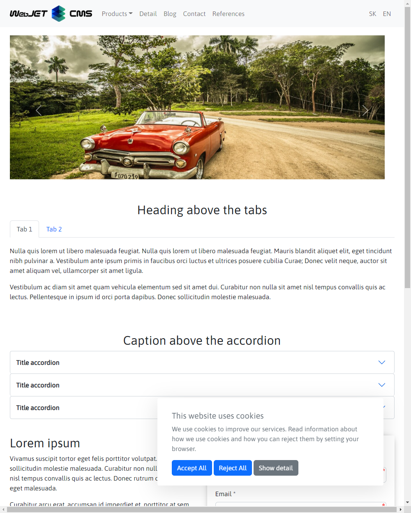
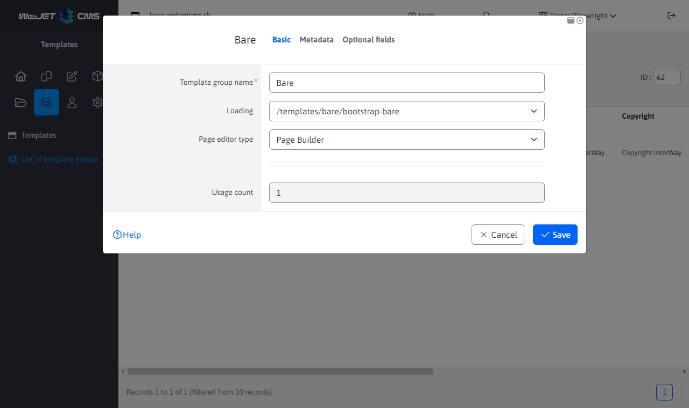
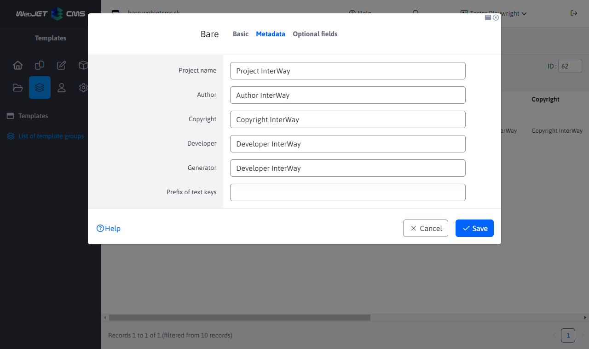
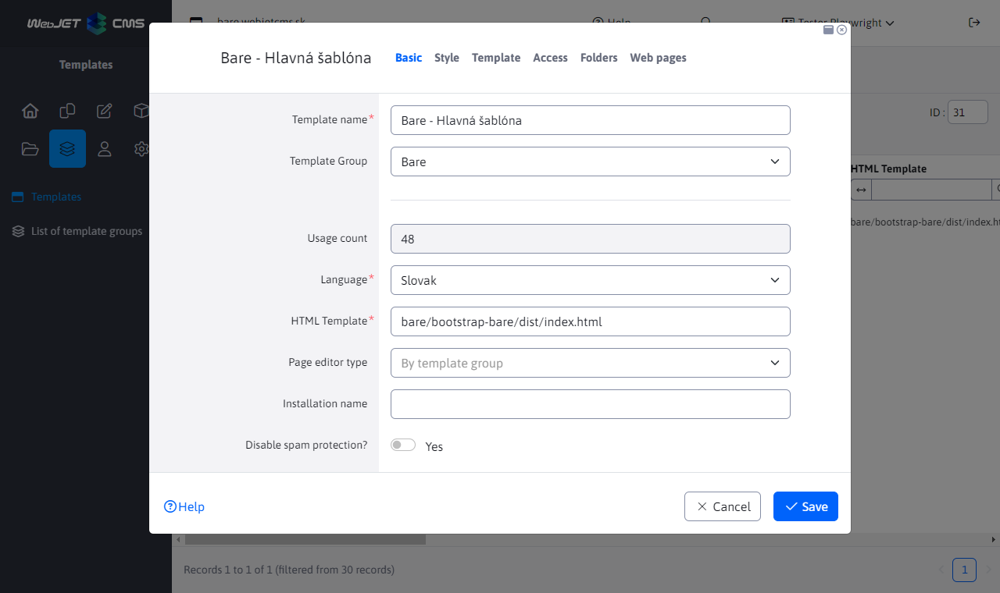
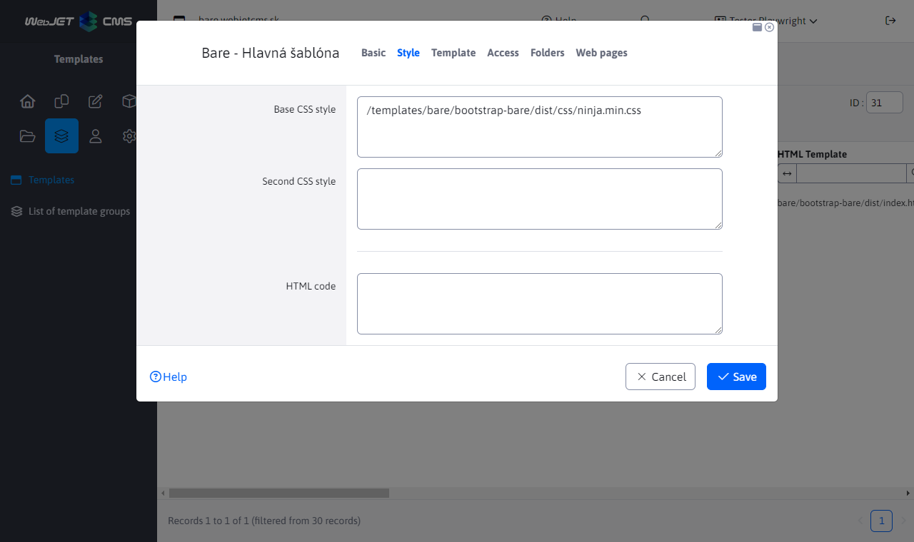
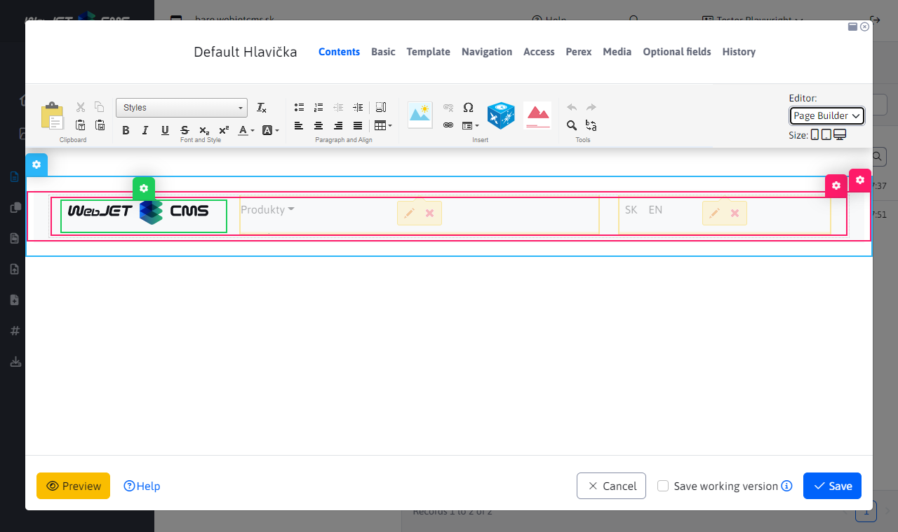
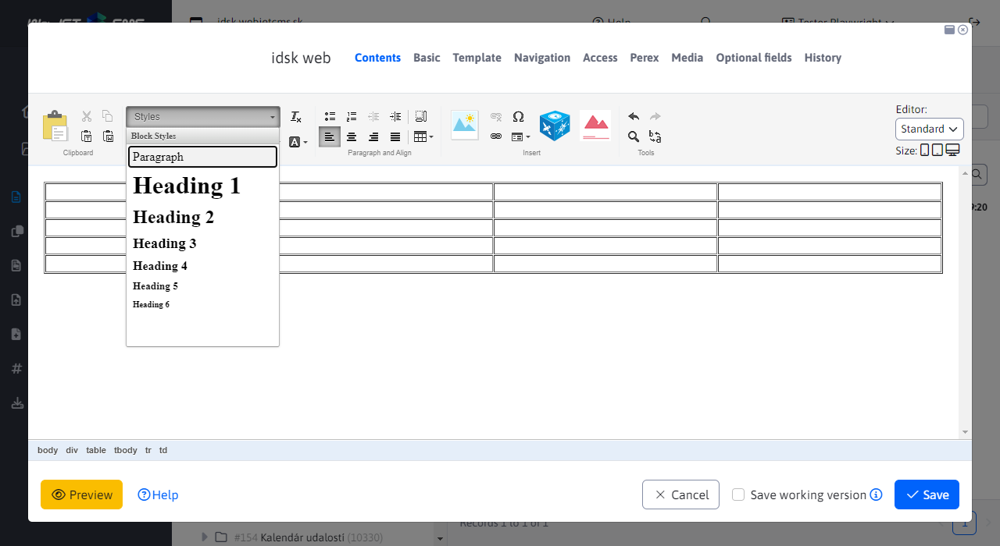

# Bare template

Basic sample template for WebJET CMS using [Thymeleaf templates](http://docs.webjetcms.sk/v2022/#/frontend/thymeleaf/README) written in the format [PugJS](http://docs.webjetcms.sk/v2022/#/developer/frameworks/pugjs). It is based on [Start Bootstrap - Bare](https://startbootstrap.com/template/bare/).

We recommend to use it as a basis for ANY new template for WebJET CMS.

You can get the source code of the template in [WebJET CMS github repository](https://github.com/webjetcms/templates-bare).



## Use in WebJET CMS

Download the template and place it in the folder `templates/bare/bootstrap-bare/` (if you are using gradle project so of course still to `src/main/webapp`). If you place it in a different folder you need to edit the paths in the source codes, just search for that string in the files and edit the path.

All the paths that you write in `.pug/.scss/.js` files you use including the prefix `/templates/bare/....`that is, as if for use in WebJET. If you run the local version via `npm run start`, but the paths have a prefix `/` (since the root folder is actually `dist`). In the file `node_scripts/bs-config.js` redirection is set, if you change the path to the template don't forget to edit it in this file as well.

In the terminal, navigate to the folder `src/main/webapp/templates/bare/bootstrap-bare` and generate `dist` version of the command:

```sh
npm install
npm run build
```

Before creating a new domain/site structure in WebJET CMS, we recommend to create templates first.

### Template group

Create a new template group called `Bare`, set the fields:
- `Priečinok` set to `/templates/bare/bootstrap-bare` (or to the folder where you have the template)
- `Typ editora stránok` set to `Page Builder`.



In the Metadata tab, set:
- `Autor, Copyright, Developer, Generator` to your data (used in the template)



### Template

Create a new template `Bare - Hlavná šablóna`, set the fields:
- `Názov šablóny` to the value of `Bare - Hlavná šablóna`
- `HTML Šablóna` to the value of `bare/bootstrap-bare/dist/index.html` (if you don't see the dist folder in the selection, make sure you have generated `dist` version after downloading the template).



In the Style tab, set

- `Hlavný CSS štýl` to the value of `/templates/bare/bootstrap-bare/dist/css/ninja.min.css`.



### Structure of web pages

If you haven't created a new domain/site structure yet, now **create a new domain** and set its template `Bare - Hlavná šablóna`:
- click on Web pages-List of web pages
- click on the icon `+` to add a new folder
- Enter Folder Name `Slovensky`
- enter the name of the menu item `sk`
- enter the value in the URL address `sk`
- set the Parent Folder to the root folder (the value `/`)
- set the domain


In the Template tab:
- in the Template for website field, select `Bare - Hlavná šablóna`


If you already have a domain/site structure in place, we recommend that you edit the existing folders - in the Folder Template tab, set `Bare - Hlavná šablóna` and turn on the option `Aplikovať na všetky existujúce podpriečinky a podstránky`. Also set this in the tab `Systém` to existing folders.

### Header and footer adjustment

Go to Web Pages - List of Web Pages, click the System tab, and navigate to the Headers folder. Open the page `Základná hlavička` in the editor. In the Template tab, check that the page uses a template `Bare - Hlavná šablóna` (if not, set and save the page and reopen it in the editor). Delete everything in the page and then add the Page Builder block `Header-menu`.

You will see 3 columns:
- WebJET logo - you can change it for a suitable logo for your site
- Application menu - probably does not have the root folder set correctly, click on the pencil icon in the application and in the application settings window change `Koreňový adresár` to your domain directory. However, you have not yet created a site structure so the application will not display anything yet.
- Language switching - displays the language switcher `SK - EN`If you do not use the language mutations, you can delete the application.



Follow a similar procedure for setting the footer (page `Základná pätička`), delete everything and insert the block `footer-footer`. In addition to the standard text columns where you can easily edit the text to suit your needs, the footer of the app includes:
- Login to `newslettra` (bulk email) - a simplified version with only a field for entering the email is used. The simplified registration form registers to all email groups that have the option enabled `Povoliť pridávanie/odoberanie zo skupiny samotným používateľom` a `Vyžadovať potvrdenie e-mailovej adresy`.
- GDPR cookies - application for setting cookies, their list is taken from the GDPR-Cookie Manager application in which you set the list of cookies that the website uses. You can import [basic list of cookies](cookies.xlsx).
Go to Template-List and set the header/footer to the template `Bare - Hlavná šablóna` (in the Template tab, set the Header and Footer fields).

Note: the template contains a menu in the header, so leave the Main and Side Navigation items blank in the template settings.

### Setting language mutations

The template is ready for language mutations, it uses the Structure Mirroring application. We recommend to create root folders in the list of web pages (Folders tab) `Slovensky` a `English`.

Set the field to the folders `URL adresa` to the value of `sk` or `en`, set the same way `Názov položky v menu` to the value of `sk` or `en` (this item appears in the header in the language switcher) and in the Template tab the field `Jazyk` to the appropriate value. Then follow the instructions for [mirroring adjustment](http://docs.webjetcms.sk/v2022/#/redactor/apps/docmirroring/README).

For the second language version, make copies of the header/footer, add a prefix for automatic use in the respective language version `EN-` to the page title (e.g. page `Default Hlavička` duplicate to `EN-Default Hlavička`). In the page, edit the application settings (root folder for the menu application).

### Creating pages

The template contains several ready-made blocks, you can add them in the page simply via PageBuilder.

## For the web designer

Study the points below if you want to edit the template code (HTML, CSS, JavaScript).

### Tree structure

All template files are located in the src folder, which contains the following structure:
- `assets` - images, icons and fonts, we recommend to follow the suggested structure of subfolders. In the folder `images` there are sample images for PageBuilder blocks.
- `js` - JavaScript files, the main file is `ninja.js`.
- `pug` - HTML code of templates in the format [PugJS](https://pugjs.org/).
	- `includes` - Shared blocks between templates (e.g. a header shared between the main page template and a subpage).
	- `pagebuilder` - blocks for [PageBuilder](http://docs.webjetcms.sk/v2022/#/frontend/page-builder/blocks). In blocks we recommend to use as much as possible the possibility of `include`. Do `container` insert existing blocks `column` blocks and into `section` Existing `container` Blocks. When changing `column` block, the change will also be reflected in `container` a `section` blocks.
- `scss` - CSS styles in format for [Ninja](http://docs.webjetcms.sk/v8/#/ninja-starter-kit/)
Design templates are compiled from pug format to HTML format for use via [Thymeleaf](http://docs.webjetcms.sk/v2022/#/frontend/thymeleaf/README). For prototyping using `npm run start` we recommend to follow the option `include` blocks for PageBuilder into templates. This way, you can verify the page view and the content at the same time as you verify the block view. Ideally, you will use all the blocks on one page in the prototype. This makes it easy to visually verify their functionality and display when changing CSS styles or HTML code.

### Generating dist version

`dist` to generate the directory, use the following commands:

```sh
#vygenerovanie dist adresara
npm run build

#vygenerovanie dist adresara, spustenie sledovania zmien v suboroch cez browser-sync a spustenie chrome
#v tomto rezime je spusteny prehliadac pocuvajuci na zmeny v suboroch
#POZOR: je napojeny len na ciste HTML subory, nie na plny WebJET, bezi teda bez Thymeleaf sablon
#vyhodne na prototypovanie HTML/CSS bez potreby spustenia celeho WebJET CMS
npm run start
```

individual `npm` scripts are defined in [package.json](package.json) in the elements `scripts` and made of `node_scripts/*.js` Directory:
- `npm run build` - generates a complete `dist` Directory.
- `npm run build:assets` - re-generates files from the directory `assets` (images, font icons).
- `npm run build:pug` - re-generates HTML files from the source pug files.
- `npm run build:scripts` - re-generates JavaScript files from the src directory.
- `npm run build:scss` - generates css files from source `scss` files.
- `npm run clean` - erases `dist` Directory.
- `npm run start` - starts prototyping mode - generates `dist` directory, tracks changes to the files and opens the browser with the prototype version.
- `npm run start:debug` - starts the prototyping mode with `debug` Browser mode.
Configuration for prototyping mode `browser-sync` is located in the file [node-scripts/bs-config.js](node_scripts/bs-config.js). There is possibly a need to modify the path for replacing the addresses of fonts/images that are linked with the full URL in the CSS files (since during prototyping the URL of the pages differs from the address in the final version via WebJET CMS).

### JavaScript file processing

To be able to use npm modules directly in the file [ninja.js](src/js/ninja.js) is used [browserify](https://www.npmjs.com/package/browserify) with extension [esmify](https://www.npmjs.com/package/esmify). The processing is in the file [render-scripts.js](node_scripts/render-scripts.js).

The reason is that all JavaScript libraries used in a web page can be managed via npm (i.e. easily updated).

In the file `ninja.js` so you can use `import/require` to import the necessary libraries for displaying the page.

You can then use [npm-check-updates](https://www.npmjs.com/package/npm-check-updates) for version control and easy updates.

### List of styles for editor

In the editor, you can add the necessary CSS styles in addition to the basic Paragraph and Heading 1-6 formatting elements. For the sake of complexity `ninja.min.css` these are written to a file `src/scss/editor.scss` which is generated to `dist/css/editor.css`.


Basic application of styles to any element is supported, as well as styling of specific HTML elements:

```css
.blue {
	color: blue;
}
.zvyrazneny-text {
	background-color: yellow;
}

a {
	&.btn.btn-primary {
		/*bootstrap default*/
	}
	&.btn.btn-secondary {
		/*bootstrap default*/
	}
}

table {
	&.table {
		&.table.table-dark {
			/*bootstrap default*/
		}
		&.table.table-striped {
			/*bootstrap default*/
		}
		&.table-bordered {
			/*bootstrap default*/
		}
	}
}
```

If the cursor is in a table, the style options for the table are also displayed in the Style selection box:



When using multiple CSS styles at once (e.g. `btn btn-primary`) are all applied to the currently selected element. Styles that are applied only to an element do not appear in the selection box unless the element is selected or the cursor is present.

If `editor.css` you do not also insert into the template design, so its styles are not applied when displaying the web page. Thus, by default, it is only used as a list of style definitions.

If you want, you can also define the style displayed in the selection box in the editor directly in other files. However, the style defined in this way must contain a comment as the first `/* editor */`. The example is in the file `src/scss/3-base/_link.scss`:

```css
a {
	&.btn.more-info {
		/* editor */
		font-size: 150%;
		background-color: var(--bs-orange);
		color: var(--bs-white);
	}
}
```

in the selection box, the option to set the CSS style is then displayed `btn more-info` on the A element. The advantage of using this is that you have the definition for both the editor and the styles themselves in one place.

When applying a CSS style that has no HTML tag set, the style is applied to the parent element where the cursor is located. If you want to apply the style only to the selected text (selector), you need to define it for the HTML tag `span`:

```css
span.more-info {
	/* editor */
	font-size: 150%;
	background-color: orange;
	color: white;
}
```

You can then select the text and apply this style only to the selected text. If it did not have an HTML tag `span` would be applied to the parent element, i.e. typically to the whole paragraph - `p`.

## Creating PageBuilder blocks

If you need to create a new block for PageBuilder follow this guide.

### Folder structure

The blocks are located in `scr/pug/pagebuilder` and are in subfolders `column,container,section` by block type. They are then organized according to their meaning; you can name the folders any way you want. They will then appear under that folder name in the block library.

We recommend to proceed from the bottom, i.e. first create blocks in `column` folder, then use include to insert them into `container` and this subsequently into `section`.

For example, the file `src/pagebuilder/column/card/card.pug`:

```javascript
.col-md-6
    .card
        .card-body
            h5.card-title Special title treatment
            p.card-text With supporting text below as a natural lead-in to additional content.
            a.btn.btn-primary(href='#') Go somewhere
```

File `src/pug/pagebuilder/container/cards/cards.pug`

```
.container
    .row
        include ../../column/card/card
        include ../../column/card/card

```

File `src/pug/pagebuilder/section/cards/cards.pug`

```
section
    include ../../container/cards/cards
```

the advantage of such a procedure is that if you modify something in `column` pug file, it will manifest itself through the use of `include` command change even in `container` also in `section` Version.

### Generating PageBuilder block previews

If you edit the pug block file for PageBuilder you can generate preview images by calling the address `/components/grideditor/phantom/generator.jsp`. Use the following settings:
- Width: 1000
- Height: 600
- zoom: 1
- docid: 383
- JSP template: `/templates/bare/bootstrap-bare/dist/index.html`

The preview images are generated in the same structure as the pug block files. They are also generated into `dist` folder. In the build process, the images are copied in the script `render-assets.js`. When manually changing the image, you can only run this script with the command:

```sh
npm run build:assets
```

Generation requires installed [PhantomJS](https://phantomjs.org/download.html), the location and setting of conf. variables is in the file `localconf.jsp`.

## Copyright and License

Copyright 2013-2021 Start Bootstrap LLC. Code released under the [MIT](https://github.com/StartBootstrap/startbootstrap-bare/blob/master/LICENSE) license.
