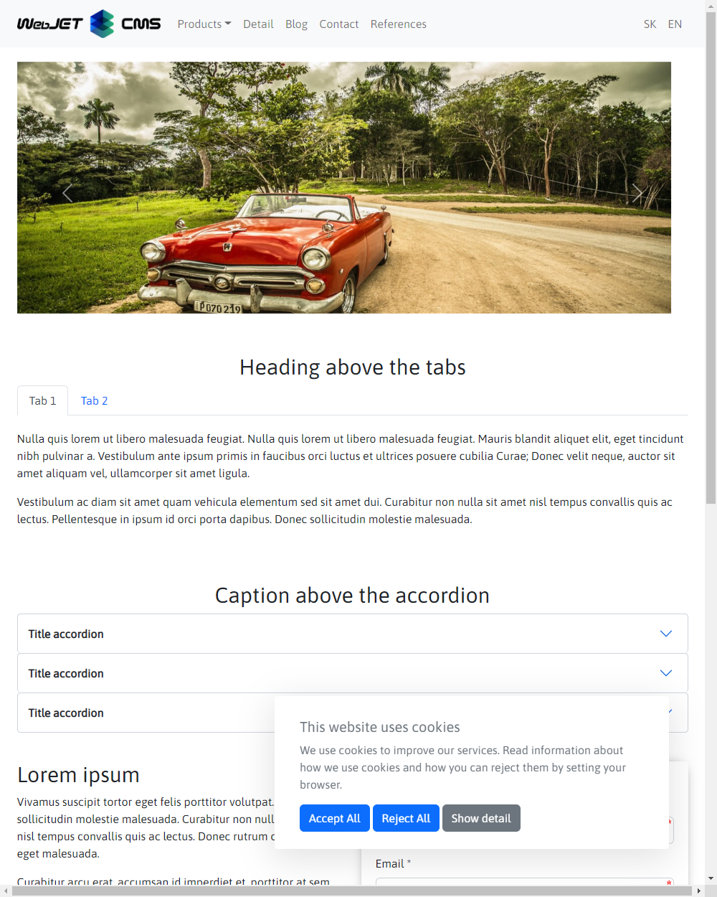
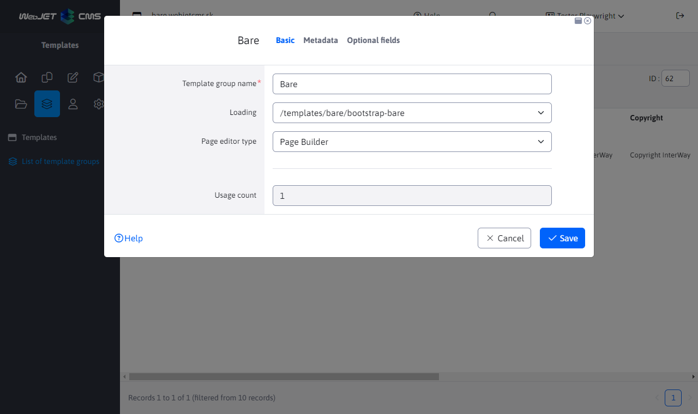
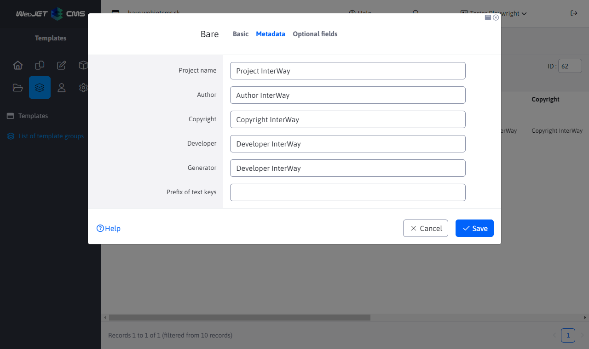
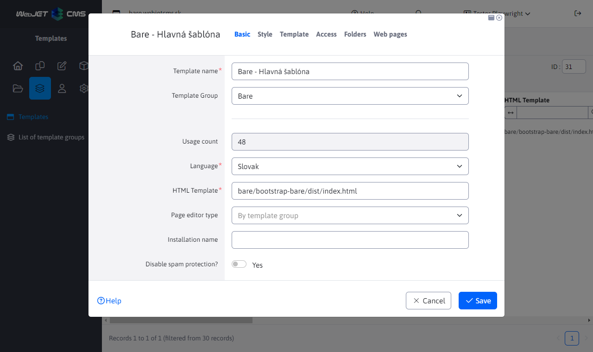
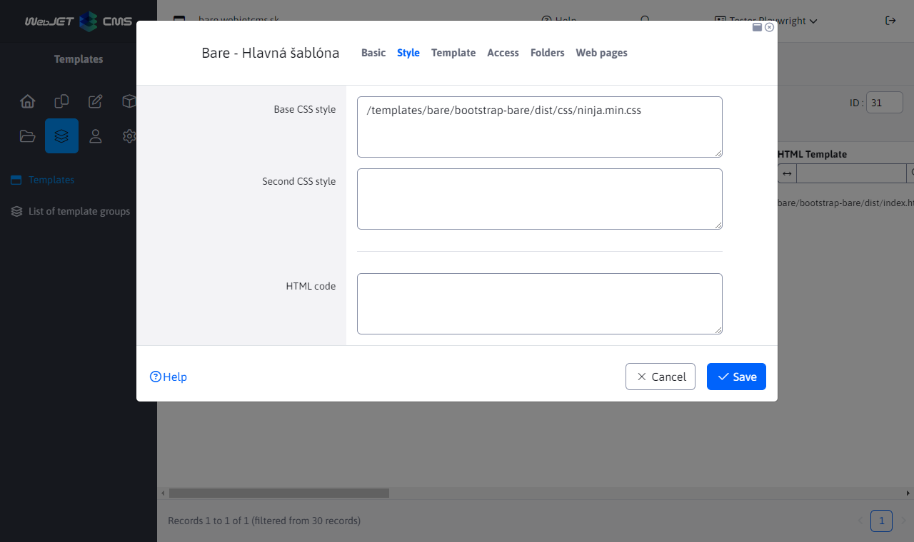
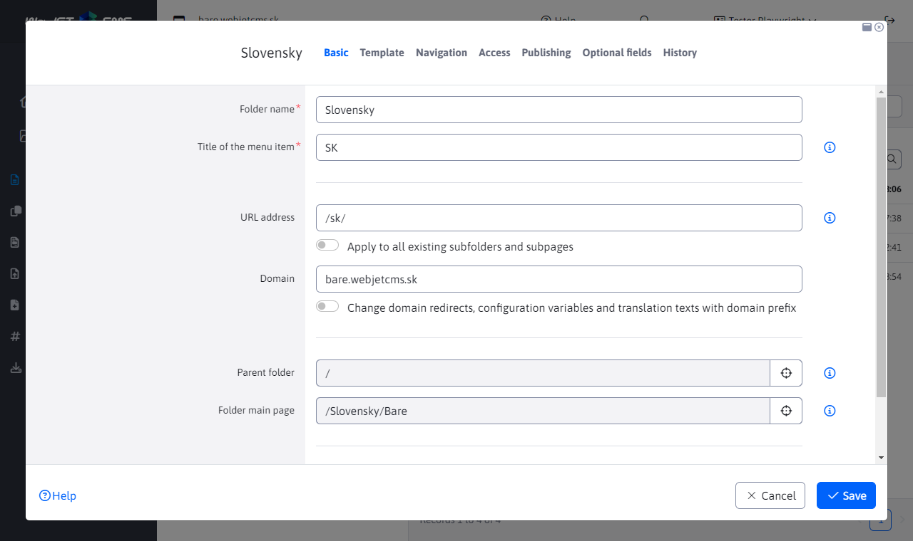
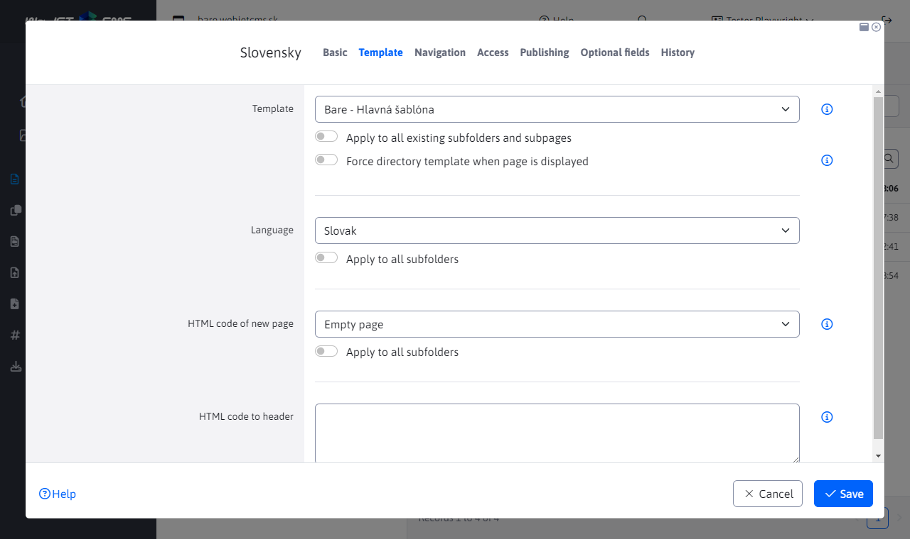
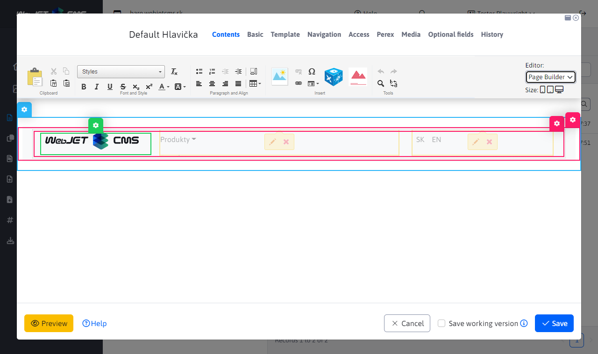
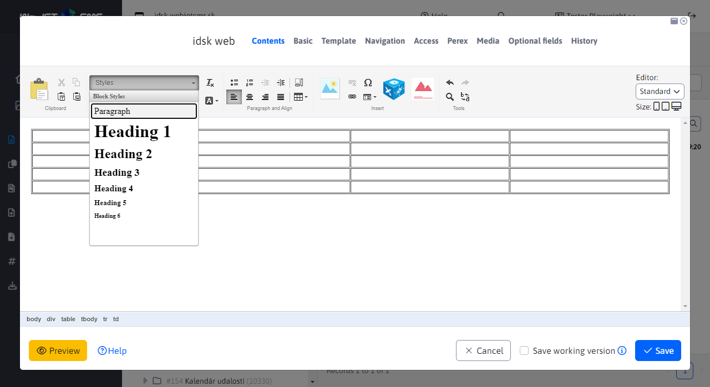

# Bare template

A basic sample template for WebJET CMS using [Thymeleaf templates](http://docs.webjetcms.sk/v2022/#/frontend/thymeleaf/README) written in [PugJS](http://docs.webjetcms.sk/v2022/#/developer/frameworks/pugjs) format. It is based on [Start Bootstrap - Bare](https://startbootstrap.com/template/bare/).

We recommend using it as the basis for ANY new template for WebJET CMS.

You can get the template source code in the [WebJET CMS github repository](https://github.com/webjetcms/templates-bare).



## Use in WebJET CMS

Download the template and place it in the ```templates/bare/bootstrap-bare/``` folder (of course, if you are using a gradle project, also in ```src/main/webapp```). If you place it in another folder, you will need to edit the paths in the source code, just search for this string in the files and edit the path.

All paths that you write in ```.pug/.scss/.js``` files are used including the prefix ```/templates/bare/....```, i.e. as if for use in WebJET. If you run the local version via ```npm run start```, the paths have the prefix ```/``` (since the root folder is actually ```dist```). Redirection is set in the ```node_scripts/bs-config.js``` file, if you change the path to the template, don't forget to edit it in this file as well.

In the terminal, go to the ```src/main/webapp/templates/bare/bootstrap-bare``` folder and generate the ```dist``` version with the command:

```sh
npm install
npm run build
```

Before creating a new domain/site structure in WebJET CMS, we recommend creating templates first.

### Template group

Create a new template group called ```Bare```, set the fields:

- Set ```Priečinok``` to ```/templates/bare/bootstrap-bare``` (or to the folder where your template is located)
- Set ```Typ editora stránok``` to the value ```Page Builder```.



In the metadata tab, set:

- ```Autor, Copyright, Developer, Generator``` for your data (used in the template)



### Template

Create a new template ```Bare - Hlavná šablóna```, set the fields:

- ```Názov šablóny``` to the value ```Bare - Hlavná šablóna```
- ```HTML Šablóna``` to the value ```bare/bootstrap-bare/dist/index.html``` (if you don't see the dist folder in the selection, check if you generated the ```dist``` version after downloading the template).



In the Style tab, set

- ```Hlavný CSS štýl``` to the value ```/templates/bare/bootstrap-bare/dist/css/ninja.min.css```.



### Website structure

If you haven't created a new domain/site structure yet, **create a new domain** now and set its template ```Bare - Hlavná šablóna```:

- click on Websites-List of websites
- click on the ```+``` icon to add a new folder
- enter Folder Name ```Slovensky```
- enter the Name of the menu item ```sk```
- enter the value ```sk``` in the URL address
- set Parent folder to root folder (value ```/```)
- set up a domain



In the Template tab:

- in the Website Template field, select ```Bare - Hlavná šablóna```



If you already have a domain/site structure created, we recommend editing the existing folders - in the Folder Template tab, set ```Bare - Hlavná šablóna``` and enable the ```Aplikovať na všetky existujúce podpriečinky a podstránky``` option. Also set this in the ```Systém``` tab for existing folders.

### Setting the header and footer

Go to the Websites - Website List section, click the System tab and go to the Headers folder. Open the ```Základná hlavička``` page in the editor. In the Template tab, check that the page uses the ```Bare - Hlavná šablóna``` template (if not, set it up and save the page and reopen it in the editor). Delete everything on the page and then add the Page Builder block ```Header-menu```.

You will see 3 columns:

- WebJET logo - you can change this to a suitable logo for your site
- Menu application - probably does not have the root folder set correctly, click on the pencil icon in the application and in the application settings window change ```Koreňový adresár``` to your domain directory. However, you do not have a page structure created yet, so the application will not display anything yet.
- Language mutation switch - displays the language mutation switch ```SK - EN```, if you do not use language mutations, you can delete the application.



Proceed similarly to set up the footer (page ```Základná pätička```), delete everything and insert the block ```footer-footer```. In addition to the standard text columns where you can easily edit the text according to your needs, the application footer contains:

- Login to ```newslettra``` (bulk email) - a simplified variant with only an email input field is used. The simplified registration form registers to all email groups that have the ```Povoliť pridávanie/odoberanie zo skupiny samotným používateľom``` and ```Vyžadovať potvrdenie e-mailovej adresy``` options enabled.
- GDPR cookies - an application for setting cookies, it takes their list from the GDPR-Cookie Manager application in which you set the list of cookies that the website uses. You can import [basic list of cookies] (cookies.xlsx).

Go to Templates-template list and set the header/footer to the ```Bare - Hlavná šablóna``` template (in the Template tab, set the Header and Footer fields).

Note: the template includes a menu in the header, so leave the Main and Side Navigation items empty in the template settings.

### Setting up language mutations

The template is ready for language mutations, uses the Structure Mirroring application. We recommend creating root folders ```Slovensky``` and ```English``` in the website list (Folders tab).

Set the ```URL adresa``` field to the value ```sk``` or ```en```, also set the ```Názov položky v menu``` to the value ```sk``` or ```en``` (this item will appear in the header in the language switcher) and in the Template tab the ```Jazyk``` field to the appropriate value. Then follow the instructions for [setting up mirroring](http://docs.webjetcms.sk/v2022/#/redactor/apps/docmirroring/README).

For the second language mutation, create copies of the header/footer, to automatically use them in the respective language version, add the prefix ```EN-``` to the page name (e.g. duplicate the page ```Default Hlavička``` to ```EN-Default Hlavička```). Edit the application settings on the page (root folder for the menu application).

### Creating pages

The template contains several ready-made blocks, you can easily add them to your page via PageBuilder.

## For the web designer

Please review the points below if you want to edit the template code (HTML, CSS, JavaScript).

### Tree structure

All template files are located in the src folder, which contains the following structure:

- ```assets``` - ​​images, icons and fonts, we recommend following the suggested subfolder structure. The ```images``` folder contains sample images for PageBuilder blocks.
- ```js``` - ​​JavaScript files, the main file is ```ninja.js```.
- ```pug``` - ​​HTML template code in [PugJS](https://pugjs.org/) format.
  - ```includes``` - ​​shared blocks between templates (e.g. header shared between main page template and subpages).
  - ```pagebuilder``` - ​​blocks for [PageBuilder](http://docs.webjetcms.sk/v2022/#/frontend/page-builder/blocks). In blocks, we recommend using the ```include``` option as much as possible. Insert existing ```column``` blocks into ```container``` blocks and existing ```container``` blocks into ```section```. When changing the ```column``` block, the change will also be reflected in the ```container``` and ```section``` blocks.
- ```scss``` - ​​CSS styles in [Ninja](http://docs.webjetcms.sk/v8/#/ninja-starter-kit/) format

Design templates are compiled from pug format to HTML format for use via [Thymeleaf](http://docs.webjetcms.sk/v2022/#/frontend/thymeleaf/README). For prototyping using ```npm run start```, we recommend using the ```include``` option for PageBuilder blocks in templates. This way you can simultaneously verify the display of the page with content and also verify the display of blocks. Ideally, you will use all blocks on one page in the prototype. This way you can easily visually verify their functionality and display when changing CSS styles or HTML code.

### Generating a dist version

```dist``` adresár vygenerujete nasledovnými príkazmi:

```sh
#vygenerovanie dist adresara
npm run build

#vygenerovanie dist adresara, spustenie sledovania zmien v suboroch cez browser-sync a spustenie chrome
#v tomto rezime je spusteny prehliadac pocuvajuci na zmeny v suboroch
#POZOR: je napojeny len na ciste HTML subory, nie na plny WebJET, bezi teda bez Thymeleaf sablon
#vyhodne na prototypovanie HTML/CSS bez potreby spustenia celeho WebJET CMS
npm run start
```

individual ```npm``` scripts are defined in [package.json](https://github.com/webjetcms/templates-bare/blob/master/package.json) in the ```scripts``` element and executed from the ```node_scripts/*.js``` directory:

- ```npm run build``` - ​​generates a complete ```dist``` directory.
- ```npm run build:assets``` - ​​regenerates files from directory ```assets``` (images, font icons).
- ```npm run build:pug``` - ​​regenerates HTML files from source pug files.
- ```npm run build:scripts``` - ​​regenerates JavaScript files from the src directory.
- ```npm run build:scss``` - ​​generates css files from source ```scss``` files.
- ```npm run clean``` - ​​deletes the ```dist``` directory.
- ```npm run start``` - ​​starts prototyping mode - generates a ```dist``` directory, tracks changes in files and opens a browser with the prototype version.
- ```npm run start:debug``` - ​​starts prototyping mode with ```debug``` browser mode.

The configuration for prototyping mode ```browser-sync``` is located in the file [node-scripts/bs-config.js](https://github.com/webjetcms/templates-bare/blob/master/node_scripts/bs-config.js). There, it may be necessary to adjust the path for replacing font/image addresses that are linked to the full URL in CSS files (since during prototyping the URL of the pages differs from the address in the final version via WebJET CMS).

### Processing JavaScript files

In order to be able to use npm modules directly in the [ninja.js](https://github.com/webjetcms/templates-bare/blob/master/src/js/ninja.js) file, [browserify](https://www.npmjs.com/package/browserify) with the [esmify](https://www.npmjs.com/package/esmify) extension is used. The processing is in the [render-scripts.js](https://github.com/webjetcms/templates-bare/blob/master/node_scripts/render-scripts.js) file.

The reason is so that all JavaScript libraries used in the website can be managed via npm (i.e. easily updated).

So in the file ```ninja.js``` you can use ```import/require``` to import the necessary libraries to display the page.

You can then use [npm-check-updates](https://www.npmjs.com/package/npm-check-updates) to check versions and easily update.

### Editor style list

In the editor, in addition to the basic formatting elements Paragraph and Heading 1-6, it is possible to add the necessary CSS styles. Due to the complexity of ```ninja.min.css```, these are written to the file ```src/scss/editor.scss``` which is generated in ```dist/css/editor.css```.


Basic application of styles to any element is supported, as well as styling of specific HTML elements:

```css
.blue {
    color: blue;
}
.zvyrazneny-text {
    background-color: yellow;
}

a {
    &.btn.btn-primary {
        /*bootstrap default*/
    }
    &.btn.btn-secondary {
        /*bootstrap default*/
    }
}

table {
    &.table {
        &.table.table-dark {
            /*bootstrap default*/
        }
        &.table.table-striped {
            /*bootstrap default*/
        }
        &.table-bordered {
            /*bootstrap default*/
        }
    }
}
```

If the cursor is in a table, the Style selection box also displays the table style options:



When using multiple CSS styles at once (e.g. ```btn btn-primary```), all of them are applied to the currently selected element. Styles that apply only to an element will not appear in the selection box unless the element is selected or the cursor is in it.

Unless you include ```editor.css``` in the template design, its styles are not applied when the web page is displayed. By default, it is only used as a list of style definitions.

If you want, you can define the style displayed in the editor's selection box directly in other files. However, the style defined in this way must contain the first comment ```/* editor */```. An example is in the file ```src/scss/3-base/_link.scss```:

```css
a {
    &.btn.more-info {
        /* editor */
        font-size: 150%;
        background-color: var(--bs-orange);
        color: var(--bs-white);
    }
}
```

The selection field will then display the option to set the CSS style ```btn more-info``` on the A element. The advantage of this usage is that you have the definition for the editor and the styles themselves in one place.

When applying a CSS style that does not have any HTML tag set, the style is applied to the parent element that the cursor is in. If you want to apply the style only to the selected text (selection), you need to define it for the HTML tag ```span```:

```css
span.more-info {
    /* editor */
    font-size: 150%;
    background-color: orange;
    color: white;
}
```

then it is possible to select text and apply this style only to the selected text. If it did not have the HTML tag ```span``` it would be applied to the parent element, i.e. typically the entire paragraph - ```p```.

If you don't like the default style name in the selection box, you can change it by adding a comment:

```css
span.more-info {
    /* editor title: Nice Editor Title */
    font-size: 150%;
    background-color: orange;
    color: white;
}
```

or in abbreviated form directly with a comment at the end of the style definition line:

```css
span.more-info { /* Nice Editor Title */
    font-size: 150%;
    background-color: orange;
    color: white;
}
```

Applying multiple styles at once is also supported. It is used if the element is also defined in the CSS:

```css
p.paragraph-green {
    color: green;
}
p.paragraph-red-border {
    border: 1px solid red;
}
p.paragraph-yellow-background {
    background-color: yellow;
}
```

The user can select any combination of these styles on the `p` element. If a style is already applied to the element, selecting it again will remove the style. This makes it easy to apply multiple styles at once.

If you want the drop-down menu to display names in your style, you can add a CSS definition of the editor style files to the page header in Page Builder mode:

```html
<script data-th-if="${T(sk.iway.iwcm.editor.InlineEditor).isInlineEditingEnabled(request)}">
    webjetContentsCss = [
       '/admin/skins/webjet8/ckeditor/dist/plugins/webjetcomponents/samples/contents.css',
       '/templates/jet/assets/css/editor.css'
    ];
</script>
```

We recommend adding only the minimum style needed to style the titles.

## Creating PageBuilder blocks

If you need to create a new block for PageBuilder, follow these instructions.

### Folder structure

The blocks are located in ```scr/pug/pagebuilder``` and are in subfolders ```column,container,section``` according to the block type. They are then organized according to their meaning, you can name the folders as you wish. They will then appear in the block library under this folder name.

We recommend proceeding from the bottom, i.e. first create blocks in the ```column``` folder, then insert them into ```container``` using include, and then into ```section```.

For example, the file ```src/pagebuilder/column/card/card.pug```:

```javascript
.col-md-6
    .card
        .card-body
            h5.card-title Special title treatment
            p.card-text With supporting text below as a natural lead-in to additional content.
            a.btn.btn-primary(href='#') Go somewhere
```

file ```src/pug/pagebuilder/container/cards/cards.pug```

```pugjs
.container
    .row
        include ../../column/card/card
        include ../../column/card/card

```

file ```src/pug/pagebuilder/section/cards/cards.pug```

```pugjs
section
    include ../../container/cards/cards
```

The advantage of this procedure is that if you modify something in the ```column``` pug file, the change will be reflected in both the ```container``` and ```section``` versions thanks to the use of the ```include``` command.

### Generating PageBuilder block previews

If you edit the pug file of the PageBuilder block, you can generate preview images by calling the address ```/components/grideditor/phantom/generator.jsp```. Use the following settings:

- width: 1000
- height: 600
- zoom: 1
- doc: 383
- JSP template: ```/templates/bare/bootstrap-bare/dist/index.html```

Preview images are generated in the same structure as the pug block files. They are also generated in the ```dist``` folder. During the build process, the images are copied in the ```render-assets.js``` script. When changing the image manually, you can only run this script with the command:

```sh
npm run build:assets
```

Generation requires [PhantomJS](https://phantomjs.org/download.html) to be installed, the location and setting of config variables is in the file ```localconf.jsp```.

## Copyright and License

Copyright 2013-2021 Start Bootstrap LLC. Code released under the [MIT](https://github.com/StartBootstrap/startbootstrap-bare/blob/master/LICENSE) license.
