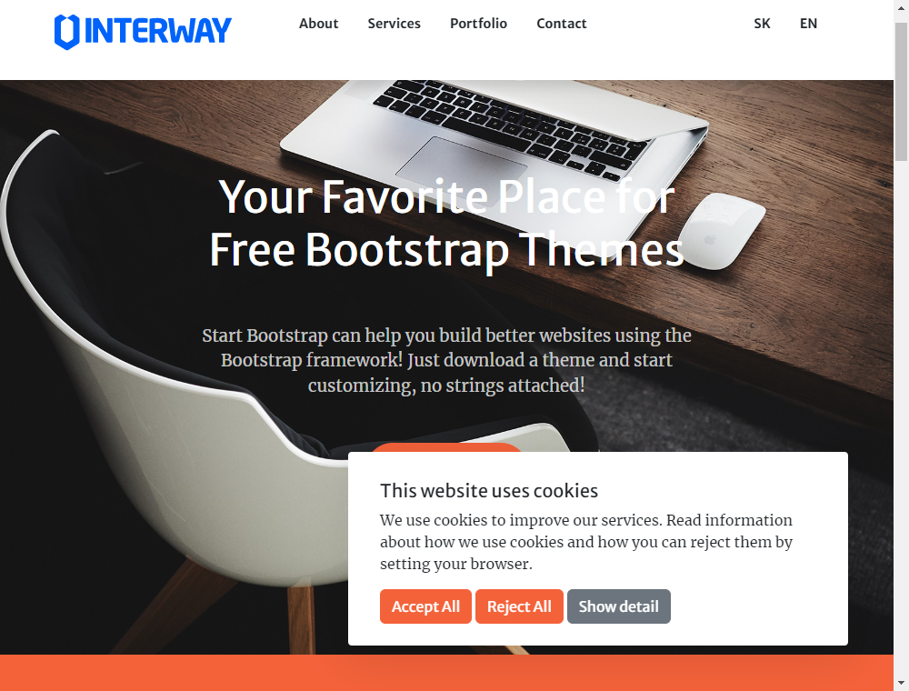
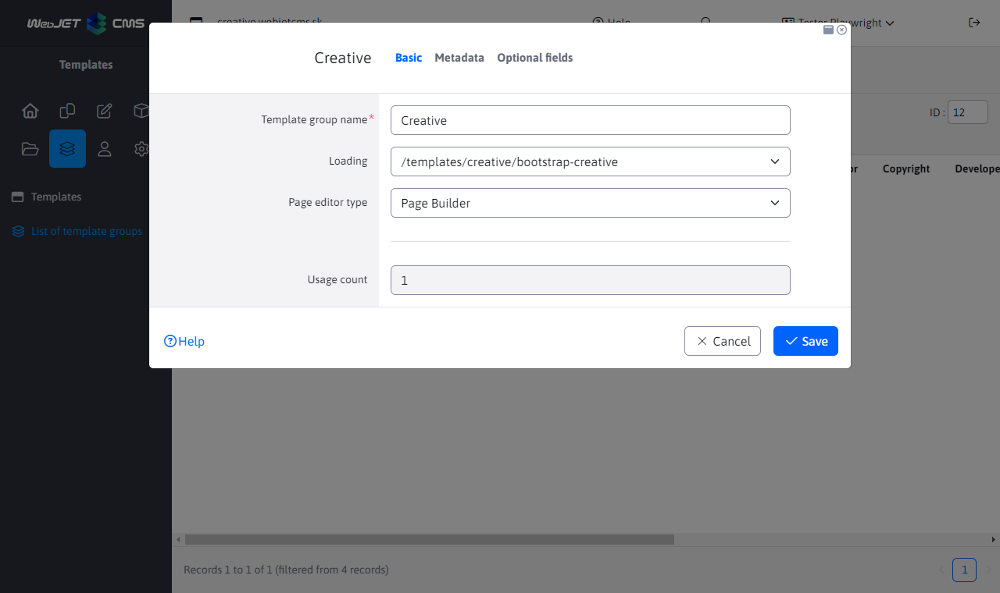
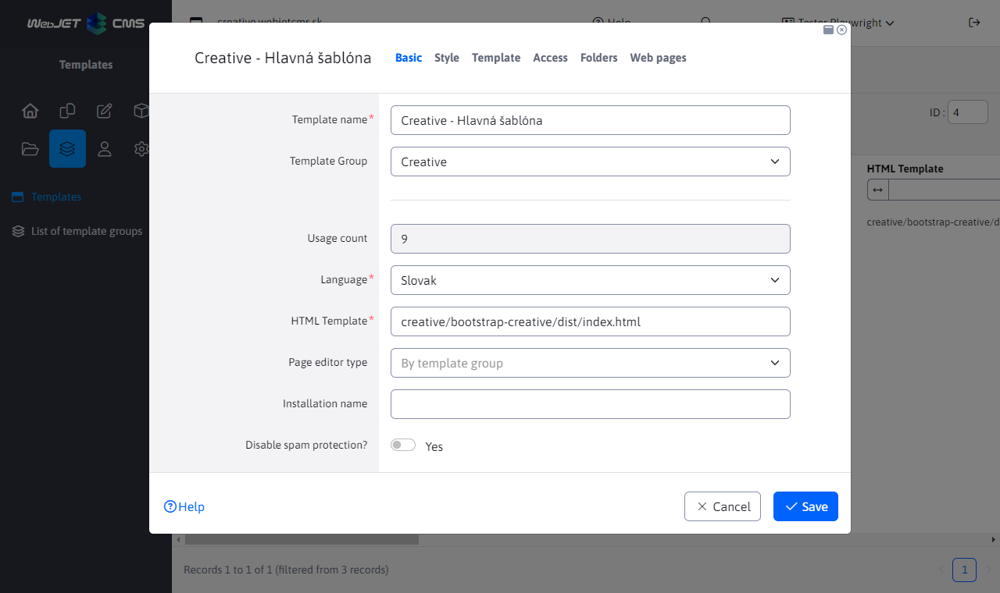
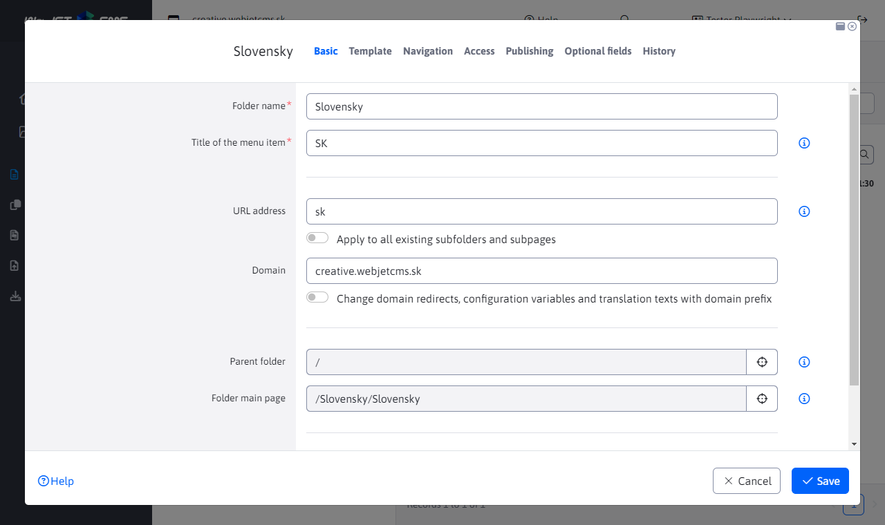
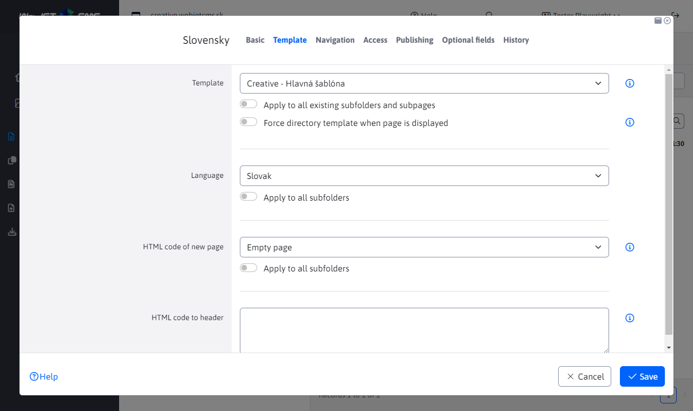

# Creative template

Basic one-page (`singlepage`) sample template for WebJET CMS using [Thymeleaf templates](http://docs.webjetcms.sk/v2022/#/frontend/thymeleaf/README) written in the format [PugJS](http://docs.webjetcms.sk/v2022/#/developer/frameworks/pugjs). It is based on [Start Bootstrap - Creative]().

You can get the source code of the template in [WebJET CMS github repository](https://github.com/webjetcms/templates-creative).

## Use in WebJET CMS

The use is the same as for [Bare template](../template-bare/README.md#použitie-vo-webjet-cms), the difference is of course in the names - replace everywhere `bare` For `creative`. The template folder is `src/main/webapp/templates/creative/bootstrap-creative/`, the paths used in the template and template group start at `/templates/creative/bootstrap-creative/`.

### Template group

Follow the instructions for the Bare template with modified path `/templates/creative/bootstrap-creative/`.

### Template

Follow the instructions for the Bare template with modified path `creative/bootstrap-creative/dist/index.html`. In the Style tab, set the Main CSS style to `/templates/creative/bootstrap-creative/dist/css/ninja.min.css`.

### Structure of web pages

Follow the instructions for the Bare template.

In the Template tab:
- in the Template for website field, select `Creative - Hlavná šablóna`

### Header and footer adjustment

Follow the instructions for the Bare template. Since this is a one-page template, the prepared menu contains directly entered anchors (links). You can edit these, they are created as a bulleted list. Clicking on an existing title will bring up a window for setting the text and any link.

You can create a new one by clicking on an existing link, closing the link setup window by clicking Cancel, and then moving the cursor to where you want the new link. Press `Enter` to create a new bullet (even if it appears in a line) and type the text. Then select it and click on the create link icon. In the window, enter the URL (e.g. `#mojblok`), and in the Advanced tab, enter a value in the Style Classes field `nav-link`.

You can set an ID to a block in the page editor (which you can then link to in the URL field in the menu) by clicking on the gear icon in the blue block (section) and then selecting the pencil icon in the menu that appears. Click Advanced and in the Selector tab you can set the block ID (e.g. `mojblok`).

## For the web designer

Follow the instructions for the Bare template, in Creative is additionally used [Font Awesome](https://fontawesome.com). Copying its fonts is set in `src/main/webapp/templates/creative/bootstrap-creative/node_scripts/render-assets.js``src/main/webapp/templates/creative/bootstrap-creative/src/scss/ninja.scss`.
