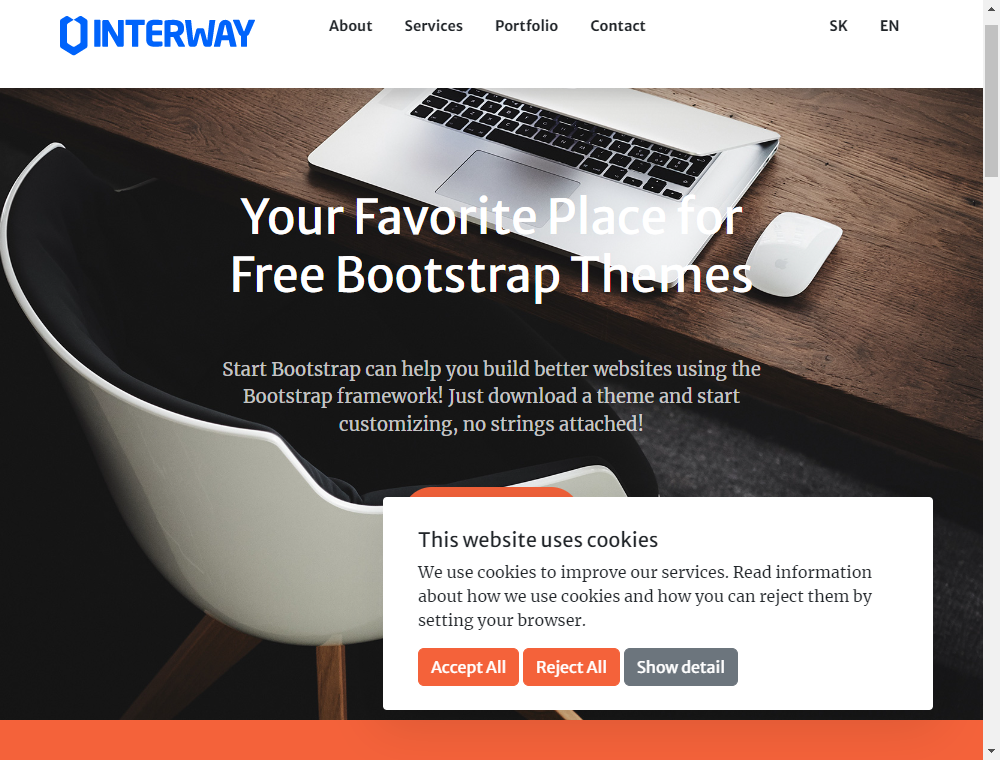
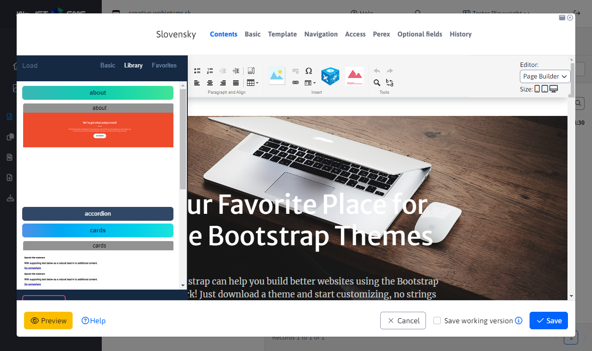
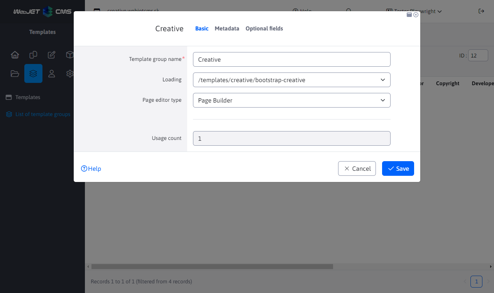
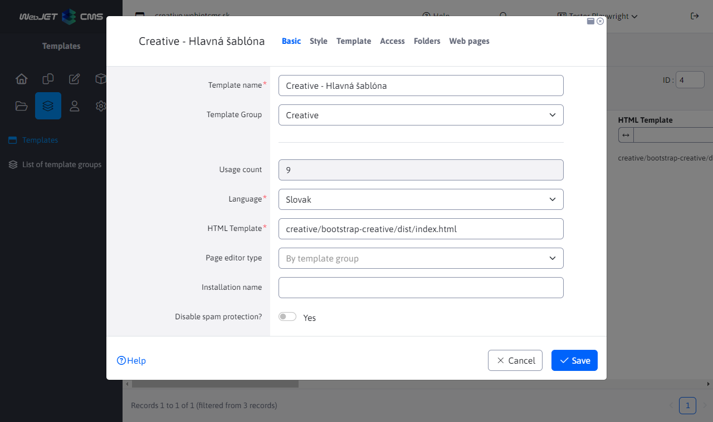
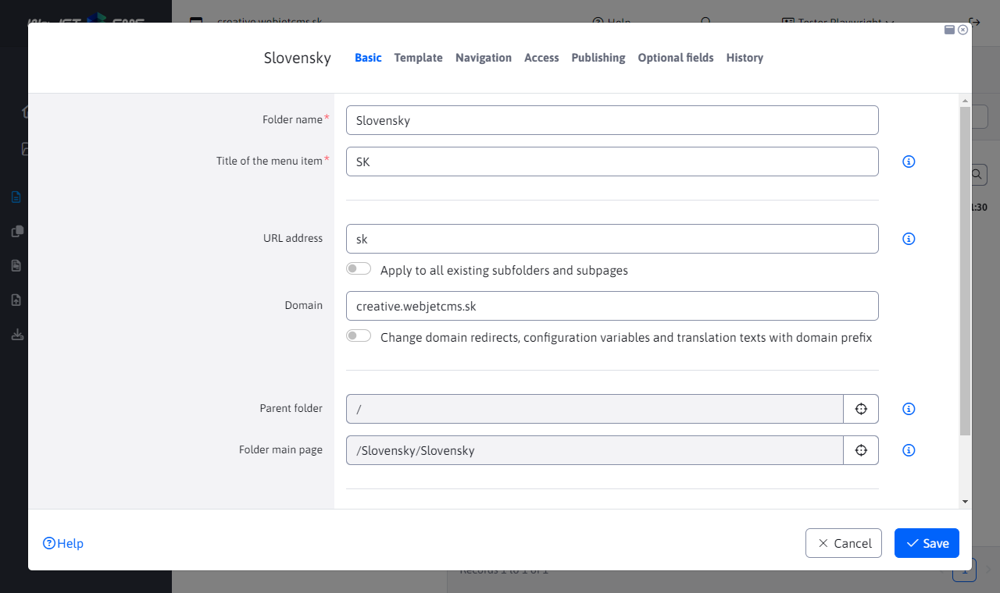
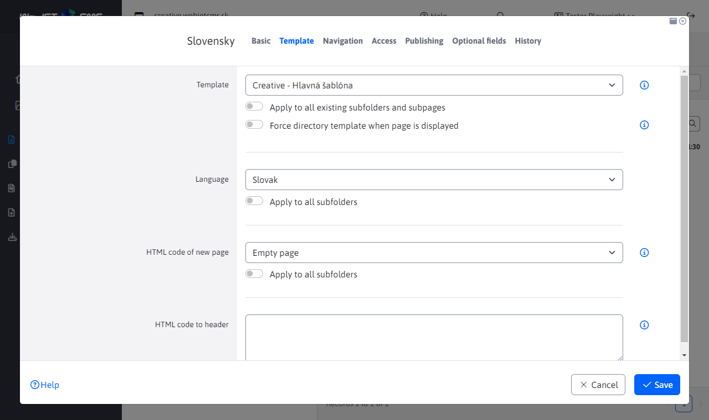

# Creative template

A basic one-page (```singlepage```) sample template for WebJET CMS using [Thymeleaf templates](http://docs.webjetcms.sk/v2022/#/frontend/thymeleaf/README) written in [PugJS](http://docs.webjetcms.sk/v2022/#/developer/frameworks/pugjs) format. It is based on [Start Bootstrap - Creative]().

You can get the template source code in the [WebJET CMS github repository](https://github.com/webjetcms/templates-creative).



## Use in WebJET CMS

The usage is the same as for [Bare template](../template-bare/README.md#použitie-vo-webjet-cms), the difference is of course in the names - everywhere replace ```bare``` with ```creative```. The folder with the template is ```src/main/webapp/templates/creative/bootstrap-creative/```, the paths used in the template and template group start with ```/templates/creative/bootstrap-creative/```.



### Template group

Follow the instructions for the Bare template with the modified path ```/templates/creative/bootstrap-creative/```.



### Template

Follow the instructions for the Bare template with the path modified to ```creative/bootstrap-creative/dist/index.html```. In the style tab, set the Main CSS style to ```/templates/creative/bootstrap-creative/dist/css/ninja.min.css```.



### Website structure

Follow the instructions for the Bare template.



In the Template tab:

- in the Website Template field, select ```Creative - Hlavná šablóna```



### Setting the header and footer

Follow the instructions for the Bare template. Since this is a single-page template, the prepared menu contains directly entered anchors (links). You can edit them, they are created as a bulleted list. Clicking on an existing name will display a window for setting the text and any link.

You can create a new link by clicking on an existing link, closing the link settings window by clicking Cancel, and then moving the cursor to the place where you want the new link. Press ```Enter``` to create a new bullet (even if it appears in a line) and type the text. Then select it and click the create link icon. Enter the URL address in the window (e.g. ```#mojblok```) and on the Advanced tab, enter the value ```nav-link``` in the Style Classes field.

You can set an ID for a block in the page editor (which you can then reference in the URL field in the menu) by clicking the gear icon in the blue block (section) and then selecting the pencil icon in the menu that appears. Click Advanced and in the Selector tab you can set the block ID (e.g. ```mojblok```).

## For the web designer

Follow the instructions for the Bare template, in Creative it also uses [Font Awesome](https://fontawesome.com). Copying its fonts is set in ```src/main/webapp/templates/creative/bootstrap-creative/node_scripts/render-assets.js``` and imported into CSS from the NPM module in ```src/main/webapp/templates/creative/bootstrap-creative/src/scss/ninja.scss```.