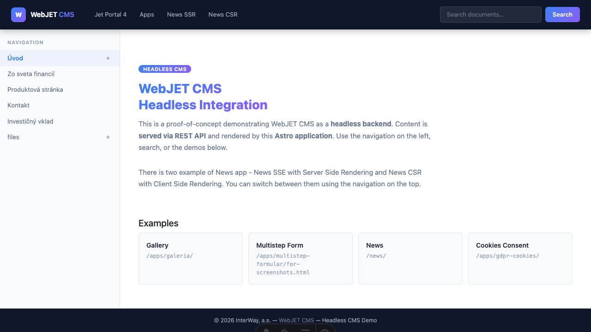
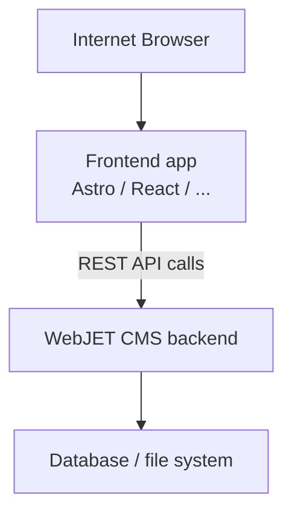
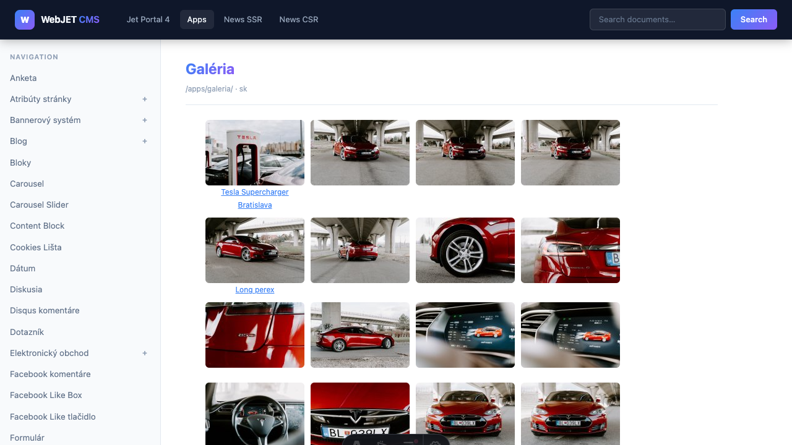

# Headless mode

WebJET CMS supports **headless** operation mode, in which it serves as a pure `backend` CMS. Content, navigation, search and forms are accessible via REST API. A frontend application (e.g. Astro, Next.js, Vue, React or any HTTP client) retrieves the data and displays it according to its own templates.



In one WebJET CMS, you can have multiple (dozens) domains and subsequently have smaller websites created in different technologies that consume and display content from the CMS system.

## How it works



- All REST services are available on the `/rest/headless/v1/` path.
- Authentication is handled via session cookies – the frontend must push cookies from the CMS back to the browser (`Set-Cookie` headers).

There are also applications implemented on the server side that can also be integrated. Typically, however, they require `jQuery/Bootstrap`, of course you can [program your own application](../../custom-apps/README.md) with the technology you use on the frontend.



## Configuration variables

Settings are configured in the WebJET CMS administration → **Settings → Configuration** (or in `conf/constants.properties`).

| Variable | Description | Example value |
| --- | --- | --- |
| `accessControlAllowOriginUrls` | Paths (URL patterns) for which the CORS header `Access-Control-Allow-Origin` is set. Separate with a comma. | `/rest/headless/*,/rest/*` |
| `accessControlAllowOriginValue` | Allowed origin domains for CORS. Can contain multiple values ​​separated by commas - the backend will automatically match based on the `Referer` request header. | `https://frontend.example.com` |
| `restAllowedIpAddresses` | IP addresses from which [public REST services] can be called (../../custom-apps/spring/public-services.md) | `127.0.0.1` |

If you don't want to allow all REST services, you can set the IP address permission only for headless mode REST services:

`txt
restAllowedIpAddresses - HeadlessPageRestController
restAllowedIpAddresses - HeadlessNewsRestController
restAllowedIpAddresses-HeadlessActionsRestController
`

set all to the IP address from which they will be called, for example `127.0.0.1`.

### CORS setup example

To allow the frontend application running on `https://frontend.example.com` to call the API, set:

```txt
accessControlAllowOriginUrls=/rest/*
accessControlAllowOriginValue=https://frontend.example.com
```

If you have multiple frontends (staging + production):

```txt
accessControlAllowOriginValue=https://frontend.example.com,https://staging.example.com
```

The backend automatically selects the correct value according to the `Referer` header of the incoming request.

## Security and XSRF

The backend checks the `Referer` header on POST requests (protection against XSRF attacks). The frontend must also send the `Referer` header from the actual browser request on server-side calls. In the sample Astro application, this is handled by the helper function `createFetchOptions(request)` in `src/lib/api.ts`.

For client (browser) calls, XSRF checking is not active, as `Referer` is sent by the browser itself.

## Frontend configuration

The frontend application is configured via a `.env` file (a uniform format for multiple frameworks).

### Setting up an API endpoint

Create a `.env` file in the root directory of the project:

```bash
# .env
PUBLIC_API_BASE=https://cms.iway.sk/rest/headless/v1
```

**Note:** The prefix `PUBLIC_` is required for Astro - it means that the variable will also be available in the browser. In client code it is obtained as:

```typescript
const apiBase = import.meta.env.PUBLIC_API_BASE;
```

### Configuration by environment

You can create multiple `.env` files:

- `.env` – default settings
- `.env.local` – local settings (will not be committed to Git)
- `.env.production` – production settings (if you build the frontend with `--mode production`)

Example `.env.example`:

```bash
# .env.example
# Headless CMS API endpoint (full path including /rest/headless/v1)
# Update this to match your Headless CMS server
PUBLIC_API_BASE=https://cms.example.com/rest/headless/v1

# Optional variables
#HEADLESS_PROXY_PREFIXES=/images/,/files/,/thumb/,/shared/,/components,/FormMailAjax.action,/rest/,/apps/form/mvc/
#HEADLESS_HOST=127.0.0.1
#HEADLESS_PORT=3000
#HEADLESS_HTTPS=true
#HEADLESS_HTTPS_CERT=./.cert/localhost.pem
#HEADLESS_HTTPS_KEY=./.cert/localhost-key.pem

# Disable SSL certificate verification for local development with self-signed certificates
#NODE_TLS_REJECT_UNAUTHORIZED=0
```

## Proxy for static content

The frontend application usually also needs to serve images, files and `/thumb` directly from the CMS backend. We recommend configuring a reverse proxy for the prefixes:

```txt
/images/
/files/
/thumb/
/shared/
/components/
/rest/
```

In the sample Astro application, the proxy is configured automatically in `astro.config.mjs`:

- **Backend origin is calculated automatically** from `PUBLIC_API_BASE` (by removing `/rest/headless/v1`).

Other available variables in the `.env` file:

| variable | Description | Default value |
| --- | --- | --- |
| `PUBLIC_API_BASE` | Full path to Headless API | `https://cms.example.com/rest/headless/v1` |
| `HEADLESS_PROXY_PREFIXES` | URL prefixes that are proxied to the backend | `/images/,/files/,/thumb/,/shared/,/components,/FormMailAjax.action,/rest/,/apps/form/mvc/` |
| `HEADLESS_HOST` | The host on which the frontend server is listening. | `127.0.0.1` |
| `HEADLESS_PORT` | Frontend port | `3000` |
| `HEADLESS_HTTPS` | Enable HTTPS for frontend server (`true`/`false`) | `false` |
| `HEADLESS_HTTPS_CERT` | SSL certificate path (PEM) | `./.cert/localhost.pem` |
| `HEADLESS_HTTPS_KEY` | SSL key path (PEM) | `./.cert/localhost-key.pem` |

## Other resources

- [List of REST services](services.md)
- [Sample Astro application](example.md)
