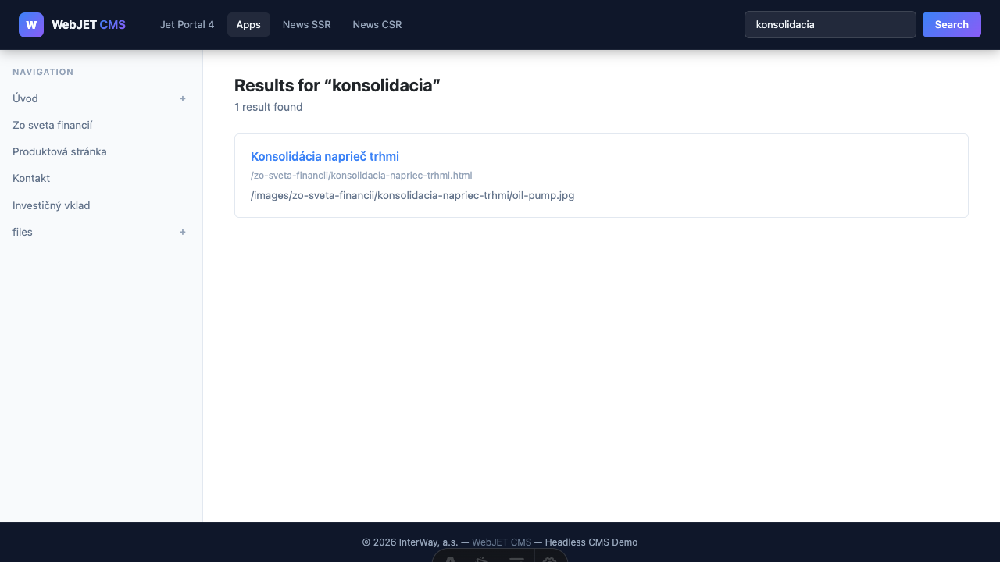
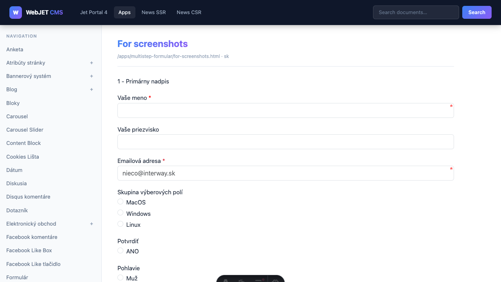

# Sample headless application (Astro)

The directory [docs/examples/headless-astro/](https://github.com/webjetcms/webjetcms/tree/main/docs/examples/headless-astro) contains a complete sample application built on the **[Astro 7](https://astro.build) ** framework, which demonstrates headless integration with WebJET CMS.


## Technologies

- ** Astro 7** – SSR (server-side rendering) framework
- **Bootstrap 5** – CSS framework
- **TypeScript** – typed JavaScript
- **Node.js** – runtime environment for the server

## Launch

```bash
cd docs/examples/headless-astro
npm install
npm run dev
```

The application runs on `http://localhost:3000` by default. The CMS backend and other settings are configured via the `.env` file in the project directory. Copy `.env.example` as a base:

```bash
cd docs/examples/headless-astro
cp .env.example .env
```

Modify `.env` according to your installation:

```bash
# Headless CMS API endpoint (full path including /rest/headless/v1)
# Update this to match your Headless CMS server
PUBLIC_API_BASE=https://cms.example.com/rest/headless/v1

#Optional variables
#HEADLESS_PROXY_PREFIXES=/images/,/files/,/thumb/,/shared/,/components,/FormMailAjax.action,/rest/,/apps/form/mvc/
#HEADLESS_HOST=127.0.0.1
#HEADLESS_PORT=3000
#HEADLESS_HTTPS=true
#HEADLESS_HTTPS_CERT=./.cert/localhost.pem
#HEADLESS_HTTPS_KEY=./.cert/localhost-key.pem

# Disable SSL certificate verification for local development with self-signed certificates
#NODE_TLS_REJECT_UNAUTHORIZED=0
```

## HTTPS mode in local development

If the backend sends a session cookie with the `Secure` flag, the frontend must run on HTTPS, otherwise the browser will discard the cookie.

### 1. Generating a self-signed certificate

```bash
cd docs/examples/headless-astro
npm run cert:generate
```

This command will create the files:

- `.cert/localhost.pem`
- `.cert/localhost-key.pem`

### 2. Enabling HTTPS in `.env`

In the file `.env` add (or uncomment):

```bash
HEADLESS_HTTPS=true
HEADLESS_HTTPS_CERT=./.cert/localhost.pem
HEADLESS_HTTPS_KEY=./.cert/localhost-key.pem
```

### 3. Running Astro Server via HTTPS

```bash
cd docs/examples/headless-astro
npm run dev:https
```

The frontend then runs at the address `https://127.0.0.1:3000` (or `HEADLESS_HOST` and `HEADLESS_PORT`).

### Notes

- With a self-signed certificate, a security warning in the browser is common when the page is opened for the first time.
- For Astro 7, use Node.js version at least `22.12.0`.

## Project structure

```txt
src/
  lib/
    api.ts         – TypeScript klient pre všetky headless REST endpointy
  layouts/
    Layout.astro   – Spoločný layout s navigáciou a search boxom
  middleware.ts      – Smerovanie CMS stránok: presmerovania 404 na /cms/[...slug]
  pages/
    index.astro        – Domovská stránka
    cms/
      [...slug].astro  – CMS renderer (obsah z CMS podľa URL, volaný cez middleware)
    news.astro         – Novinky (server-side rendering)
    news-client.astro  – Novinky (client-side rendering, volanie z browsera)
    search.astro       – Fulltext vyhľadávanie
  styles/
    global.css     – Globálne CSS štýly
```

## Sites and their functions

### `/` – Home page (`index.astro`)


Displays the start page with:

- Welcome section with a description of the headless demo
- Tabbed links to previews (news, search)
- Dynamic list of top navigation items from CMS

Uses API: `getNavigation()`

---

### Dynamic CMS pages (`cms/[...slug].astro` + `middleware.ts`)


Content from the CMS is served by a combination of middleware and CMS render:

- **`middleware.ts`** catches every 404 response from dedicated pages and rewrites the URL to `/cms/render?path=<originálna-cesta>&query=<pôvodné-parametre>` (Astro internal `rewrite`). The path is sent to the CMS API without URL parameters to correctly find the page; the original parameters remain available to the renderer.
- **`cms/[...slug].astro`** is a CMS renderer – it reads the parameter `path`, calls the API `GET /rest/headless/v1/pages/by-path?path=<cesta>` and displays the HTML content.

The CMS catch-all is intentionally placed under `/cms/`, not in the root `pages/`. This way it doesn't overwrite dedicated pages (e.g. `/news`, `/search`) and Astro will correctly display the actual error when a dedicated page fails to compile (without silent fallback to the CMS).

Features:

- Automatic fallback to 404 if the page does not exist in the CMS
- SEO meta tags (`<title>`, `<meta description>`) from the SEO metadata of the page
- Navigation loaded from CMS
- Sending `Set-Cookie` headers (session cookies) to the browser

Uses API: `getPage()`, `getNavigation()`

---

### `/news` – SSR News (`news.astro`)


Server-side rendered list of news from the group with ID `24`. Rendering is done on the server with each request (Astro SSR).

Features:

- Displays a thumbnail image of the news (if set)
- Displays the text.
- Displays labels by `perexGroups` (e.g. `Investície`, `Podnikanie`)
- Link to news detail

Uses API: `listNews()` (POST `/rest/headless/v1/news`), `getNavigation()`

**Example of news configuration:**

```typescript
const NEWS_GROUP_ID = 24;
const NEWS_PAGE_SIZE = 10;

await listNews({
  groupIds: [NEWS_GROUP_ID],
  publishType: 'new',
  order: 'date',
  ascending: false,
  pageSize: NEWS_PAGE_SIZE,
  offset: 0,
}, Astro.request);
```

---

### `/news-client` - ​​CSR News (`news-client.astro`)


Client-side rendered news list. The HTML page loads empty and the JavaScript in the browser calls the API directly from the browser.

Features:

- API call from the client side (fetch from browser)
- DOM manipulation without `innerHTML` (safe HTML generation)
- Display loading status while loading
- Display error message on failure

Uses API: `POST /rest/headless/v1/news` (called directly from the browser)

> Note: For client-side calls, the backend must have a CORS policy configured in the `accessControlAllowOriginValue` configuration variable. For example:

```txt
{HTTP_PROTOCOL}://{SERVER_NAME}:{HTTP_PORT}
http://headless.example.com:3000,https://headless.example.com:8443
```

---

### `/search` – Search (`search.astro`)



Server-side fulltext search via CMS. Results are displayed immediately after submitting the search form.

Features:

- Search by entered term from URL parameter `?q=`
- Results pagination
- Display the number of results found
- Snippet with context of the found text
- "No results" status and empty status (no entered term)

Uses API: `search()` (GET `/rest/headless/v1/actions/search`), `getNavigation()`

---

## Layout (`Layout.astro`)

The common layout for all pages includes:

- Left panel with navigation loaded from CMS
- Search box in the header (sends to `/search?q=...`)
- Bootstrap 5 CSS
- Global CSS styles
- `<title>` and meta tag management

---

## API client (`src/lib/api.ts`)

A central TypeScript file that wraps all headless REST calls. The key feature is the `createFetchOptions(request)` function, which:

1. Moves the `Cookie` header from the incoming request to the backend (session preservation)
2. Moves the `Referer` header (protection against XSRF rejection from the backend)

```typescript
import { getPage, getNavigation, search, listNews } from '../lib/api';
```

### Available features

| Function | Endpoint | Description |
| --- | --- | --- |
| `getPage(path, lng?, request?)` | GET `/pages/by-path` | Loads page content |
| `getNavigation(request?, rootPath?, rootGroupId?, depth?)` | GET `/navigation` | Loads the navigation tree |
| `search(query, request?, page?, size?)` | GET `/actions/search` | Full-text search |
| `listNews(request, request_?)` | POST `/news` | Loads the news list |

---

## Proxy configuration (`astro.config.mjs`)

The configuration automatically proxies requests for images, `/thumb`, files, and REST APIs to the CMS backend. This allows the frontend application to serve all content from a single domain and avoids CORS issues for static files.

```txt
// Prefixy, ktoré sa presmerujú na CMS backend
/images/, /files/, /thumb/, /shared/, /components, /FormMailAjax.action, /rest/, /apps/form/mvc/
```



## Server deployment (Node.js)

The sample is set to SSR mode with a Node adapter (`@astrojs/node`) and runs as a Node server in production.

### 1. Build the application

```bash
cd docs/examples/headless-astro
nvm use 22.12
npm ci
npm run build
```

### 2. Launching the production server

```bash
cd docs/examples/headless-astro
npm run start
```

Script `start` runs `node ./dist/server/entry.mjs`.

### 3. Environment variables for production

At a minimum, set:

```bash
PUBLIC_API_BASE=https://cms.vasadomena.sk/rest/headless/v1
HEADLESS_HOST=0.0.0.0
HEADLESS_PORT=3000
```

Production recommendation:

- Do not leave `NODE_TLS_REJECT_UNAUTHORIZED=0` on.
- Put a reverse proxy server (e.g. Nginx/Apache) in front of the Node server and terminate TLS on 443.

## Deploying to Vercel or Cloudflare

For these platforms, change the Astro adapter according to the deployment target.

### Vercel

1. Install the adapter:

```bash
npm install @astrojs/vercel
```

1. In `astro.config.mjs`, change the import and adapter configuration:

```javascript
import vercel from '@astrojs/vercel';

export default defineConfig({
  output: 'server',
  adapter: vercel(),
  // ...ostatná konfigurácia
});
```

1. Deploy is handled by the Vercel build pipeline, local `npm run start` is no longer needed.

### Cloudflare (Workers)

1. Install the adapter:

```bash
npm install @astrojs/cloudflare
```

1. In `astro.config.mjs`, change the import and adapter configuration:

```javascript
import cloudflare from '@astrojs/cloudflare';

export default defineConfig({
  output: 'server',
  adapter: cloudflare(),
  // ...ostatná konfigurácia
});
```

1. Then you deploy as a Cloudflare Worker (typically via `wrangler`).

Note: When changing adapters, keep `output: 'server'`, but always use only one adapter per target platform.
