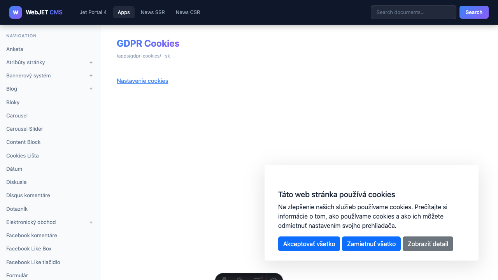

# Headless REST services

All services are available under the basic route:

```txt
/rest/headless/v1/
```

Responses are in JSON format. Error responses have the following structure:

```json
{
  "status": 404,
  "error": "Not Found",
  "message": "Page not found: /neexistujuca-stranka"
}
```

---

## Pages

### GET `/rest/headless/v1/pages/by-path`

Returns the content of the page according to its virtual path.


**Parameters (query string):**

| Parameters | Mandatory | Description |
| --- | --- | --- |
| `path` | yes | Virtual path of the page, e.g. `/about-us` |
| `lng` | no | Language code (e.g. `en`). If not specified, the domain's default language will be used. |
| `preview` | no | `true` = preview unpublished version (requires admin session) |

**Example call:**

```bash
curl "https://cms.example.com/rest/headless/v1/pages/by-path?path=/o-nas"
```

**Answer:**

```json
{
  "docId": 42,
  "title": "O nás",
  "virtualPath": "/o-nas",
  "language": "sk",
  "body": "<h1>O nás</h1><p>Text stránky...</p>",
  "seo": {
    "metaTitle": "O nás – Firma s.r.o.",
    "metaDescription": "Krátky popis stránky pre vyhľadávače.",
    "metaKeywords": "firma, o nás",
    "canonicalUrl": "https://cms.example.com/o-nas",
    "robots": "index, follow"
  }
}
```

The `body` field contains the complete HTML body of the page, including all WebJET components (news, forms, …) as it would be displayed in classic mode. The frontend can insert it directly into the DOM or use only parts of it.

---

### GET `/rest/headless/v1/preview/pages/by-id`

Returns page content according to `docId` (document ID). Intended for CMS editor - preview before publishing.

**Parameters:**

| Parameters | Mandatory | Description |
| --- | --- | --- |
| `docId` | yes | Document ID |
| `lng` | no | Language code |

---

## Navigation

### GET `/rest/headless/v1/navigation`

Returns the navigation tree structure.

**Parameters:**

| Parameters | Mandatory | Description |
| --- | --- | --- |
| `rootPath` | no | Virtual path of the root group, e.g. `/` |
| `rootGroupId` | no | Group ID - alternative to `rootPath` |
| `depth` | no | Maximum depth (0 = unlimited, default 0) |
| `lng` | no | Language code |

**Example call:**

```bash
curl "https://cms.example.com/rest/headless/v1/navigation?rootPath=/&depth=2"
```

**Answer:**

```json
[
  {
    "docId": 10,
    "title": "Domov",
    "virtualPath": "/",
    "language": "sk",
    "level": 0,
    "hasChildren": true,
    "children": [
      {
        "docId": 11,
        "title": "O nás",
        "virtualPath": "/o-nas",
        "level": 1,
        "hasChildren": false
      }
    ]
  }
]
```

---

## News

### POST `/rest/headless/v1/news`

Returns a paginated list of news items. Uses POST for a more complex input structure.


**Content-Type:** `application/json`

**Request body (HeadlessNewsRequest):**

```json
{
  "groupIds": [24],
  "alsoSubGroups": false,
  "publishType": "new",
  "order": "date",
  "ascending": false,
  "paging": false,
  "pageSize": 10,
  "offset": 0,
  "perexNotRequired": false,
  "loadData": false,
  "checkDuplicity": false,
  "perexGroup": [],
  "perexGroupNot": []
}
```

| Field | Type | Description |
| --- | --- | --- |
| `groupIds` | `number[]` | **Required.** List of newsgroup IDs |
| `alsoSubGroups` | `boolean` | Include subgroups (default `false`) |
| `publishType` | `string` | Publishing filter: `new` = current, `old` = archive (expired), `all` = all, `next` = future, `valid` = current including end date |
| `order` | `string` | Sorting: `date`, `title`, `priority`, `id` |
| `ascending` | `boolean` | `true` = ascending, `false` = descending |
| `paging` | `boolean` | Enable pagination (default `false`) |
| `pageSize` | `number` | Number of items per page |
| `offset` | `number` | Offset (record number from 0) |
| `perexNotRequired` | `boolean` | Include news without perex |
| `loadData` | `boolean` | Load the full HTML body of the news (`htmlData`) |
| `checkDuplicity` | `boolean` | Duplicate check |
| `perexGroup` | `number[]` | Filter by peroxide groups (inclusion) |
| `perexGroupNot` | `number[]` | Filter by peroxide groups (exclusion) |

**Answer:**

```json
{
  "items": [
    {
      "docId": 101,
      "title": "Nová novinka",
      "virtualPath": "/novinky/nova-novinka",
      "language": "sk",
      "perexImage": "/images/novinky/foto.jpg",
      "perexGroups": [1, 2],
      "htmlData": "Krátky perex text...",
      "publishStart": "2026-07-01T10:00:00",
      "groupId": 24,
      "available": true
    }
  ],
  "page": 1,
  "size": 10,
  "totalElements": 42,
  "totalPages": 5
}
```

The Headless News API now only allows loading of directories configured in the `newsAdminGroupIds` variable and their subdirectories, preventing loading of news from disallowed directories.

---

## Search

### GET `/rest/headless/v1/actions/search`

Full-text search in documents.


**Parameters:**

| Parameters | Mandatory | Description |
| --- | --- | --- |
| `q` | yes | Search term |
| `page` | no | Page number (0-based, default 0) |
| `size` | no | Number of results per page (default 20, max 100) |
| `scope` | no | Search restriction (optional) |
| `lng` | no | Language code |

**Example call:**

```bash
curl "https://cms.example.com/rest/headless/v1/actions/search?q=produkt&page=0&size=20"
```

**Answer:**

```json
{
  "items": [
    {
      "docId": 55,
      "title": "Produkt XY",
      "virtualPath": "/produkty/produkt-xy",
      "language": "sk",
      "perex": "/images/news/produkt-xy.jpg",
      "snippet": "...text so zvýrazneným produktom..."
    }
  ],
  "page": 0,
  "size": 20,
  "totalElements": 3,
  "totalPages": 1
}
```

---

## Sending cookies

Most services return a header (e.g. session ID) in the `Set-Cookie` response. The frontend must pass this header to the browser to maintain session state (login, language settings, ...).



Example in Astro (server-side):

```typescript
const result = await getPage('/o-nas', undefined, Astro.request);
const setCookie = result.headers.get('set-cookie');
if (setCookie) {
  Astro.response.headers.append('Set-Cookie', setCookie);
}
```

---

## TypeScript types (lib/api.ts)

The sample Astro application includes a ready-made TypeScript client in `docs/examples/headless-astro/src/lib/api.ts` with all types and functions for each endpoint. You can copy it into your project.
