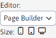

# Blocks

Page Builder also includes the ability to insert ready-made blocks. Their list is automatically loaded from the ```/templates/INSTALL_NAME/skupina_sablon/menosablony/pagebuilder``` directory. **We always recommend preparing a set of blocks for the template.**

In the root directory for blocks, you can have the following subdirectories:

- ```section``` - ​​for section blocks (blue marking in Page Builder)
- ```container``` - ​​for containers (red marking in Page Builder)
- ```column``` - ​​for columns (green marking in Page Builder)
- ```content``` - ​​for inserting various texts, buttons, etc. They are inserted using the Blocks icon and the yellow line that appears between the blocks.

In each of these subdirectories, you need to create **block groups as additional subdirectories**, e.g. ```Contact, Features```. Only in these subdirectories do you create individual HTML blocks. An example of this is the directory structure:

```java
- section
  - Contact
    - contact01.html
    - contact01.jpg
    - form.html
    - form.jpg
  - Features
    - promo.html
    - promo.jpg
    - pricelist.html
    - pricelist.jpg
- container
  - Teams
    - teams01.html
    - teams01.jpg
    - teams02.html
    - teams02.jpg
- column
  - Text-With-Picture
    - left.html
    - left.jpg
    - right.html
    - right.jpg
- content
  - Buttons
    - standard.html
    - big.jpg
    - contactus.html
```

## Block name and tags

If you want to have a nice block name in the block list, you can create a file `pagebuilder.properties` in the encoding `utf-8` in the corresponding subdirectory of the block group (e.g. in `section/Contact/pagebuilder.properties`). In it, you can define the block group name, icon and search tags:

```properties
title=Základné prvky
icon=fa fa-cubes
tags=Základné prvky
title.Citat_v1=Citát v1
title.Citat_v2=Citát v2
```

You can also create language versions of the file, e.g. `pagebuilder_en.properties`.

If you are using the `pug` format, check/add the condition in the `build-pug.js` file so that the `.properties` file for blocks is also transferred:

```javascript
  } else if (
    (filePath.match(/\.png$/) || filePath.match(/\.properties$/))
    && filePath.match(/pagebuilder/)
  )
```

## Setting column widths

The editor allows you to set column widths according to the selected device. In the toolbar next to the editor type switch, there is an option to set the device size (width).



- Desktop - is intended for a width greater than/equal to 1200 points (sets the CSS class ```col-xl```).
- Tablet - is designed for a width of 768-1199 points (sets the CSS class ```col-md```)
- Mobile - is intended for widths less than 768 points (sets CSS class ```col-```)

The correct block setup includes all widths preset, e.g. `col-12 col-md-6 col-xl-3`:

```html
<section>
  <div class="container">
    <div class="row">
      <div class="col-12">
        <h2 class="text-center">Etiam orci</h2>
      </div>
    </div>
    <div class="row">
      <div class="col-12 col-md-6 col-xl-3 text-center">
        <p class="text-center">
          
        </p>
        <h3>Etiam orci</h3>
        <p>Suspendisse interdum dolor justo, ac venenatis massa suscipit nec. Vivamus dictum malesuada mollis.</p>
      </div>
      <div class="col-12 col-md-6 col-xl-3  text-center">
        <p class="text-center">
          
        </p>
        <h3>Aenean </h3>
        <p>Aliquam elementum ut ante vitae dapibus. Interdum et malesuada fames ac ante ipsum primis in faucibus.</p>
      </div>
      <div class="col-12 col-md-6 col-xl-3  text-center">
        <p class="text-center">
          
        </p>
        <h3>Maecenas</h3>
        <p>Sed sollicitudin eros quis leo imperdiet, id congue lorem ornare. Suspendisse eleifend at ante id ultrices.</p>
      </div>
      <div class="col-12 col-md-6 col-xl-3  text-center">
        <p class="text-center">
          
        </p>
        <h3>Suspendisse</h3>
        <p>Nullam ornare, magna in ultrices mattis, lectus neque mollis libero, vitae varius mauris metus a risus.</p>
      </div>
    </div>
  </div>
</section>
```

## Thymeleaf code support

It is important to note that blocks are inserted into the page without executing the Thymeleaf code (technically, the code is inserted directly from the html file into the editor). However, the following thymeleaf attributes are currently supported when inserting:

- ```data-iwcm-write``` - ​​for application embedding support
- ```data-iwcm-remove``` - ​​for application embedding support
- ```data-th-src``` - ​​inserting an image
- ```data-th-href``` - ​​inserting a link

At the same time, the following ninja objects are executed during insertion (written, for example, as ```src="./assets/images/logo.png" data-th-src="${ninja.temp.basePathImg}logo.png"```):

- ```${ninja.temp.basePath}```
- ```${ninja.temp.basePathAssets}```
- ```${ninja.temp.basePathCss}```
- ```${ninja.temp.basePathJs}```
- ```${ninja.temp.basePathPlugins}```
- ```${ninja.temp.basePathImg}```

If you need other Thymeleaf tags for your work, you can send us a request via the Feedback function on the administration homepage.

## Generating preview images

Note that for each HTML block there is also an image with the same name. If it exists, it will appear in the Page Builder in the list of blocks as the block image. Images can be prepared manually, but can also be generated automatically by calling the ```/components/grideditor/phantom/generator.jsp``` script.

The script inserts individual blocks into the specified JSP template simulating the specified ```docid``` and creates screenshots. It requires the installed program [PhantomJS](https://phantomjs.org) and the path to the directory where ```grideditorPhantomjsPath``` is installed in the configuration variable ```PhantomJS```.

## Common blocks

Unfortunately, there is currently no option to nest blocks. There may be a requirement to insert a ```section``` block containing a certain ```container``` block, while it is necessary to be able to insert the same ```container``` block separately. In this case, there is a duplication of HTML code of blocks in both the ```section``` and ```container``` directories.

We recommend generating blocks using [PugJS](https://pugjs.org).

## CSS classes for an image

If the image has the CSS class ```fixedSize-w-h-ip``` set, the specified dimensions ```w``` and ```h``` are automatically set after changing the image address, if the last data ```ip``` is also specified, the [point of interest](../../frontend/thumb-servlet/README.md) is also set. For example, the CSS class ```fixedSize-160-160-5``` automatically generates an image of size 160 x 160 pixels with a set point of interest of 5. We recommend setting the class to all illustrative images where their size is important.

### Extended fixedSize format

The CSS class format is ```fixedSize-w-h-ip[-color][-true]``` where:

| Parameters | Mandatory | Description |
| ----------- | --------- | ------- |
| `w` | Yes | Image width in pixels |
| `h` | Yes | Image height in pixels |
| `ip` | Yes | Point of Interest Mode (1-5) |
| `color` | No | Hex value of the background color without `#` and without `c` prefix (e.g. `ff0000`) |
| `true` | No | Parameter for disabling a point of interest |

#### Format examples

| Format | Meaning |
| -------- | -------- |
| ```fixedSize-700-400-1``` | Basic format with width 700, height 400 and IP mode 1 |
| ```fixedSize-700-400-3-ff0000'' | With background color (red) |
| ```fixedSize-700-400-1-true'' | With POI turned off |
| ```fixedSize-700-400-3-ff0000-true'' | With background color and POI turned off |

When clicking on an image with the CSS class ```fixedSize/w-100/autoimg```, the image properties window will immediately open for easy replacement. This way, the editor does not have to click on the image and then click the change image icon in the toolbar.

If an image contains the expression `placeholder` or `stock` in the URL, the image selection dialog will not open to the folder containing that image, but to the Media folder of this page. This allows the user to easily upload a new image.

## Card support

For convenient editing of cards (```tabs```), their automatic generation from HTML structure is supported. Each card is represented by a container. Containers can be easily duplicated and moved, cards are automatically generated from their content.

The ```UL``` element needs to be marked with the CSS class ```pb-autotabs```. The JavaScript code in the ```/admin/webpages/page-builder/scripts/pagesupport.js``` file will generate cards after adding the / element every 5 seconds. The card name is taken from the ```title``` container attribute, or from an element with the CSS class ```pb-tab-title``` (which is more convenient for editing).

The cards themselves are not editable, they are generated automatically. Only the content of the ```tab``` container is editable. Note that in the sample code, the UL element does not contain any ```LI taby```, they are generated automatically. They will subsequently remain generated in the HTML code and will also be saved correctly. The card will remain displayed on the page as it was displayed during editing (this is something to keep in mind).

The ID attributes of individual cards are generated automatically based on the card name. If you need to use a specific name, you can set the value `data-title` on the `.tab-pane` element in the HTML code.

Note the use of the CSS class ```pb-not-container``` on the main container element. This ensures that this element is not marked as a container and that individual tabs are considered containers. Each tab uses the CSS class ```pb-custom-container```, which ensures that the red frame/toolbar of the container is displayed.

When you select the tab move option (in the container toolbar), all tabs are automatically displayed so that you can easily mark the tab where to move it. This is provided by the Page Builder CSS style.

Sample block code (in the ```section``` directory):

```html
<section>
   <div class="container pb-not-container">

         <div class="tabsBox">
            <ul class="nav nav-tabs pb-autotabs"></ul>
         </div>

         <div class="tab-content">
           <div class="tab-pane fade active show pb-custom-container">
             <div class="row">
                <div class="col-12 pb-col-12 pb-tab-title">
                  <h3>Tab 1</h3>
               </div>
               <div class="col-12 pb-col-12">
                  <p>Text 1</p>
               </div>

             </div>

           </div>

           <div class="tab-pane fade pb-custom-container">
             <div class="row">
                <div class="col-12 pb-col-12 pb-tab-title">
                  <h3>Tab 2</h3>
               </div>
               <div class="col-12 pb-col-12">
                  <p>Text 2</p>
               </div>

             </div>
           </div>

           <div class="tab-pane fade pb-custom-container">
             <div class="row">
                <div class="col-12 pb-col-12 pb-tab-title">
                  <h3>Tab 3</h3>
               </div>
               <div class="col-12 pb-col-12">
                  <p>Text 3</p>
               </div>

             </div>
           </div>
         </div>

   </div>
 </section>
```

## Accordion support

```Accordion``` pracuje podobne ako karty, Page Builder zabezpečí korektné vygenerovanie potrebných atribútov a ich automatickú obnovu pri zduplikovaní položky ```accordion-u```. Funkčnosť je napojená na CSS triedu ```pb-autoaccordion``` a implementovaná podobne ako pre karty. Podobne sa používajú aj kontajnery.

Ukážkový kód:

```html
<section>
  <div class="container pb-not-container pb-autoaccordion">

    <h2 class="text-center pb-editable">Nadpis nad accordionom</h2>

    <div class="card pb-custom-container">
      <div class="card-header">
        <a class="accordionLink" data-toggle="collapse">
          <div class="pb-editable">
            <p>Nadpis accordionu 1</p>
          </div>
        </a>
      </div>
      <div class="collapse">
        <div class="card-body">
          <div class="row">
            <div class="pb-col-12">
              <p>Text accodrionu 1</p>
            </div>
          </div>
        </div>
      </div>
    </div>

    <div class="card pb-custom-container">
      <div class="card-header">
        <a class="accordionLink" data-toggle="collapse">
          <div class="pb-editable">
            <p>Nadpis accordionu 2</p>
          </div>
        </a>
      </div>
      <div class="collapse">
        <div class="card-body">
          <div class="row">
            <div class="pb-col-12">
              <p>Text accodrionu 2</p>
            </div>
          </div>
        </div>
      </div>
    </div>

  </div>
</section>
```

## Accordion cards

When requesting the nesting of card-type objects into ```accordion-u```, it is possible to use the Page Builder property - it also indicates **nested containers**. It is necessary to consider what will be editable, how to duplicate individual items, etc. In practice, inserting cards into ```accordion-ov``` (which is a container) works like inserting another ```columnu``` into the container (whereas the inserted ```column``` further contains nested containers of individual cards).

In the example, note that the main ```column``` has the CSS style ```pb-not-editable``` so that it is automatically not editable by the CK editor and also the CSS class ```pb-always-mark```. A non-editable column is not marked with a green frame by default, but without this option it would not be possible to add another column after the tabs, or delete entire tabs (the column tools would not be available).

When inserting HTML code containing the expression ```container``` as a column object, ```PageBuilder.mark_grid_elements();``` is executed to mark all elements (so that toolbars are displayed even for nested containers).

Sample accordion card code (in the column directory):

```html
<div class="col-12 pb-not-editable pb-always-mark">
   <div class="tabsBox" role="tablist">
      <ul class="nav nav-tabs pb-autotabs"></ul>
   </div>

   <div class="tab-content">
      <div class="tab-pane fade active show pb-custom-container">
         <div class="row">
            <div class="col-12 pb-tab-title">
               <h3>Tab 1</h3>
            </div>
            <div class="col-12">
               <p>Tab text 1</p>
            </div>

         </div>
      </div>

      <div class="tab-pane fade pb-custom-container">
         <div class="row">
            <div class="col-12 pb-tab-title">
               <h3>Tab 2</h3>
            </div>
            <div class="col-12">
               <p>Tab text 2</p>
            </div>
         </div>
      </div>
   </div>

</div>
```

After insertion, the web page will have a structure like this:

```html
<section>
  <div class="container pb-not-container pb-autoaccordion">

    <h2 class="text-center pb-editable">Nadpis nad accordionom</h2>

    <div class="card pb-custom-container">
      <div class="card-header">
        <a class="accordionLink" data-toggle="collapse">
          <div class="pb-editable">
            <p>Nadpis accordionu 1</p>
          </div>
        </a>
      </div>
      <div class="collapse">
        <div class="card-body">
          <div class="row">
            <div class="pb-col-12">
              <p>Text accodrionu 1</p>
            </div>

            <div class="col-12 pb-not-editable pb-always-mark">
              <div class="tabsBox" role="tablist">
                  <ul class="nav nav-tabs pb-autotabs"></ul>
              </div>
              <div class="tab-content">
                  <div class="tab-pane fade active show pb-custom-container">
                    <div class="row">
                        <div class="col-12 pb-tab-title">
                          <h3>Tab 1</h3>
                        </div>
                        <div class="col-12">
                          <p>Tab text 1</p>
                        </div>
                    </div>
                  </div>
                  <div class="tab-pane fade pb-custom-container">
                    <div class="row">
                        <div class="col-12 pb-tab-title">
                          <h3>Tab 2</h3>
                        </div>
                        <div class="col-12">
                          <p>Tab text 2</p>
                        </div>
                    </div>
                  </div>
              </div>

            </div>

          </div>
        </div>
      </div>
    </div>

  </div>
</section>
```

## Menu support

PageBuilder can generate menu items into bootstrap menu, this is provided by the `pbAutoMenu` function in `pagesupport.js`. It generates menu items into `ul.pb-automenu` from all `section` elements in the web page. It works as follows:

- `section.pb-not-automenu` is omitted from the list.
- The name of the menu item is taken from:
  - element with CSS style `.section-title`
  - if not found, it is taken from the `h1` element
  - if not found, the attribute `title` on the `section` element is taken
- If the section does not have the `id` attribute set, it is set according to the section's serial number.

Items `li.nav-item` to `ul.pb-automenu` will be generated from the found data.

Sample menu block:

```html
<section class="pb-not-automenu">
    <div class="container pb-not-container md-tabs">
        <nav class="navbar navbar-expand-lg navbar-light bg-light">
            <div class="container-fluid">
                <a class="navbar-brand" href="#">Navbar</a>
                <button class="navbar-toggler" type="button" data-bs-toggle="collapse" data-bs-target="#navbarNav"
                    aria-controls="navbarNav" aria-expanded="false" aria-label="Toggle navigation">
                    <span class="navbar-toggler-icon"></span>
                </button>
                <div class="collapse navbar-collapse" id="navbarNav">
                    <ul class="navbar-nav pb-automenu">
                        <li class="nav-item">
                            <a class="nav-link active" aria-current="page" href="#">Home</a>
                        </li>
                        <li class="nav-item">
                            <a class="nav-link" href="#">Features</a>
                        </li>
                        <li class="nav-item">
                            <a class="nav-link" href="#">Pricing</a>
                        </li>
                        <li class="nav-item">
                            <a class="nav-link disabled" href="#" tabindex="-1" aria-disabled="true">Disabled</a>
                        </li>
                    </ul>
                </div>
            </div>
        </nav>
    </div>
</section>
```

In the example, the `Home, Features, Pricing a Disabled` elements are replaced with content in the PageBuilder page. The content is automatically updated when a section is added, deleted, or moved on the web page. The title is updated every 5 seconds, so if you change the `h1` title, please wait a moment for the new version of the menu to be generated.

Complete HTML code sample of the website with sample sections:

```html
<section class="pb-not-automenu">
    <div class="container pb-not-container md-tabs">
        <nav class="navbar navbar-expand-lg navbar-light bg-light">
            <div class="container-fluid"><a class="navbar-brand" href="#">Navbar</a><button aria-controls="navbarNav"
                    aria-expanded="false" aria-label="Toggle navigation" class="navbar-toggler"
                    data-bs-target="#navbarNav" data-bs-toggle="collapse" type="button"><span
                        class="navbar-toggler-icon"></span></button>
                <div class="collapse navbar-collapse" id="navbarNav">
                    <ul class="navbar-nav pb-automenu">
                        <li class="nav-item"><a aria-current="page" class="nav-link active" href="#">Home</a></li>
                        <li class="nav-item"><a class="nav-link" href="#">Features</a></li>
                        <li class="nav-item"><a class="nav-link" href="#">Pricing</a></li>
                        <li class="nav-item"><a aria-disabled="true" class="nav-link disabled" href="#" tabindex="-1">Disabled</a></li>
                    </ul>
                </div>
            </div>
        </nav>
    </div>
</section>

<section>
    <div class="container">
        <div class="row">
            <div class="col-md-12">
                <h1>Úvod</h1>
            </div>
        </div>
    </div>
</section>

<section>
    <div class="container">
        <div class="row">
            <div class="col-md-12">
                <p class="section-title">Stred</p>
                <h1>Toto nie je nadpis</h1>
            </div>
        </div>
    </div>
</section>

<section title="TITLE nadpis">
    <div class="container">
        <div class="row">
            <div class="col-md-12">
                <p>Záver</p>
            </div>
        </div>
    </div>
</section>
```

## Supporting JavaScript code

If you need your own JavaScript support file (see `pagesupport.js` mentioned above), you can create a file `/components/INSTALL_NAME/admin/pagesupport-custom.js`, which if it exists will be loaded after the file `pagesupport.js`. You can add your own functions, or modify the standard existing functions from [pagesupport.js](../../../../src/main/webapp/admin/webpages/page-builder/scripts/pagesupport.js).

You can also edit some settings, such as the color list, edit CSS selectors, set width for different devices, etc. The following code is just a sample, paste it into the `pagesupport-custom.js` file:

```JavaScript
window.pbCustomOptions = function(options) {
    if (window.location.pathname == "/test-stavov/page-builder/style-test-osk.html") {
        //custom code to modify options on page builder init
        console.log("pbCustomOptions called, options=", options, "href=", window.location.href);
        options.color_swatches = [
            "#ff0000",
            "#00ff00",
            "#0000ff",
            "#ffff00",
            "#00ffff",
        ];
        //disable any color picker, only swatches will be available
        options.color_picker = false;
    }
};

window.pbCustomSettings = function(me) {
    //redefine grid column content selector
    me.grid.section_default_class = 'section';
    me.grid.row = 'div.grid, div[class*="pb-grid"]';
    me.grid.row_default_class = 'grid';
    me.grid.column = 'div[class*="grid__col"]:not(.pb-not-column), div[class*="pb-col"]';
    me.grid.column_default_class = 'grid__col grid__col--12';

    me.column.valid_prefixes = ['grid__col--', 'grid__col--sm-', 'grid__col--md-', 'grid__col--lg-', 'grid__col--xl-']
};

window.pbScreenSizePrefix = function(me) {
    var screenSize =  $(window).width();
    var colPrefix = me.column.valid_prefixes[0];
    if (screenSize >= 1240) colPrefix = me.column.valid_prefixes[4];
    else if (screenSize >= 992) colPrefix = me.column.valid_prefixes[3];
    else if (screenSize >= 768) colPrefix = me.column.valid_prefixes[2];
    else if (screenSize >= 480) colPrefix = me.column.valid_prefixes[1];

    //console.log("pbScreenSizePrefix, screenSize=", screenSize, "colPrefix=", colPrefix);

    return colPrefix;
}

window.pbGetWindowSize = function(name) {
    var maxWidth = "";
    if ('tablet'==name) {
        maxWidth = "768px";
    } else if ('phone'==name) {
        maxWidth = "479px";
    }
    //console.log("pbGetWindowSize, name=", name, "maxWidth=", maxWidth);
    return maxWidth;
}

/**

- Customize tab menu in style dialog
- @param {Object} me - page builder instance
- @param {JSON} tabMenu - tab menu object
- @returns {JSON} modified tab menu
 */
window.pbBuildTabMenu = function(me, tabMenu) {

    console.log("pbBuildTabMenu called, me=", me, "tabMenu=", tabMenu);
    //hide first main tab
    tabMenu.tabs[0].visible = false;

    //move item id=10 to the first position
    var items = tabMenu.tabs[1].items;
    const tab10Index = items.findIndex(tab => tab.id === "10");
    if (tab10Index > -1) {
        const [tab10] = items.splice(tab10Index, 1);
        items.unshift(tab10);
    }

    //hide items 09,11,12
    items.forEach(tab => {
        if (["09", "11", "12"].includes(tab.id)) {
            tab.visible = false;
        }
    });

    return tabMenu;

};
```

## Custom functions for cleaning HTML code

If necessary, you can add your own function to clean up HTML code after pasting from Microsoft Office or when retrieving HTML code. Please note that the `wysiwygGetCallback` function can be called multiple times, it does not have to be just the final retrieval of HTML code before saving the page. At the same time, the page editor modifies HTML code, entities, etc., so it is advisable to clean up HTML code and replace characters/entities in the `wysiwygGetCallback` function as well.

```javascript
/**

- Callback function to modify pasted HTML from word before it is inserted into editor
- @param {*} html - pasted HTML code
- @param {*} editor - editor instance
- @returns
 */
window.afterPasteFromWordCallback = function(html, editor) {
    if (window.location.pathname == "/test-stavov/page-builder/style-test-osk.html") {
        console.log("afterPasteFromWordCallback called, html=", html, "editor=", editor);
        //custom code to modify pasted html from word before it is inserted into editor
    }
    return html;
};

/**

- Callback function to modify HTML code from editor before it is returned from get() method of wysiwyg field type
- @param {*} html - HTML code from editor
- @param {*} conf - configuration
- @returns
 */
window.wysiwygGetCallback = function(html, conf) {
    if (window.location.pathname == "/test-stavov/page-builder/style-test-osk.html") {
        console.log("wysiwygGetCallback called, html=", html, "conf=", conf);
        //custom code to modify html before it is returned from get() method of wysiwyg field type

        const replacements = [
            ['×', '&times;'],
            ['„', '&bdquo;'],
            ['“', '&ldquo;'],
            ['”', '&rdquo;'],
            ['‚', '&sbquo;'],
            ['‘', '&lsquo;'],
            ['’', '&rsquo;'],
            [' Eur(?![\\p{L}])', '&nbsp;&euro;'],
            [' €(?![\\p{L}])', '&nbsp;&euro;'],
            [' GB(?![\\p{L}])', '&nbsp;GB'],
            [' MB(?![\\p{L}])', '&nbsp;MB'],
            [' kB(?![\\p{L}])', '&nbsp;kB'],
            [' TB(?![\\p{L}])', '&nbsp;TB'],
            [' x (?![\\p{L}])', '&nbsp;&times; '],
        ];
        replacements.forEach(([search, replace]) => {
            const regex = new RegExp(search, 'gu'); // 'g' = globálne nahradenie, 'u' = podpora Unicode (\p{L})
            html = html.replace(regex, replace);
        });

        console.log("wysiwygGetCallback modified html=", html);
    }
    return html;
};
```

## Block ID

After inserting a block into a page, the path to the HTML file of the block encoded with `data-pb-id` is set in the attribute `Base64`. This means that you can use the value to search in the administration to find all pages that contain the given block. This way you can easily find out where a certain block is used if it is edited.

You can get the path to the HTML file from the attribute using the JavaScript function `atob()`, for example:

```JavaScript
atob("c2VjdGlvbi8wMC1aYWtsYWRuZS1wcnZreS9DaXRhdF92MQ==");
'section/00-Zakladne-prvky/Citat_v1'
```

For blocks from the Basic tab, an expression of the type `pb-basic-2.1` is used as the ID, where the first number is the block type (0=column, 1=container, 2=section, 4=content) and the second number is the block's sequential number in the list.

The block ID is set to the embedded element, for example `section`, `div` container, etc. depending on the block type. It is not set to the entire embedded structure, but only to the embedded element.