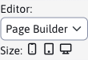

# Blocks

Page Builder also includes inserting prepared blocks. Their list is automatically loaded from the directory `/templates/INSTALL_NAME/skupina_sablon/menosablony/pagebuilder`. **We always recommend preparing a set of blocks for the template.**

You can have the following subdirectories in the root directory for blocks:
- `section` - for section blocks (blue marking in Page Builder)
- `container` - for containers (red marking in Page Builder)
- `column` - for columns (green marking in Page Builder)

In each of these subdirectories you still need to create **block groups as additional subdirectories**, e.g. `Contact, Features`. Only in these subdirectories you create individual HTML blocks. An example is the directory structure:

```java
- section
  - Contact
    - contact01.html
    - contact01.jpg
    - form.html
    - form.jpg
  - Features
    - promo.html
    - promo.jpg
    - pricelist.html
    - pricelist.jpg
- container
  - Teams
    - teams01.html
    - teams01.jpg
    - teams02.html
    - teams02.jpg
- column
  - Text-With-Picture
    - left.html
    - left.jpg
    - right.html
    - right.jpg
```

## Setting the width of the columns

The editor allows you to adjust the column widths according to the selected device. In the toolbar, next to the editor type toggle, there is an option to set the size (width) of the device.



- Desktop - is for width greater/equal to 1200 pixels (sets the CSS class `col-xl`).
- Tablet - is designed for width 768-1199 pixels (sets CSS class `col-md`)
- Mobile - is for width less than 768 pixels (sets CSS class `col-`)

The correct block setting includes all preset widths, e.g. `col-12 col-md-6 col-xl-3`:

```html
<section>
  <div class="container">
    <div class="row">
      <div class="col-12">
        <h2 class="text-center">Etiam orci</h2>
      </div>
    </div>
    <div class="row">
      <div class="col-12 col-md-6 col-xl-3 text-center">
        <p class="text-center">
          
        </p>
        <h3>Etiam orci</h3>
        <p>Suspendisse interdum dolor justo, ac venenatis massa suscipit nec. Vivamus dictum malesuada mollis.</p>
      </div>
      <div class="col-12 col-md-6 col-xl-3  text-center">
        <p class="text-center">
          
        </p>
        <h3>Aenean </h3>
        <p>Aliquam elementum ut ante vitae dapibus. Interdum et malesuada fames ac ante ipsum primis in faucibus.</p>
      </div>
      <div class="col-12 col-md-6 col-xl-3  text-center">
        <p class="text-center">
          
        </p>
        <h3>Maecenas</h3>
        <p>Sed sollicitudin eros quis leo imperdiet, id congue lorem ornare. Suspendisse eleifend at ante id ultrices.</p>
      </div>
      <div class="col-12 col-md-6 col-xl-3  text-center">
        <p class="text-center">
          
        </p>
        <h3>Suspendisse</h3>
        <p>Nullam ornare, magna in ultrices mattis, lectus neque mollis libero, vitae varius mauris metus a risus.</p>
      </div>
    </div>
  </div>
</section>
```

## Thymeleaf code support

It is important to note that the blocks are inserted into the page without executing the Thymeleaf code (technically the code is inserted directly from the html file into the editor). However, the following thymeleaf attributes are currently supported during insertion:
- `data-iwcm-write` - to support application insertion
- `data-iwcm-remove` - to support application insertion
- `data-th-src` - inserting an image
- `data-th-href` - inserting a link

At the same time, the following ninja objects are executed during insertion (written e.g. as `src="./assets/images/logo.png" data-th-src="${ninja.temp.basePathImg}logo.png"`):
- `${ninja.temp.basePath}`
- `${ninja.temp.basePathAssets}`
- `${ninja.temp.basePathCss}`
- `${ninja.temp.basePathJs}`
- `${ninja.temp.basePathPlugins}`
- `${ninja.temp.basePathImg}`

If you need other Thymeleaf tags made for your work, you can send us a request via the Feedback function on the administration homepage.

## Generating preview images

Note that for each HTML block there is also an image with the same name. If it exists, it will appear in Page Builder in the block list as a block image. The images can be prepared manually, but can also be automatically generated by calling a script `/components/grideditor/phantom/generator.jsp`.

The script inserts individual blocks into the specified JSP template with a simulation of the specified `docid` and creates screenshots. Requires an installed program [PhantomJS](https://phantomjs.org) and in the configuration variable `grideditorPhantomjsPath` set path to the directory where the `PhantomJS` installed.

## Common blocks

Unfortunately there is currently no option to nest blocks inside each other. There may be a requirement to insert `section` a block containing a certain `container` block, while it is necessary to be able to insert also the same `container` block separately. In this case, duplication of the HTML code of the blocks in the directory `section` Also `container`.

We recommend to generate blocks using [PugJS](https://pugjs.org).

## CSS classes for image

If the image has a CSS class set `fixedSize-w-h-ip` the specified dimension is set automatically after changing the image address `w` a `h` if the last entry is also entered `ip` is also set [point of interest](http://docs.webjetcms.sk/v8/#/front-end/thumb-servlet/bod-zaujmu). E.g. CSS class `fixedSize-160-160-5` automatically generates a 160 x 160 pixel image with a set point of interest of 5. We recommend setting the class to all illustration images where the size is important.

When you click on an image with CSS class `fixedSize/w-100/autoimg` will immediately open the image properties window for easy replacement. This way the editor does not have to click on the image and then on the change image icon in the toolbar.

## Card support

For convenient editing of cards (`tabs`) is supported to generate them automatically from HTML structure. Each tab is represented by a container. Containers can be easily duplicated and moved, and tabs are automatically generated from their contents.

Element `UL` should be marked with CSS class `pb-autotabs`. JavaScript code in the file `/admin/webpages/page-builder/scripts/pagesupport.js` ensure card generation after adding an element / every 5 seconds. Takes the card name from `title` container attribute, or from an element with CSS class `pb-tab-title` (which is more convenient for editing).

The tabs themselves are therefore not editable, they are generated automatically. Only the content is editable `tab` container. Note that in the sample code the UL element does not contain any `LI taby`, these will be generated automatically. They will remain in the HTML code afterwards and will also be saved correctly. The page will remain displaying the tab as it was displayed during editing (this is something to keep in mind).

Note the use of the CSS class `pb-not-container` on the main container elements. This will ensure that this element will not be marked as a container and only the individual tabs will be considered containers. Each tab uses a CSS class `pb-custom-container`, which will ensure that the red frame/toolbar of the container is displayed.

When you select the tab move option (in the container toolbar), all tabs are automatically displayed so that you can easily mark the tab where to move it. This is provided by the CSS style of the Page Builder.

Sample block code (in `section` directory):

```html
<section>
   <div class="container pb-not-container">

         <div class="tabsBox">
            <ul class="nav nav-tabs pb-autotabs"></ul>
         </div>

         <div class="tab-content">
           <div class="tab-pane fade active show pb-custom-container">
             <div class="row">
                <div class="col-12 pb-col-12 pb-tab-title">
                  <h3>Tab 1</h3>
               </div>
               <div class="col-12 pb-col-12">
                  <p>Text 1</p>
               </div>

             </div>

           </div>

           <div class="tab-pane fade pb-custom-container">
             <div class="row">
                <div class="col-12 pb-col-12 pb-tab-title">
                  <h3>Tab 2</h3>
               </div>
               <div class="col-12 pb-col-12">
                  <p>Text 2</p>
               </div>

             </div>
           </div>

           <div class="tab-pane fade pb-custom-container">
             <div class="row">
                <div class="col-12 pb-col-12 pb-tab-title">
                  <h3>Tab 3</h3>
               </div>
               <div class="col-12 pb-col-12">
                  <p>Text 3</p>
               </div>

             </div>
           </div>
         </div>

   </div>
 </section>
```

## Accordion support

`Accordion` works similarly to tabs, Page Builder ensures correct generation of necessary attributes and their automatic restoration when duplicating an item `accordion-u`. Functionality is linked to CSS class `pb-autoaccordion` and implemented similarly as for cards. Containers are used in a similar way.

Sample code:

```html
<section>
  <div class="container pb-not-container pb-autoaccordion">

    <h2 class="text-center pb-editable">Nadpis nad accordionom</h2>

    <div class="card pb-custom-container">
      <div class="card-header">
        <a class="accordionLink" data-toggle="collapse">
          <div class="pb-editable">
            <p>Nadpis accordionu 1</p>
          </div>
        </a>
      </div>
      <div class="collapse">
        <div class="card-body">
          <div class="row">
            <div class="pb-col-12">
              <p>Text accodrionu 1</p>
            </div>
          </div>
        </div>
      </div>
    </div>

    <div class="card pb-custom-container">
      <div class="card-header">
        <a class="accordionLink" data-toggle="collapse">
          <div class="pb-editable">
            <p>Nadpis accordionu 2</p>
          </div>
        </a>
      </div>
      <div class="collapse">
        <div class="card-body">
          <div class="row">
            <div class="pb-col-12">
              <p>Text accodrionu 2</p>
            </div>
          </div>
        </div>
      </div>
    </div>

  </div>
</section>
```

## Cards in accordion

When the requirement of inserting objects of the card type into the `accordion-u` it is possible to use the Page Builder property - it also indicates **nested containers**. It is necessary to consider what will be editable, how to duplicate individual items and so on. Practically, inserting cards into `accordion-ov` (which is a container) as the insertion of another `columnu` into the container (whereby the inserted `column` further contains nested containers of individual tabs).

In the example, note that the main `column` has CSS style `pb-not-editable` not to be automatically editable by CK editor and at the same time CSS class `pb-always-mark`. A non-editable column is not marked with a green border by default, but without this option it would not be possible to add another column after the tabs, or to delete entire tabs (the column tools would not be available).

When inserting HTML code containing an expression `container` as the object column is started `PageBuilder.mark_grid_elements();` to mark all elements (to display toolbars also for nested containers).

Sample card code for accordion (in the column directory):

```html
<div class="col-12 pb-not-editable pb-always-mark">
   <div class="tabsBox" role="tablist">
      <ul class="nav nav-tabs pb-autotabs"></ul>
   </div>

   <div class="tab-content">
      <div class="tab-pane fade active show pb-custom-container">
         <div class="row">
            <div class="col-12 pb-tab-title">
               <h3>Tab 1</h3>
            </div>
            <div class="col-12">
               <p>Tab text 1</p>
            </div>

         </div>
      </div>

      <div class="tab-pane fade pb-custom-container">
         <div class="row">
            <div class="col-12 pb-tab-title">
               <h3>Tab 2</h3>
            </div>
            <div class="col-12">
               <p>Tab text 2</p>
            </div>
         </div>
      </div>
   </div>

</div>
```

after inserting it, a structure of the type will be created in the web page:

```html
<section>
  <div class="container pb-not-container pb-autoaccordion">

    <h2 class="text-center pb-editable">Nadpis nad accordionom</h2>

    <div class="card pb-custom-container">
      <div class="card-header">
        <a class="accordionLink" data-toggle="collapse">
          <div class="pb-editable">
            <p>Nadpis accordionu 1</p>
          </div>
        </a>
      </div>
      <div class="collapse">
        <div class="card-body">
          <div class="row">
            <div class="pb-col-12">
              <p>Text accodrionu 1</p>
            </div>

            <div class="col-12 pb-not-editable pb-always-mark">
              <div class="tabsBox" role="tablist">
                  <ul class="nav nav-tabs pb-autotabs"></ul>
              </div>
              <div class="tab-content">
                  <div class="tab-pane fade active show pb-custom-container">
                    <div class="row">
                        <div class="col-12 pb-tab-title">
                          <h3>Tab 1</h3>
                        </div>
                        <div class="col-12">
                          <p>Tab text 1</p>
                        </div>
                    </div>
                  </div>
                  <div class="tab-pane fade pb-custom-container">
                    <div class="row">
                        <div class="col-12 pb-tab-title">
                          <h3>Tab 2</h3>
                        </div>
                        <div class="col-12">
                          <p>Tab text 2</p>
                        </div>
                    </div>
                  </div>
              </div>

            </div>

          </div>
        </div>
      </div>
    </div>

  </div>
</section>
```

## Menu support

PageBuilder can generate menu items into bootstrap menus, this is provided by `pbAutoMenu` v `pagesupport.js`. The menu item generates to `ul.pb-automenu` of all `section` elements in the web page. It works as follows:
- `section.pb-not-automenu` is omitted from the list.
- The name of the menu item is taken from:
  - element with CSS style `.section-title`
  - if not found is taken from `h1` element
  - if not found, the attribute is taken `title` at `section` element
- If the section is not set `id` attribute, is set by the section sequence number.

From the found data, entries are generated `li.nav-item` to `ul.pb-automenu`.

Sample block with menu:

```html
<section class="pb-not-automenu">
    <div class="container pb-not-container md-tabs">
        <nav class="navbar navbar-expand-lg navbar-light bg-light">
            <div class="container-fluid">
                <a class="navbar-brand" href="#">Navbar</a>
                <button class="navbar-toggler" type="button" data-bs-toggle="collapse" data-bs-target="#navbarNav"
                    aria-controls="navbarNav" aria-expanded="false" aria-label="Toggle navigation">
                    <span class="navbar-toggler-icon"></span>
                </button>
                <div class="collapse navbar-collapse" id="navbarNav">
                    <ul class="navbar-nav pb-automenu">
                        <li class="nav-item">
                            <a class="nav-link active" aria-current="page" href="#">Home</a>
                        </li>
                        <li class="nav-item">
                            <a class="nav-link" href="#">Features</a>
                        </li>
                        <li class="nav-item">
                            <a class="nav-link" href="#">Pricing</a>
                        </li>
                        <li class="nav-item">
                            <a class="nav-link disabled" href="#" tabindex="-1" aria-disabled="true">Disabled</a>
                        </li>
                    </ul>
                </div>
            </div>
        </nav>
    </div>
</section>
```

In the demonstration, the elements `Home, Features, Pricing a Disabled` replace for the content in the PageBuilder page. The content is automatically updated when a section is added, deleted or moved in the web page. The title is updated every 5 seconds, so if you change the `h1` Wait a moment for the new version of the menu to be generated.

Complete HTML code sample web page with sample sections:

```html
<section class="pb-not-automenu">
    <div class="container pb-not-container md-tabs">
        <nav class="navbar navbar-expand-lg navbar-light bg-light">
            <div class="container-fluid"><a class="navbar-brand" href="#">Navbar</a><button aria-controls="navbarNav"
                    aria-expanded="false" aria-label="Toggle navigation" class="navbar-toggler"
                    data-bs-target="#navbarNav" data-bs-toggle="collapse" type="button"><span
                        class="navbar-toggler-icon"></span></button>
                <div class="collapse navbar-collapse" id="navbarNav">
                    <ul class="navbar-nav pb-automenu">
                        <li class="nav-item"><a aria-current="page" class="nav-link active" href="#">Home</a></li>
                        <li class="nav-item"><a class="nav-link" href="#">Features</a></li>
                        <li class="nav-item"><a class="nav-link" href="#">Pricing</a></li>
                        <li class="nav-item"><a aria-disabled="true" class="nav-link disabled" href="#" tabindex="-1">Disabled</a></li>
                    </ul>
                </div>
            </div>
        </nav>
    </div>
</section>

<section>
    <div class="container">
        <div class="row">
            <div class="col-md-12">
                <h1>Úvod</h1>
            </div>
        </div>
    </div>
</section>

<section>
    <div class="container">
        <div class="row">
            <div class="col-md-12">
                <p class="section-title">Stred</p>
                <h1>Toto nie je nadpis</h1>
            </div>
        </div>
    </div>
</section>

<section title="TITLE nadpis">
    <div class="container">
        <div class="row">
            <div class="col-md-12">
                <p>Záver</p>
            </div>
        </div>
    </div>
</section>
```
