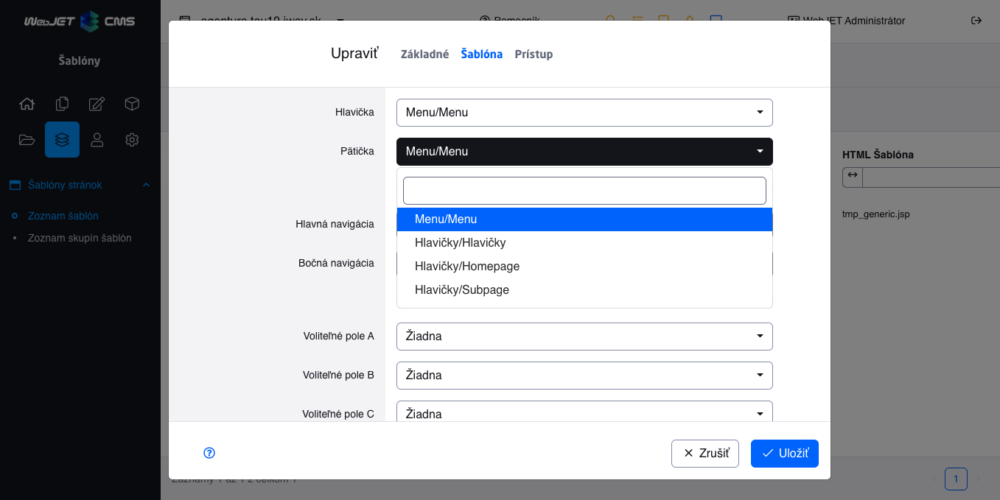

# Template setup

## One website

When used for one website/domain, there is no need to set anything special/different from WebJET 8.

## Managing multiple domains

When managing multiple domains, the following configuration variables need to be defined:

- ```multiDomainEnabled=true``` - ​​enable multi-domain management
- ```enableStaticFilesExternalDir=true``` - ​​enabling application data separation for domains separately and using an external directory for static files.
- ```cloudStaticFilesDir=/cesta/na/disku/``` - ​​setting the path to external domain files. This is a path on the disk (e.g. ```/mnt/cluster/static-files/```), which can also be outside the folder with the web application (e.g. on a network drive shared between cluster nodes). If necessary, however, you can have the domain files in the folder with the web application, in which case you can set the value ```{FILE_ROOT}static-files``` where the macro ```{FILE_ROOT}``` is replaced by the folder from which the web application is launched.
- ```templatesUseDomainLocalSystemFolder=true``` - ​​enable use of local ```System``` directory for domains
- ```multiDomainAdminHost``` - ​​if you have a separate/dedicated domain for access to the administration, set the domain name. If the value is empty, it will be possible to access the administration on all domains.

After setting these variables, we recommend restarting the server, or at least deleting all cached objects.

This setup will ensure the separation of data and files between domains. If you need to share files between domains, you can use the ```/shared``` folder, which is shared between domains.

!>**Warning:** when using an external directory, WebJET also needs to have empty folders ```/images, /files``` and possibly ```/shared``` in the root directory to display them in the All Files section. Technically, an empty directory cannot be pushed to a GIT repository, so create an empty file in these directories (ideally something like ```velmi-dlhy-nahodny-text.txt```).

WebJET 2021 displays folders in the website list only for the selected domain. When saving the root folder of the domain, a local ```System``` folder is automatically created for the header, footer, menu, etc. pages. Therefore, when saving the root folder of the domain, it is necessary to refresh the entire page in order to correctly load the link to the ```System``` folder.

Unlike WebJET 8, the ```System``` folder is stored in the root (you can view it in the folder structure by clicking on the Folders tab while holding down the ```shift``` key) and not in the first directory of the selected domain (but if it exists in the domain directory, it will be used).

The selection fields for header, footer, menu, free fields in the list of web pages, or in the template editor display pages in the folder ```System```, including the first level of subfolders (unlike WebJET 8). In the folder ```System``` you can create subfolders for headers, footers, menus, or by templates or other key. The page name has a prefix of the directory name, so for example ```Hlavičky/Homepage```.

