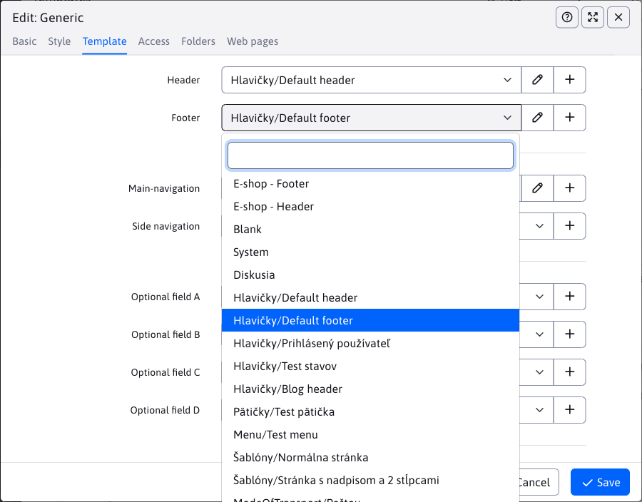

# Setting up templates

## One website

When used for a single website/domain, there is no need to set up anything special/different to WebJET 8

## Managing multiple domains

When managing multiple domains, the following configuration variables must be defined:
- `multiDomainEnabled=true` - enabling multi-domain management
- `enableStaticFilesExternalDir=true` - enabling application data splitting for domains separately and using an external directory for static files.
- `cloudStaticFilesDir=/cesta/na/disku/` - Set the path to external domain files. This is the path on disk (e.g. `/mnt/cluster/static-files/`), which can also be outside the web application folder (e.g., on a network drive shared between cluster nodes). However, if you want to keep the domain files in the web application folder, then you can set the value `{FILE_ROOT}static-files` in which the macro `{FILE_ROOT}` replaces it with the folder from which the web application is running.
- `templatesUseDomainLocalSystemFolder=true` - turn on the use of local `System` directories for domains
After setting these variables, we recommend restarting the server, or at least deleting all cached objects.

This setup ensures that the data and files of each domain are separated. If you need to share files between domains, you can use the `/shared`which is shared between domains.

**ATTENTION:** when using an external directory WebJET needs to have empty folders as well `/images, /files` and possibly `/shared` in the root directory to display them in the All Files section. Technically you can't push an empty directory into the GIT repository, so create some empty files in those directories (ideally something like `velmi-dlhy-nahodny-text.txt`).
WebJET 2021 displays folders in the list of web pages only for the selected domain. When the root folder of a domain is saved, a local `System` folder for header pages, footers, menus, etc. When saving the domain root folder, it is therefore necessary to refresh the entire page in order to correctly load the link to the folder `System`.

Folder `System`

`System``System``Hlavičky/Homepage`.

