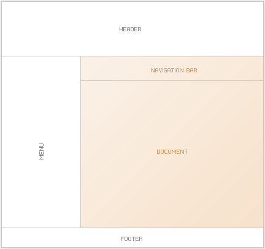
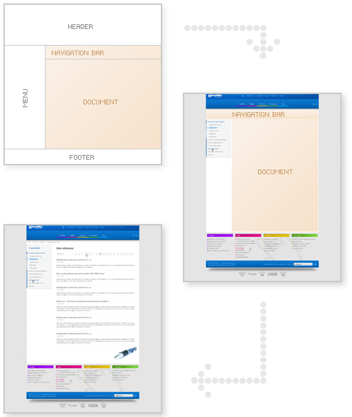

# The way the web page is displayed

A web page is usually defined not only by the text of a particular page itself, but also by common elements with other pages, such as a header, footer, or menu.

Thus, the template determines the layout of the page objects. In the top part there is the header, on the left there is the menu, in the middle part there is the navigation bar and the text of the web page and at the bottom there is the footer.

Individual objects like header, footer are technically also web pages in WebJET so that they can be easily edited. They are stored in the System tab in the list of web pages. The template then defines which web page is inserted as the header, which as the footer, etc.

In addition, the template also defines technical properties such as the CSS styles used, the HTML (JSP) code file of the page, etc.

When the web page is displayed, the web pages defining the header, footer and menu are inserted into the html template at specified locations. Subsequently, the navigation bar and the text of the web page itself are inserted, thus creating the resulting web page sent to the web browser of the visitor of the web site.
