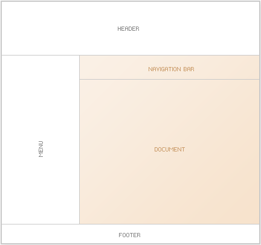

# How to display a web page

A web page is usually defined not only by the text of a particular page itself, but also by common elements with other pages, such as a header, footer, or menu.

The template determines the layout of the page objects. The header is at the top, the menu is on the left, the navigation bar and the text of the web page are in the middle, and the footer is at the bottom.

Individual objects such as headers and footers are technically also web pages in WebJET, so they can be easily edited. They are stored in the System tab in the web page list. The template then defines which web page is inserted as a header, which as a footer, etc.

In addition, the template also defines technical properties such as the CSS styles used, the file with the HTML (JSP) page code, etc.

When a web page is displayed, web pages defining the header, footer, and menu are inserted into the HTML template at designated locations. The navigation bar and the web page text itself are then inserted, creating the resulting web page sent to the web site visitor's internet browser.