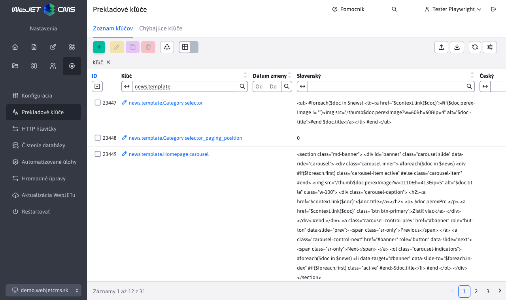
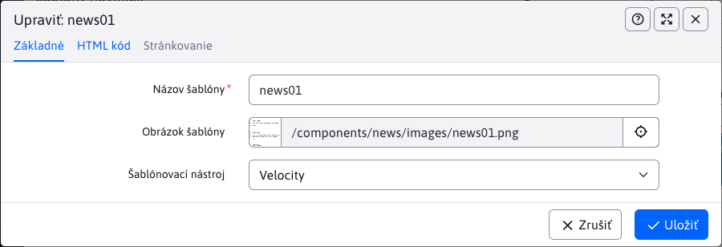
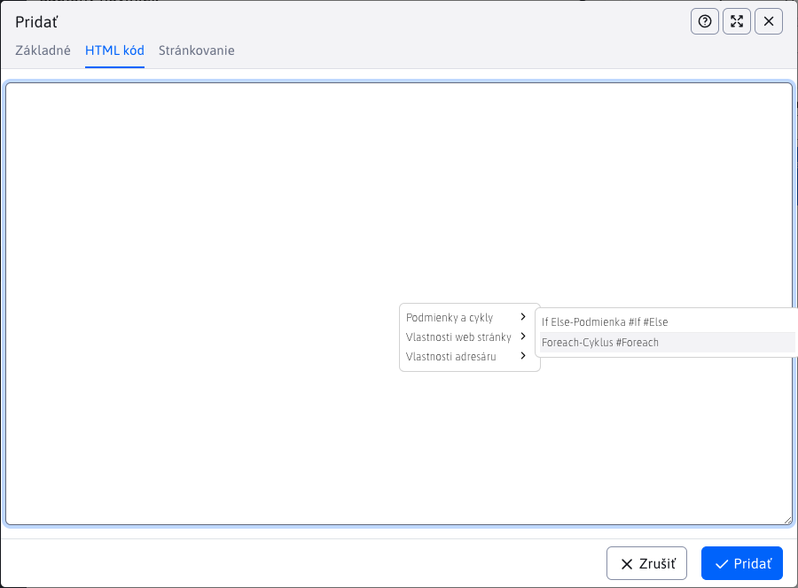
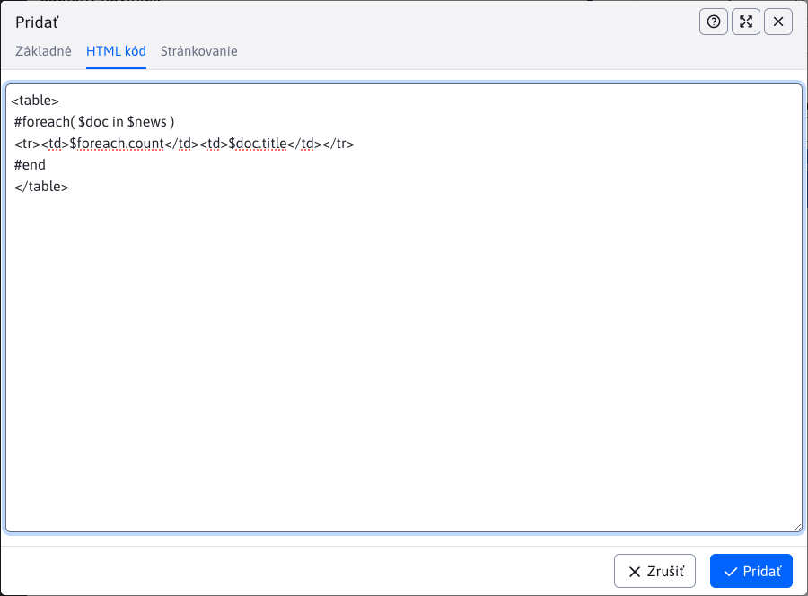

# News templates

News templates manage the design templates (HTML code) for the application [News](../../../redactor/apps/news/README.md). All actions are supported, including export and import. To access the section you need the right News - edit templates.


The section replaces the original way of defining news templates using translation keys that started with a prefix `news.template.`.



!> **Warning:** the first time you start **automatically** convert translation keys with prefix `news.template.` to the news templates in the table.

## Editor

The following fields are available:
- **Template name** - mandatory field with **Unique** name of the news template
- **Template image** - field for selecting the illustration image of the displayed news (for better orientation when selecting the template in the news application)
- **Templating tool** - choice of templating tool (only supported so far `Velocity`)
- **HTML code** - template code
- **Pagination location** - place where pagination is inserted
- **HTML pagination code** - paging code



## Inserting the code

When creating or editing a newsletter template, you have the option to use a menu of ready-made codes. These codes are used to make your work easier and will be displayed after **right click** into the field **HTML code** or **HTML pagination code**, which will bring up the menu window. Each section has its own sub-section, where the ready codes are already offered.



After clicking on the offered code, the selected code will be inserted into the field above which you have right-clicked to call the action. This way you can easily create a template.



!> **Warning:** offer for fields **HTML code** a **HTML pagination code** differs.

## Code examples

News templates used by [Velocity Engine](https://velocity.apache.org/engine/2.3/vtl-reference.html) for display, so it is possible to define cycles, conditions and other program code. Templates with one, two and three columns are ready. We recommend that templates are only edited by users who know what they are doing and know the syntax `Velocity Engine`. We recommend starting from the prepared templates and modifying them if necessary. The standard editor should not have the right to edit the newsletter templates, they should just use them.

Some examples of working with advanced objects:

```velocity
//nastavenie premennej podla pageParams objektu:
#set ($anonymousQuestions = $pageParams.getBooleanValue("anonymousQuestions", false))

//nastavenie premennej:
#set ($fileType = $media.mediaLink.split("[.]"))

//prechod cez zoznam perex skupin a nastavenie CSS triedy podla mena perex skupiny
<div class="grid-item grid-item-$doc.docId
#foreach($perexGroup in $doc.perexGroupNames)
    #if ($perexGroup == "news-red")
    grid-item-red
    #elseif ($perexGroup == "news-green")
    grid-item-green
    #elseif ($perexGroup == "news-blue")
    grid-item-blue
    #end
#end
" data-doc-id="$doc.docId">

//nacitanie medii a vypis
#foreach($media in $MediaDB.getMedia($doc, "files"))
    #set ($fileType = $media.mediaLink.split("[.]"))
    #if($fileType[1].equals('jpg') || $fileType[1].equals('png') || $fileType[1].equals('gif')) <a rel='wjimageviewer' href="$media.mediaLink"  > </a> #end
#end

//nacitanie medii a vypis
<div class="row"> #foreach($media in $MediaDB.getMedia($doc, "files"))
    #set ($fileType = $media.mediaLink.split("[.]"))
    #if(!$fileType[1].equals('jpg') && !$fileType[1].equals('png') && !$fileType[1].equals('gif')) <a href="$media.mediaLink" class="col-md-4 text-truncate icon-$fileType[1]" target="_blank"> $media.mediaTitleSk</a> #end
#end </div>

//vypis diskusnych prispevkov
//vyzaduje pridanie sk.iway.iwcm.forum.ForumDB do parametra Vlozit triedu do Velocity sablony
#set($forumDb = $ForumDB.getForumFieldsForDoc(null, $doc.docId))
#set($commentCount = $forumDb.size())
#set($showComment = 3)
#set($e = $commentCount - $showComment)
#foreach($forum in $forumDb)
    <div class="comment" #if($foreach.count > $e)style="display:block;"#end>
    <div class="comment-header"> $forum.autorFullName <span>$forum.questionDateDisplayDate $forum.questionDateDisplayTime</span> </div>
    <p>$forum.question</p>
</div>
#end

//vypis texu podla prihlaseneho/neprihlaseneho pouzivatela
#if ($actionBean.getCurrentUser()) LOGGED #end
#if (!$actionBean.getCurrentUser()) NOT-LOGGED #end

//zoznam vsetkych stranok ako odkazy - standardne $pages pouziva format 1 2 3 ... 7 8 9, pagesAll obsahuje 1 2 3 4 5 6 7 8 9
//v pages je objekt PaginationInfo, obsahuje property label, pageNumber, url, active, actual, first, last, link a getLi() pre ziskanie celeho HTML kodu LI elementu
$pagesAll
//celkovy pocet stran strankovania, napr 23, da sa ziskat aj z $lastPage.pageNumber
$totalPages

//podmienene zobrazenie ak je zadany perex obrazok
#if ($doc.perexImage!="")<a href="$context.link($doc)"></a>#end
```

If you need to display the date when the web page was first saved, set the conf. variable `editorAutoFillPublishStart` to the value of `true`. Once set, the editor will automatically fill the Start Date field in the Perex tab of the editor with the current date. This date can also be changed manually if necessary. You can then use the following objects in the template:

```velocity
//datum a cas posledneho ulozenia
$doc.lastUpdateDate $doc.lastUpdateTime

//datum a cas vytvorenia
$doc.publishStartString
```
