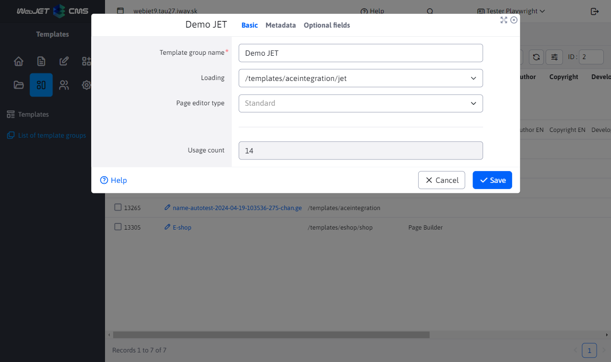

# Template groups

Template groups allow **set metadata for multiple templates**such as project title, author, copyright, etc. Template grouping is especially useful in projects where there are multiple domains with different designs/templates.

## List of template groups

The template group list shows an overview of the groups created, by default there is an unassigned group.

## Template Group Editor

## Basic tab

- Template group name - the unique name of the template group.
- Folder - the main folder where the template files (JSP/HTML design file, CSS stylesheets, JavaScript files) are located.

- Page editor type:
	- Standard - main page editor with text formatting, inserting images, links, etc.
	- HTML editor - used for special pages that need to use a precise HTML editor.
	- Page Builder - mode of editing a page consisting of [prepared blocks](../page-builder/README.md).
	- `Grid Editor` - the predecessor of Page Builder mode, will be removed in 2024.
- Number of uses - the number of templates in this group.

## Metadata tab

- Allows you to set the metadata used in [header of templates](../thymeleaf/webjet-objects.md#ninja-šablóna).
- Text key prefix - by specifying a prefix it is possible to modify the translation keys of the applications embedded in the page. Example: if an application uses a translation key `components.inquiry.answers` and set the prefix in the template group `jetportal`, so the key is searched when the application is displayed `jetportal.components.inquiry.answers` and, if any, shall be used. If there is no translation for this key, the original value from the key is of course used `components.inquiry.answers`. You can easily change the text displayed in the application in a specific template group.

## Optional fields tab

The group can be defined [optional fields](../webpages/customfields/README.md)whose use depends on the designer of the template.
