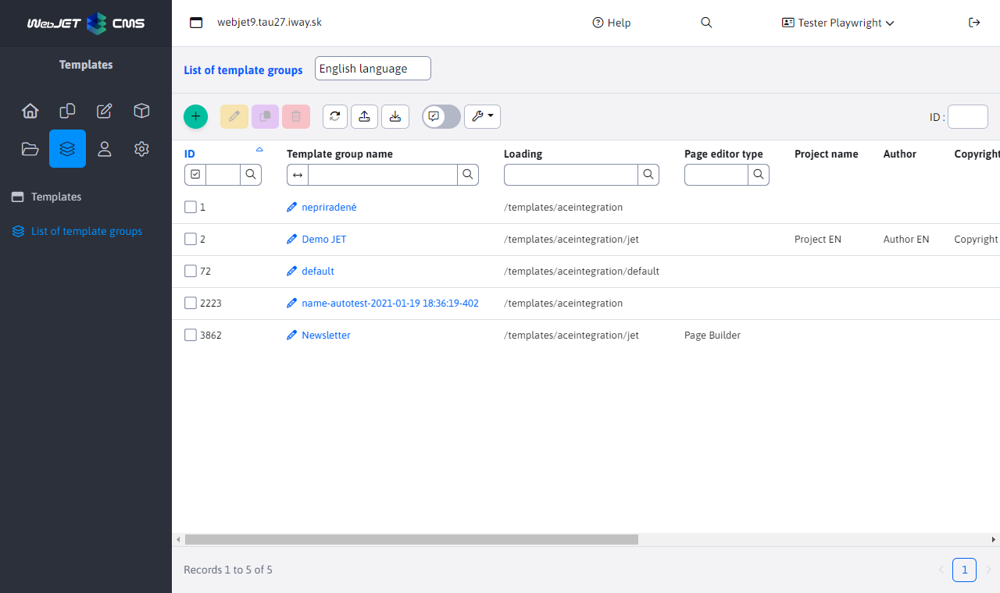
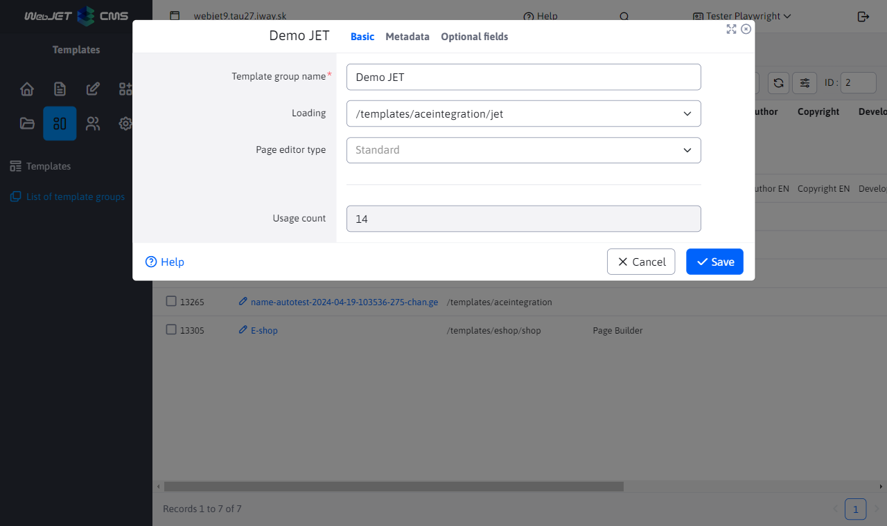

# Template groups

Template groups allow you to **set metadata for multiple templates**, such as project name, author, copyright, etc. Template grouping is especially useful in projects where there are multiple domains with different designs/templates.

## List of template groups

The list of template groups shows an overview of the created groups, by default there is a group unassigned.

## Template Group Editor

## Basic tab

- Template group name - unique name of the template group.
- Folder - the main folder containing the template files (JSP/HTML design file, CSS styles, JavaScript files).
- Page editor type:
  - Standard - the main page editor with text formatting, inserting images, links, etc.
  - HTML editor - used for special pages that need to use a precise HTML editor.
  - Page Builder - page editing mode consisting of [prepared blocks](../page-builder/README.md).
  - `Grid Editor` - ​​predecessor of Page Builder mode, will be removed in 2024.
- Number of uses - the number of templates in this group.

## Metadata tab

- Allows you to set the metadata used in the [template header](../thymeleaf/webjet-objects.md#ninja-template).
- Prefix of text keys - by entering a prefix, it is possible to modify the translation keys of applications embedded in the page. Example: if the application uses the translation key `components.inquiry.answers` and you set the prefix `jetportal` in the template group, then the key `jetportal.components.inquiry.answers` will be searched for when displaying the application and if it exists, it will be used. If there is no translation for this key, the original value from the key `components.inquiry.answers` will of course be used. This way you can easily change the text displayed in the application in a certain template group.

## Optional fields tab

It is possible to define [optional fields](../webpages/customfields/README.md) for a group, the use of which depends on the template designer.
