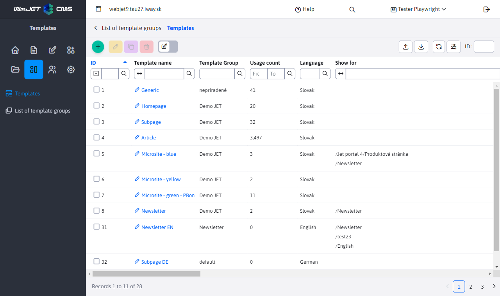

# Templates

Templates are created in the admin area of Web JET in the Templates section by clicking on the Template List menu.

## List of templates

The number of uses column shows the number of pages that use the template. If it is 0 pages, you can delete the template. If you want to delete a template that is used on some pages, use the Merge Templates feature (the Merge this template into field in the Template tab of the editor). In this way, all pages and folders using the currently edited template will be changed to the selected template.

## Template Editor

### Basic card

- Template group - assigning a template to [template groups](template-groups.md).
- HTML template defines which JSP/HTML template to use (HTML template must be stored in the folder `/templates` and have the suffix `jsp` or `html`).
- Page editor type - defines what type of page editor is used, for complex web pages it is typically used [Page Builder](../page-builder/README.md). By default, the value set in the template group is inherited.
- Installation name - when displaying the template, it is possible to change the installation name, which affects the versions of the applications used - allows you to use a specifically modified application in the folder for the template `/components/MENO_INSTALACIE/aplikacia/`.
- Disable spam protection - disable spam protection if the page in this template is loaded using a REST service, or if it is a page used for bulk email.

### Style tab

- Main CSS style - a list of references to the CSS file that the template uses. The above CSS will also be used to get a list of CSS styles for selection in the page editor.
- Secondary CSS style - an additional CSS style, not used for the Styles selection menu in the page editor.
- HTML code allows you to define additional HTML code to be inserted at the end of the page (or at a location defined in the HTML template).
CSS files can be entered each on a new line or separated by a comma.

The page editor in the admin area automatically searches for the file `/templates/template-name/dist/css/editor.css` which loads along with the CSS style of the template. In the file `editor.css` you can redefine certain properties to be used only in the editor.

### Card Template

- Assign web pages used as header, footer, etc.

In the html template, the web pages defining the header, footer and menu are inserted in the specified places to create a template. The navigation bar and the actual text of the web page are then inserted into the template, creating the final web page sent to the visitor's internet browser.

- Merge this template into - allows you to replace the currently displayed template with the one selected in the selection box in existing pages and folders. To avoid inconsistency use this function before deleting a template.

### Access tab

Allows you to define the folders for which the template will be displayed for selection when editing a web page.

### Folders tab

For an existing template, displays a list of folders that have the displayed template set as the default template for creating a new web page.

### Websites tab

For an existing template, displays a list of websites that use the template.

## Device-specific display

WebJET supports the ability to customize the template for a specific device. This is by default `phone, tablet, pc` according to the connected device, but it can be influenced by the URL parameter `?forceBrowserDetector=blind` e.g. for an optimized template for the visually impaired.

The device type is detected on the server by the HTTP header `User-Agent`. The phone is detected when an expression is found `iphone`, or `mobile` and at the same time the expression `android`. Tablet as `ipad||tablet||kindle` or if it contains `android` and does not contain `mobile`.

When you view a web page on your phone, it searches for a set template for a web page with the expression `device=phone`. If the page has a template `Homepage` the template is searched `Homepage device=phone`. If it exists, it shall be used.

In this optimized template you can use a different header page or a different HTML template file.

Similarly, the search for web page headers/footers is done automatically if the page is set `Default header` is automatically searched `Default header device=phone`. If it exists, it shall be used. So you don't need to create separate templates, just create a suitable web page with a modified header/footer.
