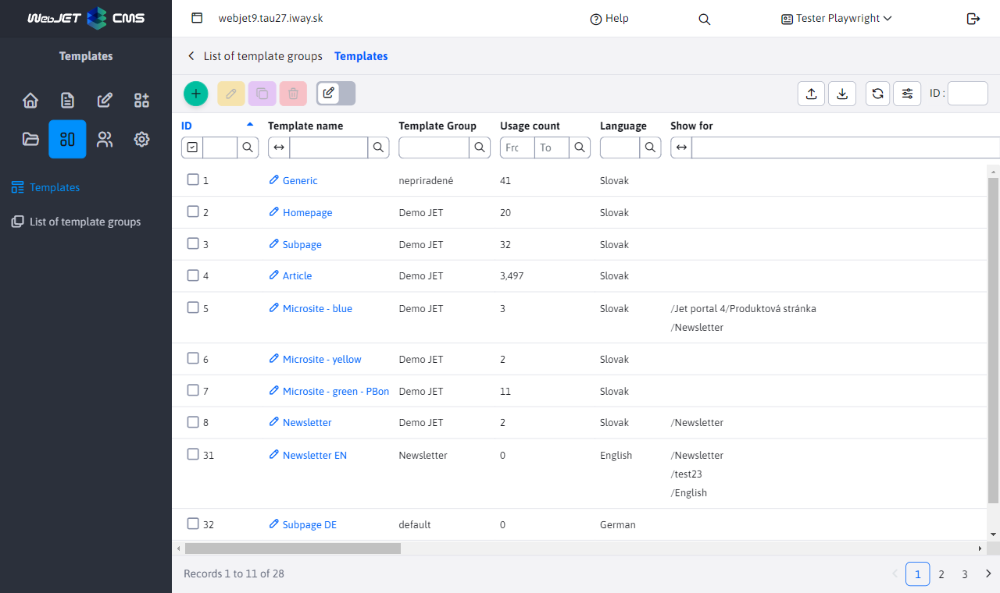
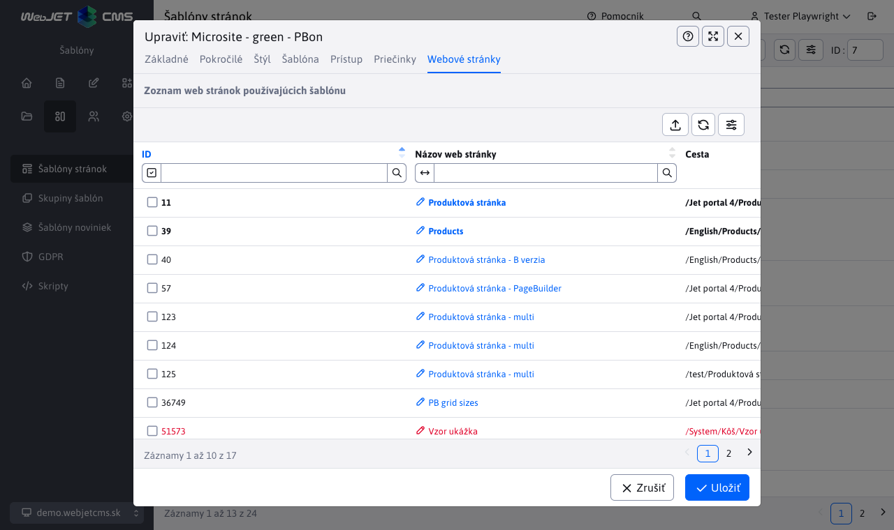

# Templates

Templates are created in the Web JET admin area in the Templates section after clicking the Template List menu.

## List of templates

The number of uses column shows the number of pages that use the template. If it is 0 pages, you can delete the template. If you want to delete a template that is used on some pages, use the template merge function (the Merge this template into field in the Template tab in the editor). This way, all pages and folders that use the currently edited template will be changed to the selected template.

## Template editor

### Basic tab

- Template group - assigning a template to [template group](template-groups.md).
- HTML template defines which JSP/HTML template will be used (the HTML template must be saved in the `/templates` folder and have the extension `jsp` or `html`).
- Page editor type - defines what type of page editor will be used, for complex websites typically [Page Builder](../page-builder/README.md) is used. By default, the value set in the template group is inherited.

### Advanced tab

- Installation name - when viewing a template, it is possible to change the installation name, which affects the application versions used. It allows you to use a specifically modified application in the `/components/MENO_INSTALACIE/aplikacia/` folder for the template.
- Disable spam protection - disable spam protection if the page in this template is loaded using a REST service, or if it is a page used for mass email.
- Move styles to `head` - ​​determines the processing of `<style>` and `<link rel="stylesheet">` tags that can be generated in the page body (e.g. from components):
  - By configuration variable - will use the global setting of the configuration variable `showDocMoveStyleToHead`.
  - On - forces styles to be moved to `<head>` for this template regardless of the global setting.
  - Disabled - disables style shifting for this template regardless of the global setting.

The configuration variable `showDocMoveStyleToHead` serves as the default value for the entire solution. A setting in the template can override it for a specific layout.

Importance and impact on performance:

- HTML output is more valid because styles and stylesheet links are consolidated in the document head instead of the page body.
- When enabled, additional HTML processing (stylesheet retrieval and extraction) is performed, which may increase CPU time when displaying the page.
- Blocks in IE conditions, `script` and `noscript` remain in place.

### Style tab

- Main CSS style - a list of references to the CSS file that the template uses. The specified CSS will also be used to get a list of CSS styles for selection in the page editor.
- Secondary CSS style - additional CSS style, not used for the Styles drop-down menu in the page editor.
- HTML code allows you to define additional HTML code that is inserted at the end of the page (or at a location defined in the HTML template).

CSS files can be entered on a new line or separated by a comma.

The page editor in the admin area automatically looks for the `/templates/template-name/dist/css/editor.css` file, which it loads along with the template's CSS style. In the `editor.css` file, you can redefine certain properties that should only be used in the editor.

### Template tab

- Assigning web pages used as headers, footers, etc.

Web pages defining the header, footer, and menu are inserted into the HTML template at designated locations, creating the template. The navigation bar and the web page text itself are then inserted into the template, creating the resulting web page sent to the visitor's Internet browser.

- Merge this template into - allows you to replace the currently displayed template selected in the selection box in existing pages and folders. To avoid inconsistencies, use this function before deleting the template.

### Access tab

Allows you to define folders for which the template will be displayed for selection when editing a web page.

### Folders tab

For an existing template, it displays a list of folders that have the displayed template set as the default template for creating a new web page.

### Websites tab

For an existing template, it displays a list of websites that use the template.

## Language mutations

If you operate a website in multiple language versions, there is no need to create separate templates for each language version. We recommend using the [language settings for the website folder] option (../../redactor/webpages/group.md#template-tab).

After setting the language of the folder, WebJET will automatically search for language mutations of the assigned headers, footers and menus in the template. If the template has a header named "default header" or "SK-default header", when displaying a page with the language set to EN, WebJET will automatically search for the page "EN-default header".

So you have a default language and a default header/footer/menu page in the template. You set the English folder in the website to English and WebJET will look for the corresponding EN versions of the header/footer/menu pages when you display the page.

## Device-specific display

WebJET supports the ability to customize the template for a specific device. This is by default `phone, tablet, pc` according to the connected device, but it can be influenced using the URL parameter `?forceBrowserDetector=blind` e.g. for an optimized template for the visually impaired.

The device type is detected on the server by the HTTP header `User-Agent`. A phone is detected when the expression `iphone`, or `mobile` and the expression `android` are found. A tablet is detected as `ipad||tablet||kindle` or if it contains `android` and does not contain `mobile`.

When viewing a web page on the phone, the set template for the web page with the expression `device=phone` is searched. If the page has the template `Homepage`, the template `Homepage device=phone` is searched. If it exists, it is used.

In this optimized template, you can use a different page in the header, or a different HTML template file.

Similarly, the search for web page headers/footers is also done automatically, if the page `Default header` is set, `Default header device=phone` is automatically searched for. If it exists, it is used. You do not have to create separate templates, just create a suitable web page with a modified header/footer.