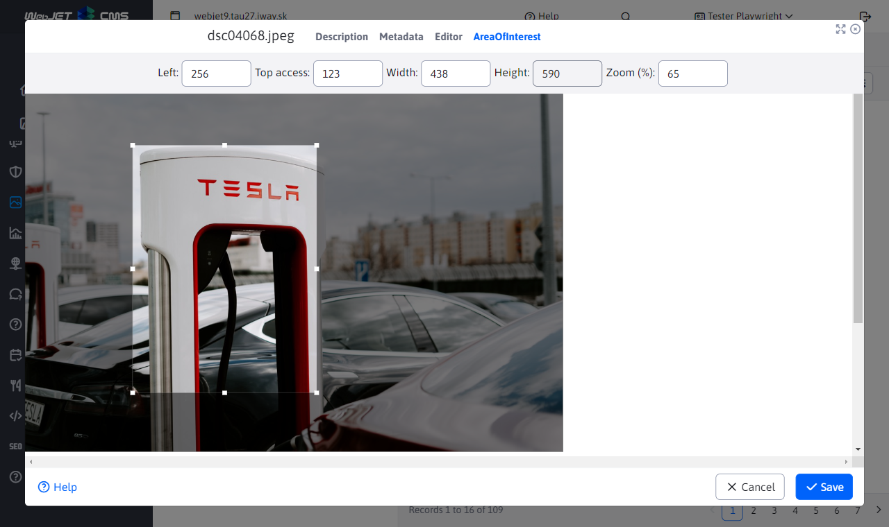
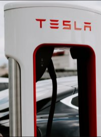
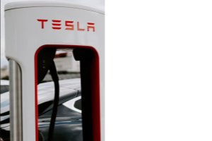
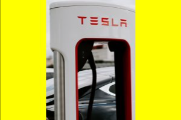
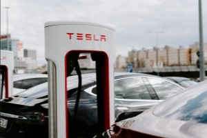

## Using a point of interest

For `/thumb` the use of [set point of interest](../../redactor/apps/gallery/README.md) by adding the URL parameter `ip` (point of interest). The point of interest can be set to any image, not just the one in the gallery, by clicking edit in the page editor or in the explorer.

For demonstration purposes, the marked region of interest is quite high to show how the shift is performed when generating images of mainly square dimension relative to the marked region.

If no area is marked, the entire image is considered marked.

Note the tightly marked Tesla stand.

## Fixed width

You only have the parameter `w`, height `h` is calculated according to the aspect ratio of the original cut-out.

An image 200 pixels wide is generated, the height is calculated (i.e. the result can be as high as you want - depending on the aspect ratio of the area) and only the selected area is used. The resulting image has the dimension `200x270` points:

`/thumb/images/gallery/test-vela-foto/dsc04131.jpg?w=200&ip=1`

## Fixed height

You only have the parameter `h`, width `w` is calculated according to the aspect ratio of the original cut-out.

The same as `ip=1` only we have specified only the height, the width is calculated, the resulting image has the dimension `148x200` points:

`/thumb/images/gallery/test-vela-foto/dsc04131.jpg?h=200&ip=2`

## Fixed width and height filled with paint

The cutout fits entirely into the selected size `w` a `h`, **No** is centered and the rest is colored with the color from the parameter `c` (default white)

You have specified the EXACT image size that the selected area must fit into, but the image can be realistically smaller than the specified part, in this case `300x200` dots, the right side is colored with the specified color (in the example the default white without the specified `c` parameter).

`/thumb/images/gallery/test-vela-foto/dsc04131.jpg?w=300&h=200&ip=3`

## Fixed width and height filled with colour - centred

The cutout fits entirely into the selected size `w` a `h`, is centered and the rest is colored with the color from the parameter `c` (default white)

You have specified the EXACT image size that the selected area must fit into, but the image can realistically be smaller than the specified portion. In this case `300x200` points, the surroundings will be colored with the selected color, so the image ALWAYS has the specified dimension (it will not jump). The color is specified as a hex value with the parameter `c` (without sign `#`).

`/thumb/images/gallery/test-vela-foto/dsc04131.jpg?w=300&h=200&ip=4&c=ffff00`

## Centred with aspect ratio - reduced

Reduce the cutout and center it so that the aspect ratio of the desired size is maintained.

You have an area 271x362 and you want a square 200x200, the resulting image is the centered portion of the area at the desired aspect ratio as the max size. That is, we sort of move the whole area down and center it (WARNING: we don't take a 200x200 area, but a 271x271 square according to the desired aspect ratio). As if you are zooming the selected area towards its center until you have filled the entire cutout (by aspect ratio, not dimension). So first you make a crop according to the aspect ratio and then shrink it to the desired size.

`/thumb/images/gallery/test-vela-foto/dsc04131.jpg?w=200&h=200&ip=5`

Note that compared to the marked area, the image is cropped from the top and bottom (less visible than the marked area) due to the different aspect ratio of the marked area and the desired size.

## Centred with aspect ratio - enlarged

The selected cutout will be complete in the result but the overall cutout will be enlarged according to the aspect ratio of the desired size.

Basically similar to `ip=5`, but the area does not shrink, but since the image also has surroundings, we enlarge it according to the desired aspect ratio. That is, the result will always be the WHOLE selected area, but it will be expanded into the surroundings (ideally centered, but if the area is on the edge it will shift):

`/thumb/images/gallery/test-vela-foto/dsc04131.jpg?w=200&h=200&ip=6`

Note that compared to the marked area, the image is expanded to the right and left (more visible than the marked area) due to the different aspect ratio of the marked area and the desired dimension.

## To turn off the set point of interest value

In some cases, it is appropriate not to use the set point of interest value, e.g. you want to use `ip=4`, i.e. the exact size of the image filled with white, but you do not want to use the set area of interest (i.e. use as much of the image as possible). Just add a parameter to the URL `noip=true` and the set value is not used.

`/thumb/images/gallery/test-vela-foto/dsc04068.jpeg?w=300&h=200&ip=4&noip=true&c=ffff00`

