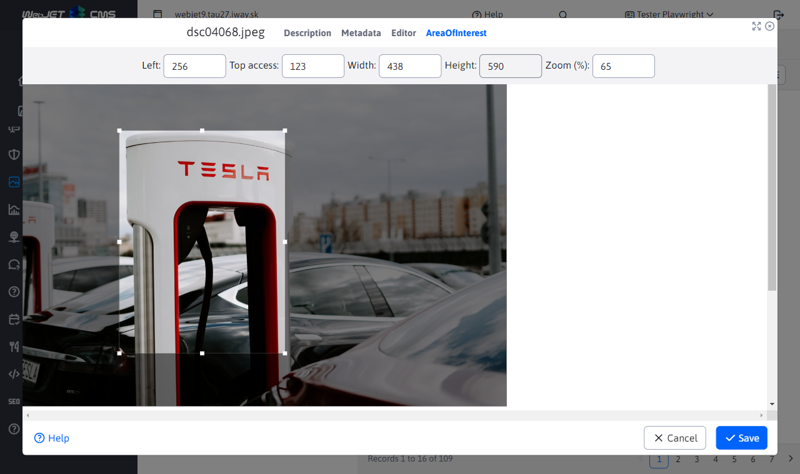
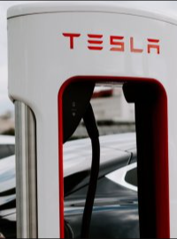
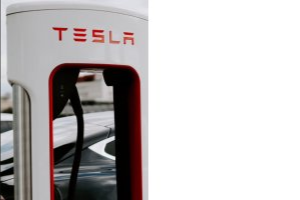
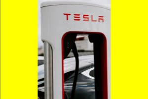
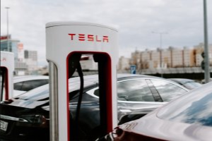

# Using a point of interest

For `/thumb`, use [set point of interest](../../redactor/apps/gallery/README.md) by adding the URL parameter `ip` (interest point). The point of interest can be set to any image, not just the one in the gallery, by clicking edit in the page editor or in the explorer.

For the demonstration, the marked area of ​​interest is relatively high to make it clear how the shift is performed when generating images, especially of square size, relative to the marked area.

If no area is marked, the entire image is considered marked.

Note that the Tesla stand is closely marked.

## Fixed width

You have only entered the parameter `w`, the height `h` will be calculated based on the aspect ratio of the original viewport.

An image 200 points wide is generated, the height is added (i.e. the result can be arbitrarily high - depending on the aspect ratio of the area) and only the selected area is used. The resulting image has dimensions of `200x270` points:

`/thumb/images/gallery/test-vela-foto/dsc04131.jpg?w=200&ip=1`

## Fixed height

You have only entered the parameter `h`, the width `w` will be calculated according to the aspect ratio of the original viewport.

The same as `ip=1`, except we only specify the height, the width is added, the resulting image has a dimension of `148x200` points:

`/thumb/images/gallery/test-vela-foto/dsc04131.jpg?h=200&ip=2`

## Fixed width and height filled with color

The cutout fits entirely into the selected size `w` and `h`, **not** centered and the rest is colored with the color from the parameter `c` (default white)

You have specified the EXACT image size that the selected area must fit into, but the image may actually be smaller than the specified part, in this case `300x200` points, the right side will be colored with the specified color (in the example, default white without the specified `c` parameter).

`/thumb/images/gallery/test-vela-foto/dsc04131.jpg?w=300&h=200&ip=3`

## Fixed width and height filled with color - centered

The cutout fits entirely into the selected size `w` and `h`, is centered, and the rest is colored with the color from the parameter `c` (default white)

You have specified the EXACT image size that the selected area must fit into, but the image may actually be smaller than the specified part. In this case `300x200` points, the surroundings are colored with the selected color, so the image ALWAYS has the specified size (will not jump). The color is specified as the `hex` value of the `c` parameter (without the `#` character).

`/thumb/images/gallery/test-vela-foto/dsc04131.jpg?w=300&h=200&ip=4&c=ffff00`

## Centered with aspect ratio - scaled down

Reduces the crop and centers it so that the aspect ratio of the desired size is maintained.

You have an area of ​​271x362 and you want a square of 200x200, the resulting image is a centered part of the area in the desired aspect ratio as the max size. So the entire area is as if we move it down and center it (ATTENTION: we will not take 200x200 from it, but a square of 271x271 according to the desired aspect ratio). As if you are zooming in on the selected area towards its center until you have filled the entire cutout (according to the aspect ratio, not the size). So first, the crop is made according to the aspect ratio and then reduced to the desired size.

`/thumb/images/gallery/test-vela-foto/dsc04131.jpg?w=200&h=200&ip=5`

Note that compared to the marked area, the image is cropped from the top and bottom (less is visible than the marked area) due to the different aspect ratio of the marked area and the desired size.

## Centered with aspect ratio - enlarged

The selected cutout will be complete in the result, but the overall cutout will be enlarged according to the aspect ratio of the desired size.

Basically similar to `ip=5`, but the area is not reduced, but since the image also has surroundings, we enlarge it according to the desired aspect ratio. So the result will always be the ENTIRE selected area, but it will be expanded to the surroundings (ideally centered, but if the area is on the edge, it will be shifted):

`/thumb/images/gallery/test-vela-foto/dsc04131.jpg?w=200&h=200&ip=6`

Note that compared to the marked area, the image is expanded to the right and left (more is visible than the marked area) due to the different aspect ratio of the marked area and the desired size.

## Turning off the point of interest setpoint

In some cases, it is appropriate to not use the set point of interest value, e.g. you want to use `ip=4`, i.e. the exact size of the image filled with white, but you do not want to use the set region of interest (i.e. use as much of the image as possible). Just add the parameter `noip=true` to the URL and the set value will not be used.

`/thumb/images/gallery/test-vela-foto/dsc04068.jpeg?w=300&h=200&ip=4&noip=true&c=ffff00`

