# Optional fields

Some dialog boxes have an optional fields tab where you can set optional attributes (values, texts) according to your needs. The values ​​can then be transferred and used in the design template as:

```html
Web stránka:
<iwcm:write name="field_a"/> až <iwcm:write name="field_t"/>

Adresár:
<iwcm:write name="group_field_a"/> až <iwcm:write name="group_field_d"/>
```

The names Field A - Field X can be changed in the configuration in the text editing section. Just modify the keys:

- `editor.field_x` - ​​for the website
- `temp-ID.editor.field_x` - ​​for a website with a template `ID`, e.g. `temp-3.editor.field_a` changes the name of the free field AND only for websites that use a template with `ID` 3.
- `groupedit.field_x` - ​​for directory
- `user.field_x` - ​​for user
- `components.qa.field_x` - ​​for the Questions and Answers application
- `components.banner.field_x` - ​​for the Banner System application
- `components.media.field_x` - ​​for the Media application
- `components.perex.field_x` - ​​for the Tags application
- `components.invoice.field_x` - ​​for the E-commerce application

Technical information can be found in the [programmer documentation](../../../developer/datatables-editor/customfields.md).

## Field types

Fields are displayed as text by default, but field types can be changed by changing the definition via translation keys.

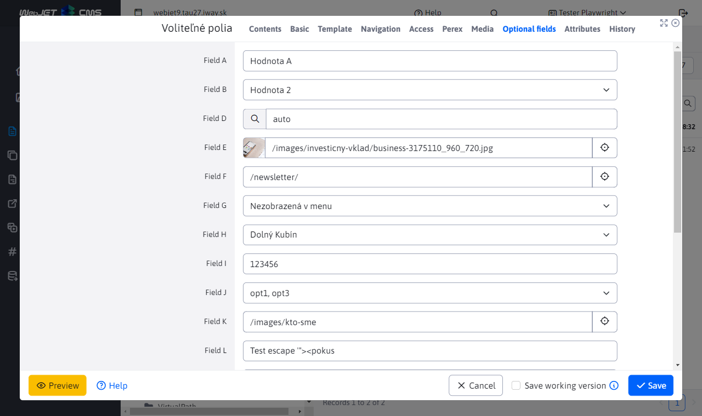

!>**Warning:**, **type setting** must always be set for the default language (set in the `defaultLanguage` configuration variable), even if WebJET is used in a different language.

### Text

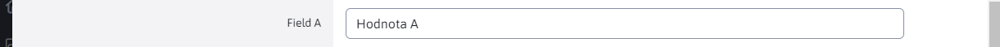

The field type `text` is a standard text field. However, it is possible to limit the maximum field size and display a warning even after the specified number of characters:

- `editor.field_x.type=text` - ​​standard text field with a maximum size of 255 characters
- `editor.field_x.type=text-10` - ​​standard text field with a maximum size of 10 characters
- `editor.field_x.type=text-160, warningLength-50` - ​​standard text field with a maximum size of 160 characters, after entering 50 characters a warning will be displayed about exceeding the recommended text length (e.g. Google recommends the description field to be 50-160 characters long)

A warning will be displayed when the specified number of characters in the `warninglength` setting is reached. Example of such a warning:

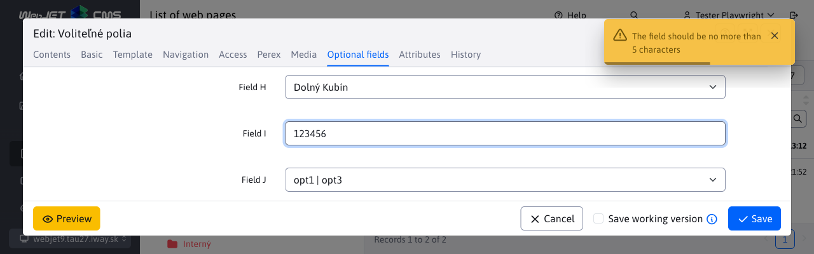

The text of the warning itself is obtained from the translation key, which you must prepare and consists of `prefix.field_x.warningText`. The key of the previous message was defined as `editor.field_J.warningText=hláška...`.

### Text area

The field type `textarea` is a standard text (multi-line) area.

- `editor.field_x.type=textarea` - ​​standard text area

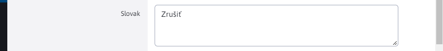

### Non-editable text

To display plain text, you can set these fields to the value `label`. The value will only be displayed without the ability to edit it.

- `editor.field_x.type=label` - ​​non-editable text


### Selection field

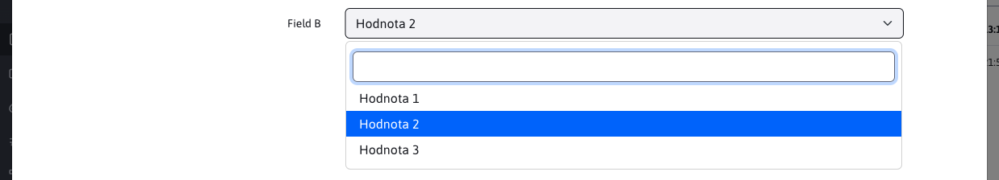

To be able to choose from predefined values, you can enter possible values ​​in `.type` separated by the `|` character:

`editor.field_x.type=Hodnota 1|Hodnota 2|Hodnota 3`

To have the option to **set an empty value**, start the list of options with the value `|`:

`editor.field_x.type=|Hodnota 1|Hodnota 2|Hodnota 3`

### Multiple choice selection box

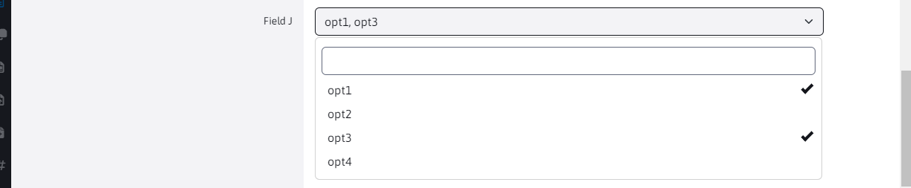

If multiple selection is required, `multiple` is added before the value:

`editor.field_x.type=multiple:Hodnota 1|Hodnota 2|Hodnota 3`

The values ​​are then stored in an array separated by the `|` character.

`Hodnota 1|Hodnota 3`

### Boolean value

For the option to enter a Boolean/binary value, enter the option `boolean` in `.type`.

### Number

For the option to enter a numeric value, enter the option `number` in `.type`.

### Date

For the date option, enter the `.type` option `date`.

### Do not display

If you need to hide unused fields, you can use a field of type `none`.

`editor.field_x.type=none`

### Autocomplete

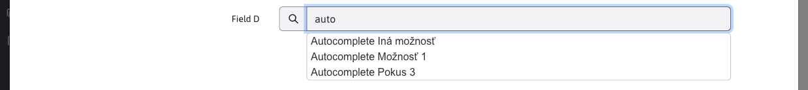

A field of type `autocomplete` works similarly to a selection field, but allows you to enter a value other than the default options. The function is enabled by prefixing `autocomplete:` with possible values ​​separated by the `|` character. At the same time, the default options are displayed sequentially after entering at least 3 characters:

`temp-3.editor.field_d.type=autocomplete:Autocomplete Možnosť 1|Autocomplete Iná možnosť|Autocomplete Pokus 3`

### Image selection


The image selection field has the type `image`. It displays the standard dialog for uploading/selecting an existing image.

`editor.field_x.type=image`

### Link selection


Similar to the image, setting `.type` to the value `link` opens a link selection for a file or another web page:

`editor.field_x.type=link`

### Selecting a website folder

To select a website folder, you can use the type `json_group`:

- `editor.field_x.type=json_group` - ​​displays a selection of website folders

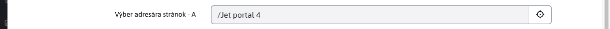

- `editor.field_x.type=json_group_null` - ​​by adding `null` to the end of the type, it is also possible to set an empty value (a button to delete the selected folder will appear)


### Website selection

To select pages, you can use the type `json_doc`:

- `editor.field_x.type=json_doc` - ​​displays a selection of pages


- `editor.field_x.type=json_doc_null` - ​​by adding `null` to the end of the type, it is also possible to set an empty value (a button to delete the selected website will appear)


### Selecting a file system folder


To select a directory in the file system by setting `.type` to the value `dir`. After clicking on the cross icon at the end of the text field, a dialog box for selecting a folder in the file system will appear.

`editor.field_x.type=dir`

### Selecting an existing page from the directory


To select an existing page (its `docId`), you can use the type `docsIn_GROUPID`:

- `editor.field_x.type=docsIn_67` - ​​displays page selection from directory 67
- `editor.field_x.type=docsIn_67_null` - ​​by adding `null` to the end of the type, it is also possible to select an empty option (set no page)

### Dial

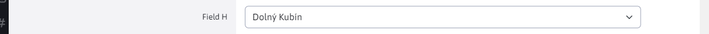

The link to the codebook is via the type `enumeration_X` where X is the ID of the codebook type. The default value and label is `string1` from the codebook:

- `editor.field_x.type=enumeration_2` - ​​displays as a selection field the options from the code list type 2, the value and label will be from `string1`
- `editor.field_x.type=enumeration_2_null` - ​​by adding `_null` to the end of the type, an empty option can also be selected

#### Custom columns for label and value

It is possible to specify which properties from the code list will be used for the label and value of the selection field:

- `editor.field_x.type=enumeration_2_string1_id` - ​​label will be from `string1`, value from `id`
- `editor.field_x.type=enumeration_2_string2_string3` - ​​label will be from `string2`, value from `string3`
- `editor.field_x.type=enumeration_2_string1_id_null` - ​​label will be from `string1`, value from `id`, with the possibility of an empty value

You can use any property from the code list:

- `string1` to `string12` - text fields
- `decimal1` to `decimal4` - numeric fields
- `boolean1` to `boolean4` - boolean fields
- `date1` to `date4` - date fields
- `id` - ​​identifier of the record in the codebook

### Unique identifier

The field type `uuid` allows you to generate a unique identifier. If the field has an empty value when displayed, a new `uuid` is generated, similarly, if you delete a value and move the cursor to another field, a new value is generated.

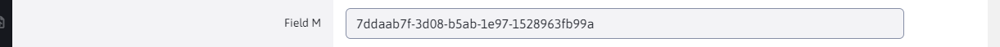

### Color

The field type `color` allows you to select a color, including setting the transparency.


## Link to template

In some cases, it is necessary to have different names and options for optional fields defined per page/directory template or per template group. WebJET allows you to set translation keys with the prefix `temp-ID.` for the template, or with the prefix of the translation texts set in the template group:

- `temp-ID.editor.field_x=Pole X` - ​​setting the field name for the template with the specified `ID`
- `temp_group_prefix.editor.field_x=Pole X` - ​​setting the field name for a template group that has the Text Key Prefix set to the value `temp_group_prefix`

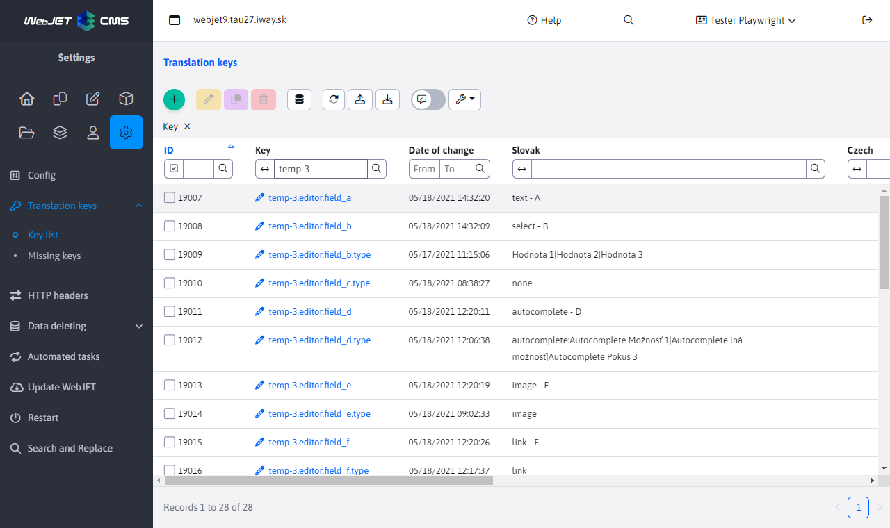

## Link to domain

Translation keys can also be modified according to the current domain. Just set the configuration variable `constantsAliasSearch` to `true`, which activates the search for configuration variables and translation keys with the domain prefix. For example, if you have a domain `demo.webjetcms.sk`, you can create configuration variables of type `demo.webjetcms.sk-installName` but also translation keys of type `demo.webjetcms.sk-editor.field_x.type=link`.

However, the domain can change, so we recommend creating so-called domain aliases. These can be set to the same value for multiple domains (e.g. for test and production domains) and when changing the domain, it is not necessary to rename all keys and configuration values. You define the alias in the configuration as a new variable with the name `multiDomainAlias:demo.webjetcms.sk` and the value e.g. `demo`. Subsequently, in the key prefixes, you can use the prefix `demo` instead of the entire domain.