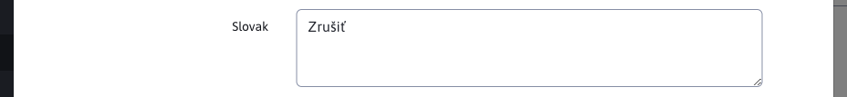
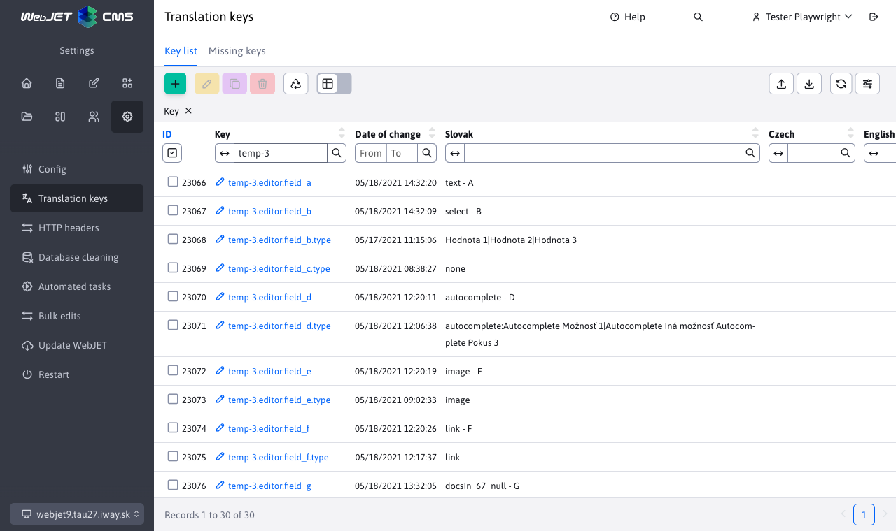

# Optional fields

Some dialogs have an optional fields tab where you can set optional attributes (values, texts) according to your needs. The values can then be transferred and used in the design template as:

```html
Web stránka:
<iwcm:write name="field_a"/> až <iwcm:write name="field_t"/>

Adresár:
<iwcm:write name="group_field_a"/> až <iwcm:write name="group_field_d"/>
```

The names Field A - Field X can be changed in the configuration in the text editing section. Just modify the keys:
- `editor.field_x` - for web page
- `temp-ID.editor.field_x` - for web page with template `ID`, e.g. `temp-3.editor.field_a` changes the name of the free A field only for web pages that use a template with `ID` 3.
- `groupedit.field_x` - for directory
- `user.field_x` - for the user
- `components.qa.field_x` - for the Q&A app
- `components.banner.field_x` - for the Banner System application
- `components.media.field_x` - for the Media app
- `components.perex.field_x` - for the Brands app
- `components.invoice.field_x` - for the E-Commerce application

Technical information can be found in [documentation for the programmer](../../../developer/datatables-editor/customfields.md).

## Field types

Fields are displayed as text by default, by changing the definition via translation keys it is possible to change the field types.


!>**Warning:**, **type setting** must always be set for the default language (set in the configuration variable `defaultLanguage`), even if WebJET is used in another language.

### Text


Field type `text` is a standard text field. However, it is possible to limit the maximum size of the field and display a warning even after a specified number of characters:
- `editor.field_x.type=text` - standard text field with a maximum size of 255 characters
- `editor.field_x.type=text-10` - standard text field with a maximum size of 10 characters
- `editor.field_x.type=text-160, warningLength-50` - standard text field with a maximum of 160 characters, after entering 50 characters a warning will be displayed about exceeding the recommended text length (e.g. Google recommends the description field to be 50-160 characters long)

When the specified number of characters is reached in the setting `warninglength` a warning will appear. Example of such a warning :


The text of the warning itself is obtained from a translation key that you need to prepare, which consists of `prefix.field_x.warningText`. The handle of the previous message is defined as `editor.field_J.warningText=hláška...`.

### Text area

Field type `textarea` is a standard text (multi-line) area.
- `editor.field_x.type=textarea` - standard text area



### Non-editable text

To display plain text, you can set the ty field to `label`. The value is only displayed without the possibility of editing it.

- `editor.field_x.type=label` - non-editable text


### Selection field


To select from predefined values, it is possible to enter the `.type` enter possible values separated by a character `|`:

`editor.field_x.type=Hodnota 1|Hodnota 2|Hodnota 3`

If you want to be able to **set a blank value** start the list of options with the value `|`:

`editor.field_x.type=|Hodnota 1|Hodnota 2|Hodnota 3`

### Multiple choice selection box


If multiple choice is to be used, the value is prefixed with `multiple`:

`editor.field_x.type=multiple:Hodnota 1|Hodnota 2|Hodnota 3`

The values are then stored in a field separated by a character `|`

`Hodnota 1|Hodnota 3`

### Boolean value

To enter a Boolean/binary value, type in `.type` Option `boolean`.

### Number

To enter a numeric value, type in `.type` Option `number`.

### Date

To enter the date, type in `.type` Option `date`.

### Do not show

If you need to hide unused fields you can use a field of type `none`.

`editor.field_x.type=none`

### Autocomplete


Field type `autocomplete` works similarly to the selection field, but allows you to enter a value other than the default options. The function is enabled by prefix `autocomplete:` in possible values separated by a sign `|`. At the same time, the default options are displayed consecutively after entering at least 3 characters:

`temp-3.editor.field_d.type=autocomplete:Autocomplete Možnosť 1|Autocomplete Iná možnosť|Autocomplete Pokus 3`

### Image selection


The image selection field has the type `image`. Displays the standard dialog for uploading/selecting an existing image.

`editor.field_x.type=image`

### Link selection


Similar to the image, the setting is `.type` to the value of `link` possible to open a link selection to a file or another web page:

`editor.field_x.type=link`

### Selecting an existing page from the directory


To select an existing page (its `docId`) it is possible to use the type `docsIn_GROUPID`:
- `editor.field_x.type=docsIn_67` - displays the page selection from the 67 directory
- `editor.field_x.type=docsIn_67_null` - by adding `null` it is also possible to select a blank option at the end of the type (do not set any page)

### Directory


The connection to the dialer is via type `enumeration_X` where X is the ID of the dial type. The value is set to the ID of the record from the dial:
- `editor.field_x.type=enumeration_2` - displays options from dial type 2 as a selection field

### Selecting a filesystem directory


To select a directory in the file system by setting `.type` to the value of `dir`. Click the cross icon at the end of the text box to display a dialog box for selecting a directory on the file system.

`editor.field_x.type=dir`

### Unique identifier

Field type `uuid` allows you to generate a unique identifier. If a field has a blank value when displayed, a new `uuid` Similarly, when you delete a value and move the cursor to another field, a new value is generated.


### Colour

Field type `color` allows you to select the colour, including the translucency setting.


## Link to template

In some cases, it is necessary to have different names and options for optional fields defined by page/directory template or by template group. WebJET allows you to set translation keys with prefix `temp-ID.` for the template, or with the prefix of the translation texts set in the template group:
- `temp-ID.editor.field_x=Pole X` - setting the field name for the template with the specified `ID`
- `temp_group_prefix.editor.field_x=Pole X` - setting the field name for a template group that has the Text Key Prefix set to `temp_group_prefix`



## Link to domain

Translation keys can also be modified according to the current domain. Just set the configuration variable `constantsAliasSearch` at `true`, which activates the search for configuration variables and translation keys with the domain prefix. For example, if you have a domain `demo.webjetcms.sk` it is possible to create configuration variables of type `demo.webjetcms.sk-installName` but also translation keys of the type `demo.webjetcms.sk-editor.field_x.type=link`.

However, the domain can change, so we recommend creating so-called domain aliases. These can be set to the same value for multiple domains (e.g. for test and production domains) and when changing domains, it is not necessary to rename all keys and configuration values. You define an alias in the configuration as a new variable named `multiDomainAlias:demo.webjetcms.sk` and value e.g. `demo`. You can then use the prefix in the key prefixes `demo` instead of the entire domain.
