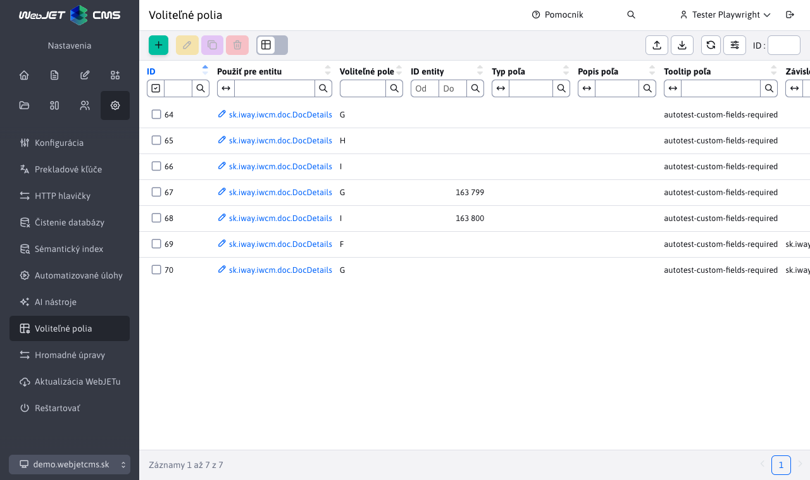

# Optional Fields Table

The Optional Fields table allows you to centrally set the properties of optional fields for various entities in the system. The settings are located in the `Nastavenia` menu under the `Voliteľné polia` item. Using this table, you can set the parameters of a mandatory field without having to edit translation keys.

!>**Note:** Currently ONLY the **Required Field** parameter setting works, the rest of the settings will be implemented in the future.

## Table columns

The table contains the following columns:

| Column | Description |
| --- | --- |
| **Use for entity** | The name of the entity class (e.g. `sk.iway.iwcm.doc.DocDetails`) for which the setting is applied. The field supports autocomplete - after entering at least 1 character, suggestions of available entities that use optional fields will be displayed. |
| **Optional field** | The letter of the alphabet (AZ) that identifies the optional field. Corresponds to the field names `field_A`, `field_B`, etc. |
| **Entity ID** | Optional ID of a specific entity (e.g. page ID). If not specified, the setting is applied globally to all entities of the given class. |
| **Field type** | The type of optional field (e.g. `text`, `textarea`, `boolean`, `number`, etc.). |
| **Field description** | The description (label) that will be displayed next to the optional field in the editor. |
| **Field tooltip** | The tooltip text that appears when you hover over an icon<i class="ti ti-info-circle"></i> . |
| **Required field** | If set to `true`, the field will be required and will be checked for completion when the entity is saved. |

In the Dependent on tab, the following fields can be set:

| Column | Description |
| --- | --- |
| **Entity dependent** | The name of the class this setting depends on, used only for `DocDetails` web pages where it is possible to have a template dependency, set `sk.iway.iwcm.doc.TemplateDetails` |
| **Dependent Entity ID** | The ID of the entity on which the setting depends, if the optional field should be set this way only for the template with ID 6, set the value to 6 |

## Setting priority

The settings are applied in order of priority:

1. **Global settings** - records without a filled in `ID entity` apply to all entities of the given class.
2. **Specific settings** - records with `ID entity` filled in have higher priority and will override the global settings for the given identifier.
3. **Dependent on** - for some entities (e.g. `DocDetails`), the template context (`TemplateDetails`) is also automatically applied according to the template ID used, which has the highest priority.

For example, for a web page (`DocDetails`), field A can be set as mandatory globally (without an entity ID), but for pages with a template with a specific ID, this requirement can be overridden.

## Validation

The combination of fields `Použiť pre entitu`, `Označenie poľa` and `ID entity` must be unique. The system will not allow a duplicate record to be created with the same combination of these values.

## Required fields

If the `Povinné pole` flag is enabled for an optional field, the system automatically:

- Marks a field as mandatory in the editor (a visual indication of a mandatory field is displayed).
- When saving an entity, it checks if the field is filled in. If it is not, it displays an error message and the save is not allowed.
