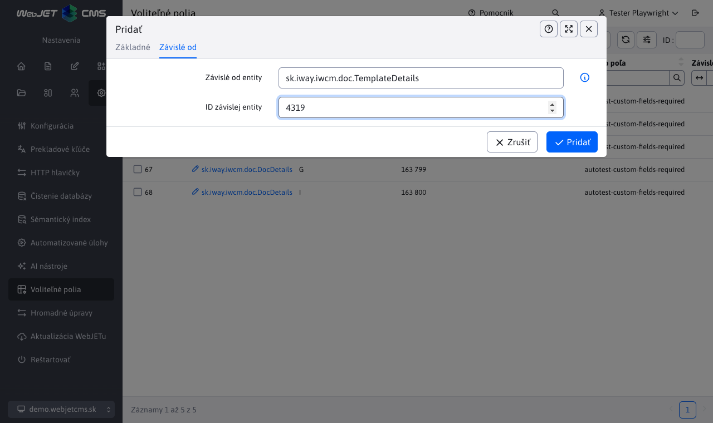

# Optional Fields Table

The Optional Fields table allows you to centrally set the properties of optional fields for various entities in the system. The settings are located in the `Nastavenia` menu under the `Voliteľné polia` item. Using this table, you can change the field type, description, obligation, tooltip, and type-specific parameters without having to edit translation keys.


## Table columns

The table contains the following columns:

| Column | Description |
| --- | --- |
| **Use for entity** | The name of the entity class (e.g. `sk.iway.iwcm.doc.DocDetails`) for which the setting is applied. The field supports autocomplete - after entering at least 1 character, suggestions of available entities that use optional fields will be displayed. |
| **Optional field** | The letter of the alphabet (AZ) that identifies the optional field. Corresponds to the field names `field_A`, `field_B`, etc. |
| **Entity ID** | Optional ID of a specific entity (e.g. page ID). If not specified, the setting is applied globally to all entities of the given class. |
| **Field type** | The type of optional field (e.g. `text`, `textarea`, `boolean`, `number`, etc.). |
| **Field description** | The label that will appear next to the optional field in the editor (you can enter a translation key). |
| **Field tooltip** | The tooltip text that appears when you hover over an icon<i class="ti ti-info-circle"></i> . |
| **Required field** | If set to `true`, the field will be required and will be checked for completion when the entity is saved. |


## Supported field types

In the **Field type** field, the available types are:

| Type | Display | Selection |
| --- | --- | --- |
| `text` | Text field | Single-valued |
| `textarea` | Text area (multiple lines) | Single-valued |
| `select` | Dropdown | Single-valued |
| `multiselect` | Multiple-value selection field | Multivalued (values ​​separated by `\|`) |
| `radio` | List of radio buttons | Single-valued |
| `checkbox` | Checkbox list | Multivalued (values ​​separated by `\|`) |
| `boolean` | Yes/No switch | Single-valued |
| `number` | Numeric field | Single-valued |
| `date` | Date selection | Single-valued |
| `autocomplete` | Text box with suggestions | Single-valued |
| `image` | Image selection | Single-valued |
| `link` | Link selection | Single-valued |
| `json_group` | Selecting a website folder | Single-valued |
| `json_doc` | Website selection | Single-valued |
| `dir` | Selecting a file system folder | Single-valued |
| `docsIn` | Selecting an existing page from the directory | Single-valued |
| `uuid` | Automatically generated unique identifier | Single-valued |
| `color` | Color selection including translucency | Single-valued |
| `none` | The field is not displayed. | — |

!>**Warning:** The type `enumeration` is no longer a separately available field type in the table. The link to the code list is set as the **option source** for the types `select`, `multiselect`, `radio` and `checkbox` (see [Option source](#option-source)).

## Settings by type

When changing a field type, additional fields that belong only to that type are dynamically displayed in the editor:

| Field type | Additional settings |
| --- | --- |
| `text` | **Maximum text length**, **Text length for warning display**, **Warning text** |
| `select`, `multiselect`, `radio`, `checkbox` | **Options Source** (**Static Options** / **Dial** toggle) |
| `autocomplete` | list of options (editor of type `OPTIONS_SIMPLE`, single-valued rows) |
| `docsIn` | **Website Folder Selection** (specifies the source of the pages for selection) |

### Required field behavior by type

If **Required field** is disabled for types `select`, `docsIn`, `json_group`, `json_doc`, the editor will automatically offer an empty value. For types `radio` and `checkbox`, disabled required field means that the user does not have to select any option.

### Source of options

For types `select`, `multiselect`, `radio` and `checkbox` you can change the source of options using the **Source of options** switch:

- **Static Options** - displays the **Options for Select Field** field (editor type `OPTIONS`, rows `label:value`). Used for a fixed list of options specified directly in the settings.
- **Codebook** - displays the **Link to Codebook** field with the `ID číselníka`, `label` column, and `value` column settings. The options are loaded dynamically from the selected codebook.

#### Static options

Static options are entered in the **Select Field Options** field in the format `label:value`, each option on a new line. If `label` and `value` are the same, you only need to enter one value:

```
Slovensko:sk
Česko:cz
Rakúsko:at
```

#### Link to dialer

When selecting the **Dialbook** source, the **Link to Dialbook** field appears, where you can set:

- **Codebook ID** - identifier of the codebook type from which the options are loaded
- **Label column** - property from the code list used as the displayed text (by default `string1`)
- **Value column** - property from the code list used as the stored value (by default `string1`)

You can use any property from the code list: `string1` to `string12`, `decimal1` to `decimal4`, `boolean1` to `boolean4`, `date1` to `date4`, `id`.

### Difference between select/multiselect and radio/checkbox

The types `select` and `radio` allow the selection of exactly one value, but differ in their display:

- **`select`** - will be displayed as a dropdown list
- **`radio`** - displayed as a list of radio buttons, all options are visible at once

The types `multiselect` and `checkbox` allow the selection of multiple values:

- **`multiselect`** - will appear as a drop-down list with multiple selections
- **`checkbox`** - displayed as a list of checkboxes, all options are visible at once

For multi-valued types (`multiselect`, `checkbox`), the selected values ​​are stored in an array separated by the `|` character.

### Backward compatibility with enumeration type

Older records with type `enumeration` will automatically be displayed as type `select` with option source `Číselník` when opened in the editor. The next time they are saved, the type will be saved as `select`. The original codebook configuration will be preserved.

## Dependent on tab

In the **Dependent on** tab, the following fields can be set:

| Column | Description |
| --- | --- |
| **Entity dependent** | The name of the class this setting depends on, used only for `DocDetails` web pages where it is possible to have a template dependency, set `sk.iway.iwcm.doc.TemplateDetails` |
| **Dependent Entity ID** | The ID of the entity on which the setting depends, if the optional field should be set this way only for the template with ID 6, set the value to 6 |



## Setting priority

The settings are applied in order of priority:

1. **Global settings** - records without a filled in `ID entity` apply to all entities of the given class.
2. **Specific settings** - records with `ID entity` filled in have higher priority and will override the global settings for the given identifier.
3. **Dependent on** - for some entities (e.g. `DocDetails`), the template context (`TemplateDetails`) is also automatically applied according to the template ID used, which has the highest priority.

For example, for a web page (`DocDetails`), field A can be set as mandatory globally (without an entity ID), but for pages with a template with a specific ID, this requirement can be overridden.

## Validation

The combination of fields `Použiť pre entitu`, `Voliteľné pole`, `ID entity`, `Závislé od entity` and `ID závislej entity` must be unique. The system will not allow you to create a duplicate record with the same combination of these values.

## Required fields

If the `Povinné pole` flag is enabled for an optional field, the system automatically:

- Marks a field as mandatory in the editor (a visual indication of a mandatory field is displayed).
- When saving an entity, it checks if the field is filled in. If it is not, it displays an error message and the save is not allowed.

For types `checkbox`, the obligation check is evaluated so that at least one option must be checked. For types `radio`, exactly one option must be selected.
