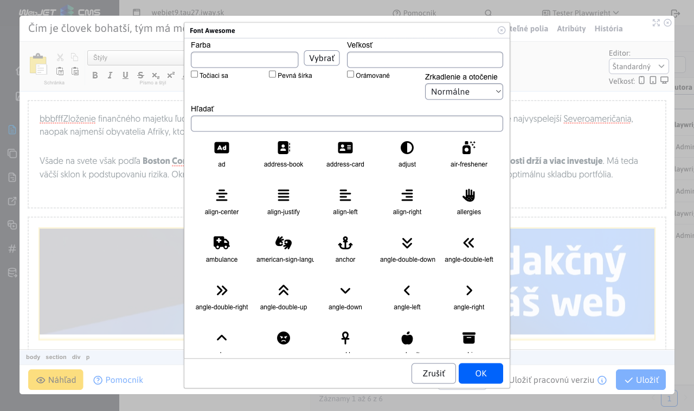

# FontAwesome

WebJET in the editor supports inserting icons from a set of [FontAwesome](https://fontawesome.com) by clicking on the icon , which will bring up a window for inserting the FontAwesome icon into the page.



Icons can be searched by their name and clicking OK will insert the icon into the web page.

## Activating the extension

The extension is activated by setting the path to the CSS files `FontAwesome` via configuration variable `editorFontAwesomeCssPath` where you set the path to the CSS files. Multiple files can be specified on a new line, for example:

```
/templates/jet/assets/fontawesome/css/fontawesome.css
/templates/jet/assets/fontawesome/css/solid.css
```

Once set up, the page editor toolbar will begin to show an icon for inserting the FontAwesome icon. Of course, the CSS style paths must also be set in the web page template for the icon to display correctly. Set the same paths in the field **Main CSS style** Templates.

## Additional icons

The standard icon list contains basic icons based on the version 4 icon set. If you need to insert icons from newer sets you can add them to the configuration variable `editorFontAwesomeCustomIcons` in format `css-name:text` each on a new line, for example:

```
fa-wand-magic-sparkles:Super Magic Wand
fa-wheelchair-move:Wheelchair Move
```
