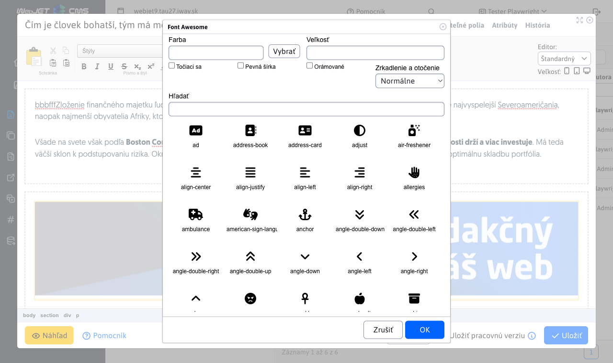

# FontAwesome

WebJET supports inserting icons from the [FontAwesome](https://fontawesome.com) set in the editor by clicking on the  icon, which will display a window for inserting an icon from the FontAwesome set into the page.



Icons can be searched for by their name and clicking OK will insert the icon into the web page.

## Activating the extension

The extension is activated by setting the path to the CSS files `FontAwesome` via the configuration variable `editorFontAwesomeCssPath` in which you set the path to the CSS files. Multiple files can be entered on a new line, for example:

```
/templates/jet/assets/fontawesome/css/fontawesome.css
/templates/jet/assets/fontawesome/css/solid.css
```

After setting up, an icon for inserting the FontAwesome icon will appear in the toolbar of the page editor. Of course, the paths to the CSS styles must also be set in the website template for the icon to display correctly. Set the same paths in the **Main CSS Style** field of the template.

## Additional icons

The standard icon list contains basic icons based on the version 4 set. If you need to include icons from newer sets, you can add them to the configuration variable `editorFontAwesomeCustomIcons` in the format `css-name:text` each on a new line, for example:

```
fa-wand-magic-sparkles:Super Magic Wand
fa-wheelchair-move:Wheelchair Move
```
