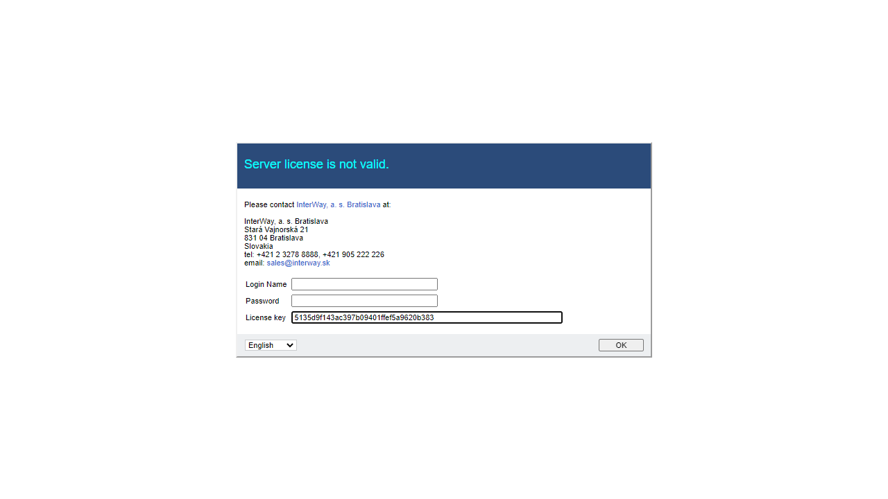
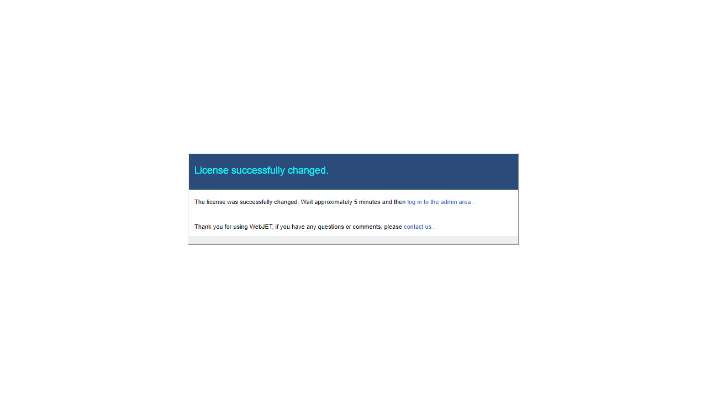

# Setting the license number

The license number for WebJET is entered in the Settings/Configuration section in the conf. variable `lisense`. It is possible to have additional licenses for additional domains (e.g. when using the Enterprise license) in the conf. variable `licenseDomains` where each additional domain license is entered on a new line.

## Incorrect licence number

If WebJET contains a license number with an expired expiration date, an incorrect domain name, or the license number is entered incorrectly, the option to update the license number will be displayed in the server logs after logging in to administration, and will be displayed in the server logs at startup:

```log
[webjet][s.i.i.InitServlet][INFO][0] 2023-10-02 09:27:30 - -----------------------------------------------
[webjet][s.i.i.InitServlet][INFO][0] 2023-10-02 09:27:30 - WebJET initializing, root: /www/tomcat/webapps/webjet
[webjet][s.i.i.InitServlet][INFO][0] 2023-10-02 09:27:30 -
[webjet][s.i.i.InitServlet][INFO][0] 2023-10-02 09:27:30 - VERSION: 9

[webjet][s.i.i.InitServlet][INFO][0] 2023-10-02 09:27:30 - Checking database connection:
[webjet][s.i.i.InitServlet][INFO][0] 2023-10-02 09:27:30 -    Database connection: [OK]
[webjet][s.i.i.InitServlet][INFO][0] 2023-10-02 09:27:30 - INIT (db): license=xxxxxxxxxxxxxxxxxxxxxxxxxxxxxxx
[webjet][s.i.i.InitServlet][INFO][0] 2023-10-02 09:27:30 - License is valid until: 01.06.2022 23:59:59
[webjet][s.i.i.InitServlet][INFO][0] 2023-10-02 09:27:30 - ERROR: License is out of date, please contact
  InterWay (www.interway.sk)
  for new license.
```

If the option to enter a license number does not appear automatically when you open the administration section, open the address `/wjerrorpages/setup/license`.



Enter your login credentials to verify your administrative privileges and your new license key. Click OK to save. You will see a confirmation of the save:



If the application server does not restart automatically, restart the application server. The restart will use the specified license number.

## Enter the license number directly into the database

If you cannot enter the license number through the web interface, you can use the following SQL statement directly on the database server:

```sql
UPDATE _conf_ SET value='xxx' WHERE name='license';
```

for Oracle use the notation:

```sql
UPDATE webjet_conf SET value='xxx' WHERE name='license';
```
