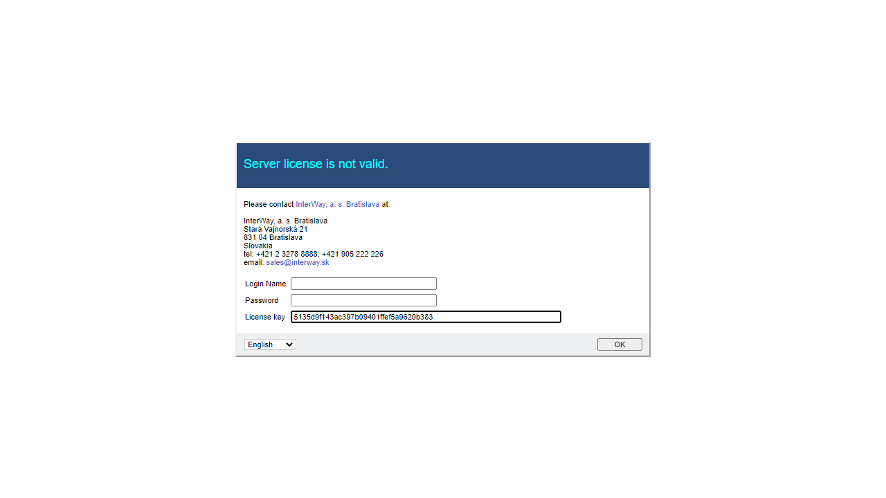
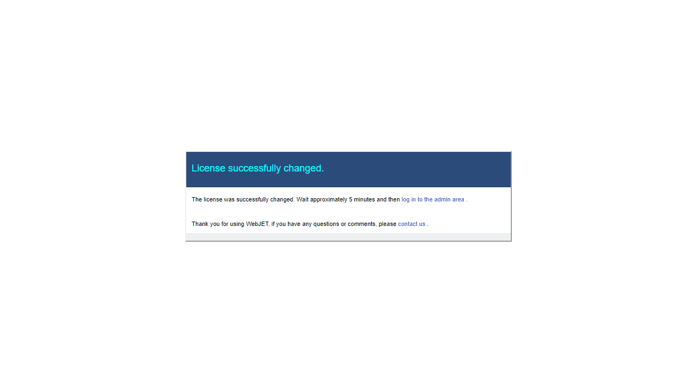
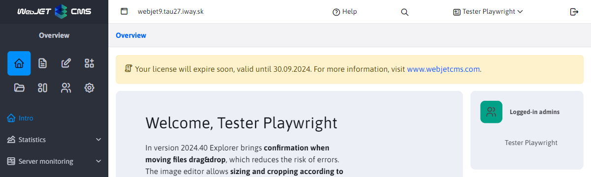

# Setting the license number

The license number for WebJET is entered in the Settings/Configuration section in the config variable `lisense`. In addition to the main license, it is possible to have additional licenses set for other domains (e.g. when using an Enterprise license) in the config variable `licenseDomains` where each additional domain license is entered on a new line.

## Incorrect license number

If WebJET contains a license number with an expired validity date, an incorrect domain name, or the license number is entered incorrectly, the option to update the license number will appear after logging into the administration, and the server logs will display the following at startup:

```log
[webjet][s.i.i.InitServlet][INFO][0] 2023-10-02 09:27:30 - -----------------------------------------------
[webjet][s.i.i.InitServlet][INFO][0] 2023-10-02 09:27:30 - WebJET initializing, root: /www/tomcat/webapps/webjet
[webjet][s.i.i.InitServlet][INFO][0] 2023-10-02 09:27:30 -
[webjet][s.i.i.InitServlet][INFO][0] 2023-10-02 09:27:30 - VERSION: 9
[webjet][s.i.i.InitServlet][INFO][0] 2023-10-02 09:27:30 - Checking database connection:
[webjet][s.i.i.InitServlet][INFO][0] 2023-10-02 09:27:30 -    Database connection: [OK]
[webjet][s.i.i.InitServlet][INFO][0] 2023-10-02 09:27:30 - INIT (db): license=xxxxxxxxxxxxxxxxxxxxxxxxxxxxxxx
[webjet][s.i.i.InitServlet][INFO][0] 2023-10-02 09:27:30 - License is valid until: 01.06.2022 23:59:59
[webjet][s.i.i.InitServlet][INFO][0] 2023-10-02 09:27:30 - ERROR: License is out of date, please contact
  InterWay (www.interway.sk)
  for new license.
```

If the option to enter the license number does not appear automatically after opening the administration section, open the address `/wjerrorpages/setup/license`.



Enter your login details to verify your administration privileges and a new license key. Click OK to save. A confirmation of the save will be displayed:



If the application server does not restart automatically, restart the application server. The entered license number will be used when restarting.

## Entering the license number directly into the database

If you are unable to enter the license number via the web interface, you can use the following SQL command directly on the database server:

```sql
UPDATE _conf_ SET value='xxx' WHERE name='license';
```

for Oracle use the notation:

```sql
UPDATE webjet_conf SET value='xxx' WHERE name='license';
```

## License expiration

WebJET can automatically detect when your license is about to expire. If it detects that your license will expire in 2 (or less) months, it will display a warning in the introductory section.

