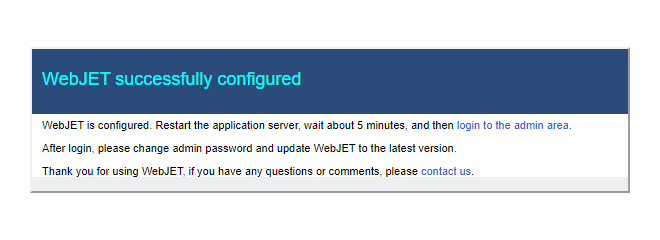
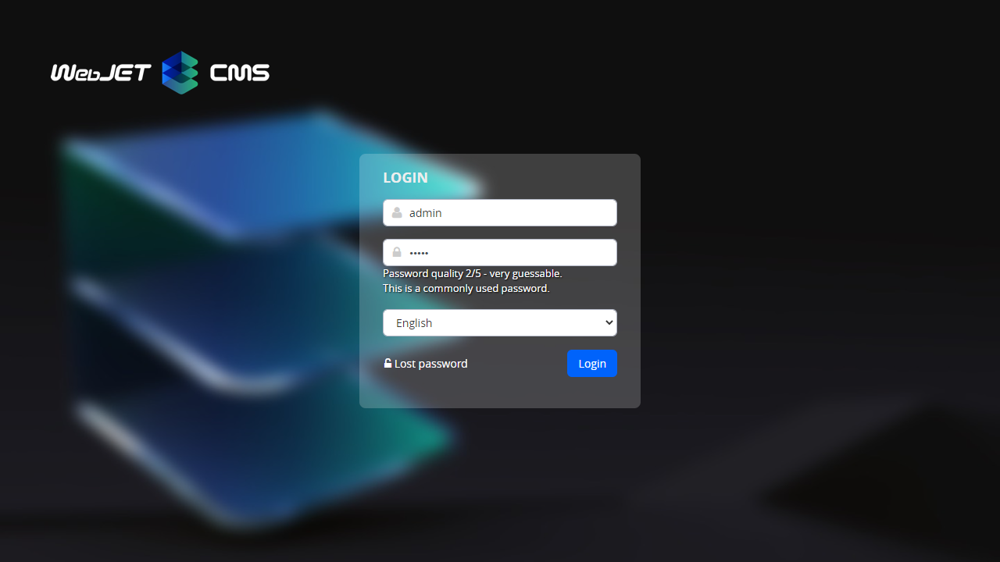
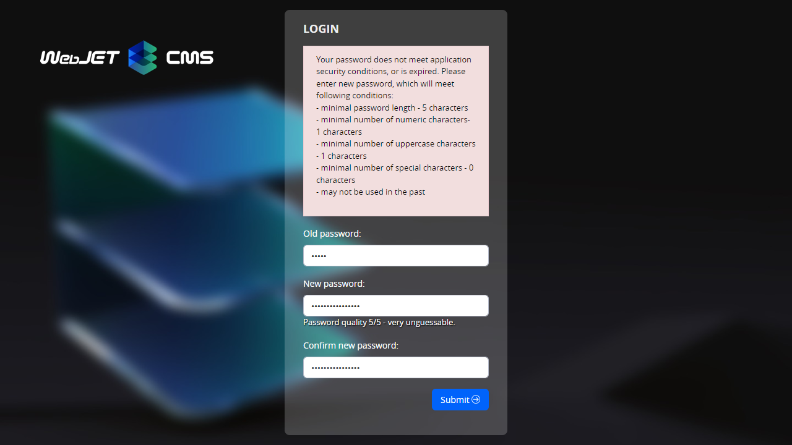
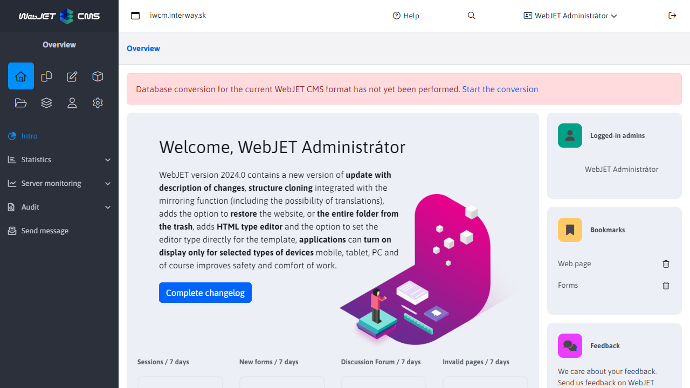
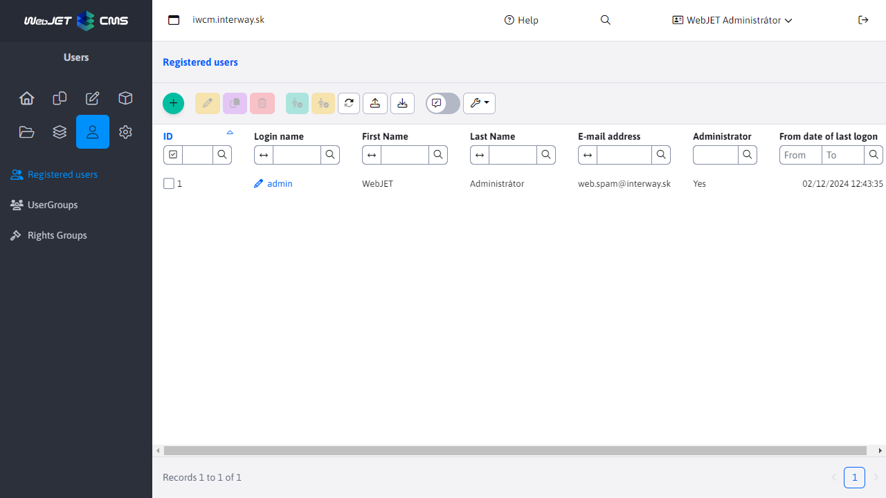
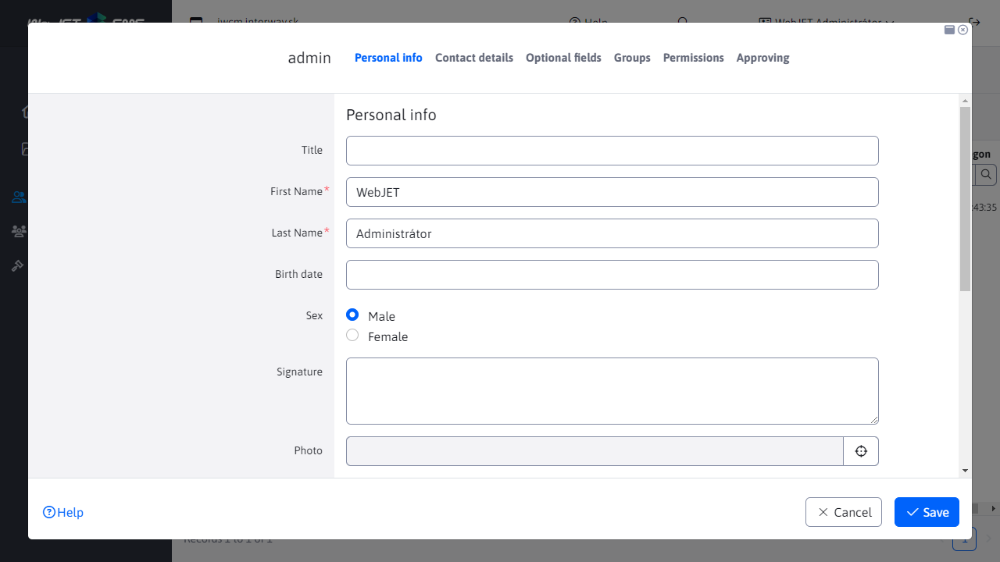
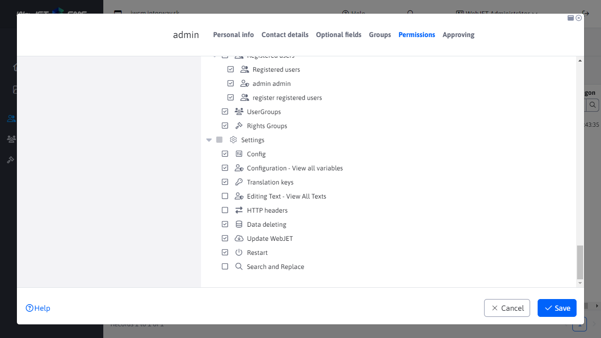

# Setting up a new installation

Instructions for creating a new installation/clean database for a new project in WebJET. Installation is only allowed on the domain for security reasons `localhost`, after installation you can use the standard domain name.

## Prerequisites

- locally functional WebJET (configured Tomcat, web application)
- access to a DB server with rights to create a new DB schema (or an already established DB schema)

## Basic server requirements

- Server with at least 8GB of memory (for applications with heavier workloads, at least 12GB), processor with at least `Dual Core 2 GHz` (for servers with a heavier Quad core load), disk space of at least 40GB.
- Database `MySQL/MariaDB verzie 5.0+` (UTF-8 encoded), or the database `Microsoft SQL 2012+` or database `Oracle 11g+`.
- [Open JDK](https://adoptium.net/temurin/releases/) version 17 and application server [Tomcat](https://tomcat.apache.org/download-90.cgi) 9.
- Connection to SMTP server for sending emails.
- Functional DNS server.
- To speed up the generation of preview images, we recommend the installed library [ImageMagick](https://imagemagick.org/script/download.php).
For installations of products such as `NET, LMS, DSK` the minimum requirements suitable for installations of up to 50 users (25 working simultaneously). For a higher number of users, it is necessary to increase the RAM and the CPU appropriately - for each additional 50 users working simultaneously +4GB of memory and 1CPU. For more than 200 users we recommend a cluster solution.

For installations of products such as `NET, LMS, DSK` it is necessary to enable on the server `websocket` connect and install the server [RabbitMQ](https://www.rabbitmq.com/).

## Creating a DB schema

- connect to the DB server and create a new database/schema (if not already established)

- in the file `src/main/resources/poolman.xml` in the gradle project, or `/WEB-INF/classes/poolman.xml` when using a ready-made WAR file, set up a database connection:
[MariaDB](https://mariadb.com/kb/en/library/about-mariadb-connector-j/):

```xml
<?xml version="1.0" encoding="UTF-8"?>

<poolman><management-mode>local</management-mode>
    <datasource>
      <dbname>iwcm</dbname>
      <jndiName>jndi-iwcm</jndiName>
      <driver>com.mysql.jdbc.Driver</driver>
      <url>jdbc:mysql://MENO-SQL-SERVERA/MENO-SCHEMY</url>
      <username>DB-LOGIN</username>
      <password>DB-HESLO</password>
  </datasource>
</poolman>
```

[Microsoft SQL](http://jtds.sourceforge.net/faq.html):

```xml
<?xml version="1.0" encoding="UTF-8"?>

<poolman><management-mode>local</management-mode>
  <datasource>
      <dbname>iwcm</dbname>
      <driver>net.sourceforge.jtds.jdbc.Driver</driver>
      <url>jdbc:jtds:sqlserver://MENO-SQL-SERVERA:1433/MENO-SCHEMY;encoding=utf-8</url>
      <username>DB-LOGIN</username>
      <password>DB-HESLO</password>
  </datasource>
</poolman>
```

[Oracle](https://docs.oracle.com/en/database/oracle/oracle-database/23/jajdb/):

```xml
<?xml version="1.0" encoding="UTF-8"?>

<poolman><management-mode>local</management-mode>
  <datasource>
      <dbname>iwcm</dbname>
      <driver>oracle.jdbc.OracleDriver</driver>
      <url>jdbc:oracle:thin:@MENO-SQL-SERVERA:1521/MENO-INSTANCIE</url>
      <username>DB-LOGIN</username>
      <password>DB-HESLO</password>
  </datasource>
</poolman>
```

## Fulfillment of the DB scheme

WebJET includes a built-in configuration that can populate an empty DB schema.

- run WebJET/Tomcat
- WebJET reports an error (multiple errors) at startup
```log
[27.11 8:32:49 {webjet} {InitServlet}] -----------------------------------------------
[27.11 8:32:49 {webjet} {InitServlet}] WebJET initializing, root: ...
[27.11 8:32:49 {webjet} {InitServlet}]

[27.11 8:32:49 {webjet} {InitServlet}] Checking database connection:
[27.11 8:32:49 {webjet} {InitServlet}]    Database connection: [OK]
java.sql.SQLSyntaxErrorException: Table 'MENO-SCHEMY._conf_' doesn't exist
...
[27.11 8:32:49 {webjet} {InitServlet}] ERROR: Server not configured.
[27.11 8:32:49 {webjet} {InitServlet}] ERROR: Server not configured.
[27.11 8:32:49 {webjet} {InitServlet}] ERROR: Server not configured.
...
```

When you try to log in or access the WebJET website, you will receive an error message:


- Open the URL in your browser [installations](http://localhost/wjerrorpages/setup/setup).
> WebJET everything that starts with `/wjerrorpages/` will process even if it is not started. Automatically provides a static file [/wjerrorpages/dberror.html](http://localhost/wjerrorpages/dberror.html) for any GET request. In the directory `/wjerrorpages/` it is also possible to have images, but we recommend to insert them via `data:` entry directly into `dberror.html`.

- The above URL has an exception and is allowed to be used even if WebJET is not started correctly (but only on the domain `localhost` or `iwcm.interway.sk`).

- You will be presented with the WebJET installation dialog:


- Check/enter the data for setting the database connection (defaults to the values from the poolman.xml file). The installation makes the connection directly to those values (ignoring the values in poolman.xml), so it needs them. But if the file `poolman.xml` already exists, it will not overwrite it, so for the next start the values in `poolman.xml`. If the file does not exist, it will be created according to the specified values.
- Enter a unique installation name (without spaces and accents, e.g. `interway2023`) and license number (if you are not using the Open Sorce version) and check the other values.

- Click OK to start the installation. If the validation of the entered values is successful, you will see the following message:



In the background WebJET fills the initial data (according to `/WEB-INF/sql/blank_web_DBTYPE.sql`) and then performs a reboot. If the reboot is not performed automatically (the server is not set to reboot automatically), restart the application server manually.

In the logo you should see something like:

```log
fillEmptyDatabaseMySQL
fillEmptyDatabaseMySQL 1
AbandonedObjectPool is used (org.apache.commons.dbcp.WebJETAbandonedObjectPool@727687f7)
   LogAbandoned: true
   RemoveAbandoned: true
   RemoveAbandonedTimeout: 600
fillEmptyDatabaseMySQL 2
hasDatabase=false

#
# Table structure for table '_conf_'
#

CREATE TABLE _conf_ (
  name varchar(255) NOT NULL default '',
  value varchar(255) NOT NULL default '',
  UNIQUE KEY name (name)
) ENGINE=MyISAM;

...


#
# Dumping data for table 'users'
#

INSERT INTO users VALUES("1", "", "", "Administrátor", "admin", "d7ed8dc6fc9b4a8c3b442c3dcc35bfe4", "1", NULL, "Interway s.r.o.", "Hattalova 12/a", "", "lubos.balat@interway.sk", "83103", "Slovakia", "0903-450445", "1", "", NULL, NULL, NULL, NULL, NULL, NULL, NULL, NULL, NULL, NULL, NULL)

Executing:
INSERT INTO users VALUES("2", "", "Obchodny", "Partner", "partner", "34f414bd2609b73403ea09787fb0aac4", "0", "2", "Interway s.r.o.", "Hattalova 12/a", "", "lubos.balat@interway.sk", "83103", "Slovensko", "0903-945990", "1", "", NULL, NULL, NULL, NULL, NULL, NULL, NULL, NULL, NULL, NULL, NULL)

Executing:
INSERT INTO users VALUES("3", "", "VIP", "Klient", "vipklient", "d1a9b4b9977e4829011396ec9dd2cf6a", "0", "1", "Interway s.r.o.", "Hattalova 12/a", NULL, "lubos.balat@interway.sk", "83103", "Slovensko", "0903-945990", "1", NULL, NULL, NULL, NULL, NULL, NULL, NULL, NULL, NULL, NULL, NULL, NULL)
[27.11 9:24:31 {webjet} {InitServlet}] RESTART request ret=true
[27.11 9:24:31 {webjet} {InitServlet}] RESTART request ret=true
```

After a reboot, a schema update is performed according to `autoupdate.xml`:

```
PathFilter init
PathFilterInit - customPath: /Users/jeeff/Documents/DISK_E/webapps-server/ppa
[27.11 9:25:05 {webjet} {InitServlet}] init start
[27.11 9:25:05 {webjet} {InitServlet}] contextDbName=null
Constants - clearValues
[27.11 9:25:05 {webjet} {InitServlet}] dbName=iwcm
[27.11 9:25:05 {webjet} {InitServlet}] -----------------------------------------------
[27.11 9:25:05 {webjet} {InitServlet}] WebJET initializing, root: /Users/jeeff/Documents/workspace-idea/webjet8/WebContent/
[27.11 9:25:05 {webjet} {InitServlet}]

[27.11 9:25:05 {webjet} {InitServlet}] Checking database connection:
[27.11 9:25:05 {webjet} {InitServlet}]    Database connection: [OK]

...

[27.11 9:25:06 {webjet}] update database call
[27.11 9:25:06 {webjet}] ----- Updating database [DBType=3] -----
[27.11 9:25:06 {webjet}]    18.5.2004 [jeeff] vo vyhladavani statistiky sa eviduje remote host [27.11 9:25:06 {webjet}] count=1 [27.11 9:25:06 {webjet}] [1/1] [27.11 9:25:06 {webjet}] [OK] [27.11 9:25:06 {webjet}] [OK]
[27.11 9:25:06 {webjet}]    24.5.2004 [jeeff] tabulka s tipmi dna [27.11 9:25:06 {webjet}] count=1 [27.11 9:25:06 {webjet}] [1/1] [27.11 9:25:06 {webjet}] [OK] [27.11 9:25:06 {webjet}] [OK]
[27.11 9:25:06 {webjet}]    9.6.2004 [joruz] zoznam alarmov pre notifikaciu registracie [27.11 9:25:06 {webjet}] count=1 [27.11 9:25:06 {webjet}] [1/1] [27.11 9:25:06 {webjet}] [OK] [27.11 9:25:06 {webjet}] [OK]

...

[27.11 9:25:39 {webjet}] MeninyImport constructor
[27.11 9:25:39 {webjet}]  -> loading prop [sk]: /text.properties
[27.11 9:25:41 {webjet}] ExcelImportJXL doImport: sheet=meniny
[27.11 9:25:41 {webjet}] header[0]=day;
[27.11 9:25:41 {webjet}] header[1]=month;
[27.11 9:25:41 {webjet}] header[2]=name;
[27.11 9:25:41 {webjet}] header[3]=lng;
[27.11 9:25:41 {webjet}]    importujem meniny: 1.1 (Nový rok, Deň vzniku SR) [sk]
[27.11 9:25:41 {webjet}]    importujem meniny: 2.1 Alexandra [sk]
[27.11 9:25:41 {webjet}]    importujem meniny: 3.1 Daniela [sk]
[27.11 9:25:41 {webjet}]    importujem meniny: 4.1 Drahoslav [sk]
[27.11 9:25:41 {webjet}]    importujem meniny: 5.1 Andrea [sk]
[27.11 9:25:41 {webjet}]    importujem meniny: 6.1 Antónia (Zjavenie pána, Traja králi) [sk]

...

[27.11 9:26:07 {webjet}] 10 tasks should run on this node
[27.11 9:26:07 {webjet}] ---------------- INIT DONE --------------
PathFilterInit - customPath: /Users/jeeff/Documents/DISK_E/webapps-server/ppa
[27.11 9:26:07 {webjet}] ---------------- INIT DONE indexed --------------
[27.11 9:26:07 {webjet}] runRefresh start

...

[webjet][s.i.i.s.s.BaseSpringConfig][INFO][0] 2023-09-29 12:18:13 - -------> Configure security, http=org.springframework.security.config.annotation.web.builders.HttpSecurity@364552cf
[webjet][s.i.i.s.s.SpringSecurityConf][INFO][0] 2023-09-29 12:18:13 - configure - SpringAppInitializer - end - sk.iway.iwcm.system.spring.BaseSpringConfig
[webjet][s.i.i.s.s.SpringSecurityConf][INFO][0] 2023-09-29 12:18:13 - configure - SpringAppInitializer - start - sk.iway.webjet.v9.V9SpringConfig
[webjet][s.i.i.s.s.SpringSecurityConf][INFO][0] 2023-09-29 12:18:13 - configure - SpringAppInitializer - end - sk.iway.webjet.v9.V9SpringConfig
[webjet][s.i.i.s.s.SpringSecurityConf][INFO][0] 2023-09-29 12:18:13 - configure - SpringAppInitializer - start - sk.iway.webjet_init.SpringConfig
[webjet][s.i.i.s.s.SpringSecurityConf][INFO][0] 2023-09-29 12:18:13 - configure - SpringAppInitializer - end - sk.iway.webjet_init.SpringConfig
```

At this point, WebJET is initialized and booted to the default state.

Log in to [section admin](http://localhost/admin/) named `admin` and the password `heslo`:



WebJET will prompt you to change your password:



After logging in, you will see a message on the home screen that the database conversion has not been performed. Click on the link [Start the conversion](http://localhost/admin/update/update_webjet7.jsp) for database conversion.



In the conversion page, start at the end [password hashing](http://localhost/admin/update/update_passwords.jsp) to switch password storage mode to secure `hash`.

We also recommend deleting `STAT` tables as shown in the page (not necessary), for example by inserting commands into [/admin/updatedb.jsp](http://localhost/admin/updatedb.jsp).

```sql
DROP TABLE stat_browser;
DROP TABLE stat_country;
DROP TABLE stat_site_days;
DROP TABLE stat_site_hours;
DROP TABLE stat_doc;
DROP TABLE stat_views;
```

Close the tab in which you have the conversion. In the original window, go to [Users -> List of users](http://localhost/admin/v9/users/user-list/), using the left menu navigation.



Open editing **Admin** Users. When the window appears, check the tabs **Personal data** a **Contact details** your details.



In the charts **Rights** enable the necessary rights. At a minimum, add rights:
- Configuration
- Configuration - view all variables



After setting the rights, log out to apply the new rights and log in again. Once logged in, go to [Settings/Configuration](http://localhost/admin/v9/settings/configuration/) and set the following conf. variables:
- If the server is in an InterWay environment, or is located behind a proxy/load balancer, set the variable `serverBeyoundProxy` to the value of `true`. In this mode, WebJET expects the IP address of the visitor in the HTTP header `x-forwarded-for` and the protocol used in `x-forwarded-proto`.
- You can set the variable `logLevel` to the value of `debug`
- `webEnableIPs`
[](../../frontend/setup/README.md).
