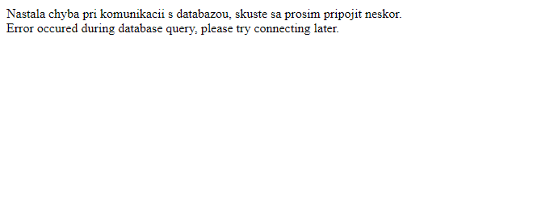
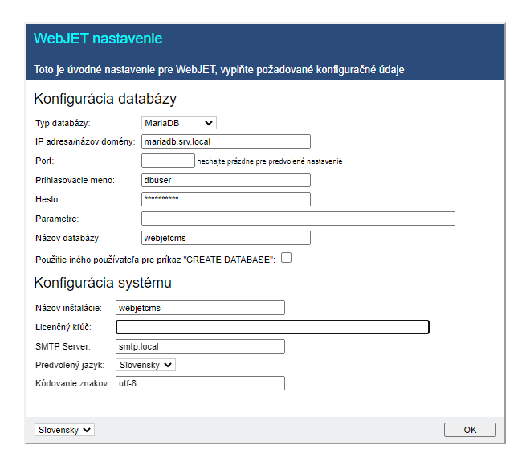
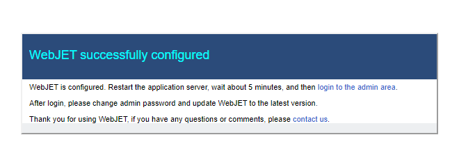
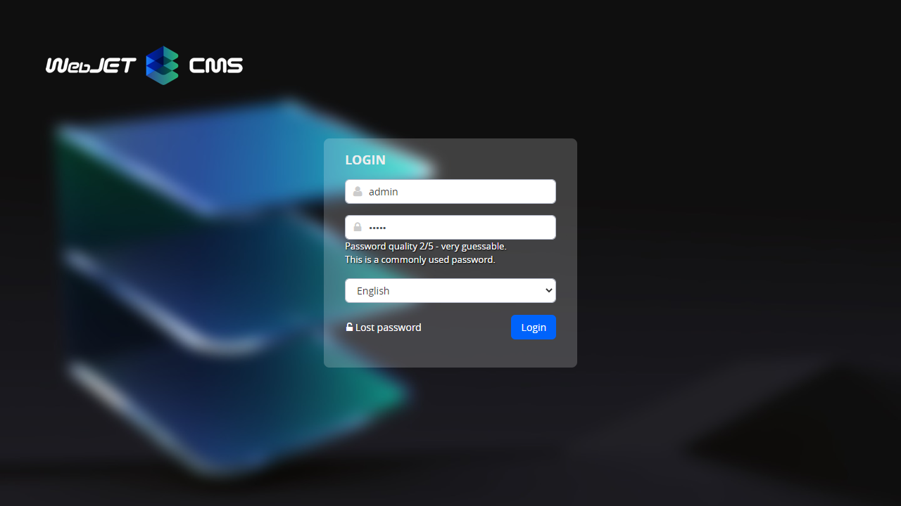
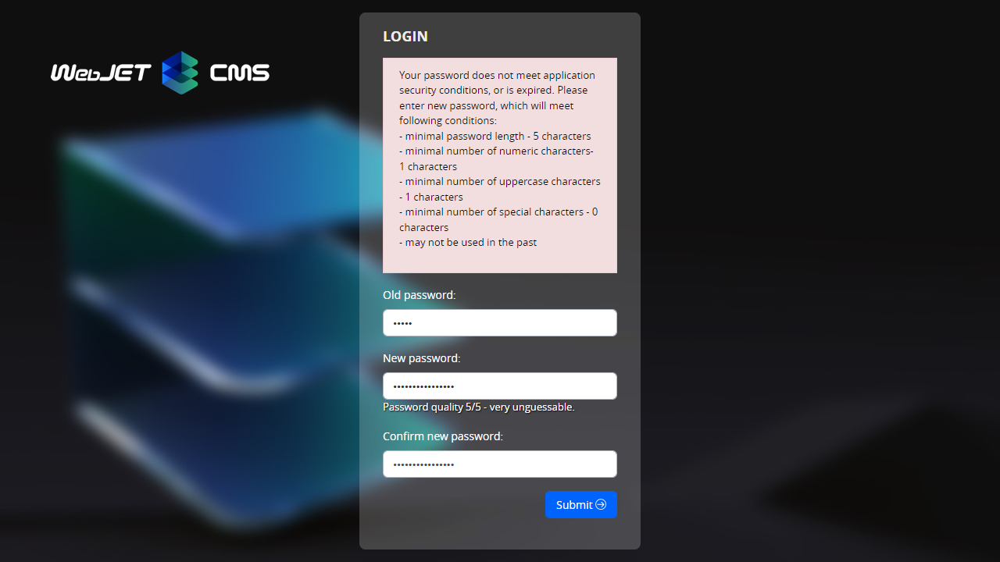
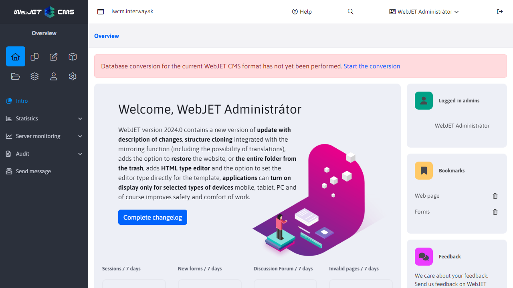
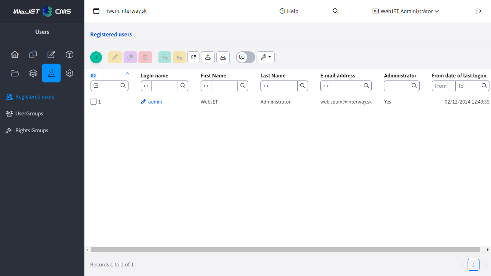
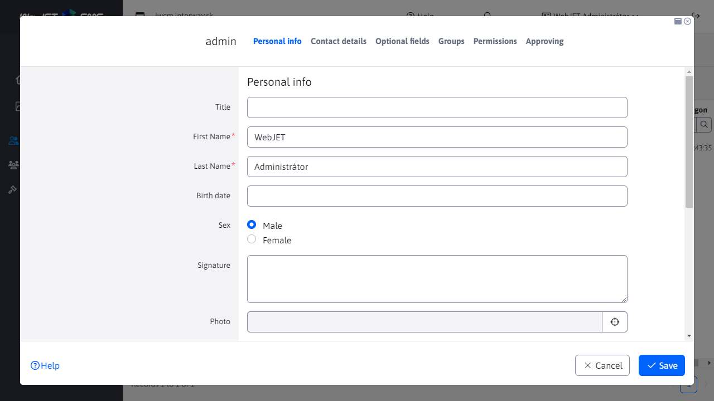
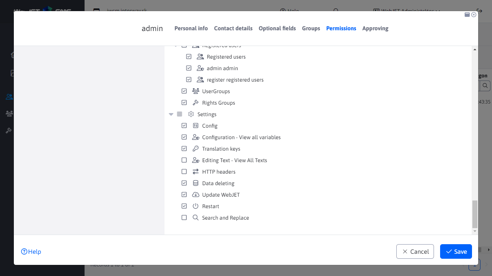

# Setting up a new installation

Instructions for setting up a new installation/clean database for a new project in WebJET. For security reasons, installation is only allowed on the domain `localhost`, after installation you can use a standard domain name.

## Prerequisites

- locally functional WebJET (configured Tomcat, web application)
- access to the DB server with rights to create a new DB schema (or an already created DB schema)

!>**Warning:** if you are setting up a new installation, use the [basecms](https://github.com/webjetcms/basecms) repository as a base, not the [webjetcms](https://github.com/webjetcms/webjetcms) repository. The difference is that `basemcs` is a basic project for using WebJET CMS with the possibility of custom [web site design](../../frontend/README.md) and programming [custom applications](../../custom-apps/README.md). The `webjetcms` repository is intended for the WebJET CMS core programmer and requires [more complex setup](../../developer/install/README.md).

## Basic server requirements

- Server with at least 8 GB of memory (at least 12 GB for applications with a higher load), processor at least `Dual Core 2 GHz` (for servers with a higher load Quad core), disk space at least 40 GB.
- Database `MySQL/MariaDB verzie 5.0+` (with UTF-8 encoding), or database `Microsoft SQL 2012+` or database `Oracle 11g+` or `PostgreSQL 16+`.
- [Open JDK](https://adoptium.net/temurin/releases/) version 17 and [Tomcat](https://tomcat.apache.org/download-90.cgi) application server 9.
- Connection to SMTP server for sending emails.
- A functional DNS server.
- To speed up the generation of preview images, we recommend installing the [ImageMagick](https://imagemagick.org/script/download.php) library.

For installations of products such as `NET, LMS, DSK`, the minimum requirements are suitable for installations up to 50 users (25 working simultaneously). For a higher number of users, it is necessary to increase the RAM and CPU memory appropriately - for every additional 50 users working simultaneously +4GB of memory and 1CPU. For more than 200 users, we recommend a cluster solution.

For installations of products such as `NET, LMS, DSK`, it is necessary to enable `websocket` connection on the server and install the [RabbitMQ](https://www.rabbitmq.com/) server.

## Creating a DB schema

- connect to the DB server and create a new database/schema (if not already established)
- in the file `src/main/resources/poolman.xml` in the gradle project, or `/WEB-INF/classes/poolman.xml` when using a ready-made WAR file, set up the database connection:

[MariaDB](https://mariadb.com/kb/en/library/about-mariadb-connector-j/):

```xml
<?xml version="1.0" encoding="UTF-8"?>

<poolman>
    <datasource>
      <dbname>iwcm</dbname>
      <driver>org.mariadb.jdbc.Driver</driver>
      <url>jdbc:mariadb://MENO-SQL-SERVERA/MENO-SCHEMY</url>
      <username>DB-LOGIN</username>
      <password>DB-HESLO</password>
  </datasource>
</poolman>
```

[Microsoft SQL](http://jtds.sourceforge.net/faq.html):

```xml
<?xml version="1.0" encoding="UTF-8"?>

<poolman>
  <datasource>
      <dbname>iwcm</dbname>
      <driver>net.sourceforge.jtds.jdbc.Driver</driver>
      <url>jdbc:jtds:sqlserver://MENO-SQL-SERVERA:1433/MENO-SCHEMY;encoding=utf-8</url>
      <username>DB-LOGIN</username>
      <password>DB-HESLO</password>
  </datasource>
</poolman>
```

[Oracle](https://docs.oracle.com/en/database/oracle/oracle-database/23/jajdb/):

```xml
<?xml version="1.0" encoding="UTF-8"?>

<poolman>
  <datasource>
      <dbname>iwcm</dbname>
      <driver>oracle.jdbc.OracleDriver</driver>
      <url>jdbc:oracle:thin:@MENO-SQL-SERVERA:1521/MENO-INSTANCIE</url>
      <username>DB-LOGIN</username>
      <password>DB-HESLO</password>
  </datasource>
</poolman>
```

[PostgreSQL](https://jdbc.postgresql.org/documentation/use/):

```xml
<?xml version="1.0" encoding="UTF-8"?>

<poolman>
    <datasource>
        <dbname>iwcm</dbname>
        <driver>org.postgresql.Driver</driver>
        <url>jdbc:postgresql://localhost/DB-NAME?currentSchema=webjet_cms</url>
        <username></username>
        <password></password>
    </datasource>
</poolman>
```

The following XML elements are supported:

- `dbname` - ​​database connection name, for WebJET CMS tables it must have the value `iwcm`, but in XML you can set more `datasource` elements and thus create a connection to other databases, set a unique name here
- `driver` - ​​java database driver class
- `url` - ​​URL address in the format for `JDBC` connection
- `username` - ​​login name
- `password` - ​​login password

Optionally, you can set:

- `minimumSize` - ​​minimum number of constantly open database connections (default 0)
- `maximumSize` - ​​maximum number of open database connections (default 50)
- `autoCommit` - ​​if set to `true`, `connection.setAutoCommit(true);` will be set, after setting to `false`, the transaction needs to be terminated programmatically (default `false`)
- `readOnly` - ​​set to `true` if the database connection is intended for reading data only (default `false`)
- `transactionIsolation` - ​​[transaction isolation](https://github.com/brettwooldridge/HikariCP?tab=readme-ov-file#infrequently-used) setting (empty by default)
- `connectionTimeout` - ​​the number of seconds the connection is considered open (default 300), sets the value `LeakDetectionThreshold`
- `testQuery` - ​​test SQL expression to verify connection functionality. For `JDBC` v4 drivers, the call `isValid()` is used, for older drivers it needs to be set. The value `true` sets the default expression `SELECT 1` (it is used automatically for `jtds` driver). However, it is possible to set your own SQL expression.
- `hikariProperties` - ​​allows you to set additional [HikariCP](https://github.com/brettwooldridge/HikariCP?tab=readme-ov-file#gear-configuration-knobs-baby) properties in `properties` format

Example of setting specific properties:

```xml
<?xml version="1.0" encoding="UTF-8"?>

<poolman>
    <datasource>
        <dbname>iwcm</dbname>
        <driver>org.mariadb.jdbc.Driver</driver>

        <url>jdbc:mariadb://MENO-SQL-SERVERA/MENO-SCHEMY</url>

        <username>root</username>
        <password>heslo</password>

        <initialConnections>0</initialConnections>
        <minimumSize>0</minimumSize>
        <maximumSize>60</maximumSize>
        <hikariProperties>
            maxLifetime=600000
            connectionTestQuery=SELECT 100
            connectionInitSql=SELECT 500
        </hikariProperties>
    </datasource>
</poolman>
```

## Filling the DB schema

WebJET includes a built-in configuration that can populate an empty DB schema.

- start WebJET/Tomcat
- WebJET reports an error (multiple errors) when starting

```log
[27.11 8:32:49 {webjet} {InitServlet}] -----------------------------------------------
[27.11 8:32:49 {webjet} {InitServlet}] WebJET initializing, root: ...
[27.11 8:32:49 {webjet} {InitServlet}]
[27.11 8:32:49 {webjet} {InitServlet}] Checking database connection:
[27.11 8:32:49 {webjet} {InitServlet}]    Database connection: [OK]
java.sql.SQLSyntaxErrorException: Table 'MENO-SCHEMY._conf_' doesn't exist
...
[27.11 8:32:49 {webjet} {InitServlet}] ERROR: Server not configured.
[27.11 8:32:49 {webjet} {InitServlet}] ERROR: Server not configured.
[27.11 8:32:49 {webjet} {InitServlet}] ERROR: Server not configured.
...
```

When trying to log in or access the WebJET website, you will receive an error message:



- Open the [installation] URL (http://localhost/wjerrorpages/setup/setup) in your browser.

> WebJET processes everything that starts with `/wjerrorpages/` even if it is not started. It automatically provides a static file [/wjerrorpages/dberror.html](http://localhost/wjerrorpages/dberror.html) for any GET request. It is possible to have images in the `/wjerrorpages/` directory, but we recommend inserting them via `data:` directly into `dberror.html`.

- The above URL has an exception and its use is allowed even if WebJET is not started correctly (but only on the domain `localhost` or `iwcm.interway.sk`).
- The WebJET installation dialog will appear:



- Check/enter the data for setting up the database connection (the values ​​from the poolman.xml file are used by default). The installation creates a connection directly to the specified values ​​(ignores the values ​​in poolman.xml), so it needs them. However, if the file `poolman.xml` already exists, it will not overwrite it, so the values ​​in `poolman.xml` will be used for the next start. If the file does not exist, it will be created according to the specified values.
- Enter a unique installation name (without spaces and diacritics, e.g. `interway2023`) and license number (if you are not using the Open Source version) and check the other values.
- Click OK to start the installation. If the validation of the entered values ​​is successful, you will see the following message:



In the background, WebJET will fill in the initial data (according to `/WEB-INF/sql/blank_web_DBTYPE.sql`) and then perform a restart. If the restart does not occur automatically (the server is not configured to automatically restart), restart the application server manually.

You should see something like this in the log:

```log
fillEmptyDatabaseMySQL
fillEmptyDatabaseMySQL 1
fillEmptyDatabaseMySQL 2
hasDatabase=false

#
# Table structure for table '_conf_'
#

CREATE TABLE _conf_ (
  name varchar(255) NOT NULL default '',
  value varchar(255) NOT NULL default '',
  UNIQUE KEY name (name)
) ENGINE=MyISAM;

...


#
# Dumping data for table 'users'
#

INSERT INTO users VALUES("1", "", "", "Administrátor", "admin", "d7ed8dc6fc9b4a8c3b442c3dcc35bfe4", "1", NULL, "Interway s.r.o.", "Hattalova 12/a", "", "lubos.balat@interway.sk", "83103", "Slovakia", "0903-450445", "1", "", NULL, NULL, NULL, NULL, NULL, NULL, NULL, NULL, NULL, NULL, NULL)
Executing:
INSERT INTO users VALUES("2", "", "Obchodny", "Partner", "partner", "34f414bd2609b73403ea09787fb0aac4", "0", "2", "Interway s.r.o.", "Hattalova 12/a", "", "lubos.balat@interway.sk", "83103", "Slovensko", "0903-945990", "1", "", NULL, NULL, NULL, NULL, NULL, NULL, NULL, NULL, NULL, NULL, NULL)
Executing:
INSERT INTO users VALUES("3", "", "VIP", "Klient", "vipklient", "d1a9b4b9977e4829011396ec9dd2cf6a", "0", "1", "Interway s.r.o.", "Hattalova 12/a", NULL, "lubos.balat@interway.sk", "83103", "Slovensko", "0903-945990", "1", NULL, NULL, NULL, NULL, NULL, NULL, NULL, NULL, NULL, NULL, NULL, NULL)
[27.11 9:24:31 {webjet} {InitServlet}] RESTART request ret=true
[27.11 9:24:31 {webjet} {InitServlet}] RESTART request ret=true
```

After restart, the schema update will be performed according to `autoupdate.xml`:

```
PathFilter init
PathFilterInit - customPath: /Users/jeeff/Documents/DISK_E/webapps-server/ppa
[27.11 9:25:05 {webjet} {InitServlet}] init start
[27.11 9:25:05 {webjet} {InitServlet}] contextDbName=null
Constants - clearValues
[27.11 9:25:05 {webjet} {InitServlet}] dbName=iwcm
[27.11 9:25:05 {webjet} {InitServlet}] -----------------------------------------------
[27.11 9:25:05 {webjet} {InitServlet}] WebJET initializing, root: /Users/jeeff/Documents/workspace-idea/webjet8/WebContent/
[27.11 9:25:05 {webjet} {InitServlet}]
[27.11 9:25:05 {webjet} {InitServlet}] Checking database connection:
[27.11 9:25:05 {webjet} {InitServlet}]    Database connection: [OK]

...

[27.11 9:25:06 {webjet}] update database call
[27.11 9:25:06 {webjet}] ----- Updating database [DBType=3] -----
[27.11 9:25:06 {webjet}]    18.5.2004 [jeeff] vo vyhladavani statistiky sa eviduje remote host [27.11 9:25:06 {webjet}] count=1 [27.11 9:25:06 {webjet}] [1/1] [27.11 9:25:06 {webjet}] [OK] [27.11 9:25:06 {webjet}] [OK]
[27.11 9:25:06 {webjet}]    24.5.2004 [jeeff] tabulka s tipmi dna [27.11 9:25:06 {webjet}] count=1 [27.11 9:25:06 {webjet}] [1/1] [27.11 9:25:06 {webjet}] [OK] [27.11 9:25:06 {webjet}] [OK]
[27.11 9:25:06 {webjet}]    9.6.2004 [joruz] zoznam alarmov pre notifikaciu registracie [27.11 9:25:06 {webjet}] count=1 [27.11 9:25:06 {webjet}] [1/1] [27.11 9:25:06 {webjet}] [OK] [27.11 9:25:06 {webjet}] [OK]

...

[27.11 9:25:39 {webjet}] MeninyImport constructor
[27.11 9:25:39 {webjet}]  -> loading prop [sk]: /text.properties
[27.11 9:25:41 {webjet}] ExcelImportJXL doImport: sheet=meniny
[27.11 9:25:41 {webjet}] header[0]=day;
[27.11 9:25:41 {webjet}] header[1]=month;
[27.11 9:25:41 {webjet}] header[2]=name;
[27.11 9:25:41 {webjet}] header[3]=lng;
[27.11 9:25:41 {webjet}]    importujem meniny: 1.1 (Nový rok, Deň vzniku SR) [sk]
[27.11 9:25:41 {webjet}]    importujem meniny: 2.1 Alexandra [sk]
[27.11 9:25:41 {webjet}]    importujem meniny: 3.1 Daniela [sk]
[27.11 9:25:41 {webjet}]    importujem meniny: 4.1 Drahoslav [sk]
[27.11 9:25:41 {webjet}]    importujem meniny: 5.1 Andrea [sk]
[27.11 9:25:41 {webjet}]    importujem meniny: 6.1 Antónia (Zjavenie pána, Traja králi) [sk]

...

[27.11 9:26:07 {webjet}] 10 tasks should run on this node
[27.11 9:26:07 {webjet}] ---------------- INIT DONE --------------
PathFilterInit - customPath: /Users/jeeff/Documents/DISK_E/webapps-server/ppa
[27.11 9:26:07 {webjet}] ---------------- INIT DONE indexed --------------
[27.11 9:26:07 {webjet}] runRefresh start

...

[webjet][s.i.i.s.s.BaseSpringConfig][INFO][0] 2023-09-29 12:18:13 - -------> Configure security, http=org.springframework.security.config.annotation.web.builders.HttpSecurity@364552cf
[webjet][s.i.i.s.s.SpringSecurityConf][INFO][0] 2023-09-29 12:18:13 - configure - SpringAppInitializer - end - sk.iway.iwcm.system.spring.BaseSpringConfig
[webjet][s.i.i.s.s.SpringSecurityConf][INFO][0] 2023-09-29 12:18:13 - configure - SpringAppInitializer - start - sk.iway.webjet.v9.V9SpringConfig
[webjet][s.i.i.s.s.SpringSecurityConf][INFO][0] 2023-09-29 12:18:13 - configure - SpringAppInitializer - end - sk.iway.webjet.v9.V9SpringConfig
[webjet][s.i.i.s.s.SpringSecurityConf][INFO][0] 2023-09-29 12:18:13 - configure - SpringAppInitializer - start - sk.iway.webjet_init.SpringConfig
[webjet][s.i.i.s.s.SpringSecurityConf][INFO][0] 2023-09-29 12:18:13 - configure - SpringAppInitializer - end - sk.iway.webjet_init.SpringConfig
```

At this point, WebJET is initialized and running in a standard state.

## Login to administration

Log in to the [admin section](http://localhost/admin/) with the name ```admin``` and the password ```heslo```:



WebJET will prompt you to change your password:



After logging in, you may see a message on the home screen that the database conversion has not been performed. Click the [Start conversion](http://localhost/admin/update/update_webjet7.jsp) link to convert the database. If you do not see the message, the installation database is already prepared in the new format, continue with [setting permissions](#setting-privileges).



In the conversion page, run [password hashing](http://localhost/admin/update/update_passwords.jsp) at the end to switch the password storage mode to secure `hash`.

We also recommend deleting the `STAT` tables as listed in the page (they are not needed), for example by inserting the commands into [/admin/updatedb.jsp](http://localhost/admin/updatedb.jsp).

```sql
DROP TABLE stat_browser;
DROP TABLE stat_country;
DROP TABLE stat_site_days;
DROP TABLE stat_site_hours;
DROP TABLE stat_doc;
DROP TABLE stat_views;
```

Close the tab where you have the conversion.

## Setting rights

In the original window, go to [Users -> User List](http://localhost/admin/v9/users/user-list/), using the navigation in the left menu.



Open the **admin** user edit. After the window appears, check your details in the **Personal details** and **Contact details** tabs.



In the **Permissions** tab, enable the necessary permissions. At a minimum, add the following permissions:

- Configuration
- Configuration - display of all variables



After setting the rights, log out to apply the new rights and log back in. After logging in, go to the [Settings/Configuration](http://localhost/admin/v9/settings/configuration/) section and set the following config variables:

- If the server is in an InterWay environment, or is located behind a proxy server/load balancer, set the variable `serverBeyoundProxy` to the value `true`. In this mode, WebJET expects the visitor's IP address in the HTTP header `x-forwarded-for` and the protocol used in `x-forwarded-proto`.
- You can set the variable `logLevel` to the value `debug` for more detailed logging.
- We recommend setting the variable `webEnableIPs` to the list of IP address prefixes from which you will access the website before launching (e.g. 127.0.0.1,10.,192.168.,195.168.35.4,195.168.35.5).

Next, continue following the instructions for [template setup](../../frontend/setup/README.md).