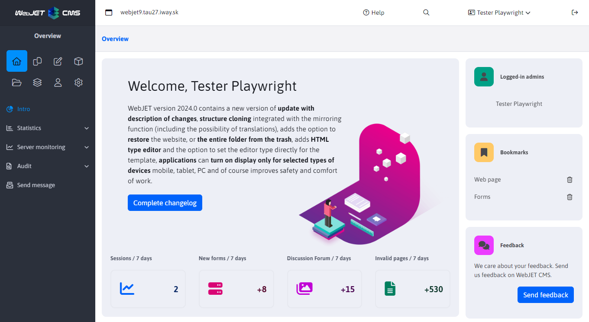
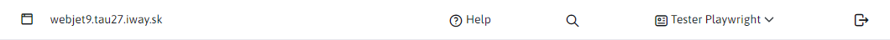
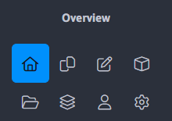
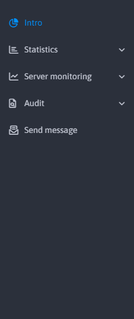
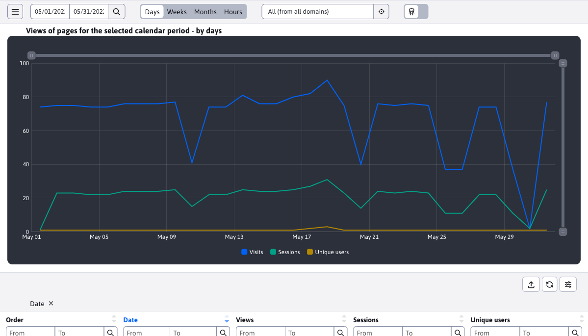
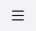
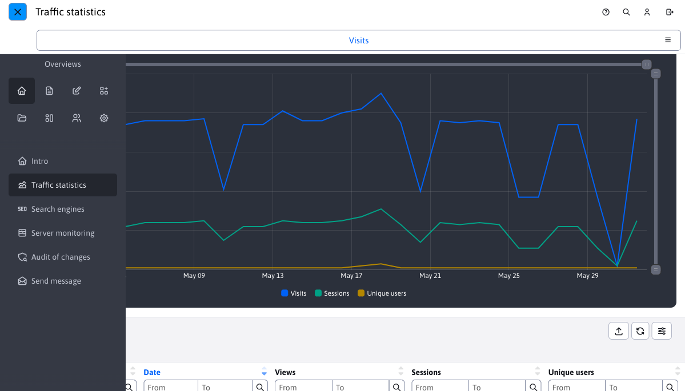
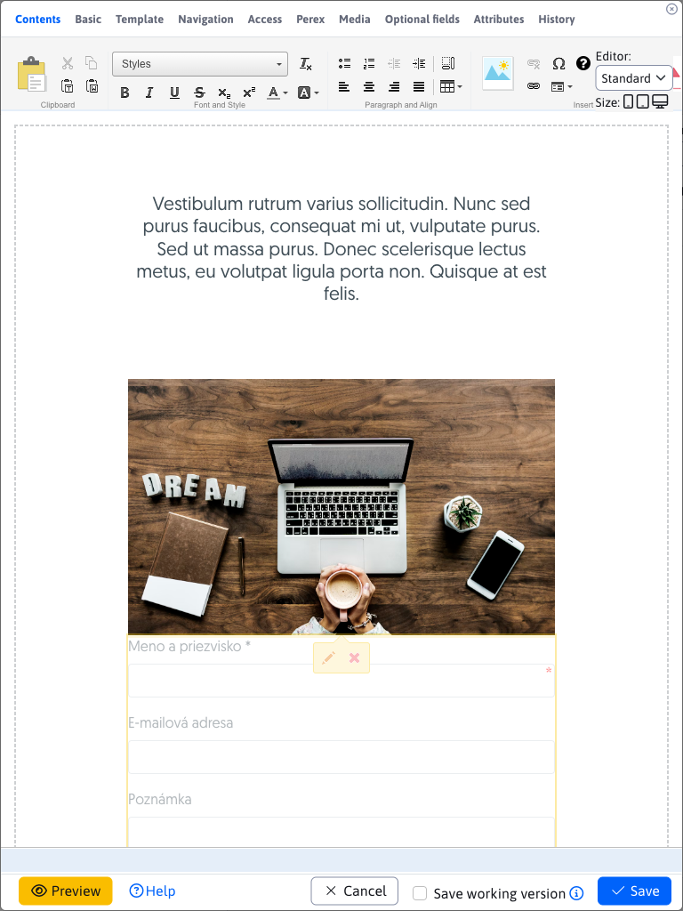
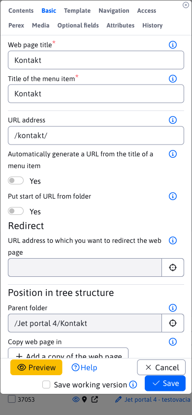

# Main controls

The administration layout is standard. The header is at the top, the menu is on the left. The third level of the menu is displayed as navigation tabs in the header.



## Header

At the top is the header:



contains the following options:

- Link to open help.
-  Icon to open the [Search](search/README.md) page
- Name of the currently logged in user, click on the name to display the following options:
  - Profile - edit your own profile (name, email... - after changing your profile, you need to log out and log in again).
  - Two-step verification - the ability to activate two-step verification using the ```Google Authenticate``` application when logging into the administration. This increases the security of your account, because in addition to the password, you also need to enter a code from your mobile device to log in. We recommend setting it for all accounts through which user accounts and rights can be managed. If you use authentication against the `ActiveDirectory/SSO` server, you can disable the menu item by setting the conf. variable `2factorAuthEnabled` to the value `false`.
  - Manage encryption keys - allows you to create a new encryption key for encrypting forms and enter an existing key for decrypting them. Requires the Forms right.
  - Logout - log out of the administration.
-  Icon for logging out of the administration.

Tabs to navigate to the third menu level can be displayed in the header.

## Menu

On the left side under the WebJET logo are icons representing the main menu sections. We decided to represent the first level menu like this so that we don't have to have deeply nested menu items:



Clicking on the main section icon will display the menu items of the selected section:



The selection of the domain you are working with (for a multi-domain installation) is located at the bottom of the left menu.


## Viewing on mobile devices

The administration is adapted to mobile devices. If the window width is less than 1200 points, the page header and left menu will be hidden:



To display the header and menu, click the hamburger menu icon  in the top left. The menu and header will then appear above the page. The navigation tabs will appear as a drop-down menu in the header.



To close the menu, click the close menu icon .

The editor in the data table will be displayed at the full window size when the window width is less than 992 points (tablet view):



For a window narrower than 576 points, the field names will also be moved from the left side above the field for better viewing, e.g. on a mobile phone:

