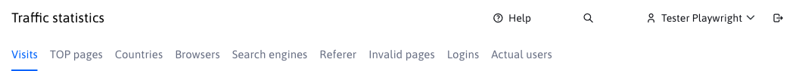
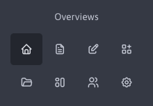
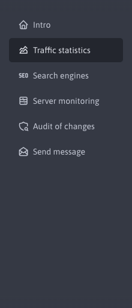
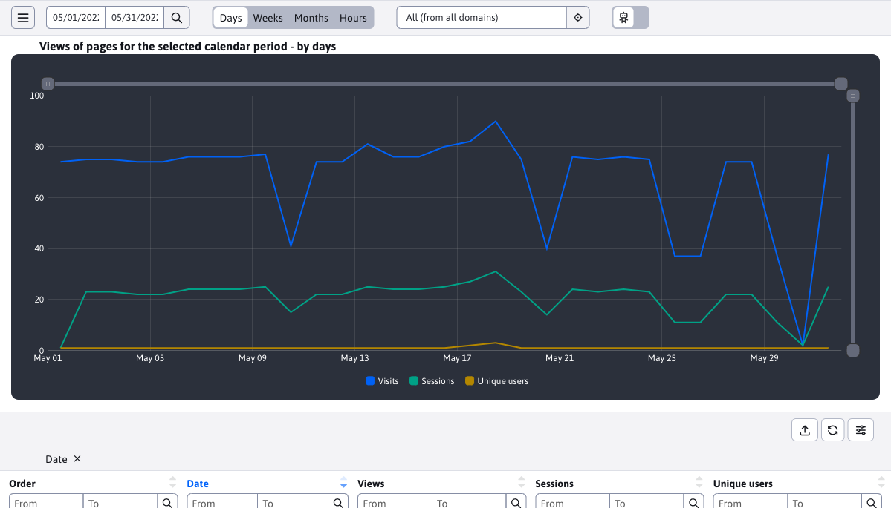
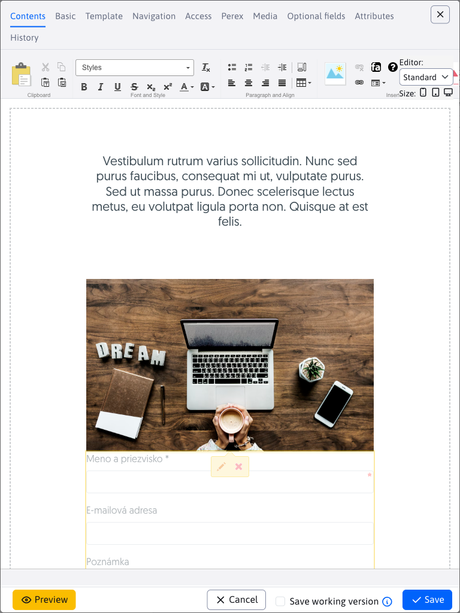
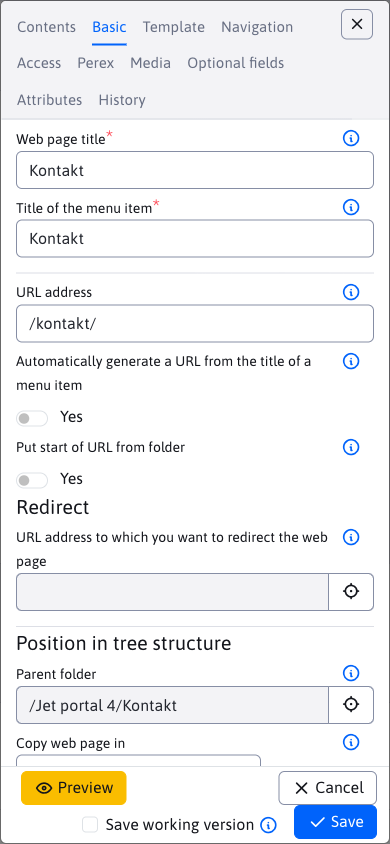

# Main controls

The administration layout is standard. There is a header at the top and a menu on the left.

## Header

The header is located at the top:

contains the following options:
- Select the domain you are working with (for a multi-domain installation).
- Link to open the help.

- The name of the currently logged in user, click on the name to display the following options:
	- Profile - edit your own profile (name, email... - after changing the profile you need to log out and log back in).
	- Two-Step Authentication - the ability to activate two-step authentication using the app `Google Authenticate` when logging into the administration. This increases the security of your account, because in addition to the password, you also need to enter a code from your mobile device to log in. We recommend setting this on all accounts through which user accounts and rights can be managed. If you use authentication against `ActiveDirectory/SSO` server, you can disable the menu item by setting the conf. variable `2factorAuthEnabled` to the value of `false`.
	- Encryption Key Management - allows you to create a new encryption key for encrypting forms and specify an existing key for decrypting them. Requires the Forms right.
	- Logout - logout from the administration.
-  An icon to log out of the administration.

## Menu

In the left part under the WebJET logo there are icons representing the main menu sections. We chose to represent the first level of the menu this way so that we don't have to have deeply nested menu items:

Click on the main section icon to display the menu items of the selected section:

Menu items are displayed in darker and lighter colours. The darker ones have not been redesigned yet, this can be seen in the link to the stats app. Clicking on this item will display the app in the old design. Clicking on an already redesigned section, e.g. Introduction, will switch from the old version back to the new one.

Switching between the old and new version is automatic, depending on whether the application has already been redesigned or not. If necessary, it is possible to switch completely to the old version by clicking on the icon  Switch to version 8 in the header.

## Display on mobile devices

Administration adapts to mobile devices. When the window width is less than 1200 pixels, the page header and the left menu are hidden:

header and menu can be viewed by clicking on the hamburger menu icon  top left. Then the menu and header will appear above the page:

to close the menu, click on the close menu icon .

The editor in the datatable when the window width is less than 992 pixels (tablet view) will be displayed at the full window size:

For a window narrower than 576 pixels, the field names will also be moved from the left side above the field for better display, e.g. on a mobile phone:

