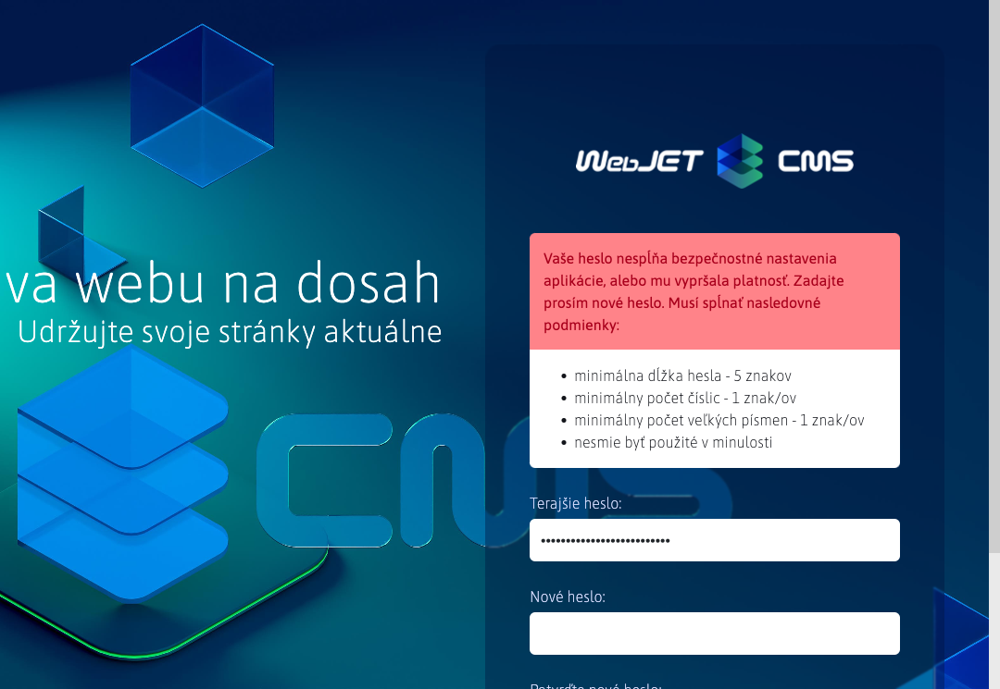
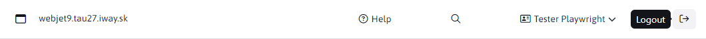
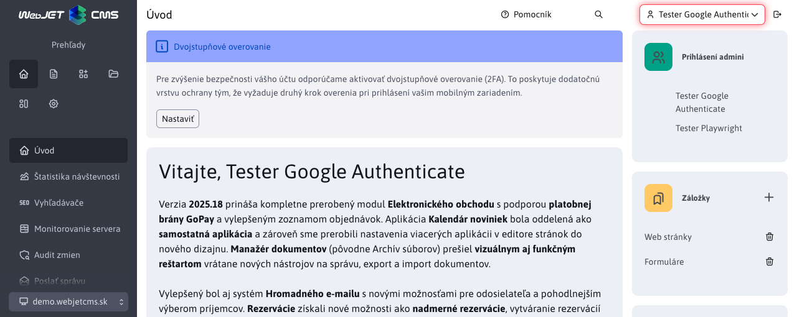
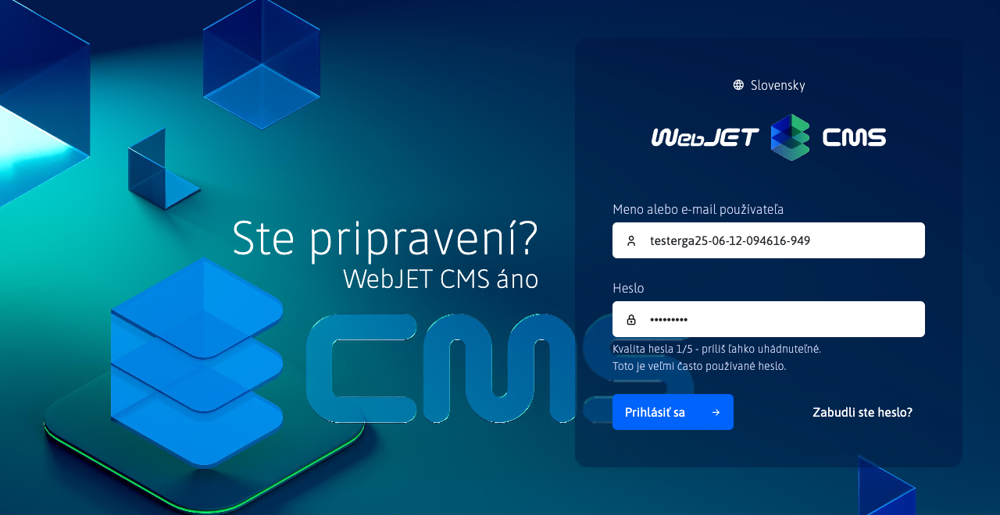

# Login and logout

## Login

### Login with name and password

Log in to the WebJET CMS administration at ```https://vasa-domena.sk/admin/```. The login screen will appear:


in which you enter your login name and password. The login dialog has an integrated password quality check; if your password does not reach a quality of at least 4, you need to change it to a more secure password after logging in (it must contain multiple uppercase and lowercase letters, numbers and special characters such as ```.-_?/```).

Clicking on the **Forgot password** link will display a password change form. Enter your email address, if it is registered in the system you will receive an email with a password change link. Click on the link in the email you received to display the password change form.

Depending on your system settings, your password may have expired or may no longer meet security requirements. In this case, after entering the correct password, you will be prompted to enter a new password:



Enter a new password that meets the required criteria.

### Use access key

**PassKey** is a modern login method that replaces the traditional password. It uses asymmetric encryption (WebAuthn/FIDO2 standard) – only the public part of the key is stored in the system, the private part remains stored on your device. The access key is tied to a specific domain, which prevents phishing attacks.


#### Advantages over a password

- **Higher security** – no password is stored on the server that could be leaked in a security incident.
- **Phishing resistance** – the key only works on the address for which it was created, it will not be used on a spoofed page.
- **No forgotten password** – login works with biometrics (fingerprint, facial recognition) or device PIN.
- **Quick login** – no need to enter a name, password or authenticator code.

#### How to log in with an access key

On the login page, click the **Use Access Key** button. The browser will then prompt you to verify your identity using biometrics or your device's PIN.


**Windows (Windows Hello)**

The system will prompt `Windows Hello`. Verify yourself with your fingerprint, facial recognition, or device PIN. After successful verification, you will be automatically logged in.

**macOS / iOS (Touch ID / Face ID)**

The system will prompt `Touch ID` or `Face ID`. Place your finger on the sensor or look into the camera. After successful verification, you will be automatically logged in.

**Mobile device (Android / iOS)**

The system will prompt you to unlock your device (fingerprint, face, or PIN). After successful authentication, you will be automatically logged in.

#### Adding a new access key

You can add your access key after logging in by clicking on your **name in the upper right** of the administration header.


and selecting **Access key**.


The Access Key Manager appears.


To add a new access key, click the icon<button class="btn btn-sm btn-success"><span><i class="ti ti-plus"></i></span></button>

1. In the **New Access Key Name** field, enter a name (e.g. My Notebook) to easily distinguish between the keys.
2. Click the **Add** button.
3. The browser will prompt you to verify your identity with biometrics or your device PIN.
4. After successful verification, the key will appear in the list of registered keys.


You can delete a registered key at any time by selecting it and clicking the trash can icon. However, this only deletes the public key from the WebJET CMS database; the private key itself remains stored on your device. To ensure that the key can no longer be used, you must also delete it from your device settings (for example, in the `Windows Hello` or `Apple heslách` settings).

!>**Warning:** The access key is tied to a specific device and browser. If you want to log in from multiple devices, register it on each device separately, or use a cloud synchronization service to transfer keys between devices (for example, iCloud Keychain, `Google Password Manager`).

You can disable the access key login option by setting the configuration variable `password_passKeyEnabled` to the value `false`.

## Logout

The logout link is located in the administration header in the upper right as an icon :



Click the logout icon to log out of WebJET CMS. For security reasons, we recommend that you **always log out** after you finish working and not just close the browser window.

!>**Warning:** If the window size is smaller, the header is not displayed, click the hamburger menu icon  to display the header.

## Two-step verification

**Two-step verification** also known as **Two-factor authentication (2FA)** using the `Google Authenticator` (or `Microsoft Authenticator`) app increases the security of your account because in addition to your password, you also need to enter a code from your mobile device to log in.

!>**Warning:** We recommend setting this to all accounts through which user accounts and rights can be managed.

To use **two-step verification**, you must have the configuration variable `2factorAuthEnabled` set to the value `true`.

If you are using authentication against the `ActiveDirectory/SSO` server, you can disable the functionality by setting the config variable `2factorAuthEnabled` to the value `false`.

!>**Note:** if you want to force every administrator to use **two-step verification**, simply set the configuration variable `isGoogleAuthRequiredForAdmin` to the value `true`.

### Set up two-step verification

You can find the `2FA` setting by clicking on the username in the upper right.



A menu will then appear, in which you will select the option **Two-step verification**


A window with two-step verification settings will appear.


For the next step, you will need the application installed. The window already has the links for the application `Google Authenticator`

- <a href="https://itunes.apple.com/us/app/google-authenticator/id388497605" target="_blank">Google Authenticator for iOS</a>
- <a href="https://play.google.com/store/apps/details?id=com.google.android.apps.authenticator2" target="_blank">Google Authenticator for Android</a>

but you can also use `Microsoft Authenticator` or another application that supports `TOTP` codes.

- <a href="https://apps.apple.com/us/app/microsoft-authenticator/id983156458" target="_blank">Microsoft Authenticator for iOS</a>
- <a href="https://play.google.com/store/search?q=microsoft%20auth&c=apps" target="_blank">Microsoft Authenticator for Android</a>

Then, in the window, check the **Enable two-step verification** option, which will display the `QR` code. Using the mobile application, scan this `QR` code, or add verification by entering the generated key.


!>**Note:** don't forget to press **OK** to save the settings.

### Login with code entry

The next time you log in, you will enter your standard login details.



and if **two-step verification** has been successfully set up, after entering your name and password, you will be prompted to enter a code from the authentication application.


There may be a situation where the code you entered expires before you can log in. In this case, you must enter a new code generated by the application.


If you enter a valid code, you will be successfully logged in.

### Loss of mobile device

If you lose your device, you may lose access to your account, so we recommend setting up a data backup in the application for easy restoration on a new device. If you use multiple devices, you can add the QR code to multiple devices or different applications at once when setting up two-factor authentication.