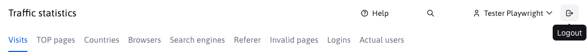

# Logging in and out

## Login

You can log in to the WebJET CMS administration at `https://vasa-domena.sk/admin/`. The login screen will appear:

in which you enter your login name and password. A password quality check is integrated into the login dialog, if your password is not at least quality 4, you need to change the password after login to a more secure password (it must contain more upper and lower case letters, numbers and special characters such as `.-_?/`).

Click on the link **Forgotten password** the password change form will appear. Enter your email address, if it is registered in the system you will receive an email with a link to change your password. Click on the link in the email you received to view the password change form.

Depending on the system settings, your password may have expired or may no longer meet security requirements. In this case, you will be prompted to enter a new password after entering the correct password:

Enter a new password that meets the required criteria.

## Logout

The logout link is located in the administration header in the upper right part as an icon :

Click on the logout icon to log out of WebJET CMS. For security reasons, we recommend that you **always check out after work** and not just close the browser window.

!>**Warning:** when the window size is smaller, the header is not displayed, click on the hamburger menu icon  to view the header.

## Two-step verification

**Two-step verification** also known as **Two-Factor Authorization (2FA)** using the app `Google Authenticator` (or `Microsoft Authenticator`) increases the security of your account, because in addition to your password, you also need to enter a code from your mobile device to log in.

!>**Warning:** We recommend that you set it to all accounts through which user accounts and rights can be managed.

For use **two-step verification** you must have a configuration variable set `2factorAuthEnabled` to the value of `true`.

If you use authentication against `ActiveDirectory/SSO` server, you can disable the functionality by setting the conf. variable `2factorAuthEnabled` to the value of `false`.

!>**Warning:** if you want to force every administrator to use **two-step verification**, just set the configuration variable `isGoogleAuthRequiredForAdmin` to the value of `true`.

### Setting up two-factor authentication

Settings `2FA` can be found by clicking on the user's name at the top right

then a menu will appear, in which you select the option **Two-step verification**

You will see a window with the two-step authentication settings.

For the next step, you will need the app installed. The links for the application are already prepared in the window `Google Authenticator`

- <a href="https://itunes.apple.com/us/app/google-authenticator/id388497605" target="_blank">Google Authenticator for iOS</a>
- <a href="https://play.google.com/store/apps/details?id=com.google.android.apps.authenticator2" target="_blank">Google Authenticator for Android</a>

but you can also use `Microsoft Authenticator` or another application supporting `TOTP` Codes.

- <a href="https://apps.apple.com/us/app/microsoft-authenticator/id983156458" target="_blank">Microsoft Authenticator for iOS</a>
- <a href="https://play.google.com/store/search?q=microsoft%20auth&c=apps" target="_blank">Microsoft Authenticator for Android</a>

Then tick the option in the window **Enable two-step verification**, which will show you `QR` Code. Using the mobile app, scan this `QR` code, or add authentication by entering the generated key.

!>**Warning:** don't forget to press **OK** to save the settings.

### Login with code

The next time you log in, you will enter your standard login credentials

and if **two-step verification** successfully set up, you will still be prompted to enter the code from the authentication application after entering your name and password.

There may be a situation where the code you entered expires before you can log in. In this case, you must enter a new code generated by the application.

If you enter a valid code, you will be successfully logged in.

### Loss of mobile device

If you lose your device, you may lose access to your account, so we recommend setting up a data backup in the app for easy recovery on a new device. If you use multiple devices, the QR code can be added to multiple devices or different apps at the same time when you set up two-factor authentication.
