# Forgotten password

If you have forgotten your password, you can reset it as follows.

## Admin section

If you have forgotten your password for the admin section, you can request a password reset on the login page.

Clicking on the 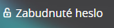 option will display the password recovery form.

You must enter your **email address** or **login name** in the field. Send the request by pressing the ![](admin-send-btn.png ":no-zoom" button. The displayed notification will warn you that if an account exists, an email will be sent to the appropriate email address.

## Customer zone

If you have forgotten your password for the customer zone, you can request a password reset on the login page.

Clicking on the **Forgot your password?** option will display a hidden recovery field.

Before | After
:------------------------------:|:-------------------------:

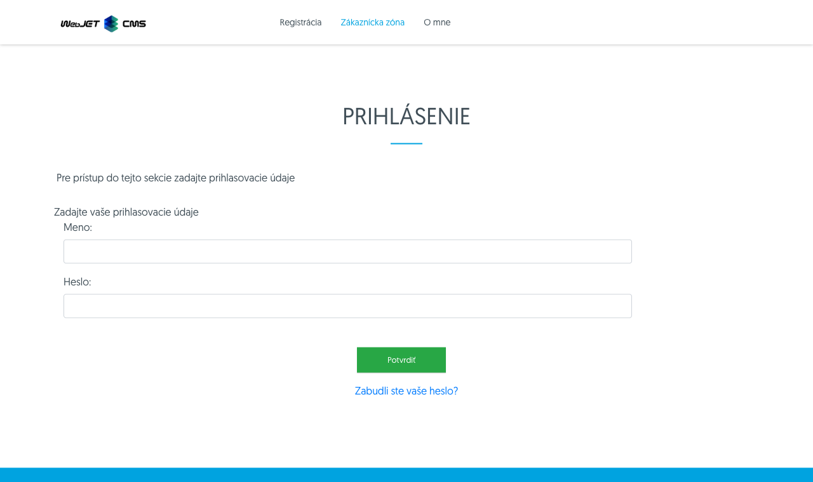

 | 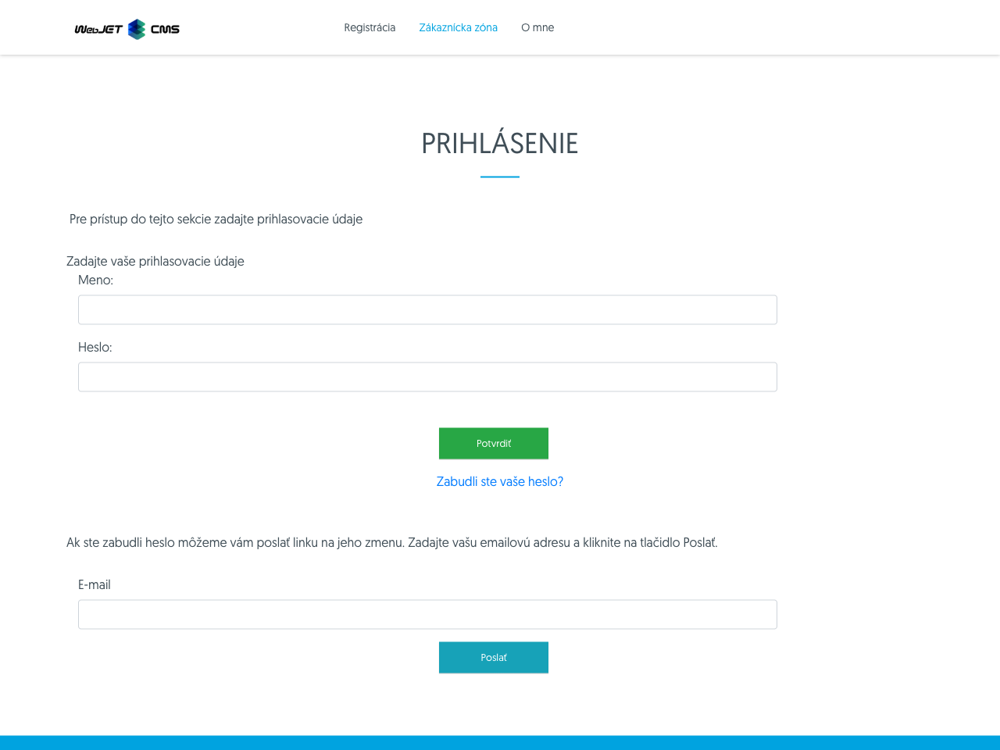

You must enter your **email address** or **login name** in the field. Send the request by pressing the ![](user-send-btn.png ":no-zoom" button. The displayed notification will warn you that if an account exists, an email will be sent to the appropriate email address.

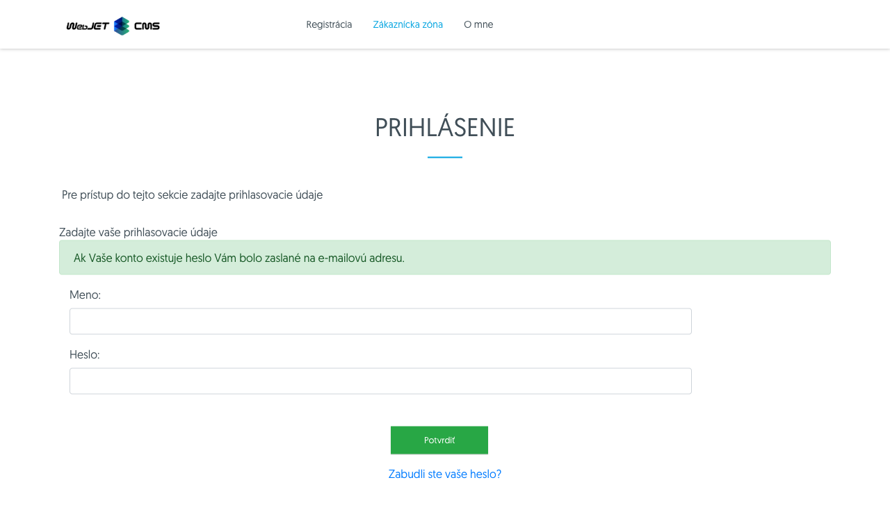

## Password change email

The sent email contains 2 links:

- password change link, **If you want to change your password, click here within 30 minutes.**
- link to cancel the password change action, **If you did not request a password change, you can cancel this action by clicking here.**

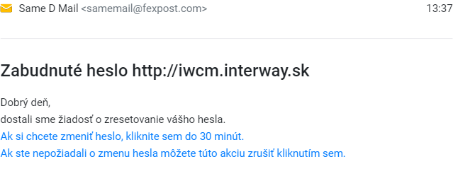

The name and email address from which the email with the link to change the password is sent can be set via the configuration variables `passwordResetDefaultSenderEmail` and `passwordResetDefaultSenderName`.

### Password change action

Clicking on the first link, **If you want to change your password, click here within 30 minutes.**, will take you to the password change page.

Admin section | User section
:------------------------------:|:-------------------------:

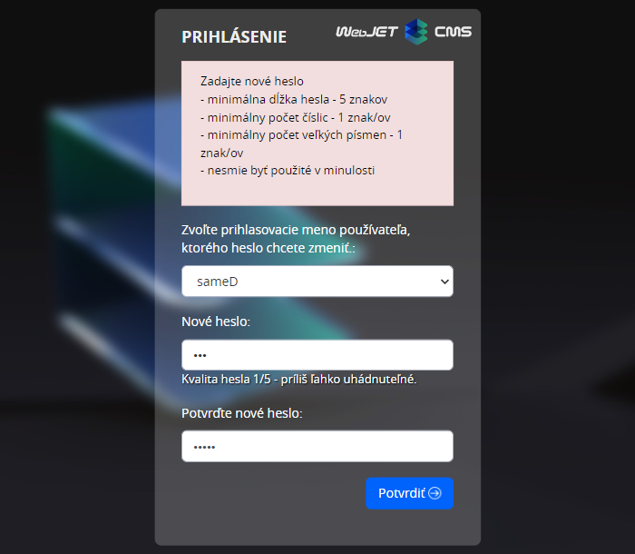

 | 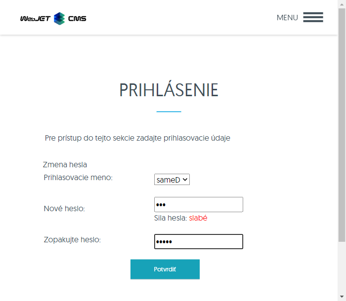

!> **Note:** the login is a selection field because it is possible to register multiple logins with the same email (e.g. administration login and customer account). The selection field therefore contains all logins that share the entered email address. **The password will only be changed for the user whose login you select.**

You must then enter a new password and re-enter it for verification. You will be notified if the passwords do not match or do not meet the minimum password quality requirements.

Password does not match | Weak password
:-------------------------------:|:--------------------------------:

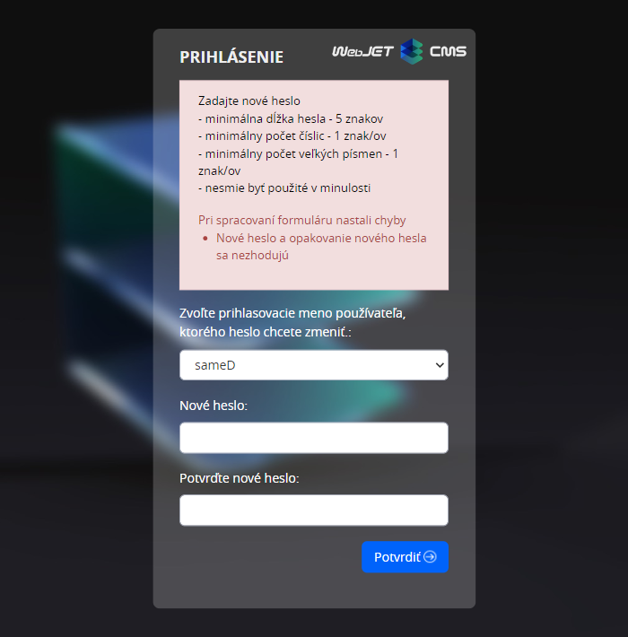

 | 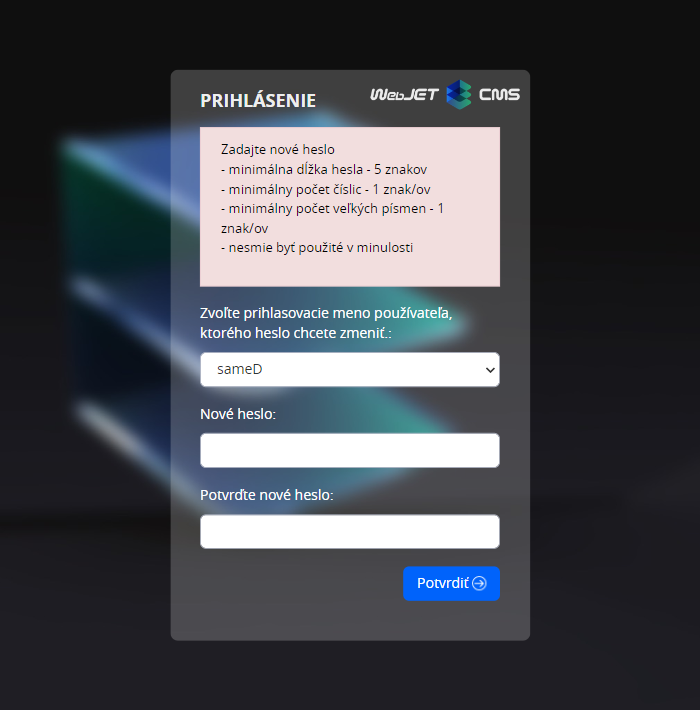

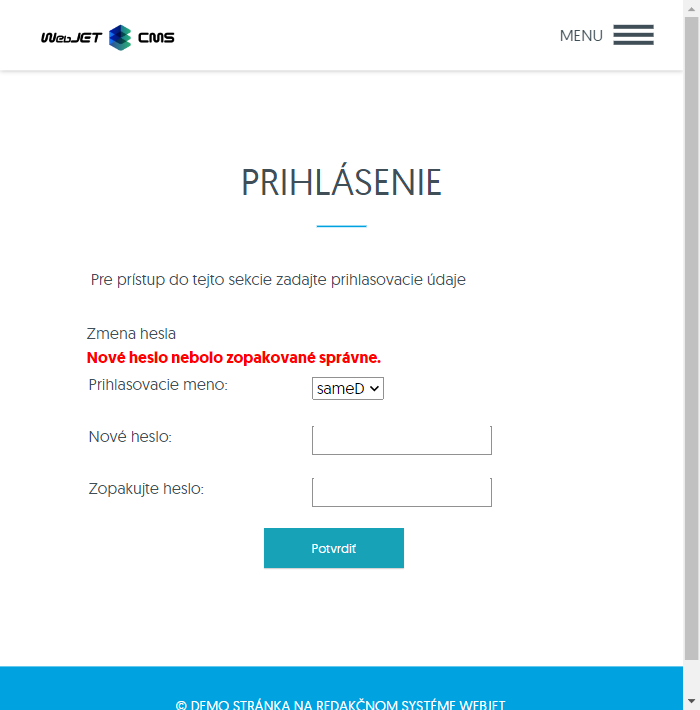

 | 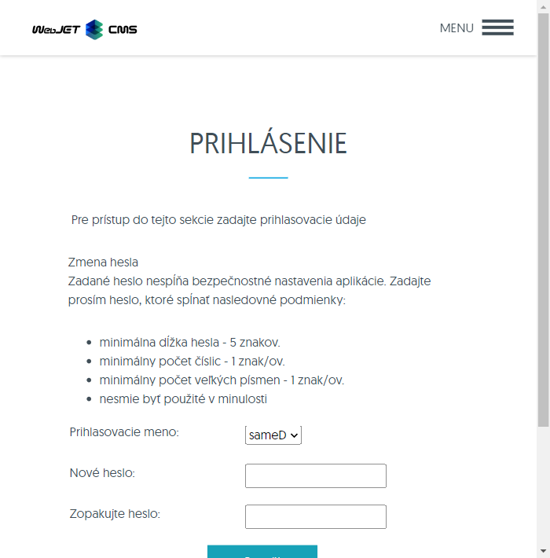

If the password for the selected user is changed successfully, the following message is displayed.

Admin section | User section
:------------------------------:|:-------------------------:

 | 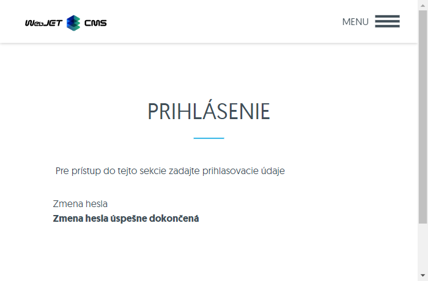

!> **Warning:** after a successful password change, the link that took you to the password change form **becomes invalid**, meaning it cannot be used to change the password again for the same or a different user. The link also becomes invalid if you do not take action within 30 minutes of receiving the email.

Admin section | User section
:--------------------------------------:|:---------------------------------:

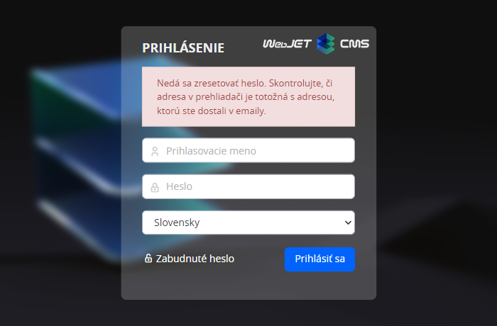

 | 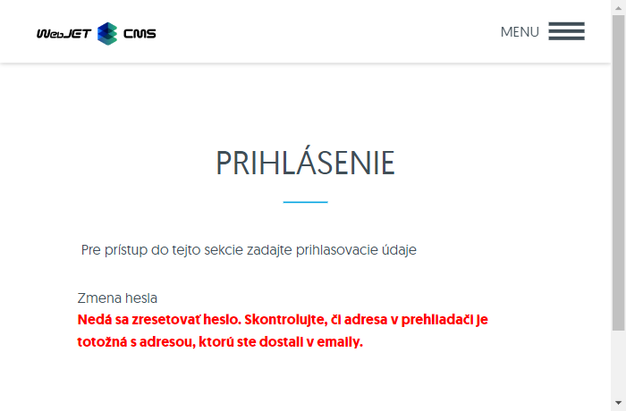

### Undo change action

By clicking on the second link **If you did not request a password change, you can cancel this action by clicking here.** you will be taken back to a page that will inform you that the password change action has been canceled, making the first password change link **inoperative**.

Admin section | User section
:----------------------------------:|:---------------------------------:

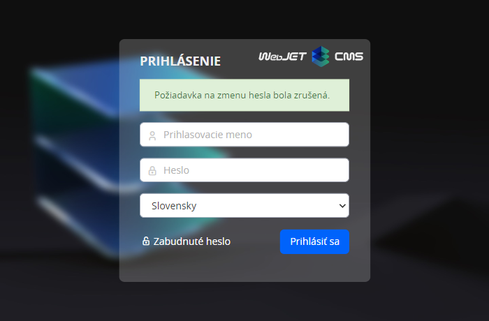

 | 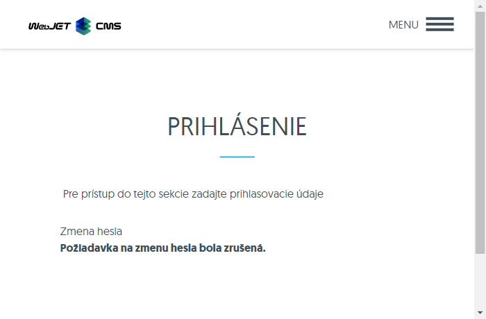

## Implementation notes

- password change works through the audit record, where when a password change request is made, a record of type `USER_CHANGE_PASSWORD` is created, which has the text `Vyžiadanie zmeny hesla` in the description
- when changing the password, it is verified whether this audit record exists and whether it is not older than 30 minutes. If it does not exist or is older, the link to change the password will no longer work and the record will remain.
- when using the link to cancel the password change, this audit record will be deleted
- if the email used to change the password is associated with multiple accounts, the audit log always contains the login name of the latest user who can change the password via this email
- after a successful password change action, the audit record is deleted