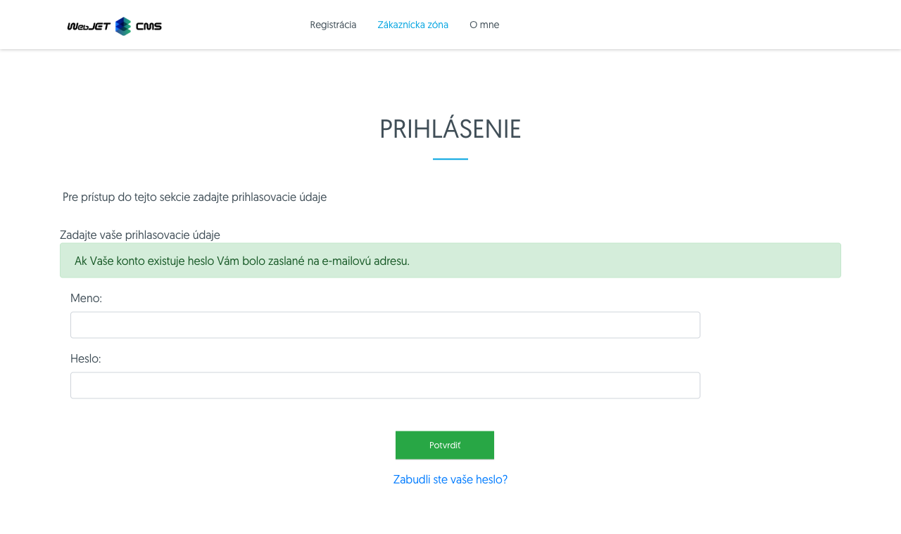

# Forgotten password

If you have forgotten your password, you can reset it as follows.

## Admin section

If you have forgotten your password for the admin section, you can request a password reset on the login page.

Click on the option  the password reset form will appear.

You must enter your **email address** or **login name**. To send your request, press the . A notification will alert you that if the account exists, an email will be sent to the appropriate email address.

## Customer zone

If you have forgotten your password for the customer area, you can request a password reset on the login page.

Click on the option **Forgot your password?** a hidden recovery box will appear.

| Before | After |
| :---------------------------: | :---------------------------: |
|  |  |

You must enter your **email address** or **login name**. To send your request, press the . A notification will alert you that if the account exists, an email will be sent to the appropriate email address.

## Email to change your password

The sent email contains 2 links:
- a link to change your password, **To change your password, click here within 30 minutes.**
- a link to cancel the password change action, **If you have not requested a password change you can cancel this action by clicking here.**

### Password change action

Click on the first link, **To change your password, click here within 30 minutes.**, you will be taken to a page to change your password.

| Admin section | User section |
| :----------------------------: | :---------------------------: |
|  |  |

!> **Warning:** login name is a type of selection field due to the possibility of registering multiple logins with the same email (e.g. login to the administration and customer account). The selection field thus contains all login names that share the specified email address. **The password will only be changed for the user whose login name you choose.**

You must then enter a new password and re-enter it for verification. If the passwords do not match or do not meet the minimum password quality requirements, you will be notified.

| Password does not match | Weak password |
| :----------------------------: | :----------------------------: |
|  |  |
|   |   |

If the password for the selected user is changed successfully, the following message is displayed.

| Admin section | User section |
| :----------------------------: | :---------------------------: |
|  |  |

!> **Warning:** after you have successfully changed your password, the link that took you to the change form **becomes inoperable** that is, it cannot be used to change the password again for the same or another user. The link also becomes inoperable if you have not taken the action within 30 minutes of receiving the email.

| Admin section | User section |
| :-------------------------------------: | :------------------------------------: |
|  |  |

### Change cancellation action

Click on the second link **If you have not requested a password change you can cancel this action by clicking here.** you will be taken back to the page that tells you that the password change action has been cancelled, which will take the first link to change the password **became inoperable**.

| Admin section | User section |
| :---------------------------------: | :--------------------------------: |
|  |  |

## Notes on implementation

- the password change works via an audit trail, where a record of type is created when a password change is requested `USER_CHANGE_PASSWORD` which has the text in the description `Vyžiadanie zmeny hesla`
- when a password change action is requested, it is checked that this audit trail exists and that it is not older than 30 minutes, if it does not exist or is older, the password change link will no longer work and the audit trail will remain in place
- when using a link to cancel a password change, this record is deleted from the audit
- if the email used to change the password is associated with multiple accounts, the audit record always contains the login name of the most recent user who can change the password via this email
- after a successful password change action, the audit record is deleted
