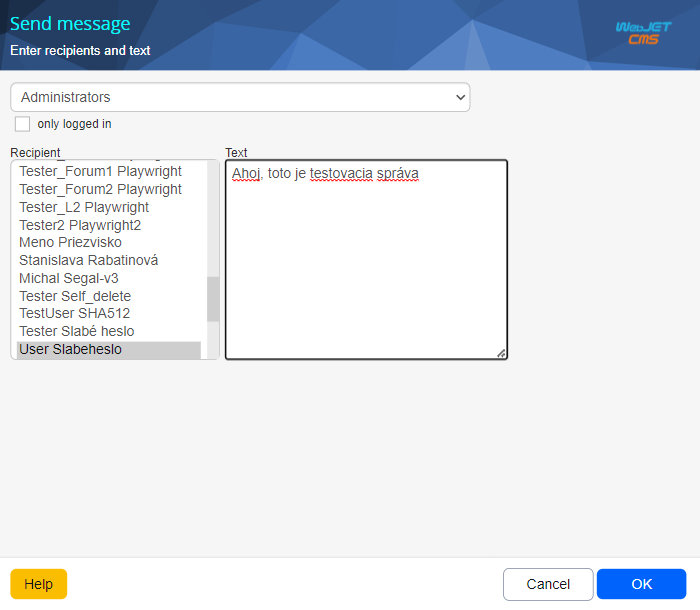

# Send a message

Click on the option **Send a message** will open a new window that you can use to send a message to multiple users. The message is displayed in a pop-up window in the administration, where you can then reply to the message.

If the pop-up window is not yet open, the new message is checked when the contents of the administration window are loaded and every minute thereafter.

!> **Warning:** If you have pop-ups blocked, the new message window will not appear.

## Options when writing a message

- **Selection field group** - a group of users whose list appears in the **To whom**.
- **Only logged in** - If checked, the message will only be displayed if the selected user is currently logged in.
- **To whom** - a list of names you want to send the message to; to select more names, press **CTRL** and click the mouse on the name.
- **Text** - the text of the message.

Click on **OK** the specified message is sent to the selected users.
