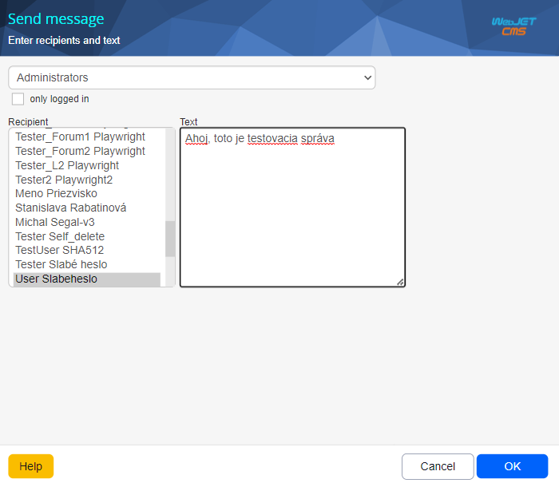

# Send message

Clicking on **Send message** will open a new window where you can send a message to multiple users. The message will be displayed in a pop-up window in the administration, where you can then reply to the message.

If the pop-up window is not yet open, a new message is checked when the content of the administration window is loaded and then every minute.

!> **Note:** If you have pop-ups blocked, the new message window will not appear.

## Options when writing a message

- **Group selection field** - a group of users whose list will be displayed in the **To** field.
- **Only logged in** - if checked, the message will only be displayed if the selected user is currently logged in.
- **To** - a list of names to whom you want to send the message; select multiple names by pressing the **CTRL** key and clicking on the name.
- **Text** - message text.

Clicking **OK** will send the specified message to the selected users.
