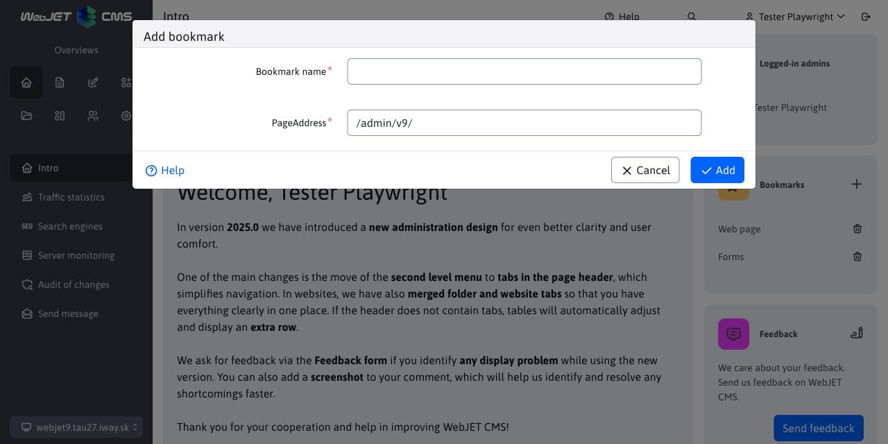
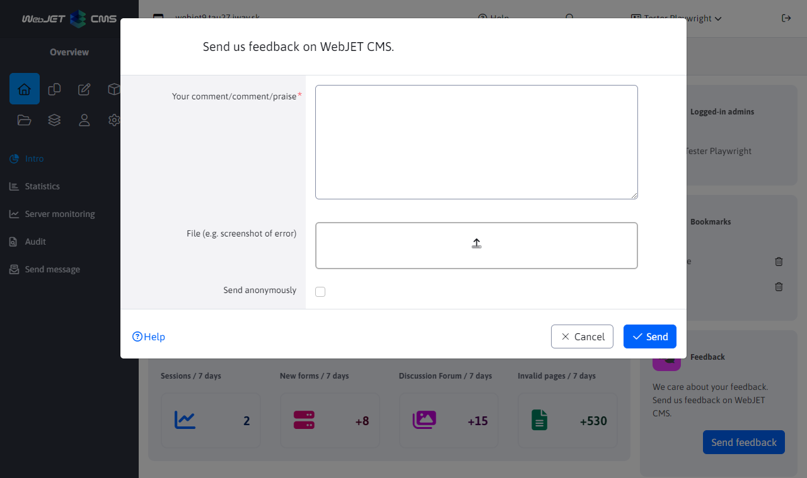

# Home screen

## Bookmarks

You can add links to frequently used sections in the administration to the bookmarks mini-application. After logging in, you don't have to search for the section in the menu, but you can directly click on the link in the bookmarks.

Click the orange icon to the left of the Bookmarks text to open a dialog box in which you specify the name of the bookmark and the address to open when you click the bookmark name.

By default, bookmarks are displayed to list web pages and forms. These will be displayed even if you delete all bookmarks.

Note: the bookmarks list is stored in the browser, if you use multiple browsers set your bookmarks in all of them.

  <iframe width="560" height="315" src="https://www.youtube.com/embed/G5Ts04jSMX8" title="YouTube video player" frameborder="0" allow="accelerometer; autoplay; clipboard-write; encrypted-media; gyroscope; picture-in-picture" allowfullscreen></iframe>

# Feedback

By clicking on the Send Feedback button you can send us, the programmers, your feedback on the use of WebJET CMS. The comment will be sent by email after filling out the form.

We will consider your comments and add them to [development maps](../../ROADMAP.md). You can also improve the functioning of WebJET CMS with your opinion.

In the dialog box you can enter the text of your comment, comment or praise. If necessary, you can also attach files (e.g. a screenshot or a document describing your request).

If you select the Send anonymously option, your name and email address will not be entered in the sent email as the sender's name and email.
