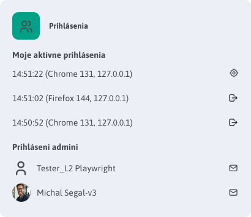
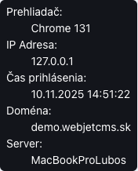
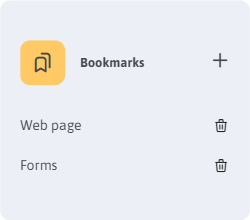
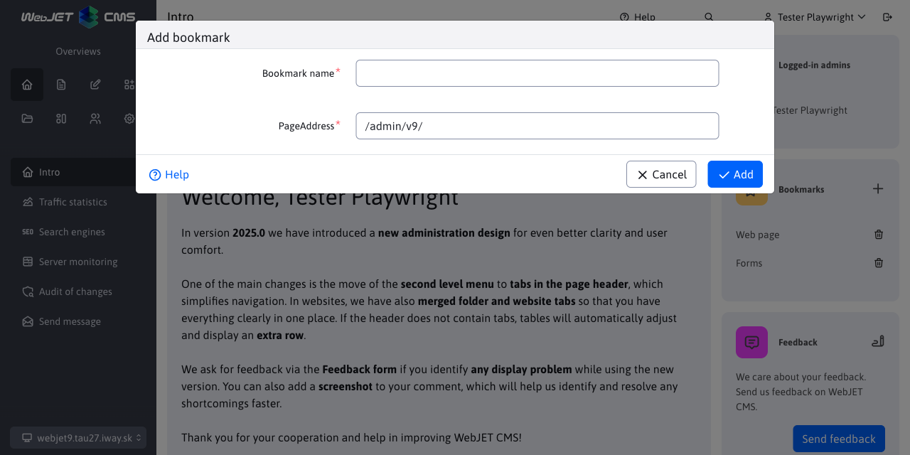
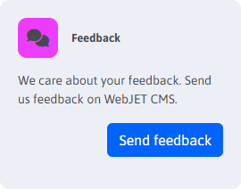
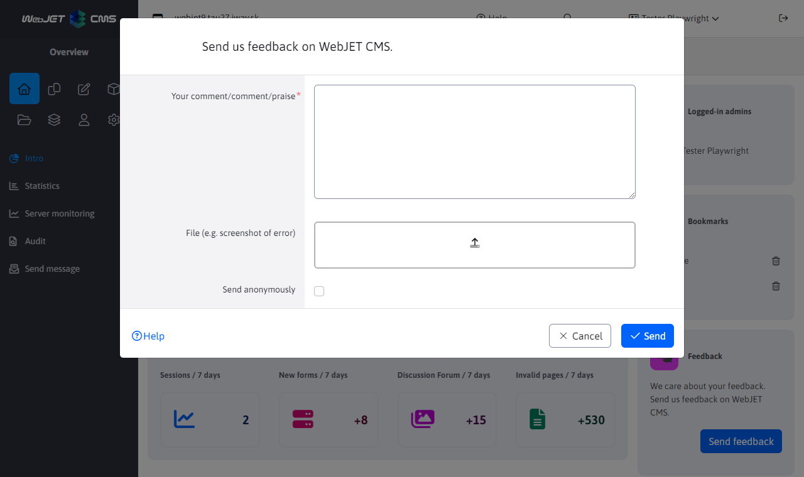

# Home screen

## Logins

Displays a list of your logins (if multiple device logins are enabled) and a list of logged in administrators.

### My active logins

The mini application **My active logins** displays a list of all active logins to the WebJET CMS administration under your user account. Your current login is marked with the icon<i class="ti ti-current-location fs-6"></i> .

Individual logins have a tooltip that displays additional information.

Click on the icon<i class="ti ti-logout fs-6"></i> you can terminate the given login. If it is within your current cluster node, the login will be terminated immediately. If it is a login on another node, the login will be terminated after synchronization between the cluster nodes (typically within a minute).

Note: data is updated after user login. You can set a new entry in [background job](../../admin/settings/cronjob/README.md) to update data more frequently, where you enter the value `sk.iway.iwcm.stat.SessionClusterService` as the job name. Enter the interval as needed, e.g. every 10 minutes. With a background job, records older than 60 minutes are deleted from the database. If a background job is not set, records older than 24 hours are deleted when the user logs in.

### Logged in administrators

If you have the "Home - View logged in administrators" right, a list of all logged in administrators will also be displayed. This gives you an overview of how many users are currently working in the administration.

Click on the icon<i class="ti ti-mail fs-6"></i> you can send an email to the administrator.

## Bookmarks

You can add links to frequently used sections in the administration to the bookmarks mini application. After logging in, you don't have to search for the section in the menu, but directly click on the link in the bookmarks.

Clicking on the orange icon to the left of the Bookmarks text will open a dialog box where you can enter the name of the bookmark and the address that should be opened when you click on the bookmark name.

By default, bookmarks for the list of web pages and forms are displayed. These will be displayed even if you delete all bookmarks.

Warning: the bookmark list is stored in the browser, if you use multiple browsers, set up bookmarks in all of them.

    <iframe width="560" height="315" src="https://www.youtube.com/embed/G5Ts04jSMX8" title="YouTube video player" frameborder="0" allow="accelerometer; autoplay; clipboard-write; encrypted-media; gyroscope; picture-in-picture" allowfullscreen></iframe>

## Feedback

By clicking the Send Feedback button, you can send us, the programmers, your feedback on using WebJET CMS. The feedback will be sent by email after filling out the form.

We will consider your comments and add them to the [development map](../../ROADMAP.md). You can also use your opinions to improve the functioning of WebJET CMS.

In the dialog box, you can enter the text of your comment, suggestion, or compliment. If necessary, you can also attach files (e.g. a screenshot or a document describing your request).

If you select the Send anonymously option, your name and email address will not be entered as the sender's name and email in the sent email.