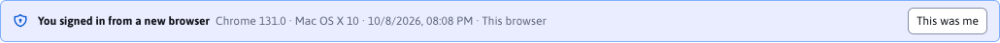
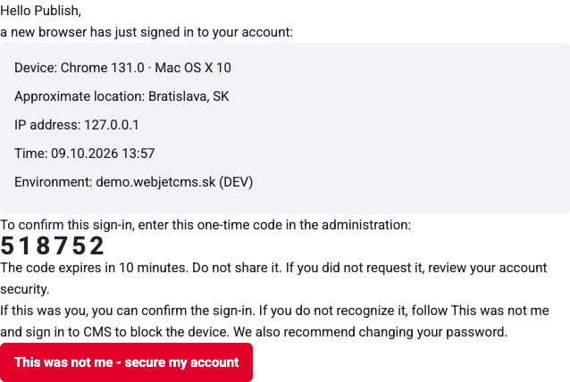
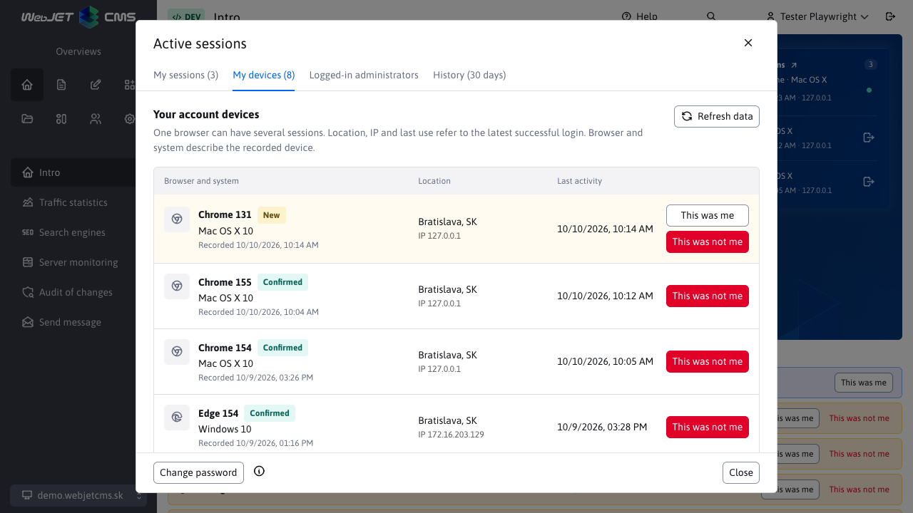
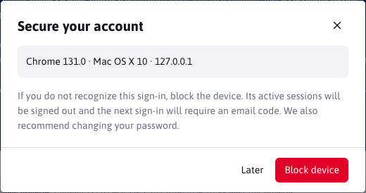

# Home screen

From the home screen, you can quickly check traffic, submitted forms, or pages awaiting approval, and return to pages in progress.

    <iframe width="790" height="444" src="https://www.youtube.com/embed/X2GNFn8IpCI" title="YouTube video player" frameborder="0" allow="accelerometer; autoplay; clipboard-write; encrypted-media; gyroscope; picture-in-picture" allowfullscreen></iframe>

The overview is made up of **widgets**, i.e. cards with specific data, such as a traffic graph or a list of approval requests. Choose the ones you use and organize them according to what you want to monitor first. Use [shortcuts](#your-shortcuts) to open a frequently used part of the administration or a specific folder without searching in the menu.

When you first open it, the default widgets **Visit**, **Forms**, **For Approval**, **404 Errors**, **Continue Working**, **Where Visitors Came From**, **Upcoming Publish** and **Newsletter** will be displayed based on your permissions. You can add additional widgets yourself. At the top is a welcome with shortcuts and news, active logins and search.

The widget menu corresponds to your permissions. The layout is saved to your account and is common across all domains and browsers. The selection of a specific form or campaign is remembered separately for each domain.

The environment label is displayed before the page name in the header of the entire administration and on the login page: **PROD**, **TEST**, **CIT**, **INT**, **UAT**, **DEMO**, **LOCAL** or **DEV**. It is also in the browser tab title to distinguish between open environments. The administrator can edit the text, icon, color, style and description of the label according to [environment configuration](../../admin/setup/configuration/dashboard.md).

## Customize the report

Place widgets at the top of your report with the data you check most often. For example, if you process forms and approve content, select the **Forms** and **For Approval** widgets. You can remove widgets you don't need.

Click **Edit Overview**. A bar appears with **Restore Defaults**, **Add Widget**, **Cancel**, and **Save** options. It remains below the header when scrolled. Widgets have a dashed outline, a drag handle, and a **Widget Options** button. Additional icons and links in the headers are hidden while editing. System notifications remain active.

Click the **Add widget** button to open the catalog. Search for the desired widget by name and click **Add** or **Add another** next to it. The settings with a preview will open. Select the size and other options and confirm them with the **Add widget** button. The widget will be added to the end of the current overview and the dialog will close. If you cancel the settings, the widget will not be added. For another widget, open the catalog again from the edit bar.

For the widget, use the **Widget Options** button:

- **Widget Settings**: In the dialog box, select an available size and other settings, such as period or form. Select the size using the card with an illustration of the size and a label, such as **1x1** or **3x3**. Not every widget offers multiple sizes.
- **Move with keyboard**: the widget is lifted, the arrows change its position, **Enter** places it and **Esc** returns it. You can also start the same move with the spacebar on the handle. When dragging with the mouse, a dashed target indicates the insertion point; **Esc** cancels the move.
- **Remove from overview**: removes the card without confirmation. The data in the application remains intact. The notification offers **Back** for 8 seconds; when you hold the mouse or focus with the keyboard, the countdown stops. **Ctrl Z** undoes the last edit even after the notification disappears. You can add the widget again from the catalog.
- **Refresh data**: loads the current data of the given card.

In the **Widget Settings** dialog box, there is a preview of the widget with the actual data on the left and its settings on the right. The preview changes according to the selected size, color, and other options. On a smaller screen, the settings appear below the preview. Confirm your changes with the **Apply** button. The progress report will change. Select a larger tab when you want to see a more detailed graph or list. A smaller tab takes up less space in the report.

In the **Background Color** section, select a subtle shade from the palette or a **Custom Color**, which you can also enter using a HEX code. The selected color will immediately appear in the widget preview. If the custom color is too dark, the setting will prompt you to choose a lighter shade. The **Default** option will restore the original background of the specific widget; new widgets will use this color automatically.

In the **Visit** widget, the colors of the graph lines, points, and legend automatically adapt to the background color. On a white or gray background, the lines are gray. The previous period remains distinguished by a dashed line.

When you are finished editing, click **Save** in the toolbar. This will save the positions, sizes, settings, and additions or removals of widgets. You will see a notification saying **Overview saved** and the editing mode will close. In case of an error, the changes in progress will remain available for re-saving.

The **Cancel** button opens a confirmation with the options **Continue editing** and **Discard changes** for unsaved changes. The browser will notify you when you leave the page. Shortcuts have their own editing mode via the pencil in the top bar and are saved separately.

On a smaller screen, tabs automatically stack under each other, preserving their order. A layout can contain up to 48 items, including shortcuts, logins, news, and search.

The **Restore defaults** button can be found in the edit bar before the **Add widget** button. After confirming in the dialog, a default selection of widgets, their sizes, order and settings will be prepared. Only by clicking the **Save** button will the change be saved and the widget filters in all domains and the confirmation of reading the news will be deleted. Your shortcuts and other account settings will be preserved.

If you hold down the **Shift** key while clicking **Restore Defaults**, a summary of all available widgets in each supported size will be prepared after confirmation. You can remove unnecessary variants and confirm the result with the **Save** button.

## Available information

Widgets from the catalog **can be added repeatedly** with different sizes or settings. For example, you can **track two different forms** or **7 and 30 day traffic** side by side. Their availability depends on your permissions.

Statistics widgets default to the last seven completed days, with the option to choose 30 or 90 days. The comparison uses the same previous period. The tab shows the actual date range. Specific rules for form and 404 error periods are listed for the respective widgets.

### Module shortcut

You can open frequently used parts of the administration without searching in the menu or in the folder tree structure. The shortcut can also point to your own URL address. You can find the procedure for adding and an example of a link to a specific folder in the [Your shortcuts](#your-shortcuts) section.

### Keep working.

You can return to a page you've been working on without having to search for its folder. The widget displays up to six of your most recently edited pages with a thumbnail image, location, and date modified. Click to open the page editor. The widget's title opens the full list of web pages. You can scroll the list when the tab is smaller.

### For approval

Indicates content that is awaiting approval. Displays requests available in the **Unapproved** tab in Web Pages. The larger version contains the six most recent requests to change or delete a page or folder. The icon next to the title distinguishes between a page and a folder.

Clicking on an item will open its approval in a new window. For a folder, the corresponding folder in the Web pages will open along with an approval dialog. Clicking on the title or total number will open the entire list of requests.

### Upcoming publication

Check which pages are due to **publish or expire** soon. For each change, you'll see the date and time of the scheduled publication or expiration. Click on the title to open the full publishing schedule.

### Forms

Here you can review data about submitted forms, such as inquiries or contact messages. In the settings, you can **select a specific form** or all available forms.

When viewing all forms, you see **the total number of responses submitted for the entire period**. The large widget displays the ten most recently submitted forms, sorted by newest. Each form has a name and the date of the last submission. Click on a name to open its responses.

When you select a specific form, the last ten submissions **for the selected period** will be displayed in a large widget. If the list does not fit within the height of the card, you can scroll it. In the **Form** column, you will see the first name, last name, and email from the filled-in data. If the form does not have such fields, the first three filled-in data will be displayed in the order of the form columns. Click on this data to open the details of a specific submission.

### Attendance

It allows you to track how website traffic changes. In the settings, select the period and the data to be tracked: the number of views, visits, or unique visitors.

The chart compares the current and previous periods. You can find the exact values ​​in the descriptions by hovering over the chart. The data table is accessible to screen readers.

### Most visited pages

It shows the most visited pages for the selected period with the number of views. Based on the traffic, you can determine which content to pay attention to when updating. Click on a page to open its detailed statistics.

### What visitors are looking for

It shows search terms and their numbers for the selected period. You can use the terms to find out what topics visitors are interested in and check whether you have up-to-date information on them on your website.

### Where did the visitors come from?

You can compare traffic sources for a selected period and see where the most visitors come from.

The graph shows the percentage of each registered source. The exact values ​​can be found in the descriptions after hovering over the graph. The data table is accessible to screen readers.

### 404 errors

It helps find addresses that don't exist. Based on the number of errors, you can determine which links or redirects to check first.

It shows the number of error requests, not the number of different addresses. Errors are recorded by week, so full weeks spanning the selected period are included. The card displays the actual date range, and the current week contains data available up to that point.

If historical data cannot be separated by domain, the card will report that it is unavailable.

### Newsletter

It allows you to track the progress of sending mass emails and record opens or clicks. It automatically selects the active campaign, the next scheduled one, or the last completed one. You can also select a specific campaign in the settings.

When sending, the visible card data is refreshed every 30 seconds. The number of opens and clicks represents the recorded events.

### What's new

In the welcome panel you will find news of the current version of WebJET CMS. Click the **Collapse news** button to confirm reading them and leave a brief summary. Click the **More info** button to expand them again.

### System notifications

In this section, you will review issues that require your attention. The login from an unknown device alert is always the first. Other alerts are sorted by severity: errors, warnings, and information. Each line contains an explanation and an available action. Errors remain visible until the cause is resolved. You can snooze a regular alert for 7 days by clicking **Remind me later** or **×**.

#### New login from an unknown device

The warning will appear after a successful login in a browser that WebJET CMS does not recognize as being used for your account in the last 90 days. It will also send you an email. For the current browser, the information **You have logged in from a new browser** will be displayed with the time and the label **This browser**. For another device, the warning will remain with the browser, operating system, IP address and login time. Check that the data matches your login.

The email **New login to WebJET CMS** contains data about the browser, IP address, time and login environment. You can use the buttons in the email to confirm the login or open its details to secure your account.

#### If you know the login

Click **It was me**. A six-digit code will be sent to your email. Enter it in the field below the notification and click **Confirm code**.

You can find the code in the email **WebJET CMS login confirmation code**:

The code is valid for 10 minutes and allows a maximum of 5 attempts. The **Send New Code** button can be used to send another code after a minute, replacing the previous one. Only after the code is verified will the device be confirmed and the warning removed in all your browsers after refreshing the report.

You can also confirm your login using the **It was me** link in the original email. The link is valid for 24 hours, only works when you are logged in to the relevant account, and can be used once. A new code will not cancel this link; successful confirmation will invalidate both the link and the code.

#### If you don't know your login

When alerted or on a device in the **My Devices** tab in the **Active Logins** window, click **It wasn't me**. The device will be locked and its known sessions will be signed out. A small **Secure your account** window will display the result and recommended next steps. If you lock the browser you're currently working in, it will also sign you out.

The **It wasn't me - secure account** link in the email after logging in will open the same small window, but it won't lock the device yet. If you don't know the login, confirm the action with the **Lock device** button.

Once locked, use **Change Password** to check your other logins. The **Turn on 2FA** button will open the two-factor authentication settings if it's available for your account and not already enabled. **Later** will just close the window. For a business account, change your password with your login provider or contact your administrator.

The next time you log in from a blocked device, after entering the correct login details, you will be prompted to verify your email code. The browser will unblock the device only after entering the correct code.

#### Browser memory and notification validity

After successful two-factor authentication, the unblocked browser is automatically confirmed. You will receive an information email about the new device with the option **It wasn't me**, without the need for further confirmation. If you have blocked the device, the code from the email is required only after 2FA. The procedure is described in [Verifying a blocked device](logon.md#verifying-a-blocked-device).

This notification does not have a cross or snooze option. It will disappear after confirming **It was me**, after successfully locking the device, or after 7 days from the event. Additional logins do not extend this seven-day period.

A blocked device remains blocked even after the notification is removed. New device detection, confirmation (including 2FA and code unlock), and blocking are logged in the audit trail as type **USER_DEVICE**. The log includes the user, device ID, browser, operating system, and device IP address.

WebJET CMS remembers the browser using a cookie. Each completed login will extend its memory by another 90 days; a regular logout will not delete the cookie. Therefore, you may receive a new notification even after deleting cookies, using a different profile or an anonymous window. After deleting or expiring a cookie, the previous blocking of the browser will not apply. Updating the browser or changing the IP address while the cookie is still present will not trigger a new notification. The administrator can change the period in [configuration](../../admin/setup/configuration/dashboard.md).

### Search and help

Use it when you want to find a page in the administration or instructions for working with WebJET CMS. Select **In administration** or **In documentation** and enter the search term. Searching in documentation will open a new window with the entered term. You can also find help for the currently opened part of the administration via the context-sensitive Help in the header.

### My active logins

It allows you to review your active logins and log out from another device or browser that you no longer use. The fixed panel is always at the top of the dashboard and cannot be removed. You can also add its standalone widget to your personal dashboard from the catalog. Click the arrow heading to open the **My Logins** tab. For details, see [Logins](#logins).

### Logged in admins

Shows which administrators are currently working in the system. This allows you to find a colleague with whom you need to agree on content editing and send them an email. Availability depends on your permissions. For details, see [Logged-in administrators](#logged-in-administrators).

### Changed pages

When reviewing content work, you will find the latest edits to available pages on the current domain here, along with the author of the change.

### Audit

Displays the latest audit events from across the server, based on your permissions. Use it to review recent operations or to find out what preceded a problem.

### Memory usage

Displays a graph and numerical values ​​of server memory usage. This allows the administrator to monitor its occupancy, for example, when checking for system slowdowns. The data in the visible widget is updated every 5 seconds. For details, see [Changed pages, auditing, and monitoring](#changed-pages-auditing-and-monitoring).

### CPU load

Displays a graph and numerical values ​​of the server's CPU load. The administrator can monitor whether the CPU load also increases during slow responses. The visible widget data is updated every 5 seconds. For details, see [Changed pages, auditing, and monitoring](#changed-pages-auditing-and-monitoring).

## Logins

At the top of the overview, you can check your active logins and log out from another device or browser. The list of other logged in administrators is a separate **Logged in admins** widget, available by permissions.

### My active logins

The **My Active Logins** panel shows all your active sessions, i.e. logins under your account, with browser, time, and IP address. In the active logins window, the **Location** column shows [an approximate city and country](../../admin/setup/configuration/dashboard.md#an-approximate-location-of-logins), with the IP address below in smaller font. If the location is not available, **Unknown** is displayed. The city is estimated based on the public Internet connection; the IP detected by the server may be internal. If the list is long, you can scroll through its contents. Your current session is the first and has a green dot with the description **This login**. You can log out of other sessions directly in the list, for example if you forgot to log out on another computer. This panel is always at the top and cannot be removed.

A separate widget in the personal overview will display information that you are logged in only here for a single current session. For multiple sessions, it will show their number and, in larger variants, a list with the latest activity. Sessions of a known but not yet confirmed device will be highlighted with an orange background and the label **New**. If the device status is unknown, it will not be highlighted. The **Logout all others** button will open a confirmation dialog; the logout will only be performed after confirmation.

Clicking on the title of the panel or widget with an arrow will open the **Active Logins** window in the **My Logins** tab. In addition to your own sessions, it offers management of your devices, login history for the last 30 days, and, depending on your permissions, logged in administrators. The **Change Password** button at the bottom of the window will open your profile to change your password. The information icon next to the button will display instructions for changing the password for a corporate account.

The **My Logins** tab only shows active sessions. A single browser can have multiple sessions. For each session, you see the browser with its version, below it the operating system with its version, and the login date. The current session has the label **This Login** next to the browser name; for others, you can use the action **Log Out**.

For another custom session, you can select **Logout this session**. The cluster will be terminated immediately on the current node, while on another node, information about waiting for synchronization between nodes will be displayed (typically within a minute). The domain and node are listed in the help text when you hover over the entry.

The data is updated after the user logs in. If you need more frequent updates, the administrator can add a [background job](../../admin/settings/cronjob/README.md) named `sk.iway.iwcm.stat.SessionClusterService` and set an interval, for example every 10 minutes.

The background job deletes records older than 60 minutes from the database. If not set, records older than 24 hours are deleted when the user logs in.

### My devices

The **My Devices** tab displays your account's saved browsers, including those that no longer have an active session. Entries are sorted by most recently used and paginated by 20. The **Refresh Data** button loads the current data.

For each device, you see the browser and its version, operating system, time of recording, IP address, and last use. The status label is next to the browser name, and below it is the operating system with version and date of recording. **Last activity** in this tab means the last successful login. The **Location** column contains the city and country, and below them the IP address from the last successful login. If the location is unavailable, **Unknown** is displayed, even if it was known from an earlier login. The browser and system come from the device recording. The current browser also has the label **This device**.

- **New** indicates a device that has not yet been confirmed. You can confirm it with the **It was me** button. It will send a one-time code to your email and open a form below the device across the entire width of the list. The **Cancel** button will close the form without changing the device's status. Only after the correct code is entered will the device be confirmed and its system notification removed. If you do not know the login, use **It was not me**.
- You can additionally block a **Confirmed** device using the **It wasn't me** button. The confirmation date will be displayed in a tooltip above the label after hovering with the mouse or focusing with the keyboard.
- **A blocked** device has a tooltip above the label with the blocking date and an explanation of how to unblock it. It can only be unblocked the next time you log in by verifying the code from your email.

Blocking will log out all known sessions on that device. If it's the current browser, it will also log you out. After blocking another browser, a small **Secure your account** window will appear with further steps, just like with a system alert.

### Logged in administrators

If you have the "Home - View Logged-In Administrators" right, you can add the **Logged-In Admins** widget through the catalog with a list of all logged-in administrators. In both sizes, it displays the total number of active sessions and the number of administrators. Each name has its own number of sessions. One account can have multiple logins, so the two totals may differ. Clicking on the title with the arrow will open the **Active Logins** window directly in the **Logged-In Administrators** tab.

Click on the icon<i class="ti ti-mail fs-6"></i> you can send an email to the administrator.

## Your shortcuts

Shortcuts under the welcome page also open a nested section of the administration or a specific folder in the website. This way, you don't have to search for frequently used places in the menu or expand the folder tree every time you return.

The shortcut can point to an available administration module or to a custom URL including parameters. When linking with parameters, it will open the target in the state specified by the address, for example with a selected folder. Shortcuts are saved to your account and are available in all browsers.

By default, shortcuts point to web pages and forms based on your permissions. If those modules are not available, a shortcut to the first available module will be displayed.

To add a new shortcut:

1. Click **Add Shortcut** directly after the list of shortcuts.
2. In the **Where should the shortcut go?** field, select **Main section**, **Section**, and the tab under the heading **Select tab**. You can select a section without any other tabs directly. The **Back** option will return the list one level higher. You can also type the name of the destination: the search will offer end tabs from all parts of the menu, for example, after entering "dial", both Dial tabs. Select the destination by clicking or using the arrows and the **Enter** key. For a custom link, click **Use custom URL…** and fill in the **URL address**.
3. Fill in the **Shortcut Name** as needed. If left blank, the name of the selected destination will be used. For a custom URL, the name is required.
4. Select **Icon** and **Color**. The first icon is based on the selected target. The **Custom…** option for the icon allows you to enter a name from the Tabler library; the preview changes immediately and a non-existent name cannot be saved. For the color, **Custom…** opens a color picker with transparency settings and a HEX value. The color is used only for the icon background, the brightness of which is adjusted to the selected background. The palette also includes the **No color** option.
5. Check the preview and click **Add Shortcut**.

Long names are abbreviated with an ellipsis. The full name is displayed when you hover over it or when you focus with the keyboard. The shortcut to an unavailable menu item remains displayed with an explanation; you can correct or delete it in edit mode.

You can enter editing mode by clicking the **Edit Shortcuts** pencil button behind the list. The pencil is replaced by the **Done** button to the right of the welcome, above the shortcuts. Clicking on a shortcut will then open its settings. After changing the destination, name, icon, or color, click **Save Changes**. A notification will offer **Back** for 8 seconds. The same form also includes a **Delete Shortcut** button. When you're done editing, click **Done**.

You move the shortcut by using the handle in front of the icon. A dashed outline remains in place while you move it, and a white line indicates the insertion point. When using the keyboard, move the focus to the handle: **spacebar** picks up the shortcut, **left/right arrows** change the position, **Enter** confirms the move, and **Esc** cancels it. You can also click the handle to select a position in the dialog box.

If you want a shortcut to a specific folder, open it in Web Pages and copy the address from the browser's address bar, including the `groupid` parameter. When adding a shortcut, select **Use custom URL…**, paste the copied address, and enter a name, such as **News**.

For example, the address may be in the form `/admin/v9/webpages/web-pages-list/?groupid=123`, where `123` is the ID of the desired folder. Use the ID from your copied address. Clicking on such a shortcut will open the folder directly, even if it is nested deeper in the website structure.

The cross **×** will remove the shortcut without confirmation. The notification will offer **Back** for 8 seconds. You can also remove the last shortcut; **No shortcut** and an add button will be displayed. Widgets, their filters, and news status will be preserved.

## Changed pages, auditing and monitoring

When checking content work and server status, you can use the **Changed Pages**, **Audit**, **Logged in Admins**, **Memory Usage** and **CPU Usage** widgets. Add them via the catalog according to your permissions. The **Reset** button in the report editor will set the default widget selection listed in the introduction.

**Changed Pages** shows the latest changes to available pages in the current domain, including the change author. **Audit** shows the latest audit events. Audit, logged in administrators, and monitoring show server-wide data according to their respective permissions.

The memory and CPU graphs have a color-coded background and a default size of **3×3**. You can also choose a smaller size of **3×2** in the widget settings. Both the graphs and the numerical values ​​of the visible widget are updated every 5 seconds, so you can continuously monitor load changes. Click on the widget name to open the full overview.

Live samples are collected from the time the widget is opened, even if historical monitoring storage is disabled. Regular loading is paused when the browser tab or widget is hidden.

## Feedback

You can use the feedback form to send a comment, suggestion for improvement, or compliment to the WebJET CMS development team. Click **Send Feedback** in the top bar of the initial overview. The completed form will be sent by email.

We will consider your comments when planning further development. You can find the planned changes in the [development map](../../ROADMAP.md).

In the dialog box, describe what you need to change or what work you're having trouble with. You can also attach files, such as a screenshot or a document describing the request.

If you select the **Send anonymously** option, the email sent will not include your name and email address in the sender information.
